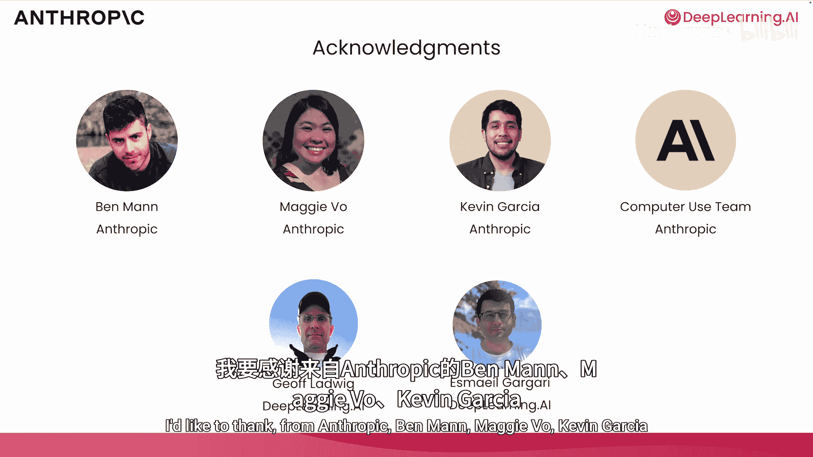
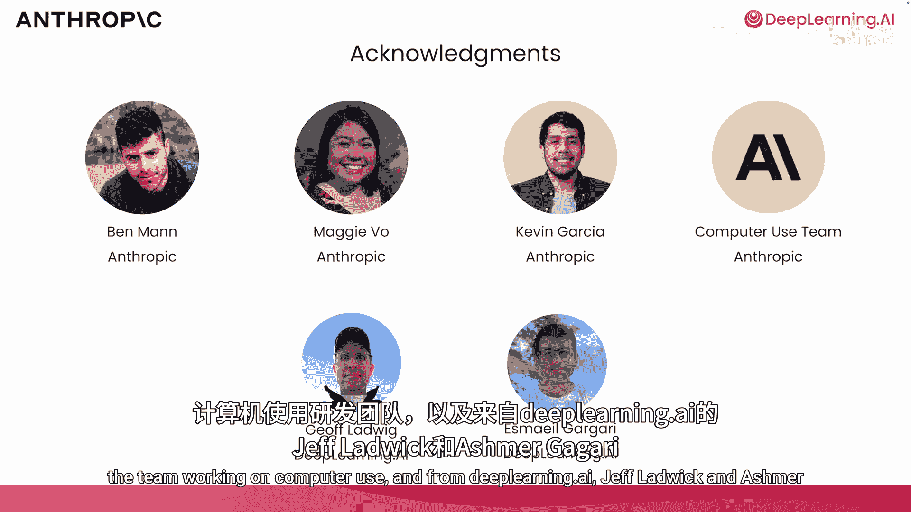

# 002：课程介绍 🚀

在本课程中，我们将学习Anthropic如何构建能够使用计算机的AI模型。我们将从基础概念开始，逐步深入到多模态处理、提示工程、工具调用等关键技术，并最终了解如何将这些技术组合起来，实现AI自主操作计算机完成复杂任务。

## 课程背景与愿景 🌟

上一节我们了解了课程的整体目标，本节中我们来看看Anthropic的背景及其模型的独特之处。

Anthropic近期取得了一项突破，发布了一个能够使用计算机的模型。该模型可以观察计算机屏幕（通常是在虚拟机中运行的截图），并生成一系列鼠标点击或键盘敲击操作，以执行诸如使用浏览器搜索网页、下载图片等任务。

这种计算机使用能力是通过结合大型语言模型的多种特性构建而成的。

## 核心技术组件 ⚙️

了解了整体目标后，我们来看看构成此能力的核心组件。

以下是实现计算机使用的几个关键技术：

*   **图像处理能力**：模型能够理解屏幕截图中正在发生什么。
*   **工具使用能力**：模型可以生成鼠标点击和键盘敲击等操作。
*   **迭代式智能体工作流**：将这些能力封装在一个迭代的工作流程中，通过在该计算机上执行多次操作来完成复杂任务。

## 课程路线图 🗺️

本课程不仅涵盖计算机使用的综合应用，其中的每个独立特性对于您构建其他基于大语言模型的应用也很有用。以下是课程的具体安排：

*   **Anthropic模型介绍**：首先，您将了解Anthropic的背景、愿景以及其模型家族的独特之处。
*   **API基础请求**：然后，您将学习使用API进行一些基本请求。
*   **多模态请求**：接着是处理图像的多模态请求，您将使用模型分析图像。
*   **提示工程**：Anthropic非常注重通过扎实的提示工程使模型行为更可预测。您将学习真正重要的提示技巧，例如思维链和少样本提示，并有机会使用我们的提示改进工具。
*   **长上下文处理**：最近，大语言模型开始支持超长输入上下文。例如，Anthropic支持超过20万个输入标记，相当于500多页文本。处理长输入成本可能很高。在长对话中，如果反复处理整个对话历史来生成下一个响应，随着对话进行，历史记录变长，成本也会增加。
*   **提示缓存**：这正好引出了提示缓存技术。提示缓存能在多次调用模型之间保留部分提示处理结果，这可以显著节省成本和降低延迟。
*   **工具调用与结构化输出**：您还将学习使用模型来调用外部工具并生成结构化输出，例如JSON。
*   **计算机使用完整示例**：在课程最后，我们将演示一个完整的计算机使用示例，您可以在自己的机器上运行。请注意，由于该工具的性质，您需要在计算机的Docker镜像中运行它，而不是直接在DeepLearning.AI的笔记本中运行。

## 潜力与应用展望 💡

我已经亲自试用过Anthropic模型的计算机使用功能，发现它非常酷。我认为这项技术将催生许多新的应用，您可以构建AI助手来使用计算机为您执行任务。

这有点像RPA（机器人流程自动化），后者擅长处理重复性任务，但现在基于大语言模型的工具使其更易于构建且更具通用性。

或者，随着这项技术变得更好，它可以处理更灵活、更开放式的任务，逐渐更像您的个人助理。

## 致谢与后续 👏

许多人共同努力创建了本课程。我要感谢来自Anthropic的Ben Mann、Maggie Vo、Kevin Garside以及计算机使用团队，以及来自DeepLearning.AI的Jeff Ladwig和Ashish Garg。Anthropic构建了许多非常出色的模型，我本人也经常使用。Co将在下一个视频中分享这些模型的详细信息。

好的，让我们开始吧！

---

**总结**：本节课中，我们一起学习了Anthropic“计算机使用”能力的课程概述。我们了解了其背后的核心思想、实现该能力所需的关键技术组件（图像理解、工具调用、迭代工作流），并预览了整个课程的学习路径，从模型基础到提示工程，再到最终的完整应用示例。最后，我们也展望了这项技术在未来自动化与个人助理方面的巨大潜力。