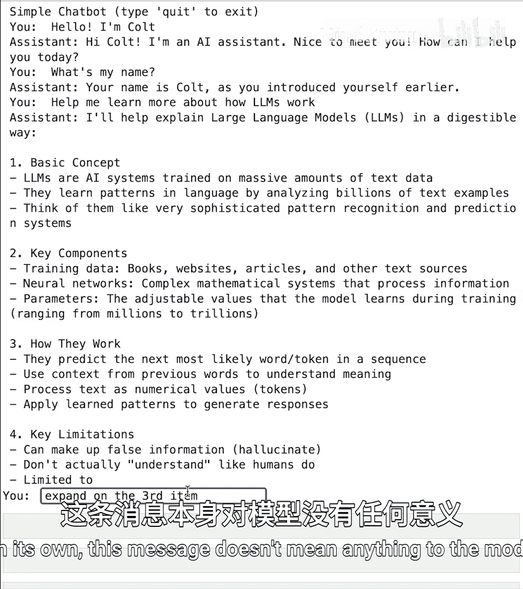
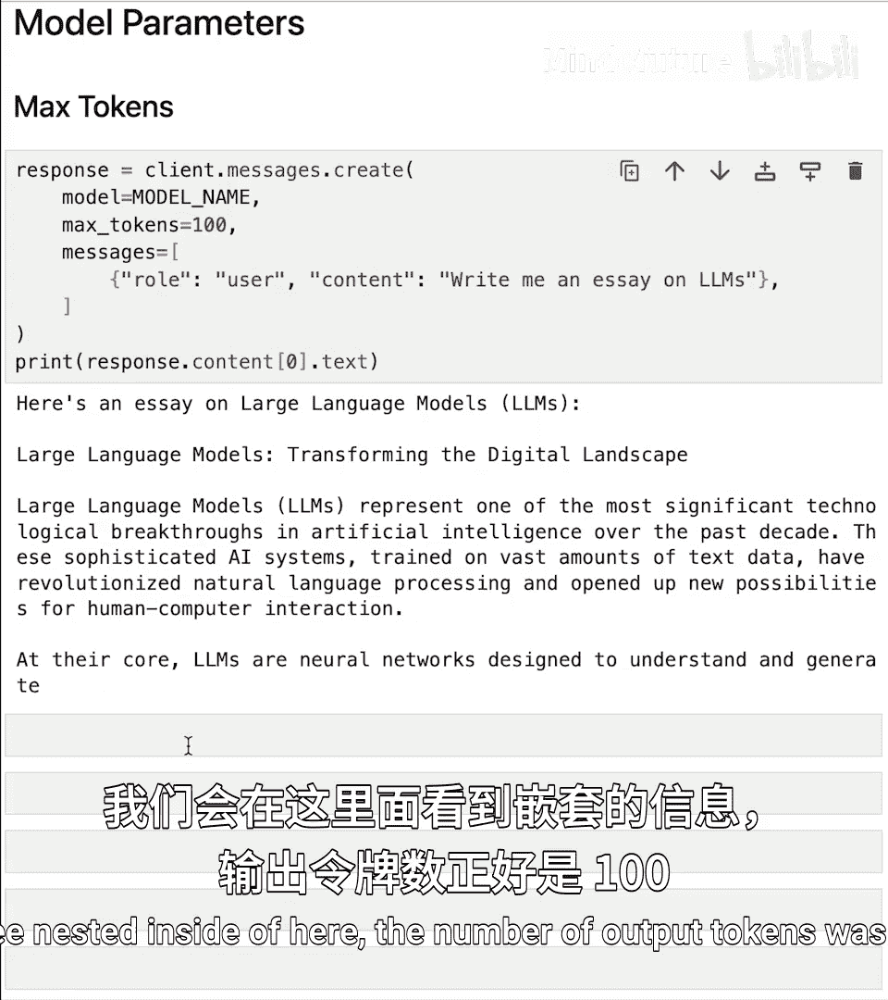
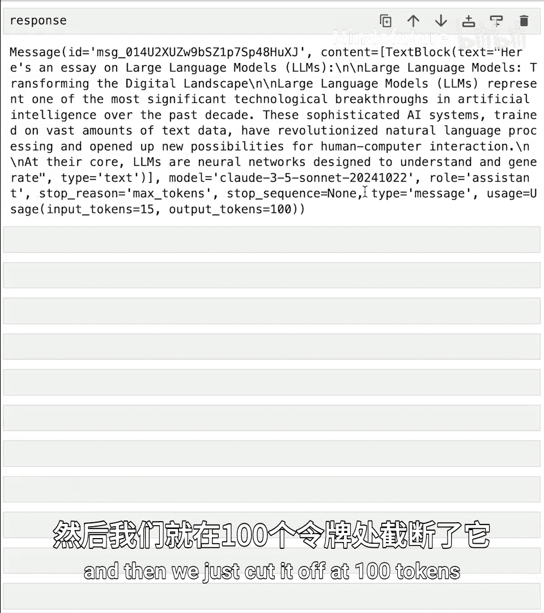
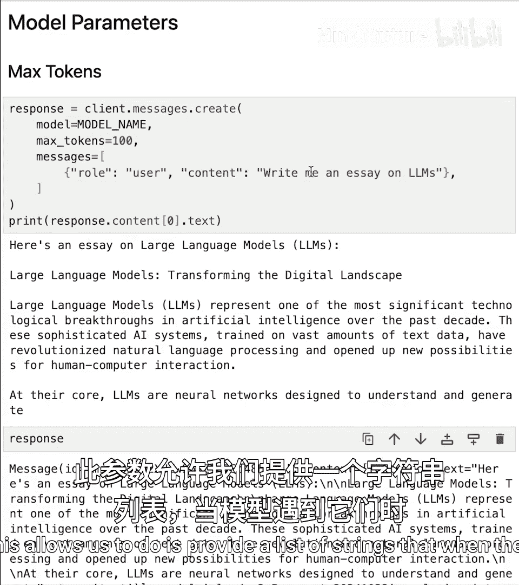
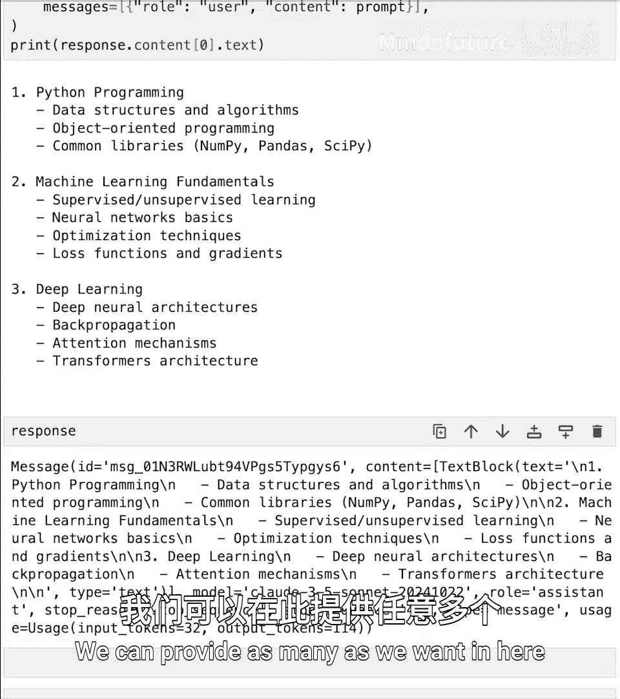
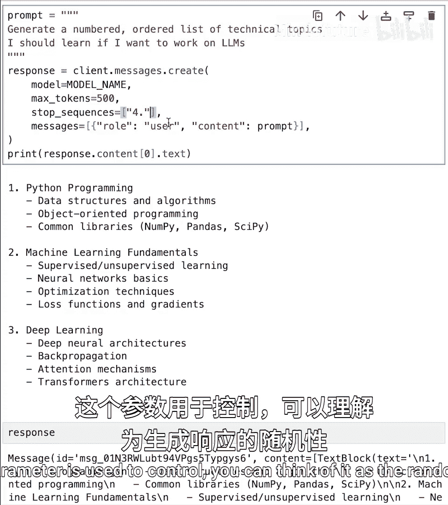
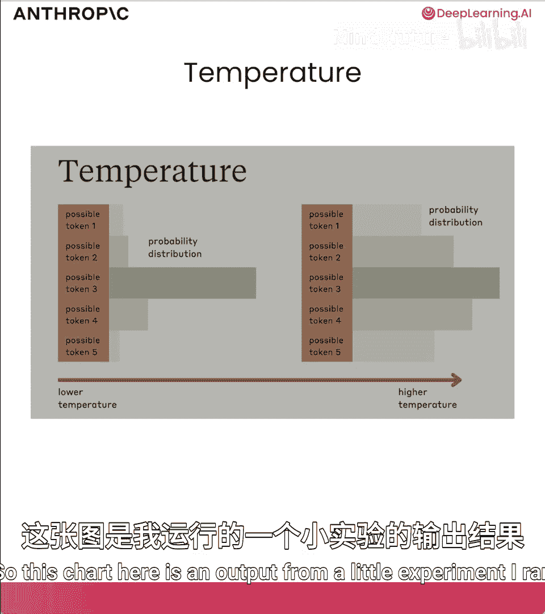
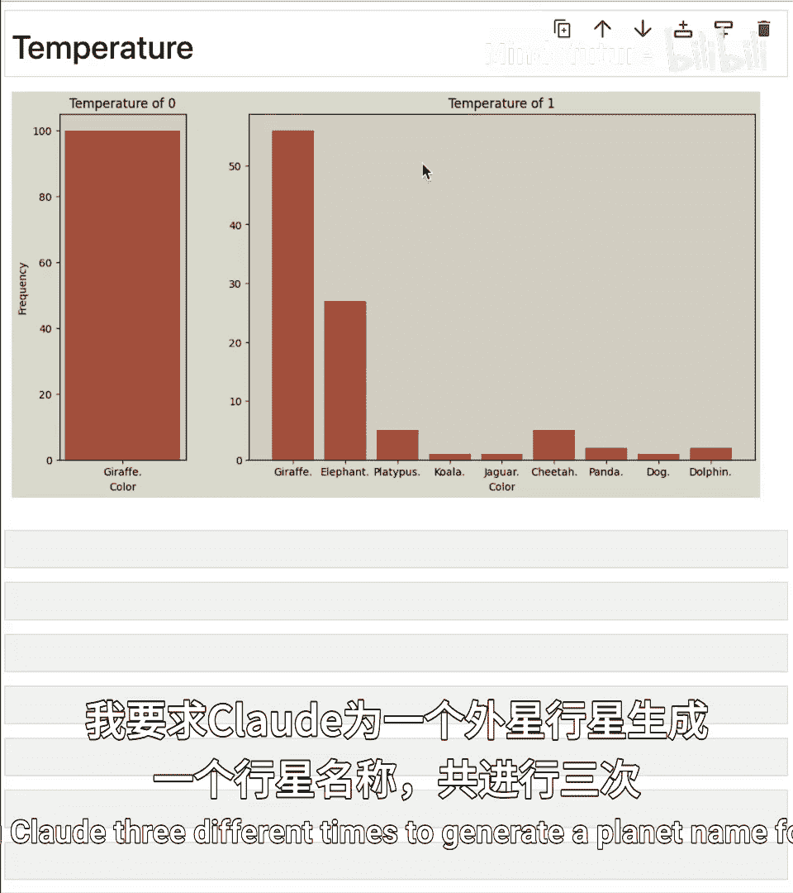
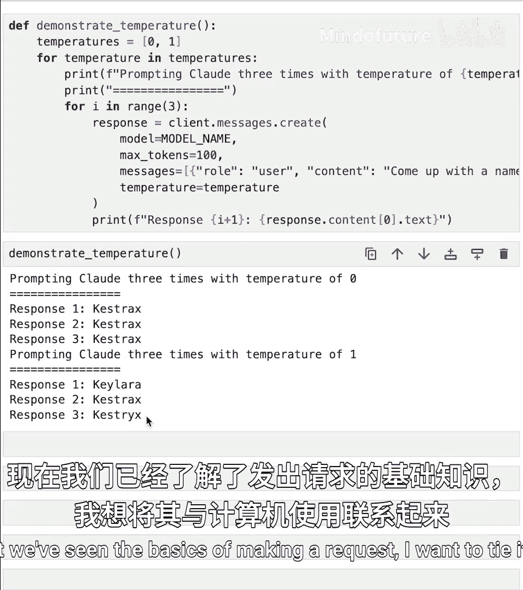
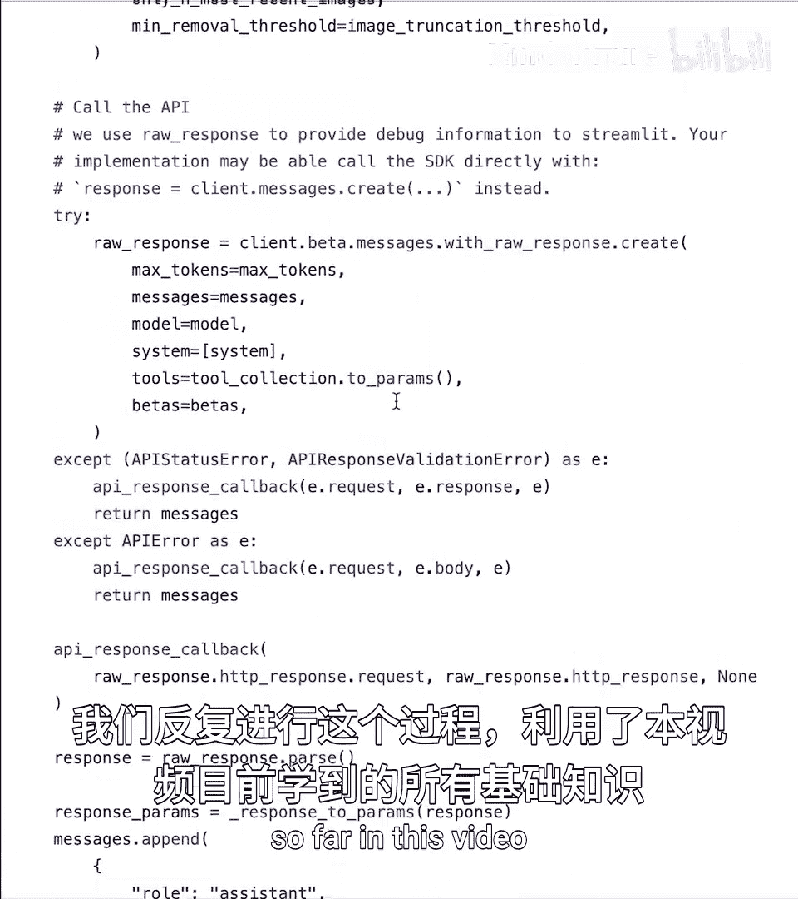

# 003：API基础操作 🚀

在本课程中，我们将学习如何向Claude模型发送API请求。你将学会如何有效地格式化消息以获得最佳AI响应，并控制各种API参数，如系统提示、最大令牌数和停止序列。

---

## 环境设置与基础请求

首先，我们需要设置Anthropic Python SDK。

第一步是确保已安装Anthropic SDK，只需运行以下命令：

```bash
pip install anthropic
```

安装完成后，我们导入它。具体来说，我们将导入大写的`Anthropic`，并用它来实例化一个客户端，以便通过该客户端发送API请求。

```python
import anthropic

client = anthropic.Anthropic()
```

在这第二行代码中，我们创建了客户端，可以随意命名，通常我称之为`client`。如果我们想显式传入API密钥，可以在这里传入。例如：`anthropic_api_key=‘你的密钥’`。但如果省略，它将自动查找名为`ANTHROPIC_API_KEY`的环境变量。

现在我们有了客户端。下一步是发出第一个请求。

我添加了两个代码单元格。第一个只是一个模型名称变量。在整个课程中，我们将重复使用这个模型名称，所以我将其放入一个变量中。

```python
model_name = "claude-3-5-sonnet-20241022"
```

然后是这段较大的代码块。这里最重要的部分是我们如何实际发出一个简单的请求。

```python
response = client.messages.create(
    model=model_name,
    max_tokens=1000,
    messages=[
        {
            "role": "user",
            "content": "写一首关于Anthropic的俳句。"
        }
    ]
)

print(response.content[0].text)
```

我们使用客户端变量`.messages.create`，其中有一些参数我们稍后会详细讨论。首先，我们必须传入模型名称。这是必需的。我们还必须传入`max_tokens`，稍后会讨论。我们还必须传入`messages`。

`messages`需要是一个包含消息列表的列表。在这个例子中，是一个单一的消息，角色是`user`，表示我们用户向模型提供了一个包含某些内容的提示。所以我让它写一首关于Anthropic的俳句。

运行这些单元格后，我打印了`response.content[0].text`。我们得到了关于Anthropic的俳句：“seeking to guide AI through wisdom and careful thought toward better futures.”

---

## 理解响应对象

让我们进一步讨论我们得到的这个响应对象。我们来看看它。

里面有很多部分。首先，有我们刚刚讨论过的`content`。`content`是一个列表。如果我们查看第0个元素，可以查看它的`text`，看到实际的俳句。

我们还有：
*   `model`：使用的模型。
*   `role`：记住我们原始消息的角色是`user`，所以这个返回的响应是一个角色为`assistant`的消息。
*   `stop_reason`：告诉我们模型停止生成的原因。这里显示`end_turn`，意味着它到达了一个自然的停止点。
*   `stop_sequence`：为`None`。稍后我们会更多讨论停止序列。
*   `usage`：我们可以看到输入（实际提示）涉及的令牌数量，以及生成的输出令牌数量。在这个例子中，输出了30个令牌。

你可以自己尝试一下。将“写一首关于Anthropic的俳句”替换成任何你想要的提示。

---

## 消息列表的格式

接下来，我们将讨论消息列表的具体格式。

SDK的设置方式是，我们传入一个消息列表。这是必需的，同时还需要`max_tokens`和模型名称。到目前为止，这个列表只包含了一个角色设置为`user`的单一消息。

消息格式的理念是，它允许我们以这种方式构建对话。我们目前还没有这样做，但这通常很有用。如果我们正在构建任何类型的对话元素，需要知道消息的角色必须设置为`user`或`assistant`。

让我们尝试提供一些先前的上下文。假设我一直在用西班牙语与Claude交谈，并且我希望Claude继续用西班牙语说话。

```python
response = client.messages.create(
    model=model_name,
    max_tokens=1000,
    messages=[
        {"role": "user", "content": "你好，只和我说西班牙语。"},
        {"role": "assistant", "content": "¡Hola! Claro, hablaré contigo en español. ¿En qué puedo ayudarte?"},
        {"role": "user", "content": "¿Cómo estás?"}
    ]
)
print(response.content[0].text)
```

我更新了消息列表，添加了一些历史记录：我有一个用户消息说“你好，只和我说西班牙语。”然后我有一个助理的回复说“¡Hola! ...”，最后是我的最终用户消息。唯一改变的是角色从`user`到`assistant`再回到`user`。我向Claude提供了一些历史记录，然后我最后说“¿Cómo estás?”。

如果我运行这个，模型将考虑整个对话，这是现在的完整提示。然后我们得到一个西班牙语的回复。

这在几种不同的场景中很有用。

---

### 用例一：构建对话助手

第一个也许最明显的用例是构建对话助手，构建聊天机器人。

这里有一个非常简单的聊天机器人实现，它利用了这种消息格式。我们将在用户消息和助理消息之间交替，随着对话的进行不断增长消息列表。

```python
messages = []

while True:
    user_input = input("你: ")
    if user_input.lower() == "quit":
        break

    messages.append({"role": "user", "content": user_input})

    response = client.messages.create(
        model=model_name,
        max_tokens=500,
        messages=messages
    )

    assistant_reply = response.content[0].text
    print(f"Claude: {assistant_reply}")

    messages.append({"role": "assistant", "content": assistant_reply})
```

我们从一个空的消息列表开始。然后我们有一个`while`循环。除非用户输入单词“quit”，否则我们将永远循环，这时我们会跳出循环。我们需要提供一个退出机制。

但如果用户没有输入“quit”，我们会要求用户输入，然后创建一个新的消息字典，角色为`user`，内容为用户输入的内容，比如“嗨，Claude”。然后我们使用`client.messages.create`方法将其发送给模型。

接着，我们获取助理的回复并打印出来。我们还将该助理消息作为新消息附加到我们的消息列表中。

然后我们重复这个过程，随着对话的每一轮，不断增长这个列表。我们添加用户消息，获取响应，添加助理消息，然后下次获取新用户消息时，将整个列表发送回模型。

让我们试试看。运行这个。从简单的内容开始：“嗨，我是Colt。”发送出去。我们得到一个回复：“嗨Colt，我是一个AI助手。很高兴认识你。有什么可以帮你的？”

让我们测试一下它是否真的有完整的上下文。让我问它：“我的名字是什么？”发送出去。它回答：“你的名字是Colt，正如你之前介绍的那样。”

让我们尝试一些更有趣的。我让它帮我了解更多关于LLM如何工作的信息。所以它会在这里为我生成一个回复。这个可能有点长。它给了我一些信息。然后我接着说：“展开说明第三点。”这再次证明了它自己拥有完整的对话历史。这个消息本身对模型没有意义，但因为我发送了完整的对话历史，现在它展开了第三个要点。

---



### 用例二：预填充回复

这是发送消息格式的另一个用例。另一个用例是我们所说的预填充，或者说是“把话放进模型的嘴里”。

本质上，我们可以使用助理消息来告诉模型：“以下是你回复的开头。”我们可以把话放进模型的嘴里。

例如，我让它写一首关于Anthropic的短诗。让我们改成别的。写一首关于猪的短诗。

如果我直接运行这个，它可能会告诉我类似：“哦，这是一首关于猪的短诗。”但出于某种原因，我真的希望这首诗以单词“Ok”开头。我坚持这一点。

现在，我可以告诉模型：“写一首关于猪的诗。你必须以单词‘Ok’开头。另外，不要给我这个前言，直接写诗。”但另一个选择是简单地添加一个以单词“Ok”开头的助理消息。

```python
response = client.messages.create(
    model=model_name,
    max_tokens=1000,
    messages=[
        {"role": "user", "content": "写一首关于猪的短诗。"},
        {"role": "assistant", "content": "Ok"}
    ]
)
print(response.content[0].text)
```

模型现在将从这个点开始它的回复：“Ok”。然后你可以看到我们得到的补全是：“Ok and snuffle pink and round rolling aly on muddy ground.”

需要注意的是，它的回复中不包含单词“Ok”，因为模型没有生成这个词，是我生成的。但模型通过以单词“Ok”开头生成了所有其他内容。所以，如果我愿意，我可以将单词“Ok”与诗的其余部分结合起来。

这就是预填充回复。

---

## 控制模型行为的API参数

接下来，我们将讨论可以通过API传递给模型以控制其行为的一些参数。

---

### 最大令牌数

第一个要介绍的是`max_tokens`。我们一直在使用`max_tokens`，但还没有讨论它的作用。简而言之，`max_tokens`控制Claude在其响应中应生成的最大令牌数。

请记住，模型不是用完整的单词或英语单词思考，而是使用一系列我们称为令牌的词片段。模型的使用也是根据令牌使用量来计算的。对于Claude，一个令牌大约相当于3.5个英文字符，尽管不同语言可能有所不同。

因此，`max_tokens`参数允许我们设置一个上限。我们可以告诉模型不要生成超过500个令牌。或者让我们从设置一个较高的值开始，比如1000个令牌。

```python
response = client.messages.create(
    model=model_name,
    max_tokens=1000,
    messages=[
        {"role": "user", "content": "为我写一篇关于大语言模型的文章。"}
    ]
)
print(response.content[0].text)
```

我要求模型为我写一篇关于大语言模型的文章。这个提示很可能会生成一大堆令牌，因为我要求写一篇文章。这是我们的回复，相当长，看起来是一篇相当不错的文章。

现在，如果我再次尝试，但将`max_tokens`设置为更短的值，比如100个令牌。

```python
response = client.messages.create(
    model=model_name,
    max_tokens=100,
    messages=[
        {"role": "user", "content": "为我写一篇关于大语言模型的文章。"}
    ]
)
print(response.content[0].text)
```

运行这个，这里会发生的是，模型基本上会在生成过程中被切断。我们只是切断了它，因为我们达到了100个令牌的生成限制。

重要的是，如果我们查看响应对象，我们还会看到嵌套在其中的输出令牌数正好是100。它达到了这个限制并停止了。但我们也看到这次的`stop_reason`是`max_tokens`。所以模型没有自然停止，因为`stop_reason`被设置为`max_tokens`，这就是我们知道模型因为我们的`max_tokens`参数而被切断的原因。





所以这并不影响模型的生成方式。我们不是在告诉模型“给我一个简短的回复，写一篇完整的文章，但要控制在100个令牌内”。相反，我们所做的是告诉模型“为我写一篇关于大语言模型的文章”，然后我们在100个令牌处切断了它。

那么，为什么要使用`max_tokens`，或者为什么要将其更改为较低或较高的值呢？

一个原因是为了节省API成本，并设置某种上限，通过良好的提示和设置`max_tokens`来实现。例如，如果你正在制作一个聊天机器人，你可能不希望你的最终用户与聊天机器人进行5000个令牌的对话轮次，你可能更希望这些对话轮次简短，并适应聊天窗口。

另一个原因是提高速度。输出涉及的令牌越多，生成所需的时间就越长。

---

### 停止序列

下一个参数是`stop_sequences`。这允许我们提供一个字符串列表，当模型遇到它们时（当模型实际生成它们时），它将停止。所以我们可以告诉模型，一旦你生成了这个词、这个字符或这个短语，就停止。这给了我们更多的控制权，而不仅仅是截断一定数量的令牌，我们可以告诉模型，我们希望在特定单词处截断你的输出。

这是一个没有使用停止序列的例子。



```python
prompt = "生成一个编号的有序列表，列出如果我想从事大语言模型工作应该学习的技术主题。"
response = client.messages.create(
    model=model_name,
    max_tokens=1000,
    messages=[
        {"role": "user", "content": prompt}
    ]
)
print(response.content[0].text)
```

我传递这个提示，我把它移到了一个变量中，因为它有点长。我得到了这个漂亮的编号列表。但它相当长，有12个不同的主题。

显然，通过提示，我可以告诉模型“只给我前3个或前5个”，但我将用这个例子来展示。我将复制这个并复制一份。但这次，我将提供`stop_sequences`，这是一个列表。

```python
prompt = "生成一个编号的有序列表，列出如果我想从事大语言模型工作应该学习的技术主题。"
response = client.messages.create(
    model=model_name,
    max_tokens=1000,
    messages=[
        {"role": "user", "content": prompt}
    ],
    stop_sequences=["4."]
)
print(response.content[0].text)
```



它包含字符串。在我的例子中，假设我想在它生成“4.”之后停止。让我们再试一次。

你可以看到我们得到了什么。我们得到了1，2，3。然后模型继续生成了4，然后停止了。注意，输出本身不包含4。如果我查看响应对象，我们还会看到这次的`stop_reason`设置为`stop_sequence`。这是API告诉我们它因为遇到了停止序列而停止，它遇到的停止序列是“4.”。

`stop_sequences`是一个列表，我们可以在其中提供任意多个。这是控制模型何时停止输出或何时停止生成的一种方法。当我们学习一些更高级的提示技术时，会看到一些使用案例。

---

### 温度



下一个参数是`temperature`。这个参数用于控制生成响应的随机性或创造性。

它的范围从0到1，较高的值如1将导致更多样化和更不可预测的响应，措辞上会有变化；而较低的温度接近0将导致更确定性的输出，更倾向于使用更可能的措辞。

这张图表是我运行的一个小实验的输出。我不建议你运行它，因为它涉及发出数百个API请求。我通过API要求模型选择一个动物。我的提示类似于：“选择一个动物。给我一个词。”我用温度为0做了100次。你可以看到，100次中的每一次响应都是单词“giraffe”。然后我又做了一次，但温度设为1。我们仍然得到了很多“giraffe”的响应，但我们也得到了一些“elephant”、“platypus”、“koala”、“cheetah”等等。我们得到了更多的变化。

所以，温度为0更可能是确定性的，但不能保证；温度为1输出更多样化。

这里有一个你可以运行的函数来演示这一点。

```python
def generate_planet_name(temperature):
    response = client.messages.create(
        model=model_name,
        max_tokens=10,
        messages=[
            {"role": "user", "content": "为外星行星生成一个行星名称。用一个词回答。"}
        ],
        temperature=temperature
    )
    return response.content[0].text

for i in range(3):
    print(f"温度 0， 尝试 {i+1}: {generate_planet_name(0)}")





for i in range(3):
    print(f"温度 1， 尝试 {i+1}: {generate_planet_name(1)}")
```

我要求Claude三次为一个外星行星生成一个行星名称。我告诉它用一个词回答。我用温度为0做了三次，用温度为1做了三次。

执行这个单元格，当我使用温度为0时，我连续三次得到相同的行星名称：“Castrx, Castrx, Castrx”。当我使用温度为1时，我得到：“Klara, Castrx, Castricx”（拼写略有不同）。所以我们确实在那里得到了更多的多样性。

---

## 关联到计算机使用

现在我们已经看到了发出请求的基础知识，我想把它关联回计算机使用。没错，我们将在本课程中学到的一切在某种程度上都与使用Claude构建计算机使用代理相关。

这是我们计算机使用快速入门中的一些代码，我们将在本课程结束时看一看。我想强调几点。

我们正在发出一个请求，提供`max_tokens`，提供一个消息列表，提供一个模型名称，以及一些我们稍后会学到的其他东西。

然后我们也使用了对话消息格式，正如你在这里看到的。我们有一个消息列表，它在代码库或这个文件的更上方定义。但我们有一个消息列表，我们将助理的回复附加回去。

所以，与我们之前看到的聊天机器人非常相似，当然，要复杂得多。它使用了计算机。涉及截图、工具和一大堆交互，但基本概念相同。我们向模型发送一些消息，然后获取助理的回复。我们将其附加到我们的消息中。



如果我向上滚动得足够高，我们可以看到它全部嵌套在一个`while True`循环中。当然，还有很多其他逻辑，但它归结为向API发送请求，使用我们的客户端，提供诸如`max_tokens`和`messages`之类的参数，然后随着新响应的返回更新我们的消息列表，并每次提供这个不断更新的、持续增长的消息列表。

我们一遍又一遍地这样做，使用了我们到目前为止在本视频中学到的所有基础知识。

---

## 总结



在本节课中，我们一起学习了如何设置Anthropic Python SDK并向Claude模型发送基础的API请求。我们深入探讨了消息列表的格式及其在构建对话助手和预填充回复中的应用。我们还掌握了控制模型行为的三个关键参数：`max_tokens`用于限制生成长度，`stop_sequences`用于精确控制停止点，`temperature`用于调整输出的随机性和创造性。最后，我们看到了这些基础知识如何构成构建更复杂计算机使用代理的基石。