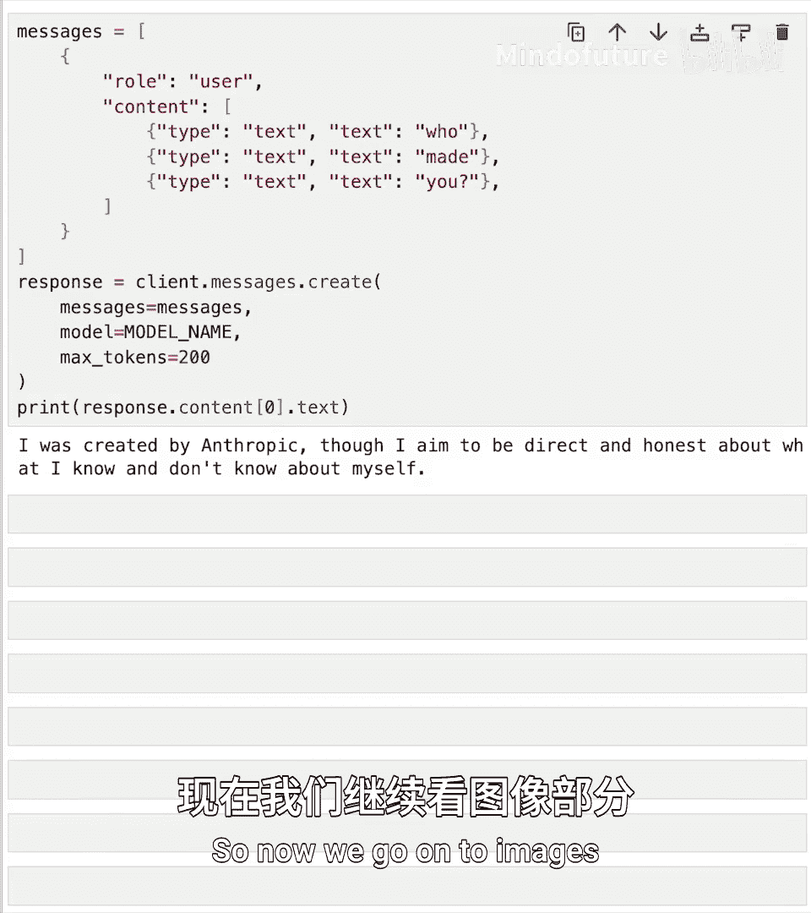
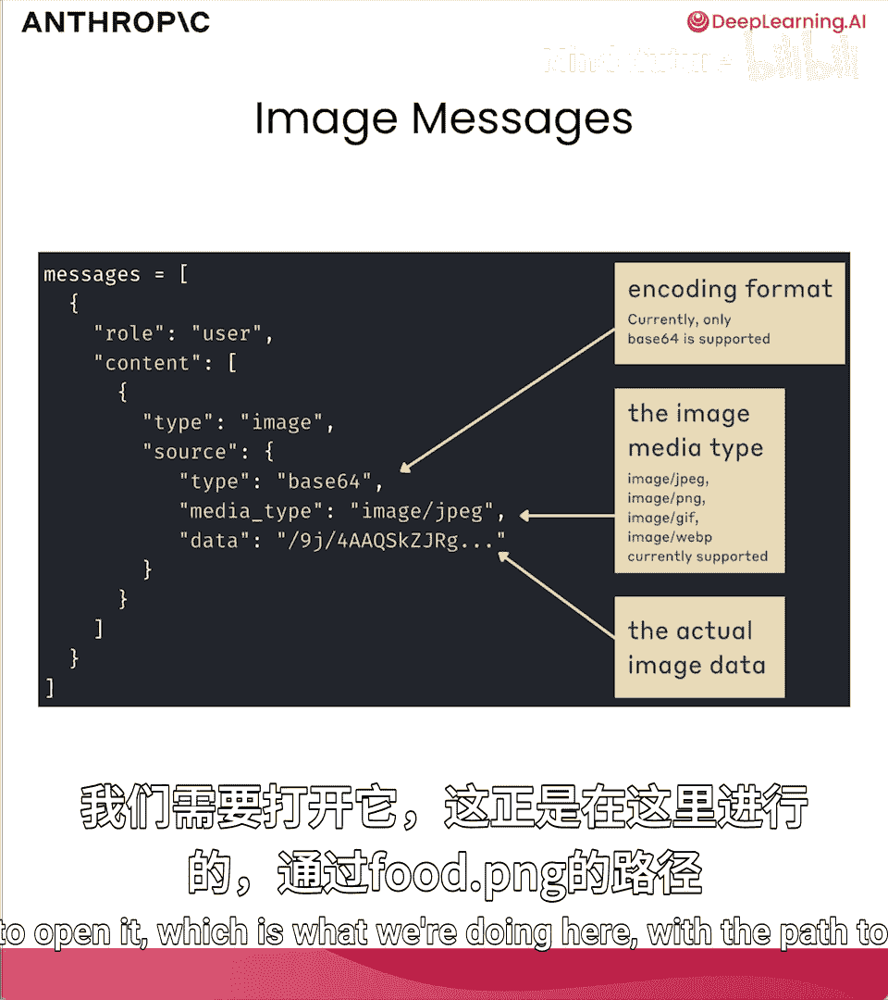
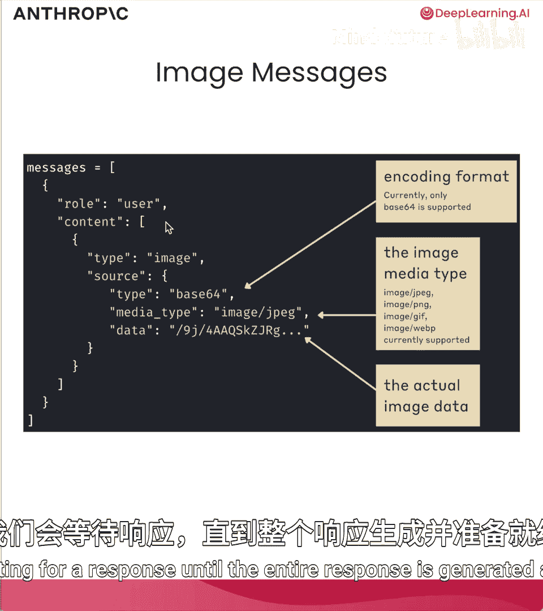
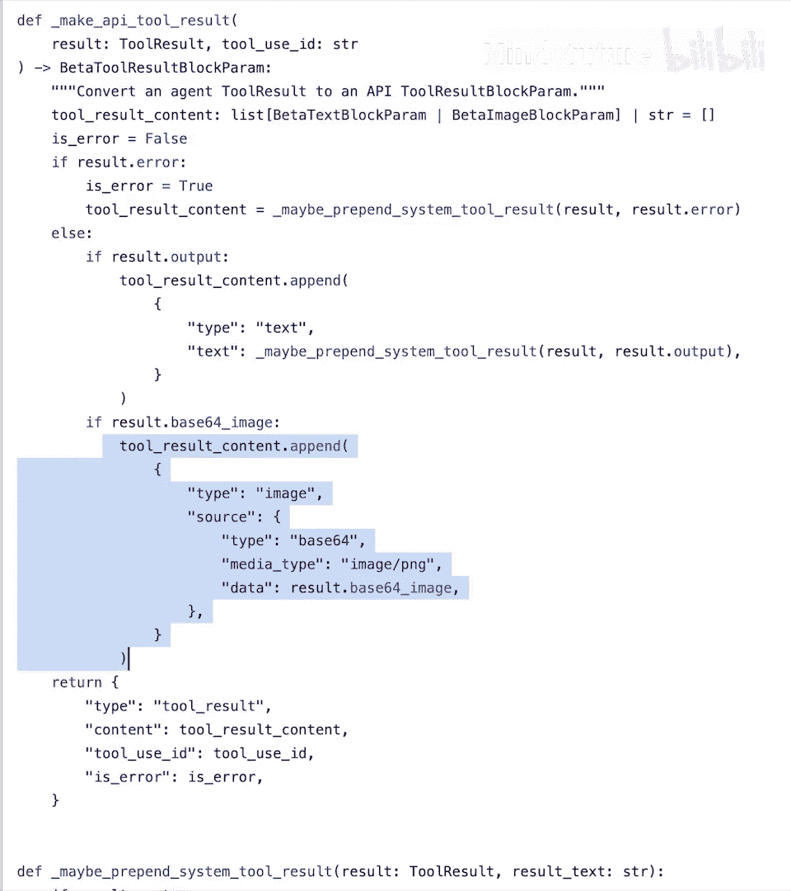

# 004：多模态请求与流式响应 🖼️💬

在本节课中，我们将学习如何构建包含图像和文本的多模态提示，并处理来自API的流式响应。我们将从基础的消息结构开始，逐步学习如何发送图像请求，并了解如何实时接收模型的响应。

## 消息结构回顾

上一节我们介绍了如何向模型发送简单的文本消息。本节中，我们来看看消息内容（`content`）更灵活的表示方式。

在之前的课程中，我们设置了一个消息列表，其中每条消息的 `role` 设为 `user`，`content` 设为一个字符串，例如 `"tell me a joke"`。运行以下代码会得到一个笑话。

```python
import anthropic

client = anthropic.Anthropic()
model = "claude-3-sonnet-20240229"

messages = [
    {"role": "user", "content": "tell me a joke"}
]

response = client.messages.create(
    model=model,
    max_tokens=100,
    messages=messages
)
print(response.content[0].text)
```

实际上，将 `content` 设置为字符串是一种快捷方式。其完整的语法是将 `content` 设置为一个包含多个内容块的列表。例如，上面的代码等价于：

```python
messages = [
    {
        "role": "user",
        "content": [
            {
                "type": "text",
                "text": "tell me a joke"
            }
        ]
    }
]
```

如果只进行文本提示，使用快捷方式更简单。但正如我们即将看到的，当需要提供图像时，我们需要使用内容块列表的形式。



以下是一个包含多个文本内容块的示例：

```python
messages = [
    {
        "role": "user",
        "content": [
            {"type": "text", "text": "who"},
            {"type": "text", "text": "made"},
            {"type": "text", "text": "you"}
        ]
    }
]
```

## 构建包含图像的消息 🖼️

现在，我们开始处理图像。假设我们运营一家食品配送初创公司，并使用Claude来验证客户的索赔。客户可能会发送一张截图说：“看，我只收到了一半的订单，我要求退款。”我们将使用Claude来分析像下面这样的客户食品图片。我们先从一个简单的任务开始：让Claude告诉我们图片中有多少个餐盒。




首先，我们需要理解如何构建包含图像的消息。其结构如下图所示：


如图所示，我们在 `messages` 列表中，设置 `role` 为 `user`，`content` 为一个列表。在这个 `content` 列表中，我们使用一种新的内容块类型：`image` 块。其 `type` 设置为 `"image"`，`source` 是一个字典，其中 `type` 为 `"base64"`，`media_type` 是图像的媒体类型（如 `"image/jpeg"`），`data` 则是经过Base64编码的原始图像数据字符串。

在代码中实现，需要以下几个步骤：

1.  读取图像文件。
2.  将其内容作为二进制对象读入。
3.  使用Base64对二进制数据进行编码。
4.  将Base64编码的数据转换为字符串。

以下是实现这些步骤的代码：

```python
import base64

# 1. 读取图像文件
image_path = "images/food.png"
with open(image_path, "rb") as image_file:
    # 2. 读取二进制数据
    image_data = image_file.read()
    # 3. & 4. Base64编码并转换为字符串
    base64_string = base64.b64encode(image_data).decode("utf-8")
```

现在，我们有了包含图像数据的Base64字符串。接下来，将其放入正确格式的消息中并发送给模型。

```python
messages = [
    {
        "role": "user",
        "content": [
            {
                "type": "image",
                "source": {
                    "type": "base64",
                    "media_type": "image/png",
                    "data": base64_string  # 上面生成的长字符串
                }
            },
            {
                "type": "text",
                "text": "How many to-go containers of each type are in this image?"
            }
        ]
    }
]

response = client.messages.create(
    model=model,
    max_tokens=100,
    messages=messages
)
print(response.content[0].text)
```

运行后，模型会给出响应：“In this image, there are three rectangular plastic containers with clear lids, and three white paper or cardboard folded take out boxes...” 这与原图信息相符。

## 创建图像消息辅助函数 🔧

反复执行读取图像、Base64编码、格式化消息这些步骤有些繁琐。因此，创建一个辅助函数是个好主意。

以下是 `create_image_message` 辅助函数，它封装了上述步骤：

```python
import base64
import mimetypes

def create_image_message(image_path):
    # 猜测文件的MIME类型（如 image/png）
    mime_type, _ = mimetypes.guess_type(image_path)
    if mime_type is None:
        mime_type = "application/octet-stream"  # 默认类型

    with open(image_path, "rb") as image_file:
        image_data = image_file.read()
        base64_string = base64.b64encode(image_data).decode("utf-8")

    # 返回格式化的图像内容块
    image_block = {
        "type": "image",
        "source": {
            "type": "base64",
            "media_type": mime_type,
            "data": base64_string
        }
    }
    return image_block
```

让我们用另一张图片测试这个函数。`images` 目录下有一张 `plant.png` 图片（一种猪笼草）。我们将让模型识别这种植物。

```python
# 使用辅助函数创建消息
messages = [
    {
        "role": "user",
        "content": [
            create_image_message("images/plant.png"),
            {
                "type": "text",
                "text": "What species is this?"
            }
        ]
    }
]

response = client.messages.create(
    model=model,
    max_tokens=100,
    messages=messages
)
print(response.content[0].text)
```

模型响应为：“This appears to be a Nepenthes pitcher plant...” 识别正确。

你可以进一步创建一个辅助函数，直接接收图像路径和文本提示来生成完整的 `messages` 列表。

## 实际应用案例：分析文档 📄

接下来，我们看一个许多客户正在使用的更实际的用例：分析文档。以一张名为 `invoice.png` 的发票图片为例。我们可以将其输入Claude，并给出好的提示，要求它返回结构化数据（如JSON）。这样，我们就能在几分钟内将成千上万的发票转换为JSON并存入数据库。

以下是单个示例的实现：

```python
messages = [
    {
        "role": "user",
        "content": [
            create_image_message("images/invoice.png"),
            {
                "type": "text",
                "text": """Generate a JSON object representing the contents of this invoice. It should include all dates, dollar amounts, and addresses. Only respond with the JSON itself."""
            }
        ]
    }
]

response = client.messages.create(
    model=model,
    max_tokens=500,
    messages=messages
)
print(response.content[0].text)
```

模型会返回一个包含公司名称、地址、发票号、日期、账单明细、总额等信息的JSON对象。所有信息均准确无误。

**重要提示**：你可以在单条消息中提供多个图像和文本块。只需在 `content` 列表中按顺序添加多个 `type` 为 `"image"` 或 `"text"` 的内容块即可。所有内容块在幕后会被视为一个完整的提示输入模型。


## 处理流式响应 ⚡



本节课要介绍的第二个主题是流式响应。到目前为止，我们使用的 `client.messages.create` 方法会等待整个响应生成完毕后才返回结果。对于较长的输出（例如写一篇短文），用户需要等待较长时间才能看到任何内容。


使用流式响应，我们可以在内容生成的过程中就逐步获取它。这对于面向用户的场景非常有用，因为我们可以随着生成的进行向用户展示部分响应，而不是等待整个生成完成。**流式响应并不会加快整体生成速度，但它显著减少了“首次令牌时间”，即用户看到第一个响应片段所需的时间。**

流式调用的语法与之前类似，但使用的是 `client.messages.stream` 方法：

```python
from anthropic import Anthropic

client = Anthropic()
model = "claude-3-sonnet-20240229"

messages = [{"role": "user", "content": "Write me a poem."}]

# 使用 stream 方法
with client.messages.stream(
    max_tokens=1024,
    messages=messages,
    model=model,
) as stream:
    # 迭代处理文本流中的每一个片段
    for text in stream.text_stream:
        print(text, end="", flush=True)  # 逐片段打印
```

运行这段代码，你会看到诗歌的内容被分成一个个小片段实时打印出来，而不是一次性全部显示。整体生成时间不变，但用户体验得到了提升。

## 在计算机使用中的应用 🔍

最后，我们再次通过计算机使用快速入门实现中的一个真实例子来巩固所学。在实现模型根据屏幕截图分析并采取行动的功能时，我们需要向模型提供截图。以下代码片段展示了如何将正确格式化的图像附加到消息中：

```python
# 摘自计算机使用示例代码
image_block = {
    "type": "image",
    "source": {
        "type": "base64",
        "media_type": "image/png",
        "data": base64_encoded_screenshot_string
    }
}
# 将 image_block 添加到 messages 的 content 列表中
```

这与我们在本节课中学到的语法完全一致。虽然这里的用例（分析屏幕以决定操作）比识别植物物种复杂得多，但核心的图像处理方法是相同的。



## 总结 📝

在本节课中，我们一起学习了：
1.  **多模态请求**：如何构建包含图像和文本内容块的消息，将图像进行Base64编码并发送给Claude模型进行分析。
2.  **辅助函数**：创建了 `create_image_message` 函数来简化图像消息的构建过程。
3.  **实际用例**：探索了图像分析在验证客户索赔、识别物体、解析文档（如发票）等场景下的应用。
4.  **流式响应**：学会了使用 `client.messages.stream` 来实时接收模型的响应，改善了长文本生成的用户体验。
5.  **综合应用**：看到了多模态图像请求如何作为更复杂的“计算机使用”功能的基础组成部分。


我们的工具箱正在逐步扩充。接下来，我们将探讨一些更复杂或更贴近现实世界的提示工程技巧。