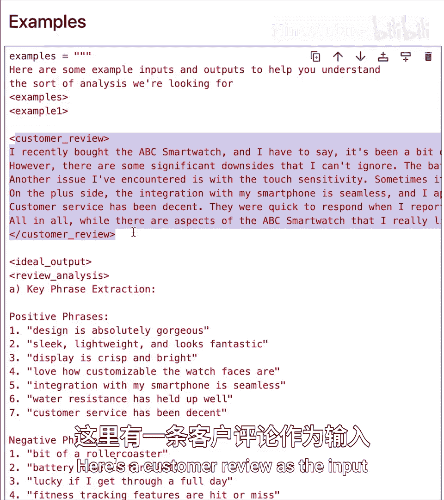
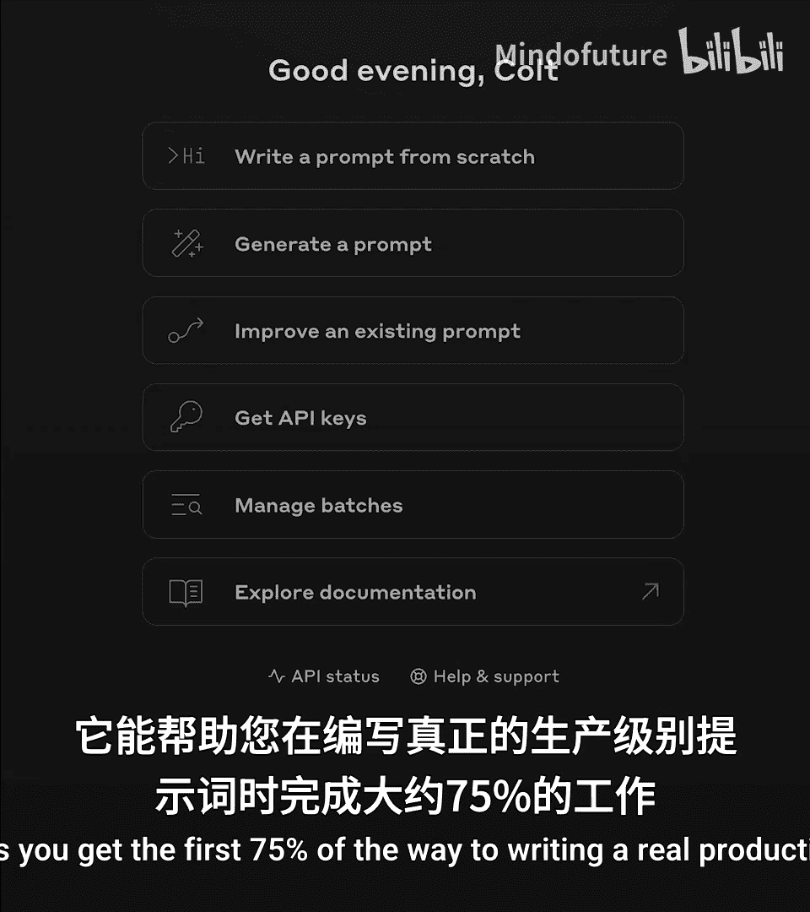
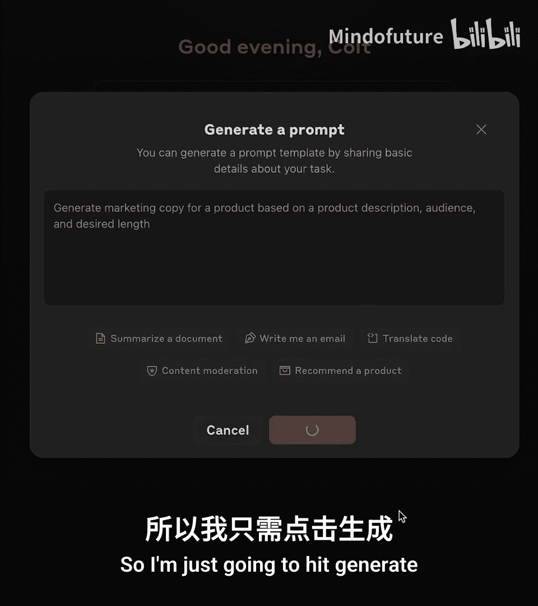
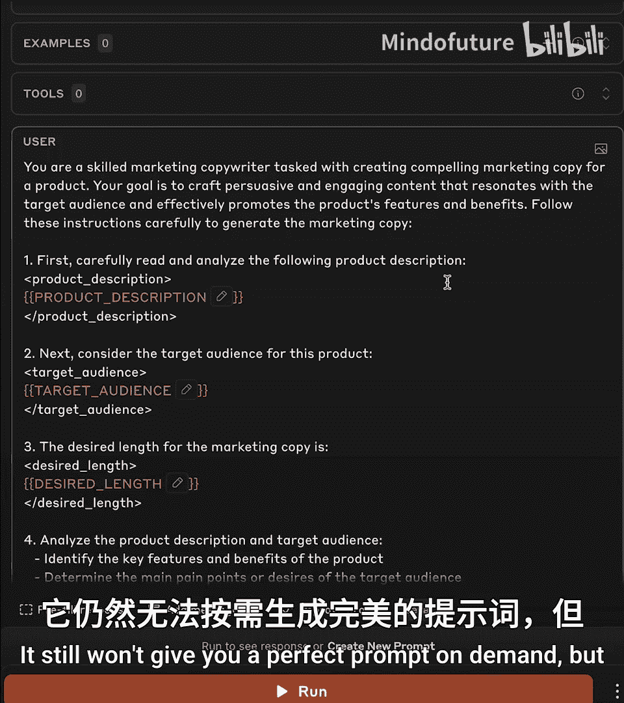

# 005：真实世界提示工程

在本节课中，我们将学习如何构建有效的提示，以从Claude获得一致且高质量的响应。我们将利用在现实世界中真正重要的、经过验证的提示技术，并理解在聊天机器人（如Claude AI）上编写提示与编写企业级、可重复使用的提示之间的区别。

## 消费者提示与企业级提示的区别

上一节我们介绍了课程目标，本节中我们来看看编写提示时的一个核心区别：消费者提示与企业级提示。

消费者提示通常用于与聊天机器人进行一次性、交互式的对话。例如，在Claude AI网站上，你可能会输入：“帮我为一场关于AI与教育的演讲进行头脑风暴。”如果不满意，你可以不断追问和调整，有很大的灵活性和容错空间。

相比之下，企业级提示是为大规模、可重复的任务设计的。它们通常很长、结构复杂，并且被视为**提示模板**。模板中大部分内容固定，但包含一些动态部分（变量），这些部分会根据具体输入被替换。例如，一个用于处理客户服务通话记录并生成JSON摘要的提示模板，可能会被每小时调用数千次。

## 构建企业级提示的核心技巧

以下是经过实证检验、值得你投入时间的核心提示技巧：

*   **使用提示模板**：将提示视为可重复使用的模板，其中包含用于插入动态内容的占位符。
*   **让Claude思考（思维链）**：指示模型在得出结论前，先输出其推理过程。
*   **使用XML标签结构化提示**：Claude模型能很好地理解XML标签，这有助于清晰地分隔提示的不同部分和模型的输出。
*   **提供示例（少样本提示）**：在提示中展示输入和期望输出的例子，能显著提升模型在复杂任务上的表现。

## 实战：构建客户评论分析提示

现在，我们将通过一个具体例子，一步步构建一个企业级的提示。我们的目标是创建一个能分析客户评论、进行情感分析并提取投诉点的提示，最终输出结构化的JSON数据。

假设我们运营一家虚构的电商公司Acme，需要处理成千上万的客户评论。

### 第一步：设定模型角色

首先，为模型设定一个明确的角色和任务背景。

```python
role_setting = """
你是一位专门分析客户评论的AI助手。你的任务是确定给定评论的整体情感，并提取其中提到的任何具体投诉。请仔细遵循以下说明。
"""
```

### 第二步：提供清晰指令（第一部分）

接下来，给出清晰、直接的指令列表。我们使用XML标签来分隔指令部分，并使用 `{{customer_review}}` 作为占位符，这将在后续被真实的评论替换。

```python
instructions_part1 = """
<instructions>
1. 审阅以下客户反馈：
<review>
{{customer_review}}
</review>
</instructions>
"""
```

### 第三步：引入思维链（第二部分）

为了让模型进行更可靠的推理，我们指示它“展示其工作过程”。我们要求模型在输出最终答案前，先在指定的XML标签内进行逐步分析。

```python
instructions_part2 = """
<instructions>
2. 使用以下步骤分析评论：
- 首先，提取可能与情感相关的关键短语。
- 然后，分别考虑支持正面、负面和中性情感的论据。
- 接着，确定整体情感并阐述你的推理。
- 最后，从评论中提取客户提出的投诉。
请将你的分析过程放在 <review_breakdown> 标签内。此部分可以较长，以便你彻底分解评论。
</instructions>
```
**核心概念**：思维链（Chain-of-Thought）通过要求模型输出中间推理步骤，能有效提升复杂任务（如逻辑推理、情感判断）的准确性和可靠性。

### 第四步：定义输出格式（第三部分）

最后，我们明确指定期望的输出格式。这里我们要求模型生成一个具有特定结构的JSON对象，并将其包裹在XML标签中，便于后续程序化提取。

```python
instructions_part3 = """
<instructions>
3. 生成一个JSON输出，结构如下：
{
  "sentiment_score": "positive/negative/neutral",
  "sentiment_analysis": "更详细的分析文本",
  "complaints": ["投诉点1", "投诉点2", ...]
}
请将JSON输出放在 <json> 标签内。
如果没有投诉，请使用空数组 []。
</instructions>
```
**核心概念**：在提示中明确定义输出格式（如JSON schema），是确保API调用结果可预测、可解析的关键，对于自动化流程至关重要。

### 第五步：组装完整提示并调用

现在，我们将所有部分组合成一个完整的提示模板，并编写一个函数来动态插入客户评论、调用Claude API并提取结果。

```python
# 组装完整提示模板
final_prompt_template = f"{role_setting}\n\n{instructions_part1}\n\n{instructions_part2}\n\n{instructions_part3}"

def get_review_sentiment(customer_review):
    # 1. 将客户评论插入模板
    prompt = final_prompt_template.replace("{{customer_review}}", customer_review)

    # 2. 构建消息并调用Claude API (此处为伪代码，需替换为实际API调用)
    messages = [
        {"role": "user", "content": prompt}
    ]
    # response = client.messages.create(...) # 实际API调用
    # full_output = response.content[0].text

    # 3. 打印完整输出以查看思维过程（调试用）
    print("完整模型输出：")
    print(full_output)
    print("\n" + "="*50 + "\n")

    # 4. 使用正则表达式从<json>标签中提取JSON内容
    import re
    json_match = re.search(r'<json>\s*(.*?)\s*</json>', full_output, re.DOTALL)
    if json_match:
        json_output = json_match.group(1)
        print("提取的JSON输出：")
        print(json_output)
        # 此处可将json_output解析为Python字典以供进一步使用
        # import json
        # data = json.loads(json_output)
        return json_output
    else:
        print("错误：响应中未找到情感分析结果。")
        return None

# 测试示例
review1 = "我爱我的Acme手机！太棒了。虽然有点贵，但物有所值。颜色我也喜欢。"
get_review_sentiment(review1)
```

运行上述函数后，你将看到模型首先在 `<review_breakdown>` 标签内输出详细的分析过程，然后在 `<json>` 标签内输出我们要求的结构化结果。这种设计既保证了结果的可解释性（通过思维链），又保证了结果的可处理性（通过结构化JSON）。

### 进阶技巧：提供示例（少样本提示）

如果模型在特定格式或复杂判断上表现不稳定，最有效的策略之一是在提示中提供输入-输出示例。

```python
few_shot_examples = """
<examples>
<example>
<review>手机电池续航太短了，一天要充三次电。不过屏幕很清晰。</review>
<ideal_output>
{
  "sentiment_score": "negative",
  "sentiment_analysis": "评论主要抱怨电池续航短，虽有正面提及屏幕，但负面问题更突出。",
  "complaints": ["电池续航短"]
}
</ideal_output>
</example>
<example>
<review>中规中矩的产品，没什么惊喜但也没什么大毛病。价格合适。</review>
<ideal_output>
{
  "sentiment_score": "neutral",
  "sentiment_analysis": "评论表达了一种中立态度，既无强烈好评也无严重批评，认为产品符合其价格。",
  "complaints": []
}
</ideal_output>
</example>
</examples>
"""
```
你可以将这个 `few_shot_examples` 字符串插入到最终提示模板的合适位置（例如，在指令之前）。提供覆盖正面、负面、中性及边缘情况的多个示例，能极大地提升模型在复杂任务上的鲁棒性和准确性。

## 工具推荐：Anthropic控制台提示生成器

编写如此长的生产级提示可能很耗时。Anthropic控制台提供了一个“提示生成器”工具，可以帮助你快速完成初稿。

1.  进入Anthropic控制台，找到“提示生成器”。
2.  描述你的任务（例如：“生成营销文案，输入产品描述、目标受众和期望长度”）。
3.  工具会生成一个包含变量占位符的结构化提示模板。
4.  你可以在此基础上进行编辑、添加示例或调整语气。

这个工具能大大减轻从零开始编写复杂提示的负担，帮助你快速获得一个可用的基础版本。



## 总结

本节课中，我们一起学习了构建真实世界、企业级提示的核心方法。



我们首先区分了**消费者提示**与**企业级提示模板**，后者是为自动化、大规模处理而设计的。接着，我们深入探讨了四项关键技巧：**使用提示模板**实现动态内容替换；利用**思维链**提升模型推理的可靠性；通过**XML标签**清晰结构化提示和输出；以及使用**少样本示例**来指导模型处理复杂或特定的任务。



通过一个完整的“客户评论情感分析与投诉提取”示例，我们实践了如何将这些技巧组合起来，构建一个从设定角色、给出指令、引导思考到定义结构化输出的完整提示流程。最后，我们介绍了Anthropic控制台的提示生成器工具，作为加速提示开发的有效辅助。




记住，编写优秀的提示是一个迭代过程。从清晰定义任务和输出格式开始，逐步加入思维链、示例等高级技巧来优化效果，并始终考虑其在自动化流程中的可靠性和可维护性。