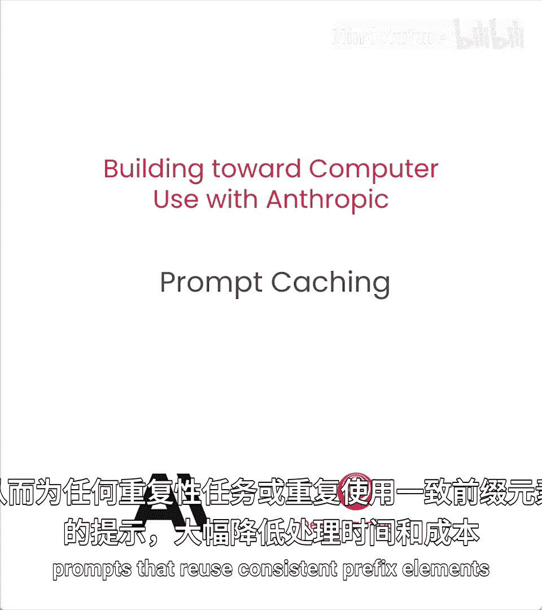
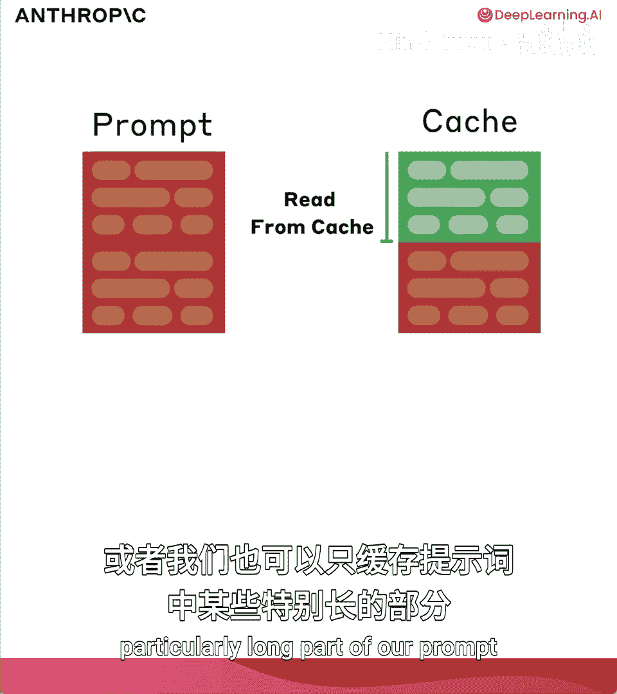
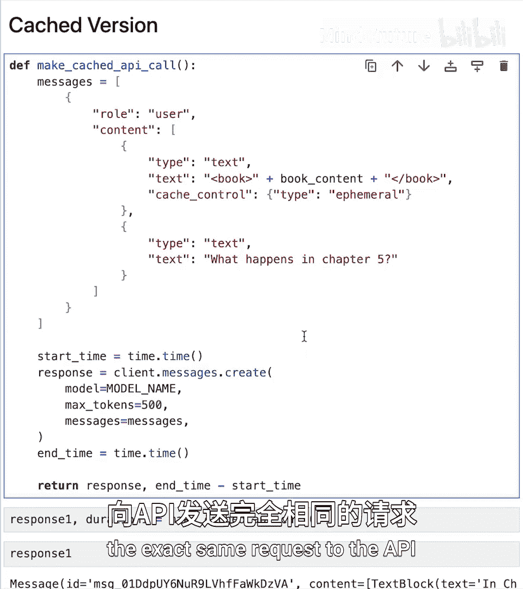
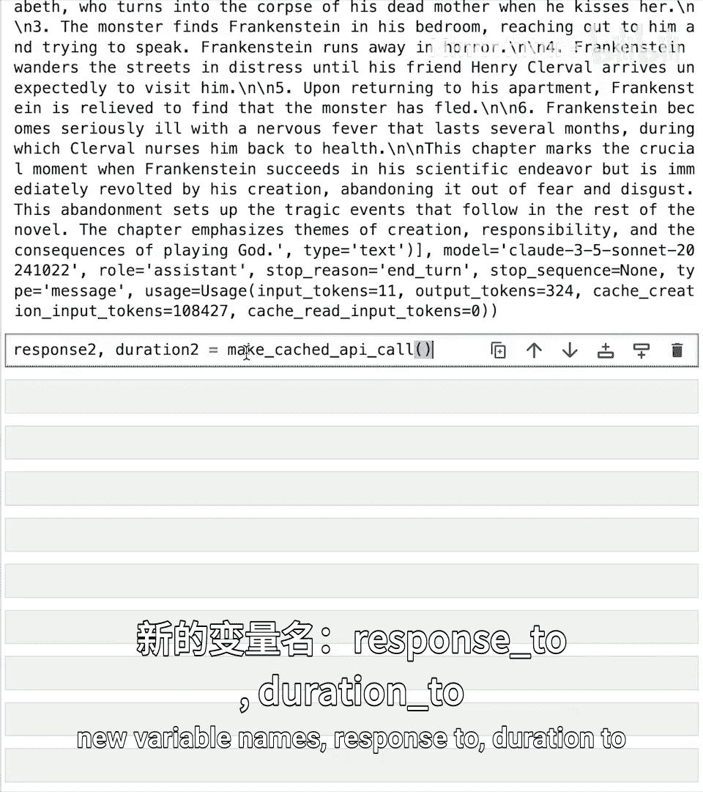
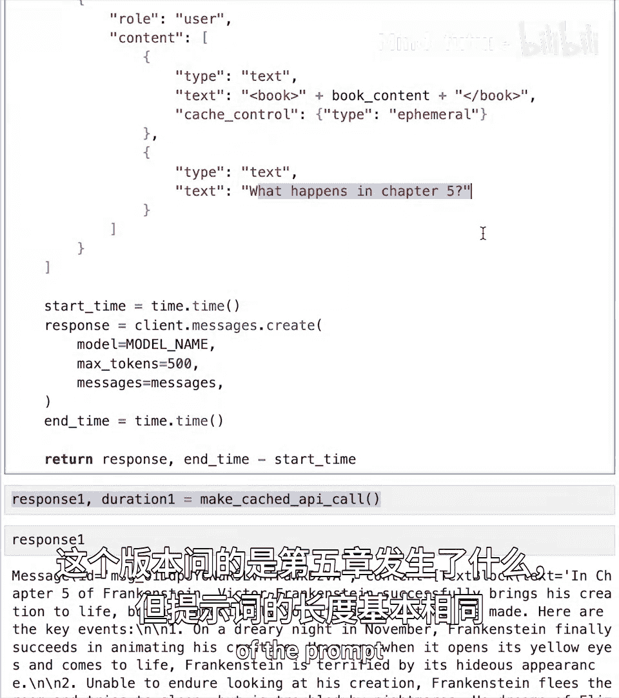
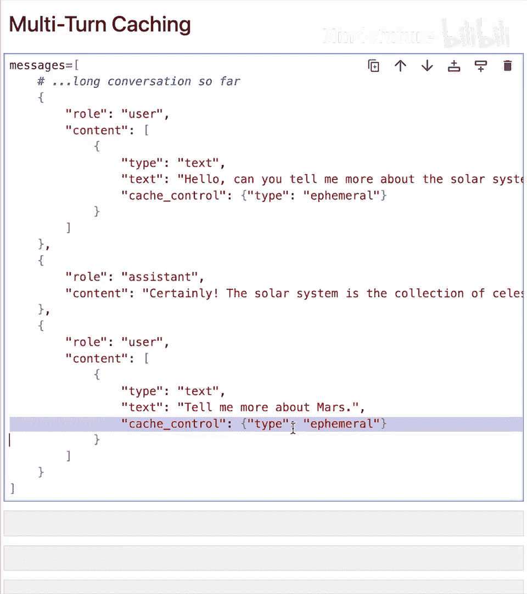
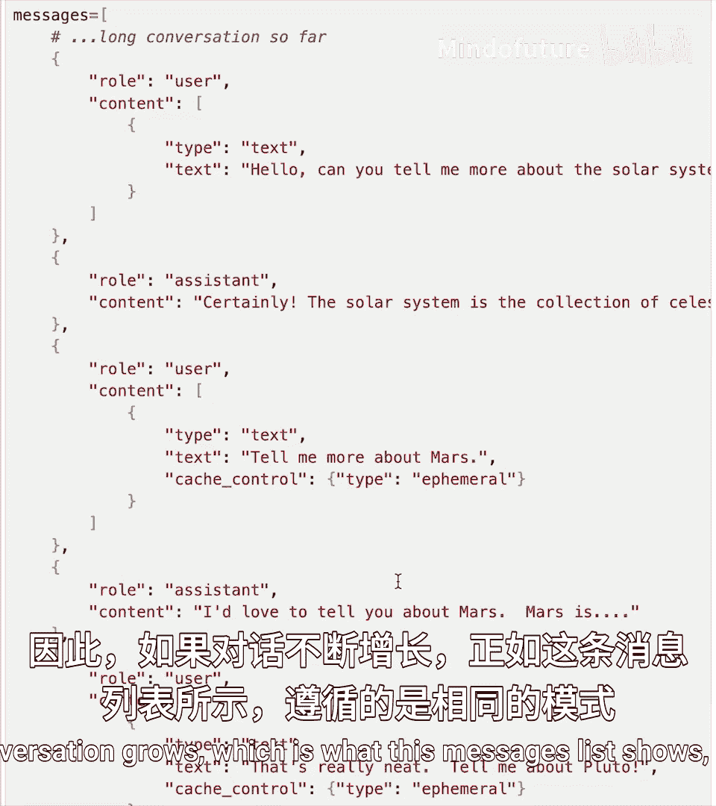
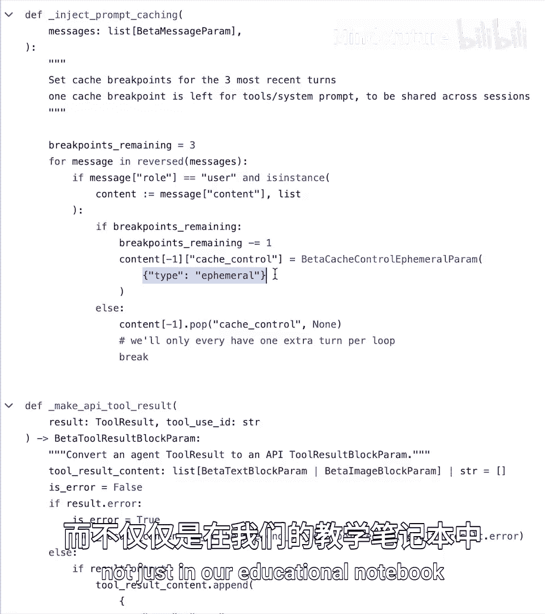

# 006：提示缓存 🚀

在本节课中，我们将学习如何使用提示缓存功能。通过这项技术，你可以将长提示的处理成本降低高达90%，并将延迟减少高达85%。

## 概述



提示缓存是一项优化API使用的功能。它允许我们缓存不同API调用之间可能共有的、保持不变的前缀内容。这能显著减少处理时间和成本，尤其适用于重复性任务或重用相同前缀元素的提示。

上一节我们介绍了API的基本调用，本节中我们来看看如何通过缓存来提升效率。

## 提示缓存的工作原理

为了理解其工作原理，我们先来看一个示意图。


左侧是一个假设的提示，我们用形状来表示。初始时没有任何内容被缓存。当我们发送这个请求到API进行处理后，可以决定缓存发送的所有内容。

此时，第一个请求的整个提示前缀都被存储在缓存中。在后续请求中，如果我们发送一个更长的提示，它包含了与第一个请求完全相同的前缀，以及后面新增的内容，那么API就无需重新处理整个提示。因为前缀已从上一轮缓存中读取，我们获得了缓存命中。这节省了大量时间和金钱，特别是当我们需要反复重用这些内容时。我们还可以根据需要，随着对话增长，逐步向缓存中添加新内容。

## 实践：无缓存调用

现在，让我们通过代码来实际体验。首先，我们进行一个无缓存的API调用。

以下是设置步骤，包括导入Anthropic库、设置客户端和定义模型名称变量。



为了最直观地展示提示缓存的效果，我们将使用一个非常长的提示：玛丽·雪莱所著《弗兰肯斯坦》一书的全文。该文本存储在一个名为 `Frankenstein.txt` 的文件中。

第一步是打开文件并将内容读入一个变量 `book_content`。

```python
# 读取《弗兰肯斯坦》全书内容
with open('Frankenstein.txt', 'r') as file:
    book_content = file.read()
```

`book_content` 现在是一个很长的字符串。接下来，我们将整本书的内容连同一些提示（例如“第三章发生了什么？”）一起发送给API。这个功能封装在名为 `make_uncached_api_call` 的函数中。

函数内部包含计时逻辑，用于计算从发送请求到接收响应所花费的时间。函数最终返回完整的响应以及耗时。

需要明确的是，这个版本完全没有使用任何缓存。高亮行展示了如何提供包含整本书内容的大字符串。注意，它被包裹在 `<book_xml>` 标签中，这并非必需，但有助于模型区分文档边界。最后是独立于书籍的问题：“第三章发生了什么？”。

```python
def make_uncached_api_call():
    import time
    start_time = time.time()

    # 构建消息，包含长文本和无缓存控制
    message = {
        "role": "user",
        "content": [
            {"type": "text", "text": "<book_xml>" + book_content + "</book_xml>"},
            {"type": "text", "text": "What happens in chapter 3?"}
        ]
    }
    # 调用API（此处为示意，非实际代码）
    response = client.messages.create(model=MODEL, messages=[message])
    end_time = time.time()
    duration = end_time - start_time
    return response, duration
```

下一步是调用这个函数，打印耗时和返回的模型响应内容。

```python
response1, duration1 = make_uncached_api_call()
print(f"无缓存调用耗时: {duration1:.2f} 秒")
print(response1.content)
```

运行这个单元需要一些时间，因为提示很长。在示例中，它花费了17.77秒，且没有涉及任何缓存。

查看响应的使用量属性，可以看到处理了约108,000个输入令牌，输出了324个令牌。缓存创建输入令牌和缓存读取令牌均为0，因为我们尚未启用缓存。

## 实践：启用缓存调用

接下来，我们看看启用显式缓存API的版本。这个函数与上一个几乎相同，但名为 `make_cached_api_call`，并且有一个非常重要的新增部分。

在提供长书籍内容的代码块中，现在设置了一个 `cache_control` 属性。其值是一个字典，包含 `"type": "ephemeral"`。任何时候你想设置一个缓存点，都需要这个标签来告诉API：“我想缓存到此为止的所有输入令牌，以便下次重用。”

```python
def make_cached_api_call():
    import time
    start_time = time.time()

    # 构建消息，在长文本后添加缓存控制点
    message = {
        "role": "user",
        "content": [
            {"type": "text", "text": "<book_xml>" + book_content + "</book_xml>"},
            {"type": "cache_control", "cache_type": "ephemeral"}, # 缓存控制点
            {"type": "text", "text": "What happens in chapter 3?"}
        ]
    }
    # 调用API（此处为示意，非实际代码）
    response = client.messages.create(model=MODEL, messages=[message])
    end_time = time.time()
    duration = end_time - start_time
    return response, duration
```

第一次运行这个函数时，仍然需要很长时间，因为还没有任何缓存内容可供读取。但作为此次请求的一部分，直到 `cache_control` 点之前的所有输入令牌都会被缓存起来。

运行后，我们得到响应。但对我们而言，最重要的是使用量信息。

这次，输入令牌数仅为11（指缓存点之后的新内容），输出令牌仍是324，而**缓存创建输入令牌**达到了108,427。这意味着大量令牌已被存入缓存。

## 实践：从缓存读取

现在，尝试从缓存中读取。回到刚才运行的 `make_cached_api_call` 函数。`cache_control` 标签实际上具有双重作用。



*   **第一次**遇到时，它会执行**缓存写入**，将直到该点的所有令牌（约108,000个）写入缓存。
*   **后续请求**中再次遇到相同的 `cache_control` 点时，它会尝试**读取缓存**，检查是否有内容已缓存至此点。



因此，我们可以发送完全相同的请求（例如将问题改为“第五章发生了什么？”）。再次运行函数调用。

```python
response2, duration2 = make_cached_api_call() # 问题可能改为 chapter 5
print(f"缓存读取调用耗时: {duration2:.2f} 秒")
print(f"使用量: {response2.usage}")
```

完成后，查看响应2的使用量属性。**缓存创建输入令牌**为0，因为本次没有执行写入操作。**缓存读取输入令牌**约为108,000个。

比较两次调用：
*   第一次：缓存创建输入令牌 ~108,000，缓存读取输入令牌 0。
*   第二次：缓存创建输入令牌 0，缓存读取输入令牌 ~108,000。



耗时对比也非常明显：
*   无缓存版本：17.7秒
*   缓存读取版本：6.2秒

这还没有考虑成本节省。

## 成本与定价策略

提示缓存的定价方式非常直接：
*   **缓存写入令牌**：比标准输入令牌贵 **25%**。
*   **缓存读取令牌**：比标准输入令牌便宜 **90%**。
*   标准输入/输出令牌：仍按标准价格计费。

这意味着，为每条消息缓存所有内容可能不划算。但如果你有一个很长的提示前缀，会在大量请求中保持不变，那么缓存这个长前缀并重复使用将极具成本效益。你只需支付一次25%的溢价进行写入，之后所有命中该缓存的请求，其对应的输入令牌都能享受90%的折扣。

## 缓存生命周期与注意事项

缓存不会永久存在。目前，我们仅支持**临时性缓存**，每个缓存有**5分钟的有效期**。每次从缓存读取都会重置这个5分钟计时器。因此，是否使用缓存以及如何使用，很大程度上取决于你的具体用例和发送的提示类型。

任何你希望节省成本、并且大量重用的长提示，都可以考虑使用提示缓存。

一个常见的难点是**多轮对话中的缓存策略**。

想象一个很长的对话，例如围绕《弗兰肯斯坦》这本书展开，模型收到了整本书文本，并且进行了数十或数百轮的长对话。有一个很长的公共前缀应该被缓存以节省令牌。

你可以通过设置 `cache_control` 点来缓存整个对话的进展。在处理多轮对话时，一种有效的方法是使用两个不断在对话中向下移动的缓存控制点。

以下是操作思路：
1.  在**倒数第二条用户消息**上设置一个 `cache_control` 点。
2.  在**最后一条用户消息**上设置另一个 `cache_control` 点。

这样设计的原理利用了 `cache_control` 的双重目的性：
*   倒数第二条消息上的点，在上一轮中曾是最后一条用户消息（并已执行了写入）。在本轮中，它充当**读取点**，尝试从缓存读取历史。
*   最后一条消息上的点，在本轮中充当**写入点**，告诉API将直到此处（包含新消息）的所有内容写入缓存，供下一轮读取。

随着对话增长，你只需不断将这两个 `cache_control` 点向下移动到新的“倒数第二”和“最后”用户消息位置，即可持续地从最新缓存中读取，并写入到对话末尾。


*图示：缓存点在多轮对话中的移动*






*图示：消息列表示例*

这个概念有时会让人困惑，我们的文档和示例笔记本中有更详细的说明。

## 缓存与计算机使用

最后，将话题拉回到计算机使用。这是我们过去几节课反复查看的计算机使用快速入门演示的一小段摘录。

我想强调的是，在实际的计算机使用场景中，我们确实使用了缓存控制。我们将 `cache_control` 类型设置为 `ephemeral`，以缓存与模型交互的漫长历史消息，其中包含大量可能占用相当多令牌的屏幕截图。

如果模型正在执行操作，整个交互可能持续数分钟，涉及多次屏幕截图和大量不同的工具调用（我们将在后续讨论），那么使用缓存可以显著减少计算机使用过程中的时间和成本。

我们稍后将有机会更仔细地查看相关代码。这里主要是为了向你展示，缓存不仅存在于教学示例中，也真实应用于实际场景。


## 总结



本节课中，我们一起学习了提示缓存的核心概念与实战应用。我们了解了其工作原理是通过缓存重复的提示前缀来避免重复处理。通过对比实验，我们看到了缓存如何将长提示的响应时间从17.7秒大幅降低到6.2秒，并通过定价策略（写入贵25%，读取便宜90%）实现高达90%的成本节约。我们还探讨了在多轮对话中移动缓存点的进阶策略，并看到了缓存在实际计算机使用场景中的价值。掌握提示缓存，是优化大型语言模型应用性能和成本效益的重要一步。