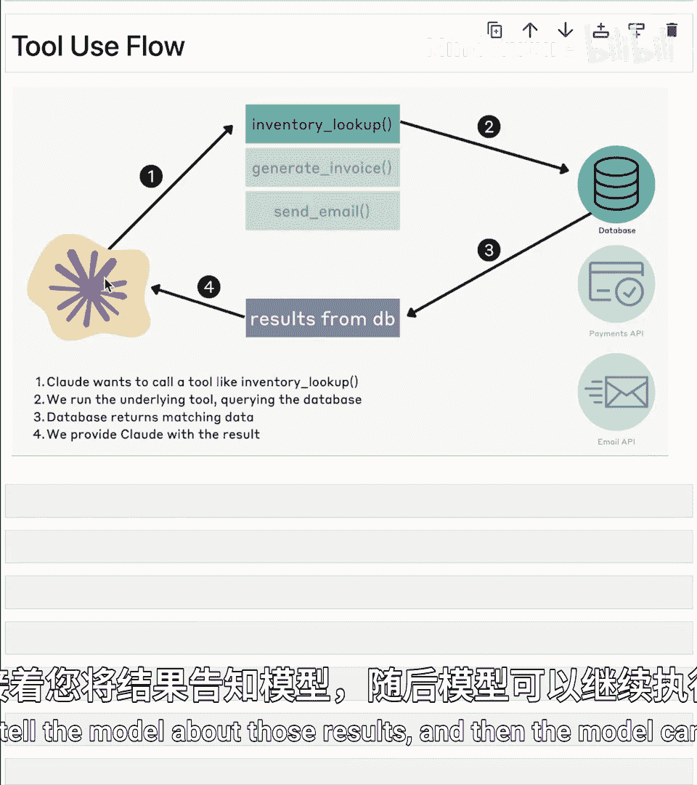
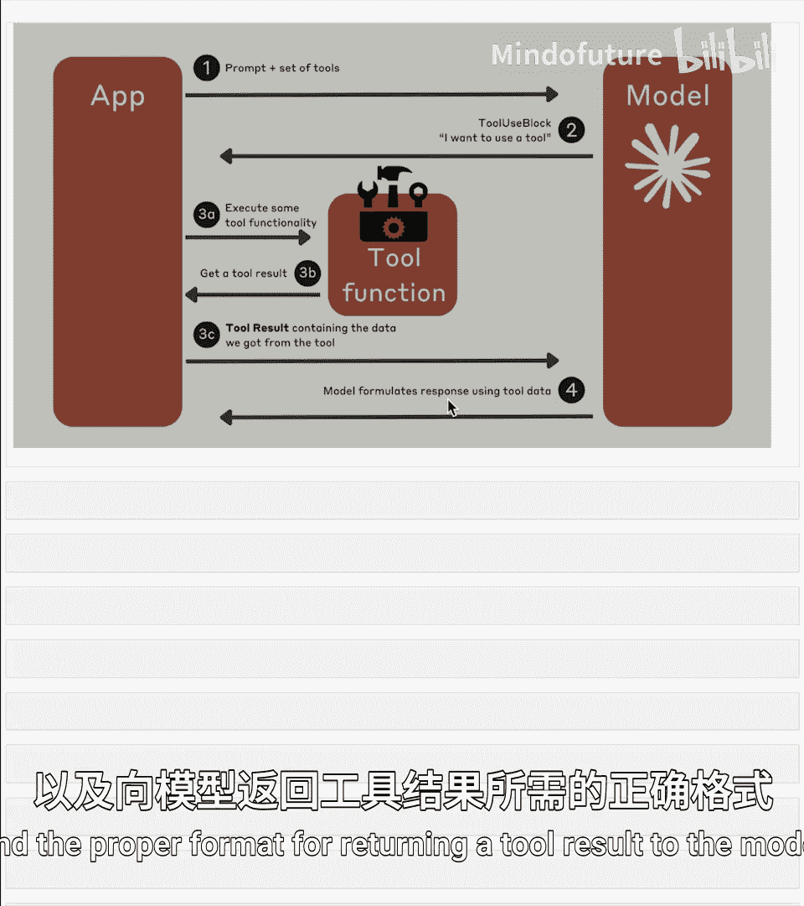
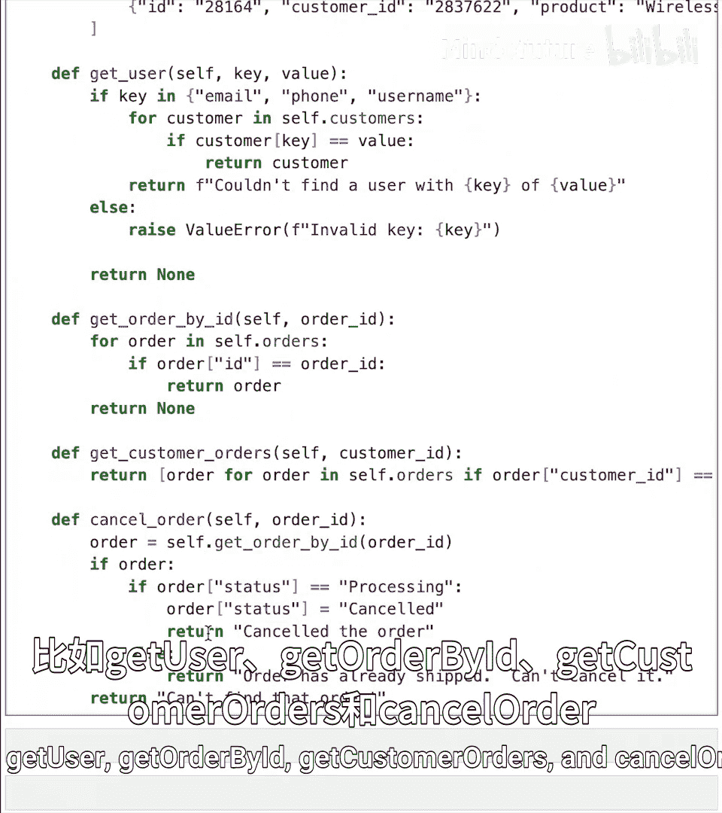
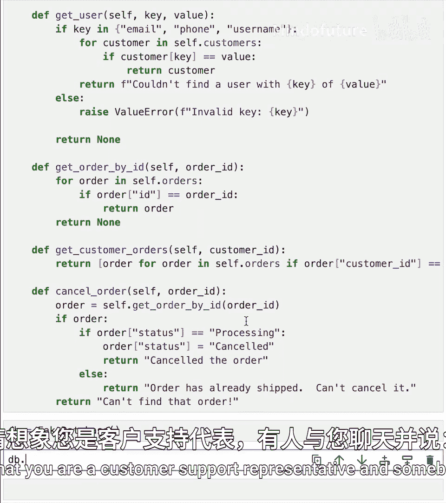
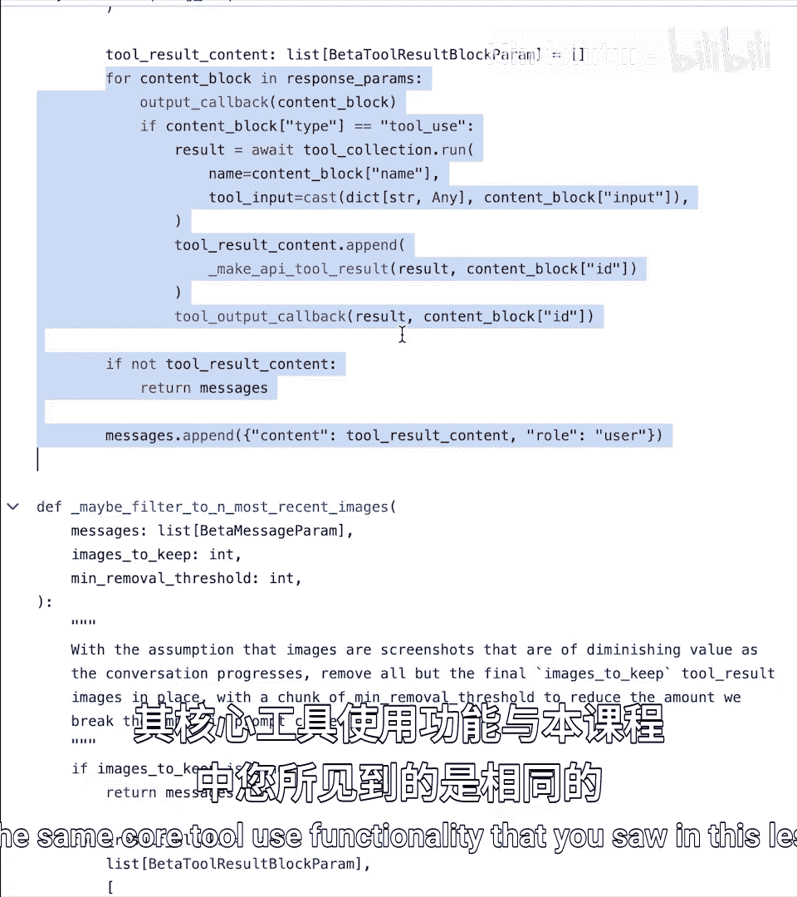

# 007：工具使用入门 🛠️

在本节课中，我们将学习Claude模型如何使用外部工具（也称为函数调用）。我们将从定义自己的工具开始，到完整实现一个基于工具的工作流程。

## 概述：什么是工具使用？

工具使用，或称函数调用，本质上是扩展Claude模型固有能力的一种方式。我们可以为Claude提供一组外部工具或函数，允许模型在需要时请求调用这些工具。需要明确的是，模型本身并不直接调用工具，而是发出调用请求并传递参数，然后由我们执行实际的函数调用，并将结果返回给模型。

## 为什么工具使用很重要？

工具使用极大地扩展了云模型的应用场景。我们可以将常规的文本或图像提示与外部函数调用结合起来。这使得模型能够完成许多其自身无法独立完成的任务，例如检索动态数据、查询内部数据库、与API交互、执行代码、搜索网络，以及控制计算机。实际上，工具使用是实现计算机使用功能的基础。



## 工具使用的基本流程

上一节我们介绍了工具使用的概念，本节中我们来看看其具体的工作流程。



下图展示了工具使用的基本流程。左侧是我们的模型，我们为其提供一组工具（例如：库存查询、生成发票、发送邮件）。模型决定调用某个工具（例如“库存查询”），这是第一步。然后，由我们实际执行该工具对应的函数。执行完成后，我们将结果返回给模型，模型可以据此继续其后续处理。






更详细的流程如下：
1.  向模型提供提示词和一组工具定义。
2.  模型可能决定使用某个工具，并输出调用请求（包含工具名和参数）。
3.  我们实际执行该工具，并获得返回值（可能来自API、数据库或搜索工具）。
4.  我们将工具执行结果发送回模型。
5.  模型可以处理该结果并继续。

## 定义工具：JSON Schema

要使用工具，首先需要定义一组希望提供给模型的工具。其次，需要以正确的格式定义它们并告知模型。最后，需要理解来回交互的流程以及向模型返回工具结果的正确格式。

我们首先创建一个模拟数据库类来替代真实数据库，以简化示例。假设我们经营一家名为“Acme Corporation”的公司，拥有客户和订单数据。这个类包含几个方法，例如 `get_user`、`get_order_by_id`、`get_customer_orders` 和 `cancel_order`。

接下来，我们需要告诉Claude关于这些工具的信息。第一步是为每个函数定义模式（Schema），这通过 **JSON Schema** 格式完成。Claude API期望使用这种格式来传递工具定义。

以下是一个 `get_user` 方法的工具定义示例：

```json
{
  "name": "get_user",
  "description": "根据邮箱、电话或用户名查找用户信息。",
  "input_schema": {
    "type": "object",
    "properties": {
      "key": {
        "type": "string",
        "enum": ["email", "phone", "username"],
        "description": "查找依据的字段类型。"
      },
      "value": {
        "type": "string",
        "description": "查找字段的具体值。"
      }
    },
    "required": ["key", "value"]
  }
}
```

这个定义包含了工具名称、描述以及输入参数的模式。`key` 参数必须是 `email`、`phone` 或 `username` 之一，`value` 是对应的具体值。两个参数都是必需的。

我们需要为所有四个方法（`get_user`、`get_order_by_id`、`get_customer_orders`、`cancel_order`）都创建类似的JSON Schema定义，并将它们放入一个列表中，例如名为 `tools` 的列表。

## 实现工具调用循环

定义好工具后，下一步是在对话中实现工具调用的完整循环。这涉及到一个持续运行的聊天机器人流程。

核心步骤如下：
1.  **初始化对话**：设置系统提示词，定义模型角色（例如客服机器人），并初始化消息列表。
2.  **发送请求**：将用户消息和工具列表（`tools` 参数）发送给模型。
3.  **处理响应**：检查模型的响应。如果模型因为想调用工具而停止（`stop_reason` 为 `tool_use`），则提取工具调用信息（名称和输入参数）。
4.  **执行工具**：根据提取的信息，调用对应的本地函数（如 `get_user`）并获取结果。
5.  **返回结果**：将执行结果封装为 `tool_result` 消息，附上对应的 `tool_use_id`，并追加到消息历史中。
6.  **继续循环**：将包含工具结果的新消息列表再次发送给模型，让模型基于结果生成后续回复，并重复此过程。

以下是一个简化的代码结构示例，展示了核心循环逻辑：

```python
def simple_chat():
    # 1. 定义工具列表
    tools = [tool_schema_1, tool_schema_2, ...]
    # 2. 定义系统提示
    system_prompt = "你是Acme的客服机器人..."
    messages = [{"role": "user", "content": "你好"}]

    while True:
        # 3. 发送消息给模型，包含工具定义
        response = client.messages.create(
            model="claude-3-sonnet-20240229",
            max_tokens=1024,
            messages=messages,
            tools=tools, # 关键：传递工具列表
            system=system_prompt
        )

        # 4. 将模型的回复加入历史
        messages.append(response)

        # 5. 检查模型是否想调用工具
        if response.stop_reason == 'tool_use':
            for block in response.content:
                if block.type == 'tool_use':
                    # 提取工具调用信息
                    tool_name = block.name
                    tool_input = block.input
                    tool_use_id = block.id

                    # 6. 执行本地工具函数
                    tool_result = process_tool_call(tool_name, tool_input)

                    # 7. 将工具结果返回给模型
                    tool_result_message = {
                        "role": "user",
                        "content": [{
                            "type": "tool_result",
                            "tool_use_id": tool_use_id,
                            "content": tool_result
                        }]
                    }
                    messages.append(tool_result_message)
        else:
            # 模型生成的是普通文本回复，展示给用户
            print(extract_reply(response.content))
            # 获取用户下一轮输入...
```

## 示例：客服聊天机器人

让我们通过一个具体的客服场景来实践上述流程。用户 `Priya123` 想查询她的订单状态，但她只知道自己的用户名。

1.  用户输入：`“我想查询订单状态，我的用户名是 Priya123。”`
2.  模型分析后，决定首先需要调用 `get_user` 工具来根据用户名查找用户ID。
3.  模型输出一个 `tool_use` 块，请求调用 `get_user`，参数为 `{“key”: “username”, “value”: “Priya123”}`。
4.  我们的程序执行本地的 `get_user` 函数，返回用户ID（例如 `“user_789”`）。
5.  程序将结果 `“user_789”` 作为 `tool_result` 发回给模型。
6.  模型收到用户ID后，决定下一步调用 `get_customer_orders` 工具，参数为 `{“customer_id”: “user_789”}`。
7.  程序再次执行本地函数，返回Priya的订单列表。
8.  模型收到订单列表后，生成面向用户的友好回复：`“您最近有两个订单：一个蓝牙音箱和一副无线耳机。您想了解哪个订单的具体信息？”`

这个例子展示了模型如何通过链式调用多个工具，自主完成一个多步骤的任务。

## 从工具使用到计算机使用

工具使用的机制是计算机使用功能的核心。在计算机使用场景中，我们提供给模型的工具集包含了诸如 `click`（点击）、`move_mouse`（移动鼠标）、`type`（打字）等计算机操作。

其工作流程与上述客服机器人完全一致：
1.  模型接收屏幕截图和用户指令（如“打开记事本”）。
2.  模型分析后，可能输出一个 `tool_use` 请求，要求调用 `click` 工具，参数为屏幕上的某个坐标。
3.  我们的程序执行实际的点击操作。
4.  程序捕获新的屏幕截图，并将其作为 `tool_result` 的一部分返回给模型。
5.  模型根据新的屏幕状态决定下一步操作（如调用 `type` 工具输入文字），如此循环，直到完成任务。

## 总结



本节课中我们一起学习了Claude模型工具使用的完整流程。我们了解到，工具使用是通过JSON Schema定义工具、在API调用中传递工具列表、并处理模型发起的工具调用请求来实现的。关键在于理解“请求-执行-返回”的循环：模型请求调用工具，我们执行实际函数并将结果返回，模型再基于结果继续推理或行动。这套机制是构建智能助手、自动化工作流乃至实现计算机使用等高级应用的基础。在接下来的课程中，我们将深入探讨计算机使用的具体实现。