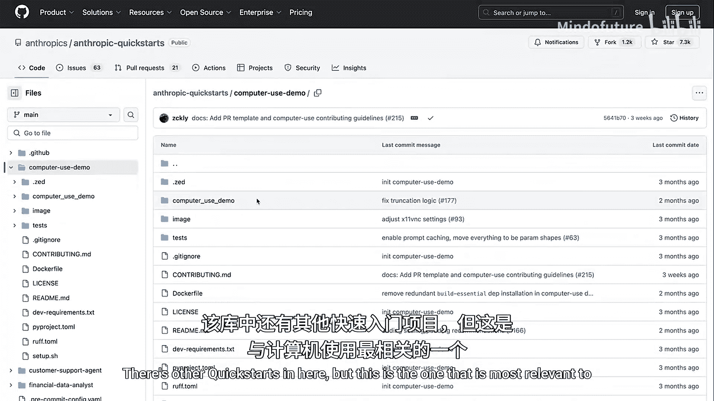
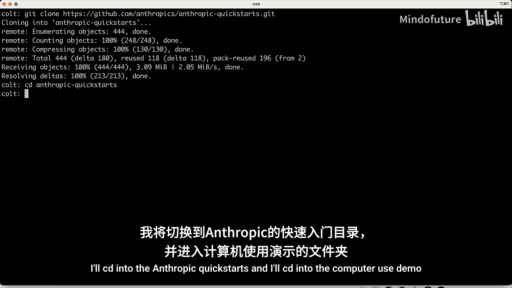
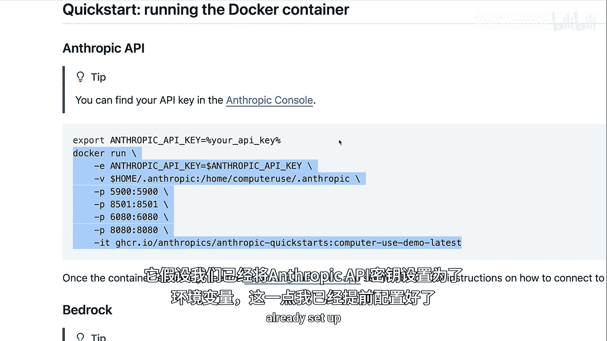
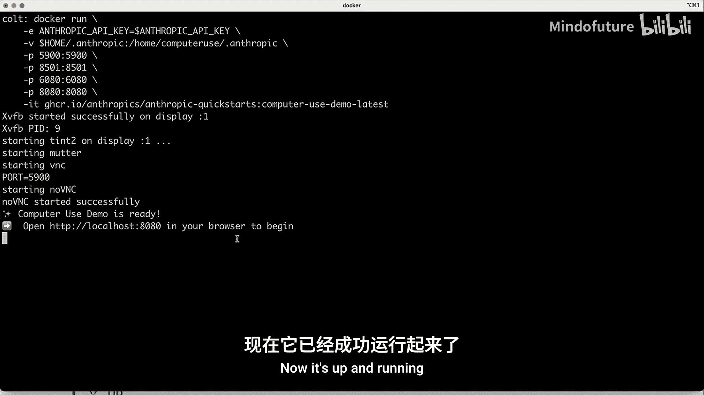
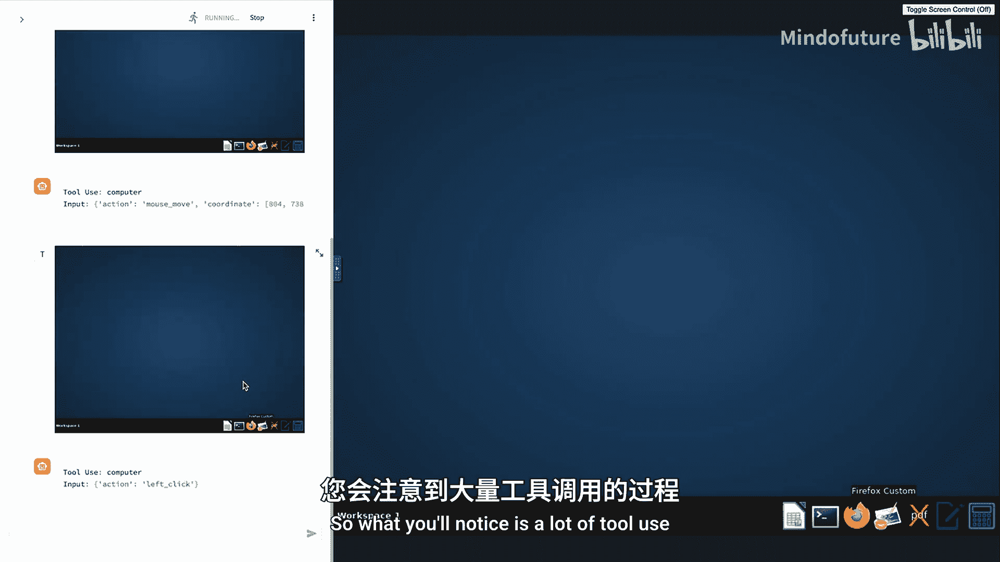
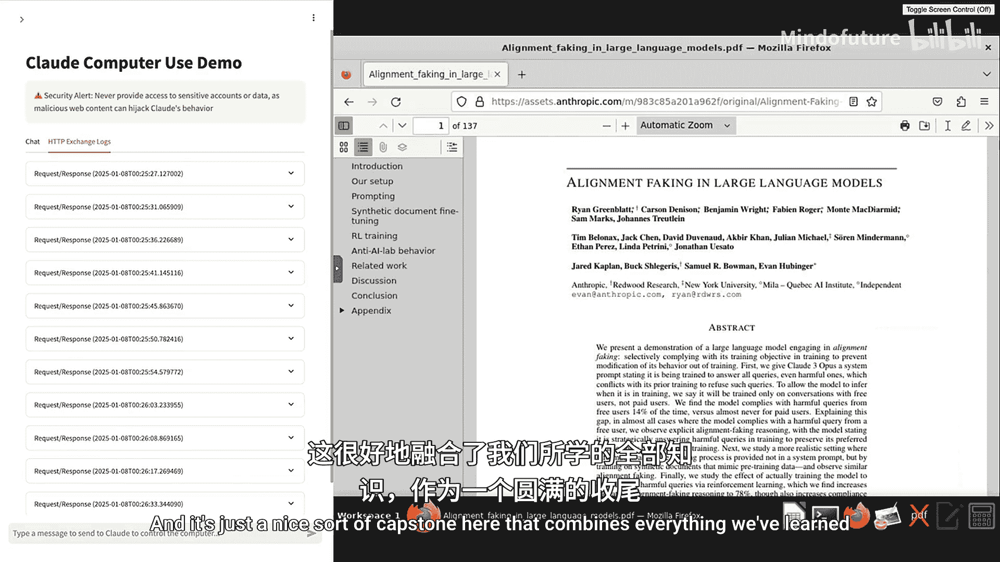

# 008：构建计算机使用代理

在本节课中，我们将整合之前学到的所有概念。你将理解基本的代理架构，并演示一个可以在你自己计算机上运行的、具备计算机使用能力的Claude代理。

## 概述

上一节我们介绍了多模态提示和工具使用。本节中，我们将把这些概念整合到一个具体的应用案例中：一个能够操作计算机的智能代理。我们将通过一个实际的演示，展示如何利用Anthropic提供的快速入门代码库，在本地运行一个计算机使用代理。





## 运行演示的前提条件



在深入之前，你需要了解运行此代理的几个步骤。这些步骤相对直接，但必须在你的本地机器上完成。这并非本课程的必修部分，而是为有兴趣自行探索的学员提供的演示。

Anthropic在Github上有一个名为“Anthropic Quickstarts”的代码库，其中包含一个计算机使用演示。这个演示是一个快速上手的实现方案，让你能相对轻松地启动一个计算机使用代理。你只需要一个API密钥，克隆代码库，并运行几条基本命令。

以下是启动演示的步骤：



1.  克隆代码库。
    ```bash
    git clone <repository-url>
    ```
2.  进入计算机使用演示目录。
    ```bash
    cd anthropic-quickstarts/computer-use-demo
    ```
3.  确保已设置Anthropic API密钥作为环境变量。
    ```bash
    export ANTHROPIC_API_KEY='your-api-key-here'
    ```
4.  运行启动命令（具体命令请参考代码库中的README文件）。

启动后，你可以在浏览器中访问 `localhost:8080` 来使用这个快速入门演示。请注意，这只是众多实现方式中的一种，你可以基于此编写自己的计算机使用代理实现，并对其进行修改。

## 演示界面与交互



界面左侧是一个聊天窗口，你可以在此向Claude发送消息。右侧是一个容器化的计算机界面，Claude将能够与之交互。初始状态下，你无法直接操作右侧界面，它是一个简单的Linux机器。你可以通过点击“toggle screen control”来切换控制权，在将控制权交给Claude之前，你可以先进行一些手动操作。

界面中还有一些可配置参数，例如最大图像数量、选择使用的API后端（Anthropic原生API、AWS Bedrock或Google Vertex），以及自定义系统提示后缀等。

## 一个简单的任务示例

让我们尝试一个简单的任务：“查找Anthropic最近关于对齐伪造的研究论文并为我总结。”

发送请求后，模型开始工作。你会观察到大量的工具使用记录。左侧日志显示了模型希望使用的工具，右侧则展示了模型在显示屏上做出的各种操作。

模型执行了以下步骤：
1.  搜索“anthropic alignment faking research paper”。
2.  点击搜索结果中的研究论文。
3.  打开PDF文件。
4.  使用 `curl` 命令下载该文件。
5.  使用bash工具检查下载内容。
6.  最终，生成并返回了论文内容的摘要。

从初始提示到最终获得摘要，模型以代理循环的方式进行了大约10到15轮的消息交互。这是一个非常简单的代理，其核心目标是完成任务。为了实现目标，模型可以访问多种工具。

## 代理循环与工具调用机制

核心的代理循环会调用Anthropic API，并为模型提供计算机使用工具。这比之前看到的演示要复杂一些，但其底层原理是相同的。

代码中包含一个较长的提示词，用于向模型说明它正在一个Ubuntu虚拟机中运行，可以打开Firefox、安装应用程序、访问各种工具，并告知当前日期等。

以下是工具定义的核心部分，其结构与之前讨论的工具使用完全一致：
```python
# 示例工具结构
tools = [
    {
        "name": "screenshot",
        "description": "获取当前屏幕截图",
        "input_schema": {...}
    },
    {
        "name": "mouse_move",
        "description": "移动鼠标到指定坐标",
        "input_schema": {...}
    },
    # ... 其他工具如 left_click, type_text 等
]
```

在循环中，消息被反复发送给模型，直到模型决定任务完成。代码中包含决定模型调用工具时该如何处理的逻辑：执行工具，并以正确的工具结果格式回复模型。

在代码库的 `tools` 文件夹中，定义了一系列工具。其中最关键的是 `computer` 工具，它能执行诸如按键、输入字母、移动鼠标、左键/右键/中键点击、双击以及最重要的——截取屏幕截图。

整个系统的运行基础依赖于屏幕截图。模型通过请求截图来获取屏幕的当前状态，然后决定将鼠标移动到何处、在哪里输入、在哪里点击。之后，它可能会获取另一张截图，并持续这个过程。虽然其中涉及一些逻辑，例如截图需要缩放到适合Claude模型处理的分辨率，但本质上，这只是一个接收模型请求（如左键点击、截图、双击或移动鼠标）并实际执行该功能的函数。

请记住，模型本身并不执行工具。就像简单的聊天机器人示例一样，模型只是输出一个表示“我想调用这个工具”的代码块。在这里，我们作为工程师或开发者（如果你使用这个快速入门代码库，代码已为你写好）需要实际实现点击、拖拽、截图等操作。模型只是在告诉我们它希望执行哪些操作。

## 底层原理回顾

如果我们查看HTTP交换日志，可以看到整个对话的完整记录。每一轮对话都包含我们的初始请求（用户角色）、模型的助手响应（包含文本和工具调用块），以及我们作为工程师回复的工具结果。

这与我们之前学到的内容完全一致：
*   **消息传递**：以正确的角色和内容类型（图像和文本）发送消息。
*   **工具使用**：为模型提供工具，并以正确的工具结果块回复，告知模型其调用工具的结果。
*   **多模态提示**：提供屏幕截图作为图像内容块。

虽然这个计算机使用代理比简单的聊天机器人更复杂、更精巧，但其底层支撑技术正是我们在本课程中接触过的几乎所有主题的汇总，包括提示缓存等技术。

## 总结

本节课我们一起学习了如何将多模态提示、工具使用和代理循环等概念整合，构建一个能够操作计算机的智能代理。我们通过Anthropic的快速入门演示，实际观察了代理如何通过截图感知环境、调用工具执行操作，并最终完成复杂任务的过程。



这只是一个演示，不要求你现在就必须去操作。但如果你对此感到好奇和兴趣，可以访问Quickstart代码库，在你自己的机器上进行尝试和探索。你也可以查阅我们的文档和博客，了解更多关于如何充分利用计算机使用功能的信息。这个演示很好地总结了我们在本课程中学到的几乎所有内容，是一个完美的收官案例。