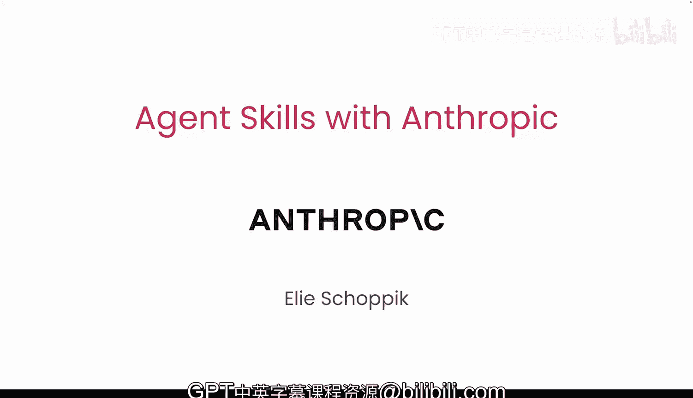
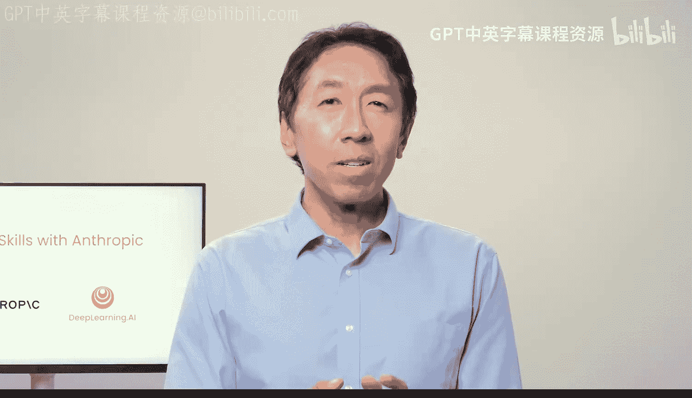
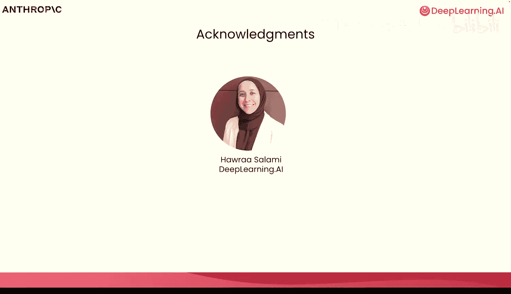

# 001：课程介绍

在本节课中，我们将要学习智能体技能的基础概念，了解其工作原理、核心构成以及如何利用它们来扩展智能体的能力。

欢迎来到这门关于智能体技能的课程。本课程由Anthropic合作开发，并由回归讲师El Showe主讲。

技能为Claude及其他智能体提供了执行任务的新能力。我很高兴能再次与大家一同教学。感谢Andrew，我也很高兴能回来，并与大家共同探讨这个主题。

技能是一种扩展智能体能力的指令集合，它包含了专业化的知识。在本课程中，你将学习技能的工作原理、创建技能的最佳实践，并为不同的用例构建技能，包括编码、研究、数据分析等。

技能的令人兴奋之处在于，它们现在是一个开放标准。这意味着它们拥有标准化的格式，可以与任何兼容技能的智能体协同工作。因此，你可以一次性构建技能，并将其部署到多个智能体产品中。

任何技能都应包含一个名为 `skill.md` 的Markdown文件，该文件包含了技能的名称、描述和主要指令。主要指令也可以引用其他文件，例如脚本、额外的Markdown文件以及模板和图片等资源。

技能是逐步向智能体披露的。这意味着技能的名称和描述始终存在于智能体的上下文窗口中，但智能体只有在使用请求与技能描述匹配时，才会将指令的其余部分加载到上下文中。此时，如果需要，智能体可能还会加载引用的文件和资源文件。

为了使用技能，你的智能体需要一套基本工具：文件系统访问权限以读写文件，以及 `bash` 工具来执行代码。这些工具使你的智能体能够执行技能所需的任何命令。

你的智能体可以将技能与MCP和子智能体结合，以创建强大的智能体工作流。例如，它可以利用MCP从外部源获取数据，然后依靠技能来了解如何处理这些数据或如何高效地检索数据。它也可以将任务委托给具有独立上下文的子智能体，而子智能体本身可以使用技能来获取专业知识。

在本课程中，我们将从Cloud AI开始，为营销活动创建一个技能，并将其与预构建的Excel和PowerPoint技能结合。然后，我们将为内容创建和数据分析工作流创建两个技能，并通过Cloud API进行尝试。

之后，我们将使用Claude Code中的技能来审查和测试代码。最后，我们将使用Claude Agent SDK构建一个研究智能体，该智能体利用一个技能来整合研究成果。

我要感谢来自DeepLearning.AI的Harrison Salami对本课程的贡献。

那么，你如何知道何时该使用技能呢？假设你有一个需要反复要求智能体执行的工作流。与其每次都解释相同的工作流，你可以将其打包成一个技能，这样你的智能体就能自动知道该做什么。

这正是你将在第一课中与El一起学习的内容。请继续观看下一个视频以了解更多信息。

本节课中我们一起学习了智能体技能的基本定义、其作为开放标准的优势、核心文件结构、逐步披露的工作原理，以及技能如何与工具、MCP和子智能体结合来构建复杂工作流。我们还预览了整个课程的学习路径。