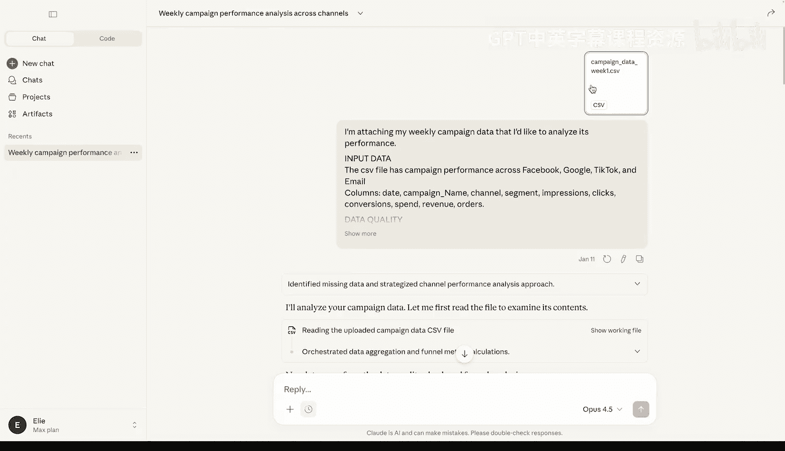
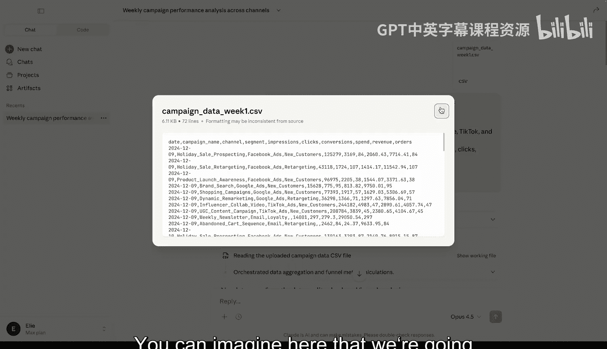
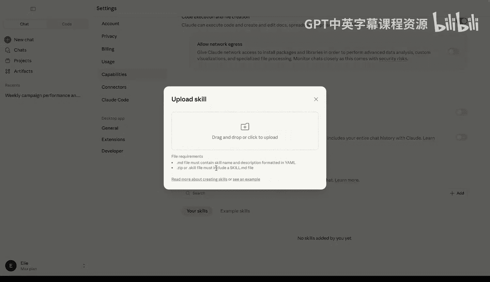
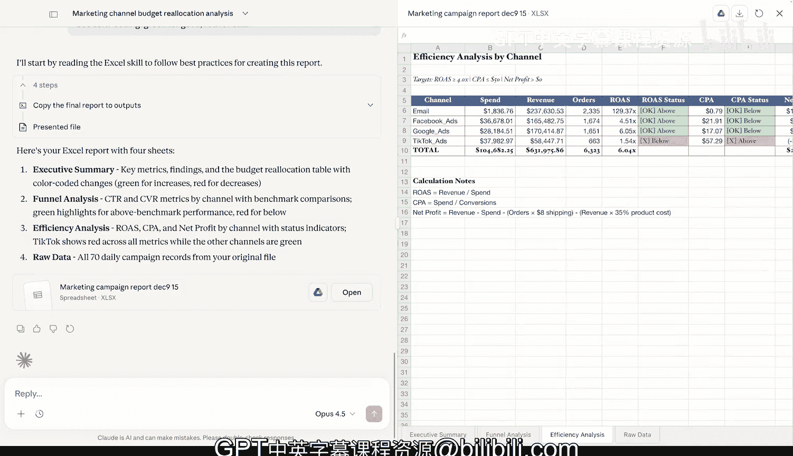

# 002：为什么使用技能——第一部分 🧩

在本节课中，我们将要学习什么是“技能”，并通过一个具体的营销数据分析场景，来理解为什么将重复的工作流程打包成技能会如此有用。我们将看到，技能如何帮助我们节省时间、统一标准，并更高效地利用AI的上下文窗口。

## 技能是什么？

技能是一组指令的文件夹，它将重复的工作流程、专业知识或新能力打包给你的智能体。

如果你发现自己经常在不同的对话中键入相同的提示词，就应该考虑将其转化为一个技能。接下来，我们将通过一个使用Claude AI的场景来探索如何做到这一点。


## 场景演示：营销数据分析





在深入探讨技能的具体构成和工作原理之前，我们先通过一个场景来展示技能的实用性。

### 初始数据分析

这里，我有一份CSV格式的营销活动数据，需要对其表现进行分析。数据包含日期、活动名称、展示量、点击量和转化量。

在我的第一个提示中，我附上了这份数据，解释了输入数据的结构，并要求Claude检查数据质量、进行漏斗分析，并计算一些关键指标，如点击率和转化率。在提示末尾，我还指定了期望的输出格式。


Claude读取了CSV文件，执行了数据质量检查和漏斗分析，并返回了活动表现分析报告。报告显示了总记录数、缺失数据以及存在的异常。进一步查看漏斗分析与基准数据的对比，我们可以清楚地看到哪些方面表现良好，哪些方面有待改进。这些信息对于调整营销活动和制定下一步策略非常有价值。

### 计算效率指标

接下来，我们要求Claude计算额外的营销效率指标，包括广告支出回报率、单次获取成本和净利润等，同样指定了输出格式。

我们看到效率分析的结果，再次明确了哪些有效、哪些无效，并获得了相应的解读。从投资组合表现和总净利润来看，我们正在盈利，但显然还有更多可以优化的空间。

### 预算重新分配分析

第三步，我们引入了一份额外的数据文件：预算重新分配规则。这份文件包含了大量关于如何在不同营销渠道间分配预算的规则，用于决定在哪些渠道增加、维持或减少预算。

这同样是大量针对我们特定用例的数据。虽然Claude知道如何处理决策和分析营销指标，但这里我们指定了具体的执行方式。这要求我引入外部文档，找到正确的规则，即使我对这个领域不是最了解的，也希望操作正确。

Claude根据规则进行了分析，我们可以看到哪些规则通过、哪些未通过，并提出了预算重新分配的建议，释放了一些预算，并分析了表现良好的渠道以分配额外预算。

## 传统方式的挑战

以上我们看到的是一个逐步进行的过程，它要求我们作为用户，每次都要输入必要的文档并具备预先的知识。

不仅如此，我输入的所有信息都会立即被添加到AI的上下文窗口中。如果我想进行其他类型的对话或询问不同的问题呢？这些信息并非总是必要的。

## 技能的解决方案：打包工作流

现在，我们来看看如何将这些信息打包成一个“技能”。技能是一个独立的资产（本质上是一个文件夹），它包含了如何执行活动分析的指令，同时可以精细控制哪些信息进入上下文窗口，哪些不进入。

我们刚才演示的是一个每周都要进行的活动表现分析。我不希望每周都重复复制粘贴相同的提示词。将其预打包成一个可以随时使用、与团队成员共享并根据需要编辑的技能，会是更好的选择。

## 技能文件剖析

那么，一个技能具体长什么样呢？它需要一个名为 `skill.md` 的Markdown格式文件，这个文件包含了执行我们之前所见任务的核心指令集。

在这个Markdown文件中，我包含了与之前提示词中非常相似的信息：
*   **输入要求**
*   **数据质量检查**
*   **带有历史基准的漏斗分析和指标**
*   **效率分析**
*   **期望的输出格式**

最后，我还有一个关于预算重新分配的说明，它**仅在用户询问预算重新分配时**，才会引用另一个文件。这是技能能更高效利用上下文的一个例子：只有用户需要时，才会读取和使用那个特定文件。

### 技能元数据：YAML头部

为了让技能按预期工作，我需要在文件开头添加一段YAML格式的数据。每个技能都必须包含一个**名称**和一个**描述**。

*   **`name`**: 技能名称，用于在需要时引用它，并在界面上显示是否正在使用。
*   **`description`**: 技能描述，至关重要，它帮助AI模型理解何时应该使用这个特定技能。

```yaml
name: analyzing-marketing-campaign
description: Performs weekly marketing campaign analysis including data quality checks, funnel analysis, efficiency metrics, and budget reallocation recommendations.
```

### 引用外部文件

技能还可以引用其他文件，只要它们都在同一个父文件夹内。例如，我们的 `skill.md` 中引用的预算重新分配规则文件，其内容就是我们之前在对话中直接输入的那些规则。

这样，我们就从在对话中直接输入指令，转变为将指令放入一个结构化的文件夹中。

## 创建技能文件夹

现在，我已经有了技能文件和相关的外部文件，接下来需要创建一个新的文件夹来存放它们。

1.  创建一个文件夹，并以技能名称命名，例如 `analyzing-marketing-campaign`。
    *   **命名规则**：使用小写字母，单词间用短横线连接，避免使用“Claude”或“Anthropic”等保留关键词。
2.  在该技能文件夹内，创建另一个名为 `references` 的文件夹。这是技能开放标准中用于存放技能所引用的外部文件的特定目录。
3.  将 `budget-reallocation-rules.md` 文件放入 `references` 文件夹。
4.  将 `skill.md` 文件放在技能文件夹的根目录下。

最终，文件夹结构如下所示：
```
analyzing-marketing-campaign/
├── skill.md
└── references/
    └── budget-reallocation-rules.md
```

## 上传并使用技能

创建好文件夹后，将其压缩成ZIP文件，然后上传到Claude AI。


1.  进入Claude AI的设置，找到“能力”部分。
2.  在“能力”页面底部，找到“技能”版块。
3.  点击“添加”，上传你创建的ZIP文件。
4.  上传完成后，可以看到技能的名称和描述。



现在，让我们看看技能的实际应用。开始一个新的聊天，附上同样的CSV数据文件，并输入一个与之前类似的提示，询问活动分析和预算重新分配。

如果一切正常，Claude会自动识别并应用我们上传的“每周营销活动分析”技能。它将按照技能文件中的指令执行任务，而我们不再需要来回复制粘贴大量的提示词。

我们可以看到，Claude读取了技能文件以确保遵循正确的指令。技能的名称和描述正是Claude能够识别并启用它的关键。由于我们询问了预算重新分配，它还会去读取技能中上传的那个额外文件。

分析结果与我们之前手动操作时类似：分析了各渠道表现（例如TikTok可能面临挑战），指出了有效和无效的方面，并给出了重新分配建议。但这一次，我们无需自己添加所有提示。

## 技能的扩展价值

这个技能可以在许多不同平台间共享。由于技能是一个开放标准，它在其他编码环境（如Cursor、GitHub Copilot等）中也得到支持。

我们不仅创建了一种将数据和分析流程打包到中心位置的方法，还更高效地利用了上下文窗口，其可移植性极具价值。

### 结合内置技能生成报告

最后，我们可以要求Claude根据分析结果创建一份带有特定信息和颜色编码的Excel报告。

实际上，创建电子表格和执行必要代码的能力，存在于Claude的一个**内置技能**中。因此，我们会看到底层技能被调用，代码运行以创建Excel文件，并最终输出符合我们要求的报告。

现在，我们得到了生成的电子表格，其中包含执行摘要、漏斗分析和效率分析。我们可以直接在Google Drive中打开或下载这个表格。

通过使用我们自定义的数据分析技能，结合Claude内置的电子表格生成技能，我们可以将CSV数据转化为有意义、可操作的见解，并以多种文件格式输出。

## 总结



本节课中，我们一起学习了“技能”的概念及其重要性。我们通过一个完整的营销数据分析案例，演示了将重复、复杂的工作流程打包成技能的过程。这包括创建 `skill.md` 文件、添加YAML元数据、组织引用文件、上传技能并最终应用它。技能不仅提升了效率、保证了分析的一致性，还通过智能管理上下文和提供卓越的可移植性，极大地扩展了AI助手的能力边界。下一节，我们将更深入地探讨技能的详细结构及其在整个AI生态系统中的位置。