# 003：为何使用技能（第二部分）🚀

在本节课中，我们将深入学习智能体技能的本质、其作为开放标准的特性，以及它如何通过提供领域专业知识、可重复工作流程和新能力来增强智能体。我们将探讨技能的构成、可组合性以及其独特的“渐进式披露”机制。

在上一节课中，我们学习了如何在 Claude 中创建技能，以及如何将包含数据的提示转化为可在不同对话中复用的技能包。

现在，让我们深入探讨技能究竟是什么，以及驱动它们的开放标准——类似于模型上下文协议。

## 技能：一个开放标准 📜

技能本身是一个开放标准，可以跨多种不同的人工智能应用使用。

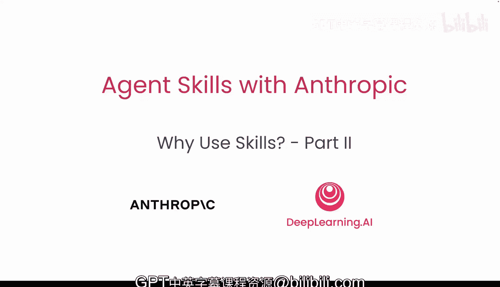

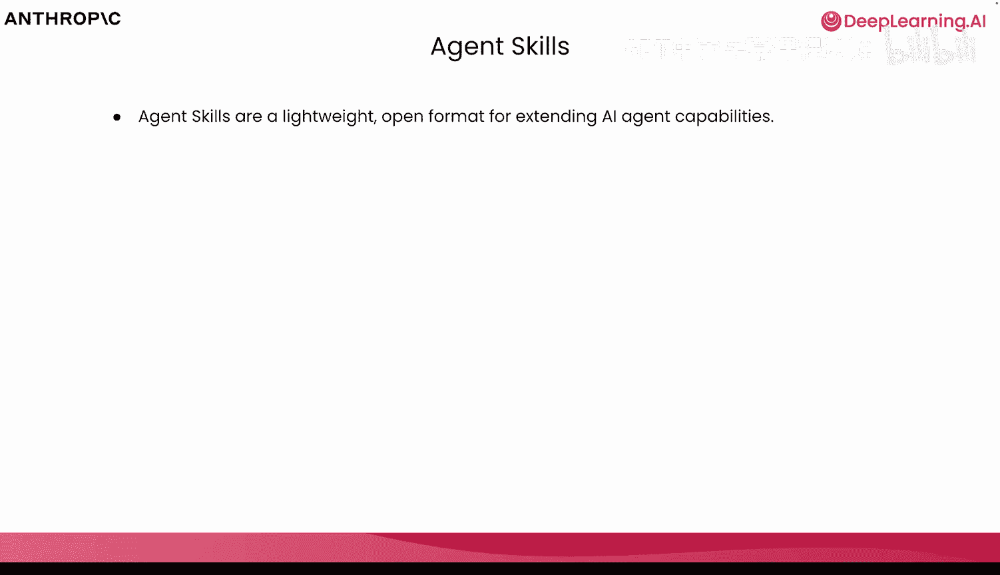

虽然技能最初由 Anthropic 创建，但它现在已成为一个拥有特定规范的开放标准，被包括 Claude、Gemini、Cloud Code、OpenCode 等在内的众多平台采用。

基于这一点，我们来谈谈它的工作原理。

## 技能的文件系统结构 📁

当我们构建人工智能应用以使用特定技能时，我们需要利用某种文件系统。在使用 Cloud AI 或 Cloud Desktop 等工具时，我们会在该文件系统中加载包含 `.skill.md` 文件的文件夹，以及可以被引用的子文件夹或文件。

以下是我们之前操作的确切结构示例：

```
技能文件夹/
├── .skill.md          # 技能主定义文件
└── 其他资源文件/      # 可被引用的脚本、文档等
```

同时，技能本身不仅可以包含其他 Markdown 文档，还可以包含可执行的脚本。

例如，我们有一个用于处理 PDF 文档的技能。我们需要将 PDF 转换为图像、从表单字段中提取信息，甚至用注释填充 PDF 表单。这需要执行代码，而这些需要执行的代码可以从 `.skill.md` 文件中引用。

因此，当我们开始探索自定义技能和内置技能时，重要的是要认识到技能不仅仅是引用其他文本文件的文本文件，而是可以引用脚本、说明其功能以及何时需要执行的文本文件。

技能还可以包含图标、图像和其他资源。当我们开始思考创建自定义样式和品牌时，技能真正大放异彩的地方在于那些 Claude 可能不完全了解你或你公司具体运作方式的领域。

你可以想象设计新闻稿、创建品牌指南等任务，Claude 对其有大致概念，但不知道你公司或团队的具体做法。

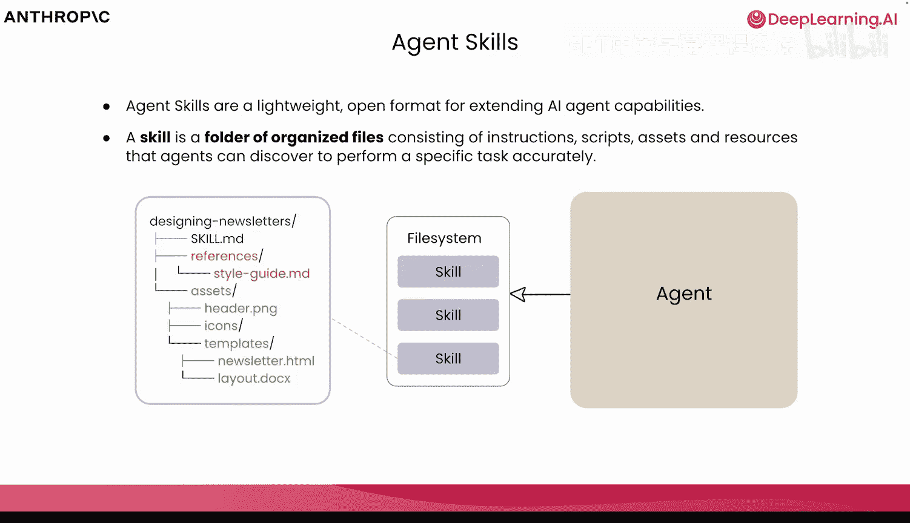

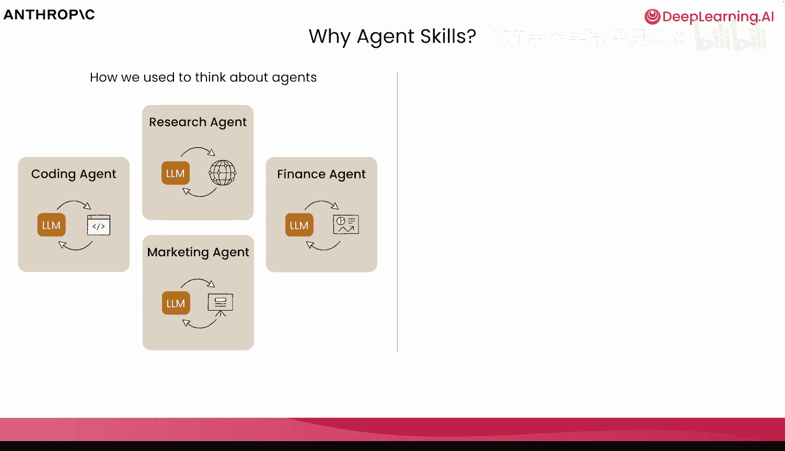

## 为何在构建智能体时引入技能？🤔

为了更清楚地理解为何在构建自己的智能体时要引入技能，我们需要回顾一下构建智能体思路的演变。

我们过去构建智能体的方式，是围绕具有单一目的的智能体展开的，例如编码、研究、金融、营销等。这些领域特定的智能体拥有一套特定的工具和完成任务所需的上下文。

但随着我们构建了更多单一目的的智能体，我们开始意识到，在底层，它们真正需要的只是一个简单的脚手架、底层工具（如 Bash 和文件系统）来查找、编辑、修改、执行和完成任何必要的任务。

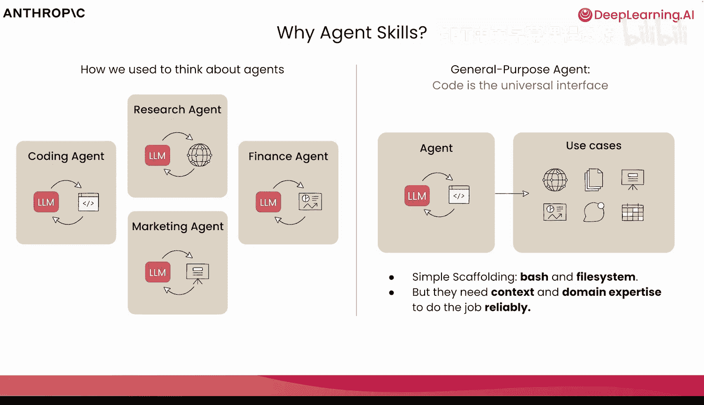

这些更简单的智能体更容易评估、理解和扩展。

但这些智能体所缺乏的，是可靠完成工作所需的底层上下文和领域专业知识。

上下文可以通过模型上下文协议来提供，而领域专业知识正是技能的用武之地。

我们希望金融智能体以特定的方式进行财务分析。
我们希望研究智能体拥有必要的研究领域专业知识，并以我们期望的方式进行研究。
我们希望能够在许多不同的生态系统和智能体之间移植这种能力。
这就是我们拥有智能体技能的原因。

## 技能的核心优势 💪

这些技能为我们提供了程序性知识和用户特定的上下文，它们可以按需加载。

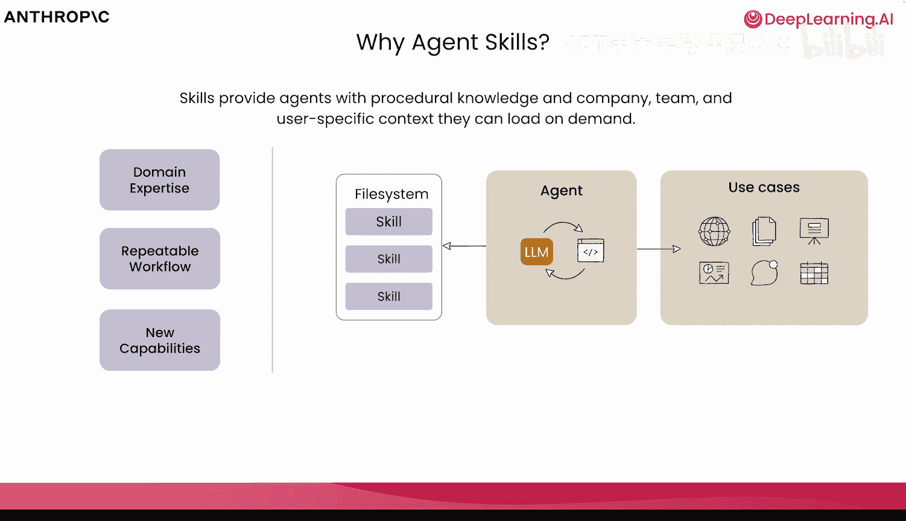

除了领域专业知识，技能还可以在非确定性系统中提供可重复的工作流程。在非确定性系统中，我们并不总是确切知道模型的输出会是什么，因此很难找到可重复的方法来产生相同的输出。

技能允许我们做的是，通过提供具有非常清晰步骤或指令的可重复工作流程，使智能体能够执行我们可以开始更准确预测的任务。

技能还引入了新能力的概念。这些是智能体开箱即用不知道如何做的事情，甚至是 Claude 完全不知道如何操作的数据。当我们引入这些新能力时，我们只需最少的额外上下文，就能为我们的智能体释放整个生态系统和新的功能。

当我们思考领域专业知识时，我们希望依赖那些 Claude 可能不知道如何做，或者知道如何做但不适用于你特定领域的事情。

Claude 可以进行数据分析，可以进行法律审查，但它如何按照你、你的团队或公司希望的方式去做呢？

我们之前看到了执行每周营销活动回顾的能力，我们希望这种能力在不同的个人和团队之间是可预测的。

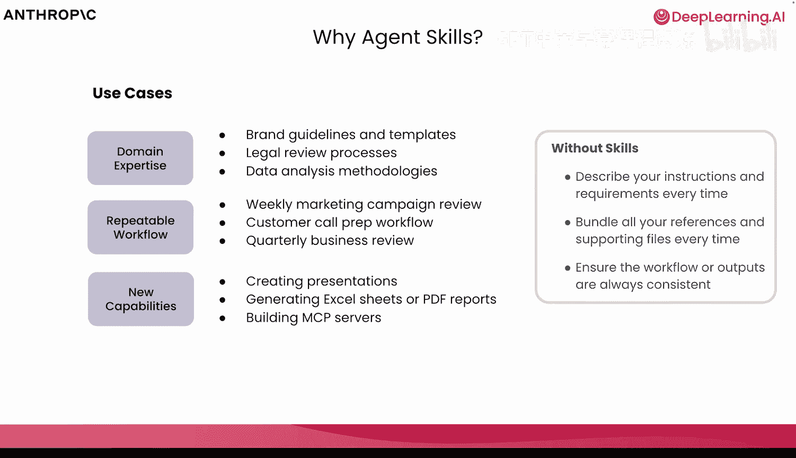

当我们开始思考一些这些新能力时，比如生成演示文稿、Excel 电子表格、PDF 报告，以及在必要时执行脚本来完成这些操作，这正是智能体技能可以大放异彩的地方。

## 技能的可移植性与可组合性 🔗

我们之前在没有技能的情况下看到的是描述指令、尝试预测工作流程以及一次性将所有必要文件和上下文捆绑在一起的做法。

我们稍微谈到了技能的可移植性。虽然到目前为止我们是在 Cloud AI 中看到技能，但技能可以以完全相同的格式使用，不仅跨 Cloud Code、智能体和 API，而且由于智能体技能是一个开放标准，你可以在越来越多的智能体产品中使用它。

你可以在一个环境中创建技能，然后在许多不同的环境中使用、分享和扩展它们。

当我们说技能是可组合的时，这我们已经看到了。我们可以将像分析营销活动这样的自定义技能，与创建 PowerPoint 演示文稿、PDF 或 Excel 电子表格等内置技能结合起来。

我们不仅可以一起使用多个技能，还可以将它们组合起来构建复杂且可预测的工作流程。我们可以引用必要的技能、必要的步骤，并开始在一个非确定性系统中创建可预测的输出。

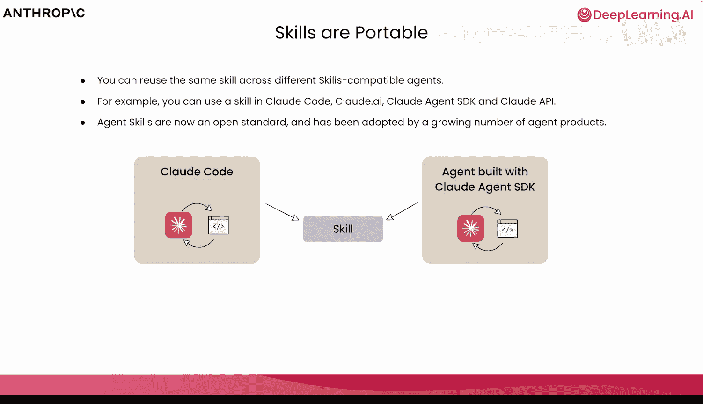

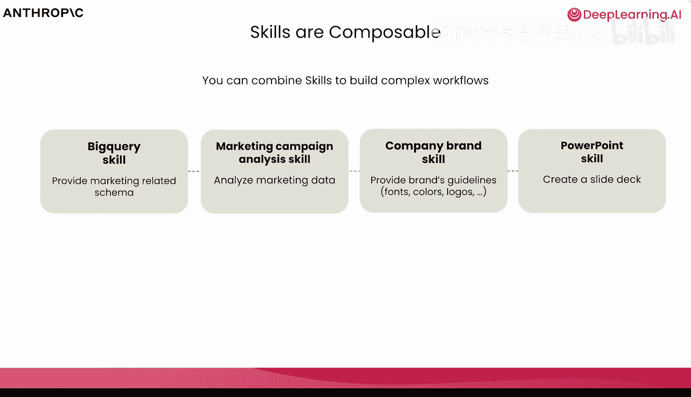

## 技能的渐进式披露机制 ⚙️

在底层，技能可以包含相当多的信息。我们看到了包含额外 Markdown 文件的例子，甚至看到了包含可执行脚本的例子。

你的系统中可以有数百个技能，而我们将要看到更多。但为了保护上下文窗口，技能是渐进式披露的。

渐进式披露的理念是只加载必要的数据。我们不希望用可能不需要的数据污染上下文窗口。技能引入了渐进式披露的概念。

当技能从文件系统加载时，只有技能的名称和描述被添加到上下文窗口中。这至关重要，这样 Claude 或任何其他系统才知道技能是什么以及如何触发它。

一旦该技能被触发，底层的 `.skill.md` 文件就会被加载。这是将数据加载到上下文中的下一个阶段。根据所需内容，如果需要加载和执行额外的文件或脚本，它们将被渐进式地加载。

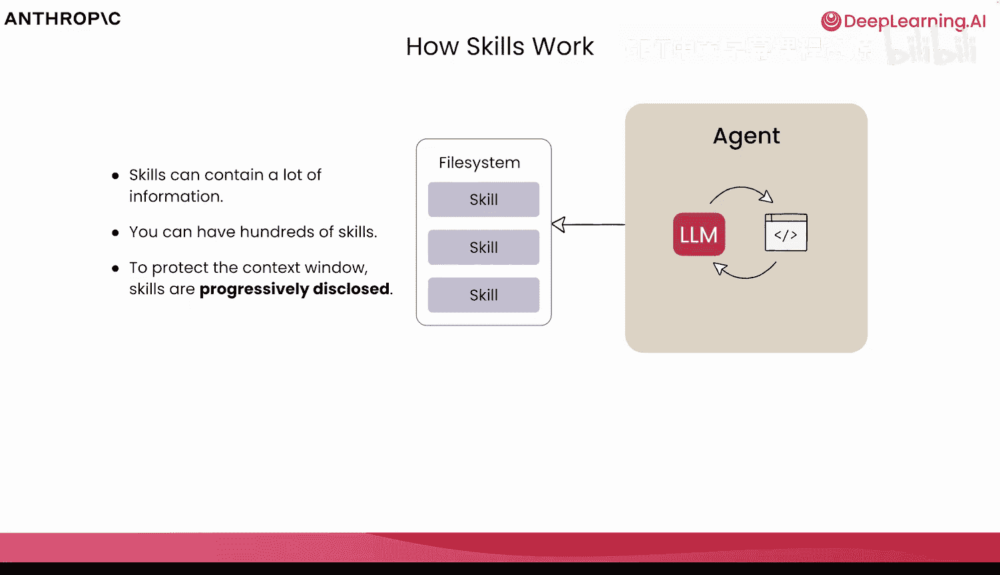

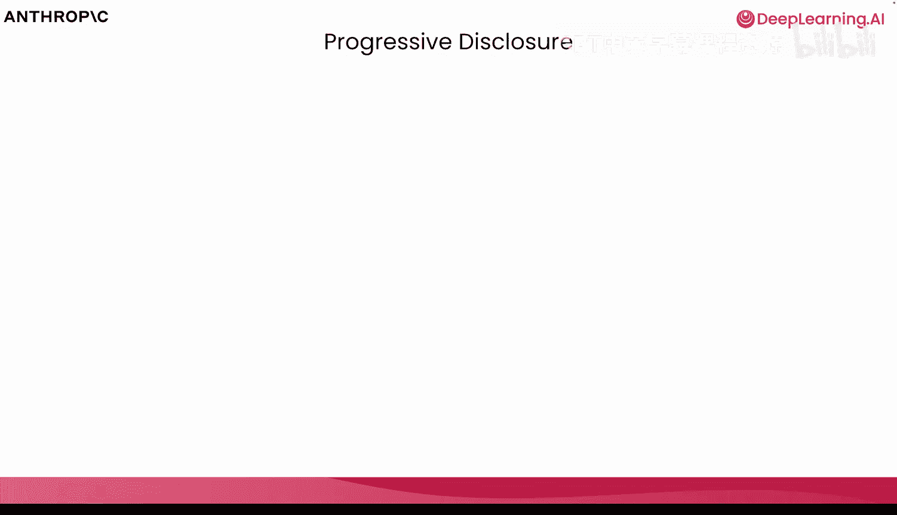

这些额外的资源可以根据需要加载。如果有需要加载的脚本，这些脚本会被单独加载和执行，以避免用不必要的额外令牌污染上下文窗口。

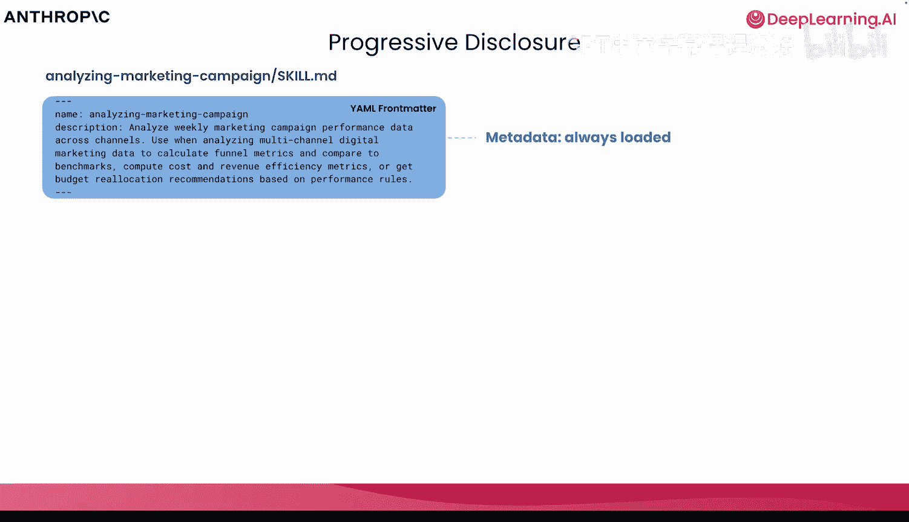

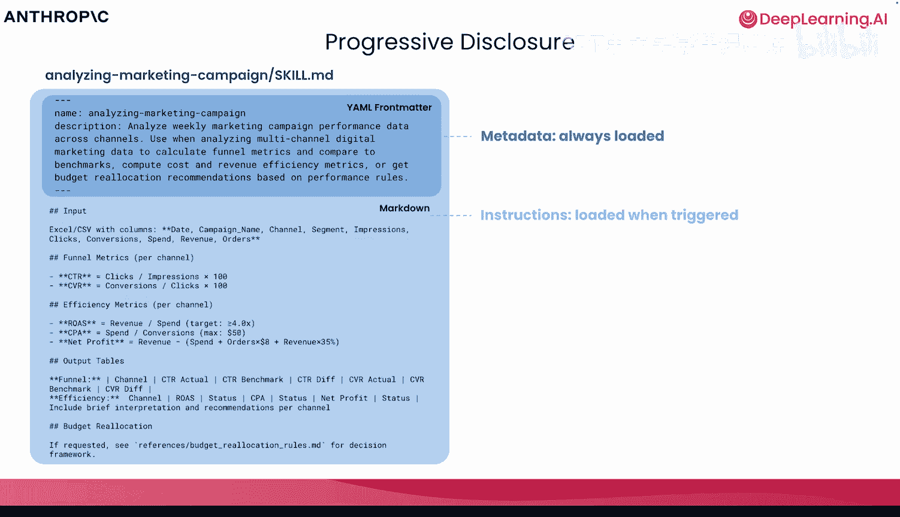

通过使用 Bash 和文件系统等工具，Claude 可以只加载必要的信息，只执行必要的脚本和文件读取，并有意地只将必要的内容添加到上下文窗口中。

## 总结 📝

本节课中，我们一起深入探讨了智能体技能。我们了解到技能是一个开放的、可移植的标准，它通过提供领域专业知识、可重复的工作流程和新的能力来增强智能体。技能具有可组合性，能够构建复杂的工作流程。其核心机制“渐进式披露”确保了上下文的高效利用，只在需要时加载必要的信息和资源，从而在非确定性系统中实现更可预测的输出。

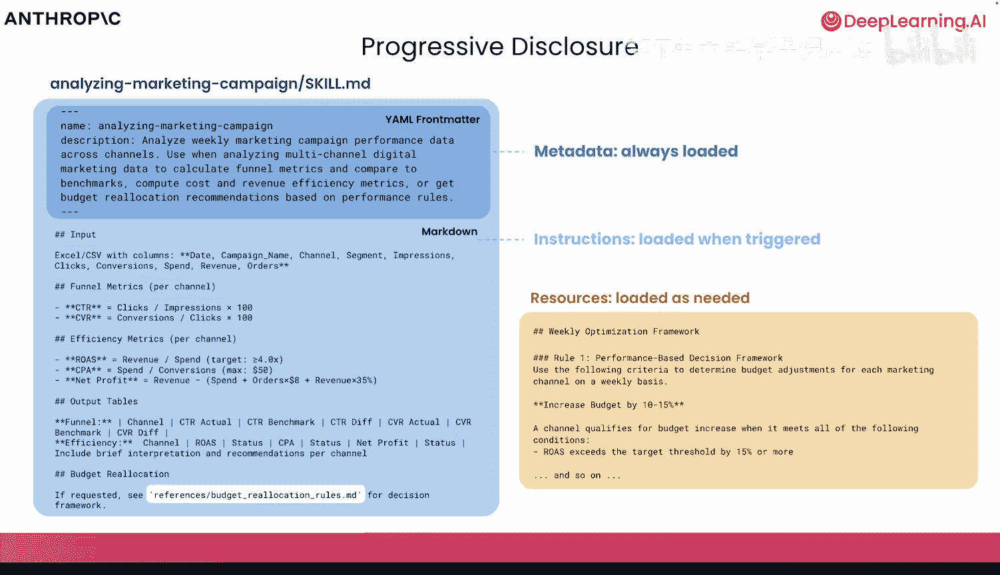

在下一节课中，我们将继续讨论技能，特别是它们如何与模型上下文协议、子智能体、底层工具等其他技术一起使用。