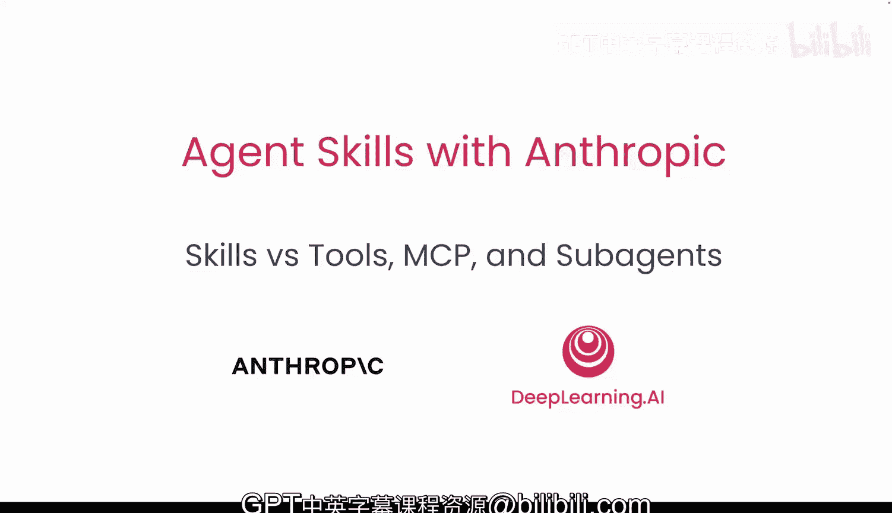
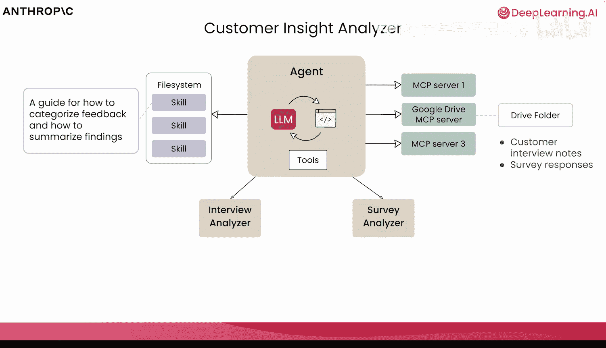
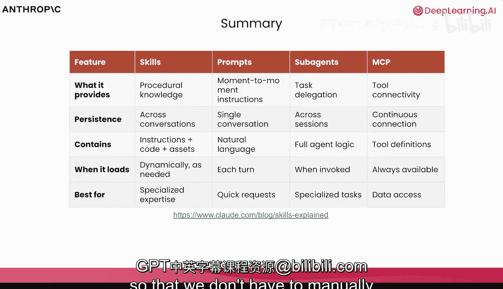

# 004：技能、工具、MCP 与子智能体

在本节课中，我们将探讨技能如何融入智能体生态系统，并与 MCP、工具和子智能体等其他技术协同工作。我们将确保理解这些组件如何在现有应用中共同发挥作用。

## 概述

我们将学习如何将技能与工具、模型上下文协议和子智能体结合，以创建强大的智能体工作流。我们会逐一剖析每个组件，了解它们如何协同工作，并明确各自的适用场景。

## 技能与模型上下文协议的对比

上一节我们介绍了技能的基本概念，本节中我们来看看技能与模型上下文协议的关系。

模型上下文协议将我们的智能体或AI应用与外部系统和数据连接起来。这些外部数据可能来自数据库、Google Drive或各种其他系统。当需要模型本身不了解的外部数据和上下文时，模型上下文协议就非常有帮助。

您拥有的技能可以利用模型上下文协议提供的底层工具和数据，来教导您的智能体如何处理这些数据。可以将模型上下文协议视为引入我们所需的所有底层工具，而技能则是一套指令，用于将这些工具组合起来，构建可重复的、能产出您所需数据的特定工作流。

当我们考虑利用外部数据来计算指标、进行研究或计算数据时，所有这些底层工具都可以通过模型上下文协议从外部提供。

## 技能与工具的对比

接下来，我们思考一下技能与工具的区别。我喜欢用一个类比：工具更像是较低层级的组件。

您可以想象拥有像锤子、锯子和钉子这样的工具，而技能则像是“如何建造一个书架”。工具本身是访问系统、为智能体提供完成任务所需能力的基本方式。

实际上，工具在底层被用来驱动生成技能、读取技能的能力，甚至为执行代码和加载这些技能生成文件系统。技能通过引入需要执行的额外文件和脚本来扩展能力，但执行这些底层脚本和文件的能力是由工具提供的。

某些智能体生态系统内置了工具，我们也可以编写自己的工具，或通过模型上下文协议加载工具。工具定义始终驻留在上下文窗口中，而技能则在需要时逐步加载。

当我们思考这些如何协同工作时，技能允许我们创建可预测的工作流，而这些技能可以引入可执行的脚本，类似于按需使用的工具。如果我们有一个不需要在每次对话中都使用的工具，我们可以通过技能和渐进式披露仅在需要时使用它。

## 子智能体的角色

现在，让我们看看子智能体如何融入这个组合。首先，我们定义一下什么是子智能体。

我们有一个主智能体，它可以生成或创建子智能体，子智能体可以向父智能体报告。这些子智能体可以通过 Cloud Code 或 Agent SDK 等生态系统创建，我们也可以自己创建。

当我们思考子智能体提供的价值时，主要考虑的是拥有一个具有细粒度权限的隔离上下文，以及并行执行任务的能力。关于子智能体能访问什么，我们有受限的工具权限，并且可以指定每个子智能体可以访问哪些技能。

因此，虽然主智能体可以作为协调器，并可以利用任何必要的技能，但子智能体也可以遵循类似的思路，使用特定的技能。

子智能体与技能配合得非常好。例如，我们可以有一个特定的子智能体，如代码审查员，其唯一任务是分析和审查代码库，并利用那些明确规定您、您的团队或您的公司如何进行代码审查的技能。

## 综合应用：客户洞察分析器示例

当我们把所有组件放在一起时，可以提供一个“客户洞察分析器”的类比。让我们思考这一切如何协同工作。

我们有一个主智能体，它被赋予一组工具。这些工具可以由 MCP 服务器提供。我们可以引入数据、资源和执行任务所需的工具，以派遣子智能体来分析客户。

我们可能会分析客户访谈或客户调查，并在隔离的环境中并行处理它们，以便更快地获取数据。当我们思考如何实际分析客户洞察、如何分类反馈、总结发现、如何分析访谈和调查，以及如何确保我们以可预测的方式、在正确的时间加载正确的工具来完成这些工作时，这就是技能发挥作用的地方。

我们从外部引入数据，如果需要并行执行并在单独的线程和上下文窗口中运行，则利用子智能体，并且我们引入技能，以可预测、可重复和可移植的方式消费所有这些信息。

## 总结与要点

本节课中我们一起学习了AI生态系统中的许多不同组成部分。

当我们思考构建AI应用时，从根本上说，我们有提示词。提示词是对话中最基本的原子单位，是我们与模型沟通的基础工具。但提示词本身在团队和公司间的扩展性并不好。

为了捆绑这些底层的提示词、对话、代码和资产，我们可以利用技能。被委派任务的子智能体可以使用技能，这些子智能体随后可以从主智能体那里消费必要的工具，这些工具是通过模型上下文协议定义的。

当我们思考这些特定功能旨在解决什么问题时，我们希望非常谨慎地考虑如何加载这些信息以及它们最适合用于什么场景。考虑到上下文窗口是一种公共资源，我们希望有意识地决定何时使用子智能体来帮助我们最小化主上下文窗口中的内容，以及MCP如何加载必要的数据，技能如何在需要时逐步加载。

当我们讨论持久性以及如何考虑将事物存入长期记忆时，对于子智能体，我们可以在子智能体和父智能体的多次会话中保持持久性；对于技能，我们可以在用户与AI应用的多次对话中保持持久性。

因此，在思考每个步骤的用途时，我们希望将技能用于程序化的、可预测的工作流，而将子智能体仅用于必要的、专门任务的完整智能体逻辑。

在下一课中，我们将看看 Claude 附带的一些预构建技能，深入研究这些技能的代码仓库，深入探讨一些技能 Markdown 文件，并讨论一个非常有用的技能——“技能创建器”，这样我们就不必从头开始手动创建所有技能了。