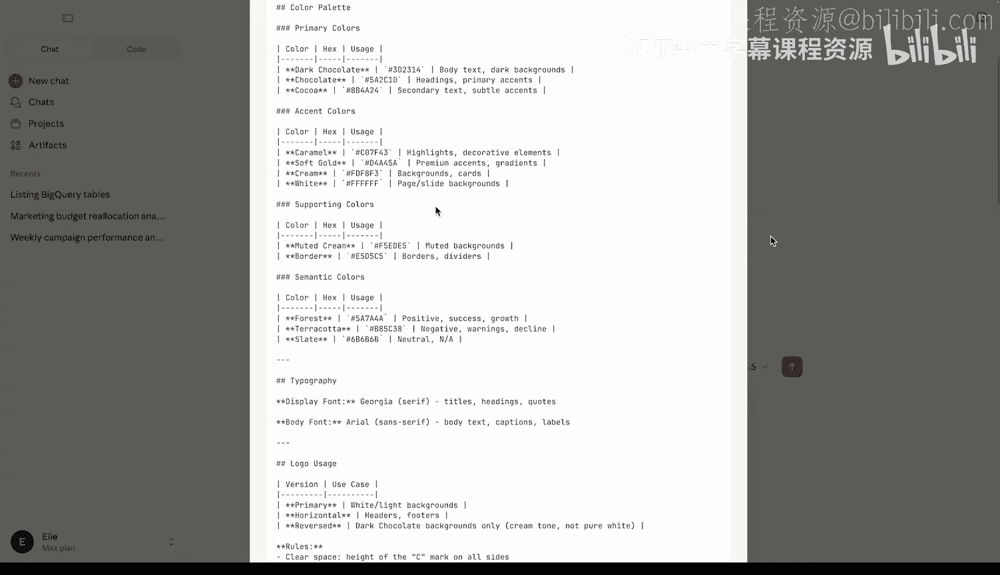
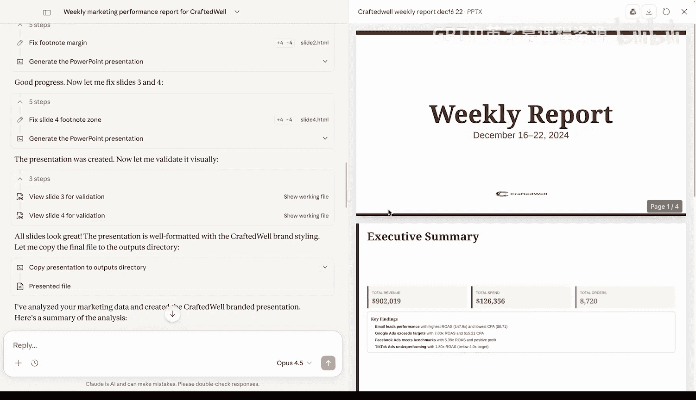

# 005：探索预构建技能

在本节课中，我们将学习 Anthropic 提供的预构建技能，了解它们如何融入整个 AI 生态系统，并探索如何将这些技能与我们自己创建的技能以及 MCP 服务器结合，构建一个完整的数据分析和演示文稿生成工作流。

## 预构建技能概览

在第一节课中，Claude AI 使用了 Excel 技能来创建展示营销结果的电子表格。Excel 技能是 Anthropic 的预构建技能之一，其他预构建技能还包括 PowerPoint、Word 和 PDF 技能，以及一个技能创建器技能。

现在我们已经了解了技能在整个 AI 生态系统中的位置，接下来让我们看看一些开箱即用的预构建技能。这些技能可以在 Claude AI 和 Claude Desktop 中使用，你也可以通过像 Claude Code 这样的工具自行安装，这些工具位于 GitHub 上的 `anthropic/skills` 代码库中。

让我们查看技能文件夹，看看有哪些内置技能。所有这些技能都已准备好用于生产环境，我们在之前的课程中已经看到了 Excel 技能的使用案例。

需要注意的是，这个技能列表虽然由 Anthropic 创建，但实际上分为两个不同的部分。用于 Microsoft Docs、PDFs、PowerPoints 和 Excel 的技能被称为文档技能。这些是内置的，并且总是在像 Claude AI 这样的工具中使用。其余的技能是我们创建的示例，你可以在 Claude 中开启或关闭，但默认情况下，除了技能创建器，其他都是关闭的。

## 分析 PowerPoint 技能

首先，让我们从分析 PowerPoint 技能开始。

我们可以像查看其他结构一样，看到一个 `skill.md` 文件以及其他引用的文件和文件夹。在这个 `skill.md` 文件中，我们有相同的 YAML 前置元数据，其中包含名称和描述。

你在这里看到的是 GitHub 如何渲染这个 Markdown 文件，但底层代码看起来与我们之前创建的非常相似。如果你熟悉 Markdown 文件，可以以这种方式查看。我将切换回预览模式，因为它看起来更美观一些。

当我们查看这个技能的工作原理和功能时，我们有一个概述。用户可能会要求创建、编辑、分析 PowerPoint 文件的内容。这是它的样子，这是你阅读它的方式。如果有需要完成的特定任务，有底层的脚本来执行。请记住，这些不是开箱即用的，只有在必要时才会加载和执行。

我们可以用 PowerPoint 演示文稿做很多事情，包括颜色、版式。正如你所想象的，这就是我们如何开始制作看起来更美观、更像真实世界演示文稿的东西。

我们有一些设计原则、必要的要求，以及当用户未指定时，可以让 Claude 选择的调色板。

这个 `skill.md` 文件相当长，因为我们可以用 PowerPoint 演示文稿做很多事情，但在本课后面，我们将看到如何实际使用这个技能，将现有数据转化为美观的演示文稿。

## 探索技能创建器技能

接下来我想向你展示的技能有点“元”概念，它叫做技能创建器。技能创建器是一个技能，其目的是以编程方式为你创建技能，而不是从头开始创建必要的文件和文件夹结构，技能创建器可以为你完成这些工作。让我们看看 `skill.md` 文件，看看这里发生了什么。

与其他技能类似，我们有一个名称和描述。实际上，我将查看底层代码，因为它更容易理解。

在这个 `skill.md` 文件中，我们指定了什么是技能，它提供什么，然后我们包含了一些与技能相关的最佳实践。我们将在下一课深入探讨这些最佳实践，但你可以想象，当 Claude 以编程方式为你创建技能时，我们希望利用其中一些最佳实践。

当我们查看技能创建过程时，我们对这里的步骤极其明确。因为我们想使用这个技能来创建一个可预测的工作流，所以我们希望非常明确步骤是什么，如何遵循它们，以及仅在某种原因存在时跳过什么。我们从具体示例开始，规划可重用的技能内容。在这里，你可以开始看到一些非常有用的示例，当你想创建一个技能时，Claude 可以进行模式匹配。

当我们在这里初始化技能时，我们运行底层的 Python 脚本来执行必要的任务。让我们看看这些脚本做了什么。

在 `scripts` 文件夹中，我有三个 Python 文件：一个用于初始化技能并提供底层文本的脚本，一个用于打包该技能的 Python 文件，以及一个用于验证该技能的脚本。

让我们看看这个底层代码如何初始化一个技能。我们获取一个现有的模板，其中包含一些 YAML 前置元数据和一些占位符及待办事项，然后根据传入的数据填充它。这个底层脚本允许我们在制作技能时创建必要的文本文件。

一旦我们生成了必要的文件，我们就可以打包它。在这里你可以看到，我们引入了必要的模块来压缩我们的技能，并确保我们在正确的文件夹和文件结构中完成此操作。

最后，我们还有一个脚本用于执行技能的验证，确保 `skill.md` 存在，验证一些 YAML 前置元数据，并确保我们放入文件夹和文件中的内容是正确的。

我们将利用这个技能创建器技能，将我们拥有的现有内容打包成可重用和模块化的脚本。现在，让我们继续将注意力转回 Claude，看看如何将内置技能、我们自己的技能与 MCP 服务器结合成一个可预测的工作流。

## 在 Claude 中配置和使用技能

回到 Claude，让我们去看看并确保我们启用了正确的技能，以及这些技能位于何处。

回到设置中的功能部分。我们之前看到可以在这个部分创建技能。我想向你展示我们拥有的示例技能，这应该看起来很熟悉。这就是我们在 GitHub 上看到的。

默认情况下，这些技能是关闭的。如果我们想开启它们，我们完全可以这样做。默认开启的技能是我们刚刚看到的技能创建器。

需要注意的是，虽然技能创建器在创建底层技能和必要结构方面非常有效，但我们仍然需要对我们提供的提示和将要制作的技能中输入的数据保持有意识。

我们现在要做的是将所有关于技能、MCP 和提示的想法结合起来。首先，我们将修改之前创建的用于分析营销活动的技能，使其不使用 CSV 获取数据，而是使用 BigQuery。如果你不熟悉，BigQuery 是由 Google 提供支持的数据存储。为了引入必要的工具和上下文来使用 BigQuery，我们将连接一个 MCP 服务器。因此，我们将使用技能创建器技能来修改我们之前的营销分析技能以使用 BigQuery。

然后，我们将使用技能创建器创建另一个技能。这将用于品牌指南的目的。我们将包含一个指定指南的文件以及徽标，并为自己构建另一个技能来执行该任务。

最后，我们将采用我们用于提取和分析数据的两个技能，以及利用品牌指南，并将它们与用于创建 PowerPoint 演示文稿的内置技能结合起来，创建一个利用提示、技能和模型上下文协议的工作流。

在我们开始之前，你可能想知道我们之前看到的 Excel、PowerPoint 和其他文档技能位于何处。这些是内置在 Claude AI 中的，不是可以开启和关闭的东西。

## 构建完整工作流

考虑到这一点，让我们开始这个工作流。在我们修改分析营销活动技能以使用 BigQuery 之前，我们还要注意，我们在这里使用 Claude Desktop 来连接到本地 MCP 服务器以利用 BigQuery。

所以让我们看看那个 BigQuery 服务器是如何配置的。我将转到设置、开发者部分，在这里我们可以查看特定项目的底层命令和参数以及环境变量，以及我的凭据所在的位置。

对于这个例子，我们不必使用 BigQuery。你可以使用数据库或其他外部数据存储，但我们只是想展示技能和 MCP 服务器协同工作的样子。

如果你有兴趣查看那个底层配置文件，这就是它的样子。在这个配置文件中，我们指定要连接的服务器以及 Claude Desktop 启动时运行的底层命令。

考虑到这一点，让我们继续修改我们之前的技能，现在使用 BigQuery 而不是 CSV 进行数据访问。

为了确保这正常工作，首先让 Claude 列出 BigQuery 中的表。

这存在。这将利用我们拥有的 MCP 服务器，我们将允许这个操作。

我们应该会得到表的列表，在这个例子中，我们只有一个。

所以在这里我们可以看到，有一个名为 `marketing` 的数据集包含一个表。

现在我们将让 Claude 显示这个表的模式。

希望 Claude 能纠正那个小的拼写错误，我们应该就能继续了。

在这里，我们指定了表的样子，这看起来很好，当我们继续更新分析营销活动技能时，我们将利用这个模式。

我们现在要做的是让 Claude 更新我们的分析营销活动技能，使其不是从 CSV 上传获取数据，而是从 BigQuery 拉取。我们指定来自 BigQuery 表的数据，特别是我们上面刚刚看到的模式，因为我们都在一个对话中，Claude 应该没有问题查看模式是什么。我们为此指定了一些要求。

就像在我们现有的技能中一样，我们要确保对我们预算重新分配规则的引用不会被修改。

正如我们之前谈到的，技能创建器技能非常有帮助且高效，但我们仍然需要提供必要的上下文。

注意这里，它要做的第一件事是分析必要的技能结构，并使用我们的技能创建器技能来修改现有技能并遵循最佳实践。

我们现在将继续创建更新后的技能，并生成一个新的 `skill.md` 文件。

在这里，我们可以开始看到一些与我们之前的技能相似的东西。但是，它添加了 BigQuery 而不是 CSV 上传。在底层，我们使用文件系统和 bash 工具为我们创建必要的文件和文件夹结构。

我们在这里看到的是，我们使用 BigQuery 而不是 CSV，并且我们遵循了将 MCP 服务器与技能结合使用的最佳实践，我们指定了服务器和工具的名称。技能创建器正在遵循最佳实践来修改我们现有的技能。

因此，正如我们指示技能创建器时，当我们指定我们的必需输入时，我们现在正在实践中看到这一点。最佳实践是不要使用模糊的日期范围或整个范围，所以我们要求用户澄清，当我们展示查询示例时，我们指定一个日期范围。所以我们放入的一些工具和要求在我们更新这个技能时被直接应用。

所以我们的技能看起来状态很好。为了确保这个技能被保存到后续的对话中，让我们继续复制这个技能。

## 创建品牌指南技能

现在我们将转换方向，创建一个新的品牌指南技能，我们将与这个技能一起使用，以创建一个引人注目的数据驱动的 PowerPoint 演示文稿。

所以让我们继续开始一个新的聊天，我们将让 Claude 从我们上传的文件中创建一个品牌指南技能。我要做的第一件事是上传一个包含我的品牌指南的文件，以及一些将在演示文稿中使用的徽标。

在我们继续创建这个技能之前，让我向你展示这些品牌指南是什么样子。我有一个调色板、支持颜色、版式。Claude 知道如何设计东西，但技能真正闪耀的地方在于，你可以告诉 Claude 你希望为你的公司如何精确地完成事情，包括徽标、颜色、字体。这是一个很好的例子。现在，让我们继续从这些文件中创建一个技能，我们可以将其应用于未来的演示文稿和文档。

我们将在这里再次看到技能创建器技能在行动。我们利用现有的工具和技能来使用最佳实践，以及指南和徽标来制作一个可重复和可移植的技能。

我们将分析其他现有技能，看看它们使用什么模式，并确保我们正在创建的这个新技能可以补充它们。这非常有价值，因为我们将把它与 PowerPoint 演示文稿一起使用。

现在我们对需要做什么有了很好的了解，让我们运行之前看到的那个初始化技能 Python 脚本。这将创建底层技能，现在我们可以开始将我们的资源添加到技能的 `assets` 文件夹。

我们将开始看到颜色填充、强调色、字体、版式，稍后，我们将拥有一个技能，当我们需要进行设计时，可以开始将其添加到所有未来的对话中。

我们的徽标被引入，Word 文档和 PDF 被指定，演示文稿布局按照我们希望的方式设置。

技能创建器已经运行完成。在这里，我们有一个遵循最佳实践创建的 `skill.md` 文件，带有名称和描述，以及包含必要数据和徽标的底层文件夹。

我们需要再做一步来确保这个技能被添加到未来的对话中。为了确保这个技能被保存到后续的对话中，让我们继续复制这个技能。

一旦完成，我们应该在已创建技能列表中看到这个技能。

## 结合技能生成演示文稿

现在我们已经更新了我们的技能，从 CSV 迁移到 BigQuery，并为我们的品牌指南创建了一个新技能，让我们将它们结合起来，与内置的 PowerPoint 演示文稿技能一起构建一个工作流，首先分析我们的数据，然后生成一个演示文稿。所以我们将首先分析 BigQuery 中不同星期的营销数据，看看每个渠道的表现如何，然后基于这些数据，使用我们的品牌指南生成一个演示文稿。让我们看看这看起来怎么样。

首先，我们将继续读取相关的技能文件，这包括我们的营销活动分析，并将包括我们的 BigQuery 指南。

我们将继续确保我们拥有正确的 PowerPoint 演示文稿技能，以及我们用于样式设计的品牌技能。

在底层的 PowerPoint 演示文稿技能中，有关于演示文稿创建的额外文档。

首先，我们将从 BigQuery 开始。我们将查询必要的数据。

我们可以查看正在编写的底层 SQL，就像我们之前看到的那样，以及我们正在寻找的日期范围。

现在我们有了数据，我们将使用这些指标继续生成一个 PowerPoint 演示文稿。我们将使用我们在品牌样式中建议的样式设计来完成这个任务，并将其转化为 PowerPoint 演示文稿。可以在这里看到为我们的幻灯片编写的底层 CSS 和 HTML。

然后，我们将依赖内置技能来创建底层演示文稿。

现在我们有了正确的 HTML 文件，让我们继续创建我们的演示文稿。

在这里，我们使用原生的 PowerPoint 技能，并编写必要的代码来创建演示文稿。

我们可以看到，即使存在特定问题，模型也会返回，编辑任何必要的内容，并依赖确切的工作流，不仅用于运行必要的代码，还用于验证需要完成的工作。

模型具有回溯和遵循特定模式的能力，这使我们能够创建没有内置问题的演示文稿，这些问题需要我们立即纠正。所以我们看到 Claude 已经完成了验证，幻灯片看起来很好，现在它将继续生成那个底层的 PowerPoint 演示文稿。

我可以在 Google Drive 中打开它并用作 Google Slides，或者我可以直接下载。

在这里，我们可以看到我有一些非常好看的幻灯片，带有我特定公司想要的颜色、字体、徽标和一切。我们有我们的效率分析、漏斗分析，以及突出显示需要审查的内容和表现良好的内容的执行摘要。

我可以下载这个演示文稿。我可以继续在此基础上构建，并再次在 Google Drive 中打开它以与队友分享。我可以继续提示和处理这个演示文稿。

但我们在这里看到的是一个底层的 PowerPoint 演示文稿，它由内置技能与我们制作的两个技能结合创建，同时通过 MCP 服务器从 BigQuery 拉取数据。

在下一课中，我们将探讨一些关于创建技能的最佳实践，并查看我们创建的另外两个自定义技能，看看我们是否遵循了最佳实践。

## 总结

在本节课中，我们一起学习了 Anthropic 提供的预构建技能，包括文档技能和技能创建器。我们深入探讨了如何利用技能创建器来修改现有技能（例如将数据源从 CSV 迁移到 BigQuery）和创建全新的技能（如品牌指南技能）。最后，我们成功地将内置的 PowerPoint 技能、我们自定义的营销分析技能和品牌指南技能与 MCP 服务器结合，构建了一个从数据分析到生成品牌化演示文稿的完整、自动化的工作流。这展示了如何通过组合不同的工具和协议，让 AI 智能体执行复杂、多步骤的现实世界任务。