# 006：创建自定义技能 📚

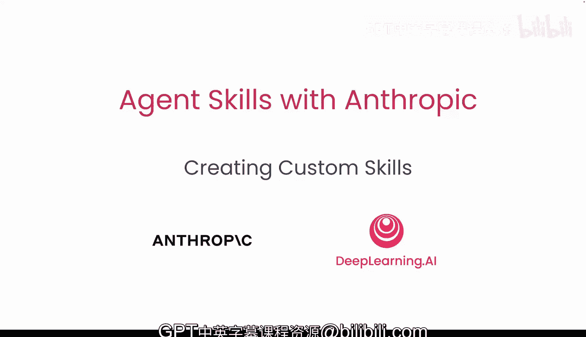

在本节课中，我们将深入学习智能体技能的结构以及创建技能的最佳实践。然后，我们将应用所学知识分析两个具体示例：一个用于根据讲义生成练习题，另一个用于分析时间序列数据的特征。

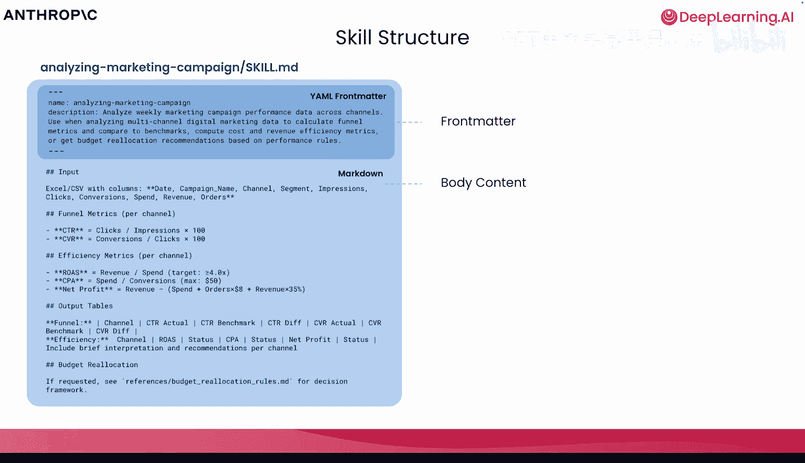

## 技能结构与最佳实践概览 🔍

上一节我们介绍了技能的基本概念，本节中我们将详细探讨技能的内部结构。

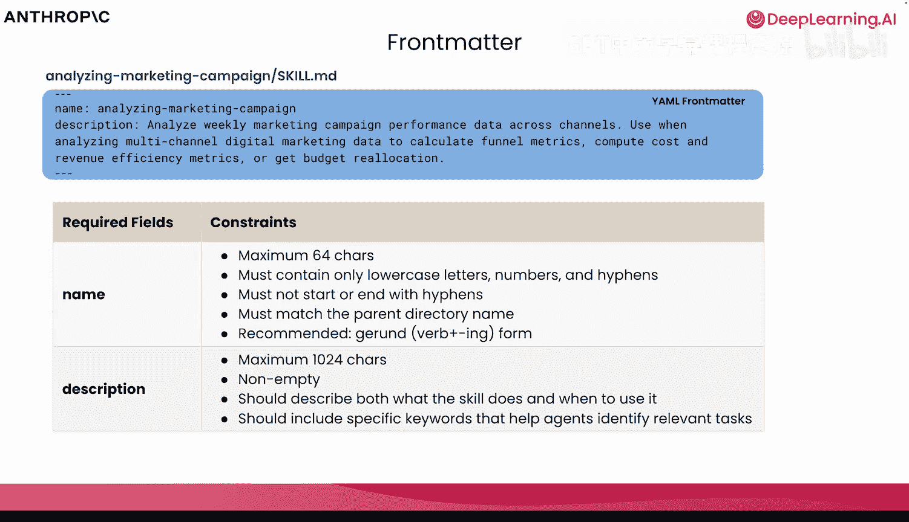

每个我们创建的技能都必须包含一个 `skill.md` 文件，其开头是 YAML 格式的“前言”部分。这部分需要包含**名称**和**描述**。在 `skill.md` 的主体内容中，我们编写技能的核心指令，并可以引用仅在必要时加载的脚本或其他文本文件等资源。

## 名称与描述的最佳实践 ✨

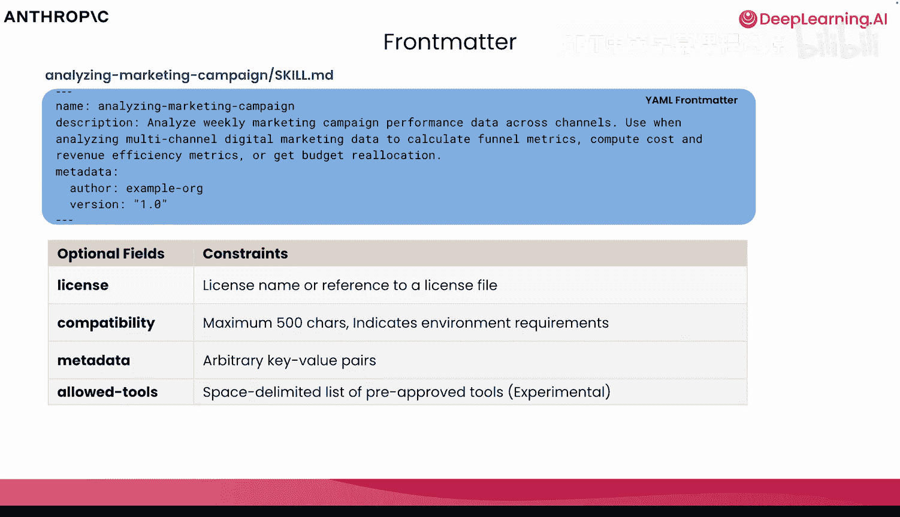

以下是关于为技能命名和撰写描述的核心要点：

*   **名称**：最多64个字符，只能包含小写字母、数字和连字符。最佳实践是采用“动词+名词”的形式，例如 `generate-questions`。
*   **描述**：最多256个字符。描述不仅要说明技能**做什么**，还要说明**何时使用**它。如果某些特定关键词会触发智能体使用此技能，务必在描述中强调它们。

## 可选的元数据字段 📄

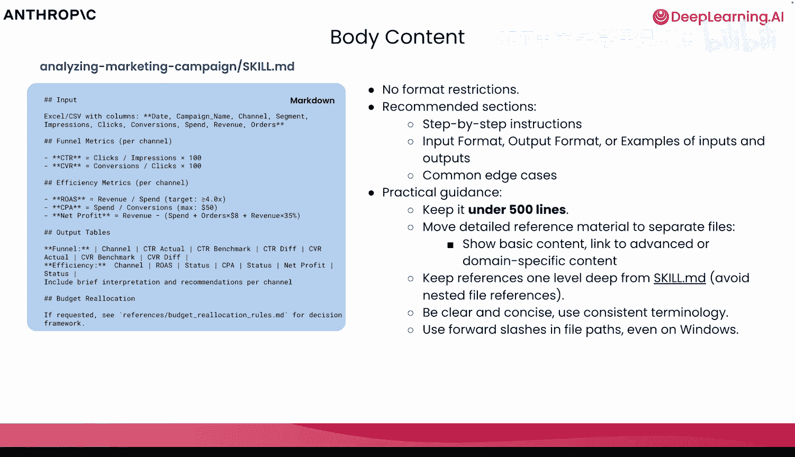

除了必需的字段，智能体技能规范还允许一些可选字段。

这些可选字段可能包括许可证信息、兼容性说明以及在元数据中任意添加的键值对。需要注意的是，虽然存在智能体技能的标准规范，但你可能会遇到一些技能（包括Anthropic内置的或其他开发者创建的）并未完全遵循此规范。这些技能和规范本身都处于积极开发中，因为我们需要适配众多不同的模型提供商和智能体工具生态系统。

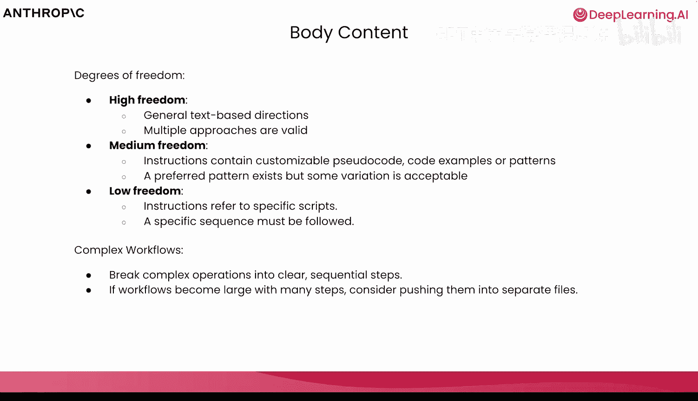

## 编写技能主体内容 📝

当我们越过YAML前言，进入技能的主体内容部分时，对于格式没有硬性限制。

然而，为了构建可预测的工作流，确保你提供了**分步指令**。正如我们在其他技能（尤其是技能创建器技能）中看到的，明确指定边界情况和分步指令非常重要。如果某一步可以跳过，必须清楚说明原因。通常，将内容保持在500行以内是最佳实践，因为我们总是可以在必要时引用外部文件、资源或脚本。保持清晰和简洁很有价值。使用正斜杠 `/` 作为路径分隔符至关重要，即使在Windows系统上，也要确保技能能在多种不同环境中运行。

在创建技能时，你需要思考给予该技能多大的自由度。

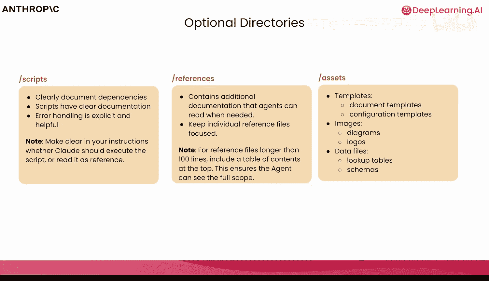

我们应该允许通用的方法和方向，还是专注于特定的操作序列？对于遵循最佳实践的技能，我们可能希望**自由度较低**；而对于需要创造性输出的技能（如涉及多种颜色、样式、字体），则可以允许**较高的自由度**。

当我们开始考虑包含多个技能的更复杂工作流时，将任务分解为连续的步骤，总是比创建一个试图包办一切的、非常庞大的单一技能更有价值。这些系统可以处理100多个技能，确保它们命名恰当、不易混淆并能以可预测的模式被调用至关重要。

## 可选的目录结构 📁

在规范中，为可选目录预留了空间。

正如我们在许多不同技能中看到的，常见的子文件夹包括 `scripts`、`refs` 和 `assets`。

以下是这些目录的用途：

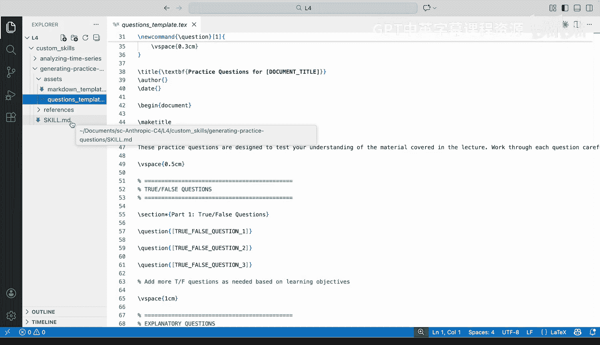

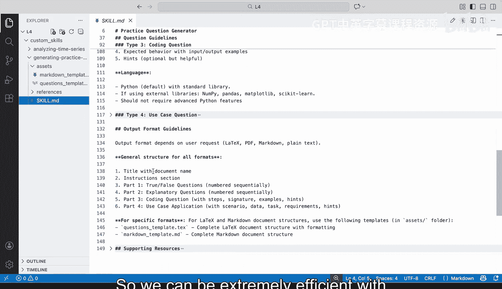

*   **`scripts`**：包含任何需要读取和执行的代码。你还需要确保代码包含错误处理和清晰的文档。
*   **`refs`**：包含额外的文档或参考文件。通常，如果参考文件很长，指示技能读取整个文件会很有价值。
*   **`assets`**：包含底层资源，例如输出模板、徽标、数据文件、模式等。

需要指出的是，`scripts`、`refs` 和 `assets` 这些目录遵循的是智能体技能的标准。但你可能会遇到许多尚未完全遵循该特定标准的技能。标准在快速演变，技能也在快速演变。因此，展望未来，我们期望新创建的技能遵循此标准，但你可能会遇到一些使用不同文件夹命名和约定的技能。

## 技能示例分析：生成练习题 🧑‍🏫

现在我们已经很好地理解了最佳实践、可选目录以及如何编写生产级技能，让我们看看两个我们创建的技能示例。

第一个是**生成练习题技能**。其描述是“根据讲义生成教育练习题以测试理解力”。想象你是一名教师或讲师，希望为输入和输出提供特定格式，并生成全面的问题来测试理解力。

让我们逐步分析这个技能。首先，它定义了支持的输入格式，指定了要使用的特定库以及要提取的文本。接着，它详细说明了问题结构，明确指定了生成问题的确切顺序（从判断题开始，一直到现实应用题）。对于每种问题类型，下面都有子指导原则。我们可以看到这个技能没有超过500行代码，但如果需要扩展，我们总是可以引用底层文件。

当我们查看判断题、编程题等示例时，可以看到我们对这些特定问题的范围、结构和所需输出都非常明确。在深入输出格式时，我们指定它取决于用户请求，并且没有给出每种输出的直接示例，而是引用了 `assets` 文件夹中的模板。例如，对于Markdown或LaTeX，我们精确指定了它们的外观。如果你发现自己需要特定类型的输出格式，不要全部放在 `skill.md` 中，而是将其引用到外部资源或文件中。请记住，这些模板文件仅在必要时加载，因此我们可以通过仅加载所需数据格式的特定文件来高效利用令牌和上下文窗口。

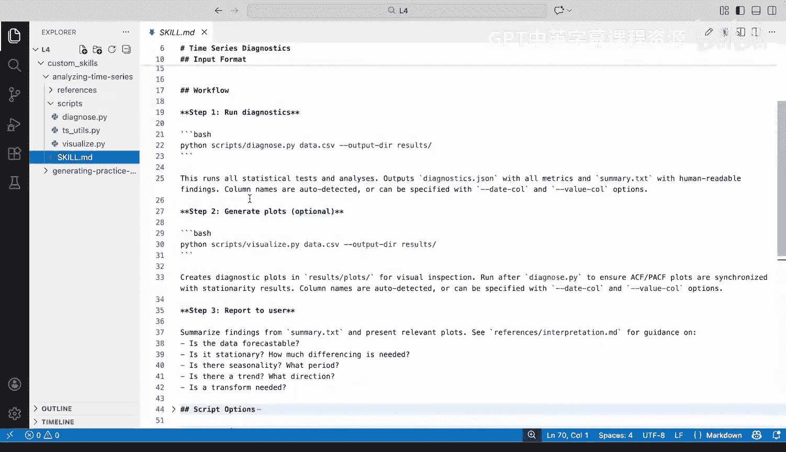

如果需要外部资源或特定领域的示例，我们也可以链接到它们，就像在 `refs` 文件夹中所做的那样。我们遵循“渐进式披露”的概念，只加载绝对必要的内容，仅在需要时引用外部文件。

## 技能示例分析：分析时间序列数据 📈

我们要看的第二个技能是**分析时间序列数据技能**。我们将提供一个CSV文件，并希望在预测之前理解数据的特征。

需要注意的是，在这个特定技能中，我们希望有一个非常确定的、可预测的工作流程。我们使用了几个不同的Python脚本来执行特定操作。首先，我们有一个用于可视化数据的Python脚本，可以绘制时间序列图、直方图、滚动统计、箱线图等。对于自相关分析，我们也有可以绘制的图表。同样，对于分解也是如此。

查看我们的诊断脚本，它包含了用于分析所处理数据的基础功能。虽然这里有很多函数，但我想请大家注意最后运行诊断时的操作：我们利用这些函数来分析数据质量、分布、平稳性检验、季节性、趋势、自相关性，最后给出转换建议。

我们这里有一个每次都想以特定顺序运行的可预测工作流。让我们回到技能本身看看具体是如何实现的。首先，我们从输入格式开始，对应该查找的内容、列名和特定数据类型非常明确。接下来，我们将进入此技能最重要的部分之一：工作流。请注意，我们在这里对步骤的描述极其明确，告诉我们的特定技能和Claude在开始诊断时运行这个确切的脚本。然后，我们可选择生成必要的图表并向用户报告数据，获取数据，在摘要文件中查找内容并呈现相关图表。我们还可以看到，为了回答一些可能需要的问题，我们有一个解释指南文件。

查看一些脚本选项，我们可以在必要时添加额外的标志。当我们考虑输出内容时，可以精确指定输出的文件树、文本文件、图像等。我们希望输入的数据、执行的操作以及最终的输出都极其可预测。一如既往，如果有外部参考资料，我们可以确保在这里列出。鉴于我们有依赖于Python库的脚本，我们需要确保明确指出这些依赖项是什么，并确保它们已安装，以便这些脚本正确运行。

## 使用技能创建器评估技能 ✅

现在我们已经查看了这两个自定义技能，让我们看看当通过技能创建器技能运行它们时表现如何，并判断我们是否遵循了最佳实践。

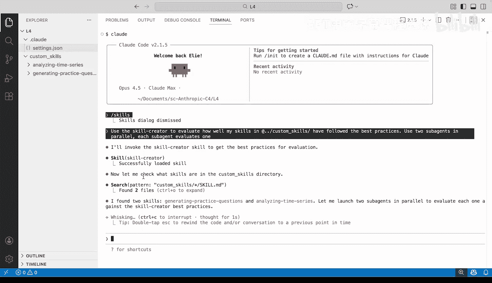

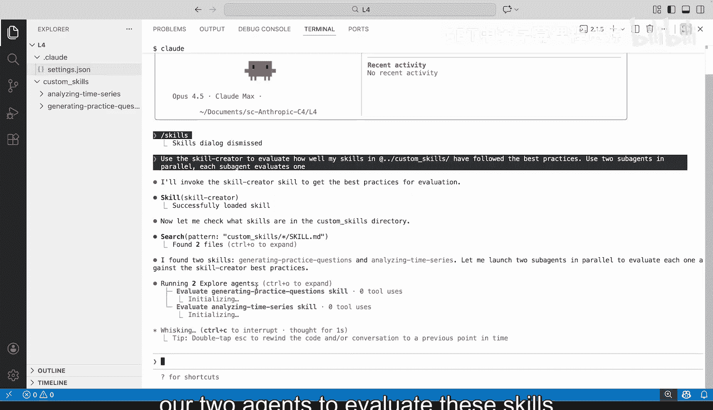

我们可以在几个环境中进行此操作。一个非常有用的方法是使用Claude Code及其技能。我们将安装必要的技能创建器技能，然后使用两个并行子代理来评估我们的“分析时间序列”和“生成练习题”技能。这是开始评估我们编写这些技能效果的一个非常有帮助的方式。

在Claude Code中，我们需要从市场添加Anthropic的Claude技能仓库并安装技能创建器技能。安装并重启后，我们可以使用 `/ss` 命令查看可用技能，并确认技能创建器技能已就绪。接着，我们要求Claude Code使用技能创建器技能来评估这些技能遵循最佳实践的情况。为了更快完成，我们使用并行子代理，每个子代理评估一个自定义技能。技能创建器技能会成功加载，读取必要文件，并分派子代理根据最佳实践检查这些技能。

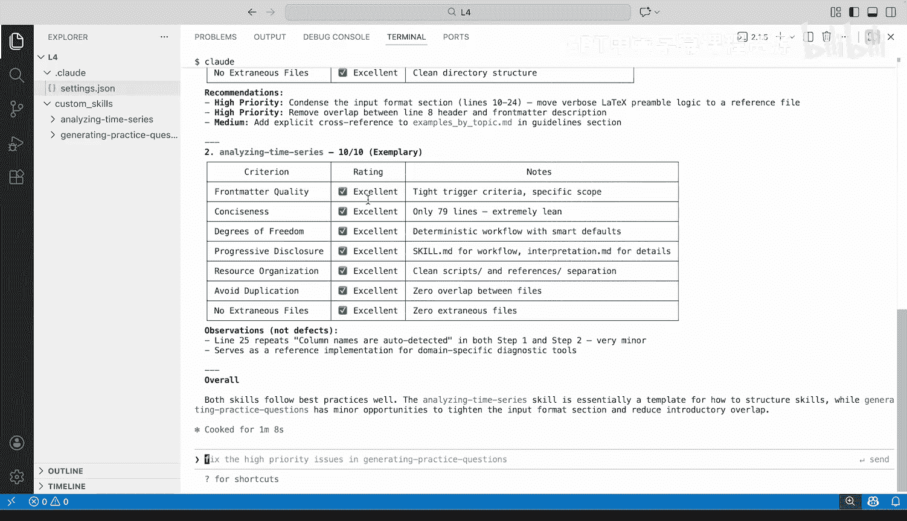

评估结果显示，“生成练习题”技能得了9分（满分10分），在简洁性方面可以改进，并获得了一些不错的建议。“分析时间序列”技能表现更好，在避免重复、前言质量和简洁性方面都做得非常出色。通过这个内置了最佳实践的技能创建器来评估你的技能，是一种非常好的方法。

## 为技能编写测试 🧪

我们已经通过技能创建器分析了技能在底层 `skill.md` 及相关文件方面对最佳实践的遵循情况，但如何确保技能能按预期工作呢？

以下是一个我们可以围绕其构建测试框架的示例，思考如何为我们的技能编写单元测试，就像为软件编写单元测试一样。

首先，对于“生成练习题”技能，评估可能涉及几个不同的查询：生成问题并保存到Markdown文件、LaTeX文件、PDF。我们可以确保传入正确格式的正确文件。然后，我们可以确保预期行为符合要求：对PDF输入使用正确的库、按指定提取学习目标、生成不同类型的问题并遵循其指导原则、使用正确的输出结构、使用我们在资源文件夹中看到的正确输出模板、确保在某些数据格式（如LaTeX）中成功编译，最后确保问题生成到正确的文件并以正确的格式保存。在此过程中，我们还希望确保收集人工反馈，并跨我们计划使用的所有不同模型进行测试。

对于第二个“分析时间序列”技能，我们使用了三个不同的Python脚本。因此，我们假设已经用传统的单元测试和软件测试方法测试了这些Python脚本，假设这些脚本能按我们期望的方式工作。现在，让我们测试一切是否以正确的顺序、使用适当的输入和输出以及预期的行为发生。这里的查询可能是“分析某些时间序列数据并生成图表”。我们希望传入一些可能的CSV文件，确保我们展示的可视化和诊断Python脚本正确运行，更重要的是，确保工作流中的所有步骤顺序正确。如果我们要求生成图表，要确保包含该可选步骤。然后，我们希望返回摘要，解释这些发现，最后创建一个包含所有必需文件且位置正确的文件夹。如果你还记得，在输出中，我们对不同的文件、文件夹和底层资源有非常具体的位置规定。与我们的其他技能类似，我们希望获得人工反馈，并在我们使用的模型上进行测试。

## 总结 🎯

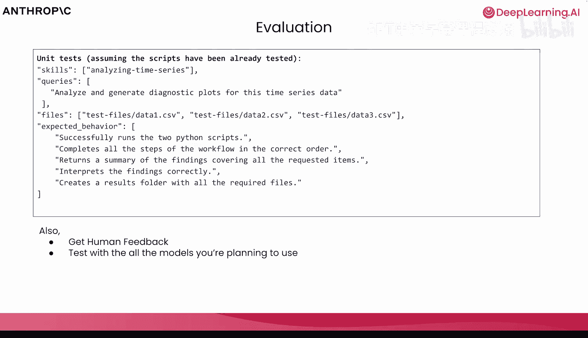

本节课中，我们一起深入探讨了智能体技能的结构，学习了创建技能在命名、描述、内容组织和目录结构方面的最佳实践。我们通过“生成练习题”和“分析时间序列数据”两个具体示例，剖析了如何编写清晰、可预测且高效的技能。我们还介绍了如何使用技能创建器技能来评估自定义技能的质量，并探讨了为确保技能可靠运行而进行测试的基本思路。掌握这些知识，将帮助你创建出更加强大、稳定且易于维护的智能体技能。