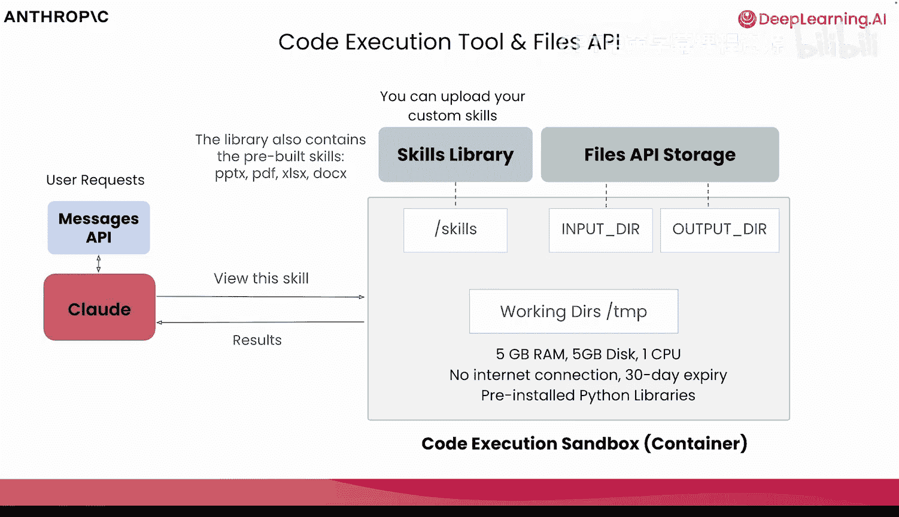
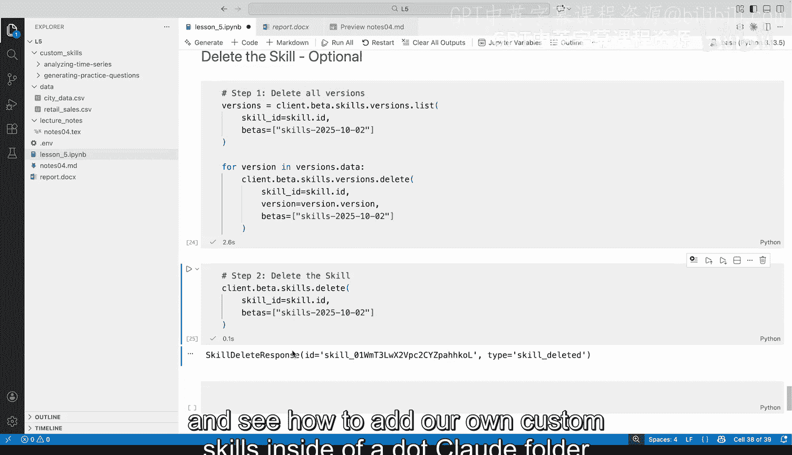
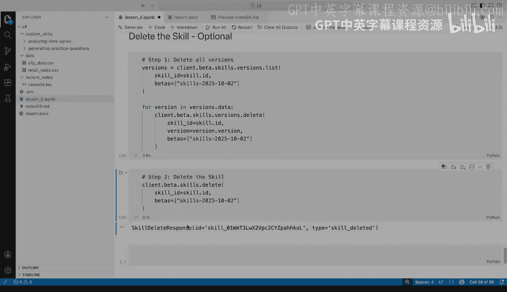

# 007：通过 Claude API 使用技能

在本节课中，我们将学习如何通过 Claude API 来使用我们之前创建的自定义技能。我们将重点介绍代码执行工具和文件 API 的作用，并通过实际代码演示，将技能集成到程序化的工作流中。

---

## 概述：技能与 API 环境

在第一课中，我们看到了技能如何在 Cloud AI 中工作。现在，我们将通过 Claude API 来测试上一课中制作的两个技能。

要通过 API 使用技能，我们需要用到**代码执行工具**和**文件 API**。这将为 Claude 提供文件系统访问权限（用于读写文件）以及执行代码的能力。

---

## 技能的可移植性与环境差异

我们已经讨论了技能的工作原理以及如何创建它们，也简要介绍了技能在 Claude 生态系统及其他智能体应用中的可移植性。

我们首先在 Cloud AI 和 Claude Desktop 中了解了技能，现在我们将探讨如何通过 Claude Messages API 来使用技能。

有两点需要注意：
1.  在 Cloud AI 和 Claude Desktop 中创建的技能**不会**自动在 Claude API 或 Claude Code 中共享。
2.  为了让技能正常工作，Claude 需要能够执行代码、创建和编辑文档、演示文稿、PDF、数据报告，并能操作文件系统。在使用 API 时，我们需要手动配置这些功能；而在 Cloud AI 和 Claude Desktop 中，这些功能是默认启用的。

在 Cloud Desktop 或 Cloud AI 的设置中，可以看到“代码执行和文件创建”部分。这允许 Claude 执行代码、创建文档、电子表格、演示文稿等。本质上，这为 Cloud AI 和 Claude Desktop 提供了一个执行代码和完成技能所需任务的虚拟机环境。

---

## 代码执行工具与文件系统

现在，让我们深入了解一下代码执行工具和文件创建的工作原理，因为在使用 API 时，我们需要手动启用这些功能。

在使用 Cloud Code 和 Claude 智能体等工具时，你可以直接访问文件系统。而使用 Claude API 时，我们则需要一个容器来执行代码和一个文件系统来操作。在 Cloud AI 和 Claude Desktop 中，这个容器化环境和文件系统是直接提供的，无需自行实现。

归根结底，功能是相同的，但我们利用技能的方式略有不同。技能本身的格式不会改变，但根据你所在的环境，使用技能的方式可能会稍有差异。

---

### 代码执行工具详解

当我们开始探索 Messages API 时，我们将使用**代码执行工具**。该工具允许 Claude 运行 Bash 或 Shell 命令，以执行我们在使用技能时看到的所有操作：在沙盒环境中创建、查看、编辑文件和编写代码。

代码执行工具为我们的应用程序提供了在一个独立的专用容器中执行代码和操作文件系统的能力。正如你所见，这对于读取技能、在其中执行代码以及处理我们可能想要编辑、查看和创建的其他文件至关重要。

为了让你更直观地理解，当我们包含代码执行工具时，我们为 Claude 提供了一个执行沙盒或容器。当我们要求 Claude 创建和执行文件时，这些操作都在一个安全、隔离的环境中进行。该环境对 RAM、磁盘、CPU 等资源有限制，更重要的是**不提供互联网连接**，但会预装一些开箱即用的库。因此，它并非适用于所有类型的编码环境，需要注意这些限制。

同时，我们还可以访问一个文件系统，并可以向其中添加目录。在 Cloud Desktop 和 Cloud AI 中工作时，你可能已经看到了这方面的提示。**没有互联网连接**这一限制是 Messages API 在使用代码执行工具时的特定情况。在 Cloud AI 或 Cloud Desktop 中使用代码执行工具时，我们确实可以访问互联网，并能下载和安装软件包。

---

### 文件 API 的作用

代码执行工具与 Claude API 允许我们使用的另一组 API——**文件 API**——配合得非常好。

可以想象，当我们处理文件、添加、创建、写入、修改文件时，我们需要某种机制来实际存储这些底层文件。Claude API 包含一组称为文件 API 的接口，用于上传和下载可以在容器内运行和处理的文件。

例如，用户可以要求总结某个输入并将摘要保存到文本文件中。我们上传该输入文件，将其发送到容器，然后使用文件 API 下载生成的文件。我们很快将在代码中看到从上传和下载文件返回的 ID，以及它如何与技能、代码执行工具良好地协同工作。而这正是技能发挥作用的地方。

我们在 Cloud AI 等工具中开箱即用的技能库，或者如果我们愿意也可以通过 API 包含的技能，都存在于容器中的一个目录中。当我们开始从这个技能目录读取、向技能添加信息或使用这些底层技能创建可以下载或上传的新文件时，技能就派上了用场。我们将看到，在使用 API 时，如果我们想使用技能，也需要使用代码执行工具。

---

## 实战：在 Jupyter Notebook 中使用技能

现在我们已经很好地理解了代码执行工具和文件 API 允许我们做什么，让我们看看如何在实际中使用它们。

我们将回顾之前构建的两个自定义技能：生成练习题和时间序列分析。

让我们进入 Jupyter Notebook 并开始探索。这里我有两个之前使用过的自定义技能，还有一个用于分析时间序列数据的`data`文件夹，以及一个包含讲座笔记的文件夹，我将在使用生成练习题技能时用到它。

首先，我将加载所需的环境变量，以及一个帮助我从目录中查找特定文件的辅助函数。当我们开始使用技能时，会看到它的作用。

---

### 使用“生成练习题”技能

首先，我将开始使用我的“生成练习题”技能。让我们看看需要做的第一步。

**上传技能目录**
我需要上传技能目录。这里可以看到我们使用了来自辅助函数的文件以及技能所需的 Beta 请求头。完成后，我应该能看到创建的技能 ID。

这些 Beta 请求头是在向 Messages API 发出请求时添加的特定头部信息，它们会在底层转换为请求头，以确保我获得正确的数据并与 API 进行适当的通信。

**查看所有技能**
为了查看我拥有的所有技能，我可以使用`.list`方法，并传入`source=‘custom’`参数，这样我们就不会加载所有内置技能，而只是确认我按预期创建了技能。

在这里，我可以看到标题以及我即将使用的唯一技能 ID。

**上传输入文件**
为了让这一切按预期工作，我们需要使用包含讲座笔记的 LaTeX 文件来生成练习题。

在这里，我将使用文件 API 上传这个特定的 LaTeX 文件，确保它被设置为可读，然后获取一个文件对象。我将结合必要的技能使用这个文件对象，以确保一切按预期工作。

**发送请求**
我在这里使用`sonnet`模型，并传入必要的 Beta 请求头，不仅是为了技能，而且为了确保在与模型对话时技能能按预期工作，我还需要确保包含代码执行的 Beta 头。由于我在这里发送了一个文件，我们还必须确保有文件 API 的请求头。

在使用技能时，这些技能通过一个名为`container`的关键字参数设置，在这里我传入技能列表。这些可以是自定义的，也可以是内置的。随着我创建技能的不同版本，我可以引用特定的时间戳，或者只使用我拥有的最新版本。

在与模型通信时，我要求它生成练习题，然后指定我正在处理的文件。这个文件对象是我之前上传 LaTeX 文件时创建的。最后，我们确保引入了正确的代码执行工具，并向我们的 API 发送消息。

**分析响应**
现在让我们看看返回的响应。我们可以看到这里使用了多个不同的部分：服务器上的工具、代码执行、使用了额外的工具，最后是 Bash 代码执行结果。

为了让查看更清晰，让我们添加一些漂亮的格式，以便我们可以逐步查看和分析不同的文本响应和工具使用情况。

我们将在这个特定的序列中逐步查看发生了什么。当我们查看响应（包括我们的文本、工具使用和工具结果）时，模型首先告诉我们，它可以帮助从这些笔记中生成问题，并将开始读取技能文件和检查讲座笔记。

请注意，它在这里检测到了需要使用的技能，但它只读取了技能文件（`skill.md`）。稍后我们将看到，如果需要读取其他文件，将会利用渐进式披露。我们还将审查我们的输入，即那个 LaTeX 文件。

接下来，我们将继续查看这些文件中的底层数据。这是我们之前见过的 YAML 前置内容，以及来自 LaTeX 笔记文件的内容。

然后，我们将检查要使用的 Markdown 模板，以确保输出结构正确，因为我们希望输出是 Markdown 格式。在这里，我们将更多地利用渐进式披露。

我们将读取`assets`文件夹中的 Markdown 模板文件（`markdown_template.md`）。我们将得到已读取的响应，现在将根据我们传入的讲座笔记生成问题。

我们将使用代码执行工具创建一个特定的文件。我们将为该文件提供 Markdown 格式的文本，并获取该文件的结果。

我们将把它复制到输出目录，并使用文件 API 获取一个文件 ID，以便稍后下载。

一旦我们得到那个结果，我们就可以查看已生成的底层文件，并利用那个文件 ID 以编程方式下载它。

我们可以看到它已被保存并准备使用。

**下载生成的文件**
使用上面看到的文件 ID，让我们下载该文件。我们将检查这个响应，确保我们正确提取了文件 ID。如果我们有它（我们期望如此），我们应该能够下载那个特定的文件。

我们将写入一个名为`notes.md`的文件，内容包含文件 ID 以及与 API 通信所需的 Beta 请求头。

我们可以看到我们已经下载了那个`notes.md`文件。这是通过文件 API 和代码执行工具，全部由模型和技能生成的。

在我们下载的这个文件中，我们可以看到我们遵循了技能中定义的确切部分：从判断题开始，然后是解释性问题、编码问题，最后是应用案例。

我们可以用 Markdown 预览来看看效果，这里我们可以看到我们的应用案例，所有必要的内容。

**评估输出**
现在是评估这个特定输出的好时机。我们是否完全按照技能的要求做了？看起来不错。但如果引入一些单元测试，可以真正将其提升到一个新的水平。如果需要，我们可以像之前看到的那样，使用 API、代码执行工具和文件 API 返回并修改技能。

我们还可以以编程方式删除技能。要删除一个技能，首先必须找到与该技能关联的所有版本，然后删除它们。一旦这些版本被删除，我们就可以删除底层的技能。

---

### 结合使用“分析时间序列”技能与内置技能

接下来，我们将继续使用我们的“分析时间序列”技能以及另一个技能。这将与我们上面看到的非常相似，所以让我们逐步完成这些步骤。

**上传技能**
首先，我们将上传我们的自定义技能，获取技能 ID，并确认我们按预期完成了。在这里，我们还可以看到我们不仅加载了自定义技能，也看到了内置技能。这些看起来应该很熟悉，因为我们在 Claude AI 中也见过它们。

**上传输入文件**
接下来，我们将上传我们的输入文件，这将是我们的零售销售 CSV 文件。

**构建请求消息**
我们将构建一条消息发送给 API。和之前一样，我们将使用我们的技能，但在这里我们还将包含文档（DocX）技能。我们使用这个是因为我们想创建一个总结结果和图表的 Word 文档。

所以在这里，我们看到了自定义技能（使用我们拥有的技能 ID 和版本）与 Anthropic 内置技能（本例中是 DocX 技能）的结合。

我们传入了之前必须传递的相同请求头：技能、代码执行和文件 API。

**分析响应**
现在运行完成后，我们可以检查得到的响应类型。我们将看到与之前类似的情况，但这次发生的事情稍微多一点。

让我们通过漂亮的格式来看看底层发生了什么。

模型将回应帮助我们分析时间序列数据。和之前一样，我们将开始读取这些技能文件的全部内容：我们将读取我们的自定义技能以及我们需要使用的内置 DocX 技能。我们可以看到这些结果包括从文件开头开始并包含整个技能文件的内容。

接下来，我们将检查数据以运行时间序列分析。我们将查看这个 CSV 的前 20 行，以检查列名和我们正在处理的数据类型。

由于这按预期工作，我们将继续运行诊断并创建可视化。我们需要运行的这些特定命令直接来自我们的技能。在这里，我们将读取那些底层文件，执行代码，并将其交还给 Claude 处理。

我们将得到这些执行的结果，包括诊断和可视化的结果。

然后，我们将读取摘要和诊断结果，这些是我们脚本运行后生成在名为`summary.txt`文件中的结果。

**创建 Word 文档**
一旦我们创建了那个特定的文件，我们就可以继续创建 Word 文档。内置的 DocX 技能包含了如何处理 Word 文档的正确内容。

我们将看看如何最好地生成该文档，并在这里利用渐进式披露。我们不需要 DocX 技能中的所有内容，只需要一种获取 Markdown 文件的方法。一旦我们有了这些，我们将使用必要的技能创建全面的 Word 文档，执行代码来实现这一点，并生成底层的 Word 文档。

一旦我们有了那个 Word 文档，我们将把它复制到输出目录，就像我们之前看到的那样，获取一个文件 ID，如果我们想下载这个 Word 文档就可以使用它。

**下载并查看结果**
我们可以看到这些数据的摘要，现在我们可以下载该文件。类似地，我们将找到那个文件 ID（如果存在的话）。我们将下载那个特定文件，其必要内容作为一个`.docx`文件。

如果我们看看这个文件的样子，我们现在有了一个包含我们发现的 Word 文档：概述、统计数据。我们可以看到我们引入了那些图表和可视化，以及我们请求的统计分析。

这不仅是评估我们所做的是否符合技能预期的好时机，也是评估我们是否以可预测的方式进行的好时机。随着我们继续评估，我们总是可以根据需要修改这个技能，但所有这些数据都来自技能以及 DocX 技能，以创建这个单独的文件。

和之前一样，如果我们想删除这个技能，我们可以列出所有版本并删除它们，一旦这些版本被删除，就删除底层技能。

---

## 总结

在本节课中，我们结合了对 Messages API、代码执行工具、文件 API 和技能的理解，以编程方式使用我们的自定义技能。我们看到了如何上传技能、处理输入文件、结合使用自定义技能与内置技能，并最终下载生成的结果。

在下一课中，我们将转向 Cloud Code，看看如何在 `.cloud` 文件夹中添加我们自己的自定义技能，并构建一个更复杂的命令行应用程序。