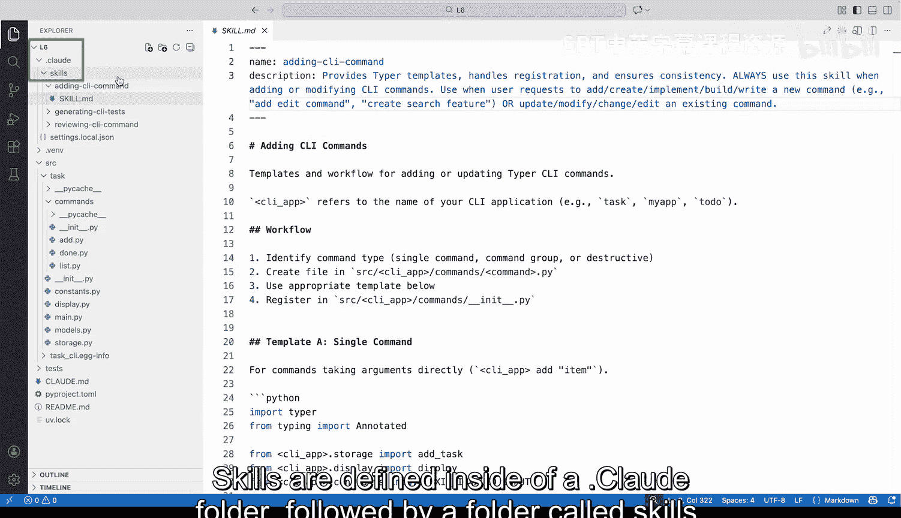
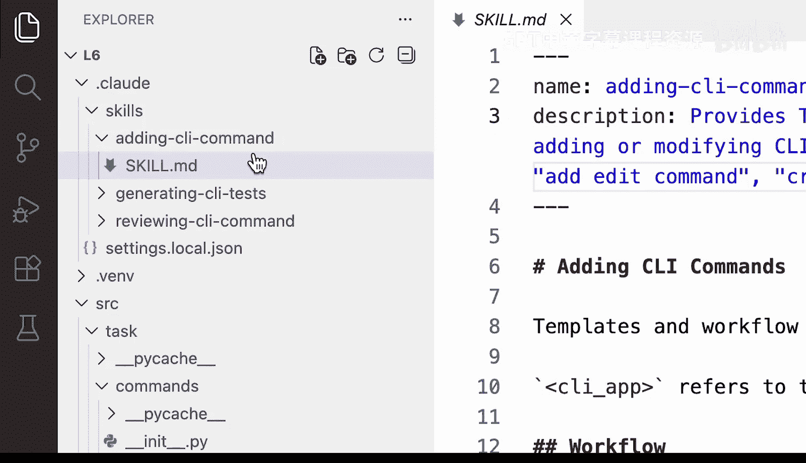
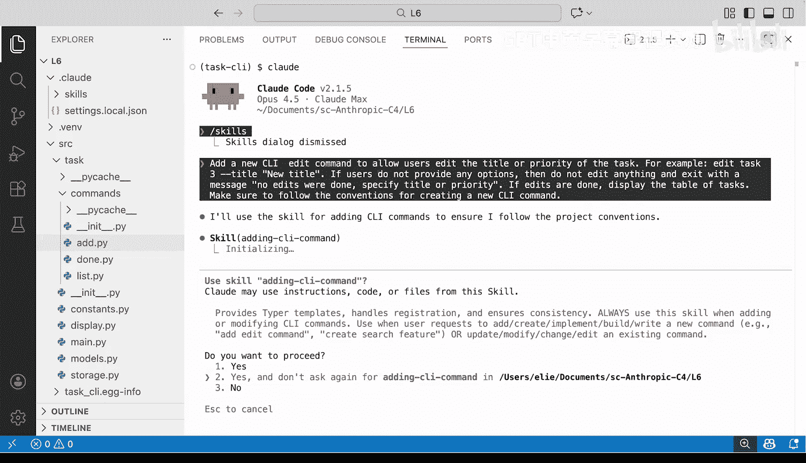
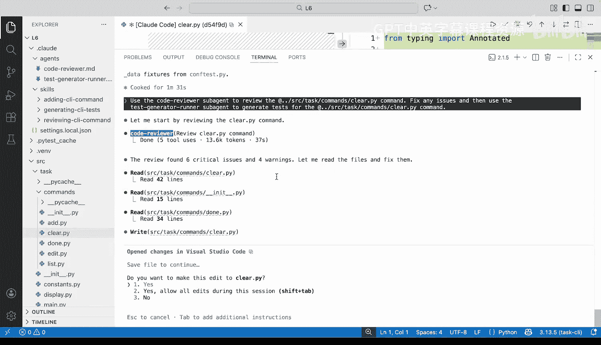
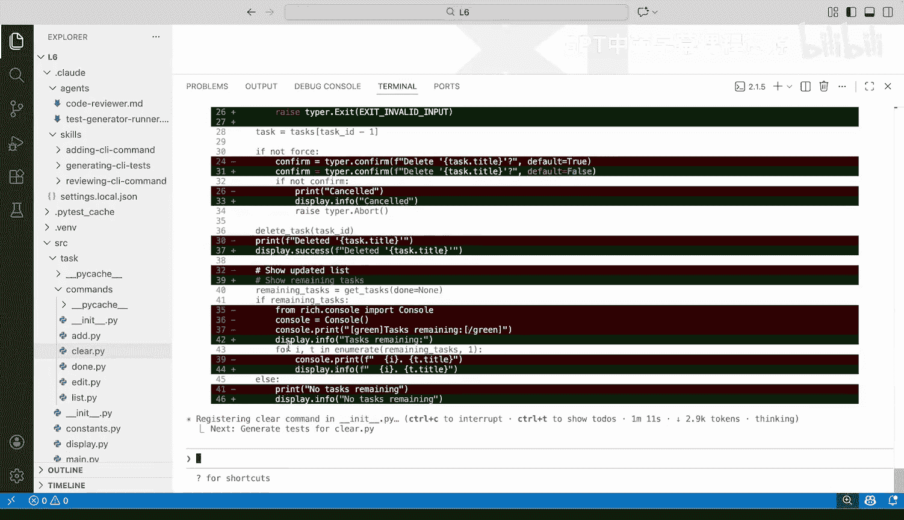
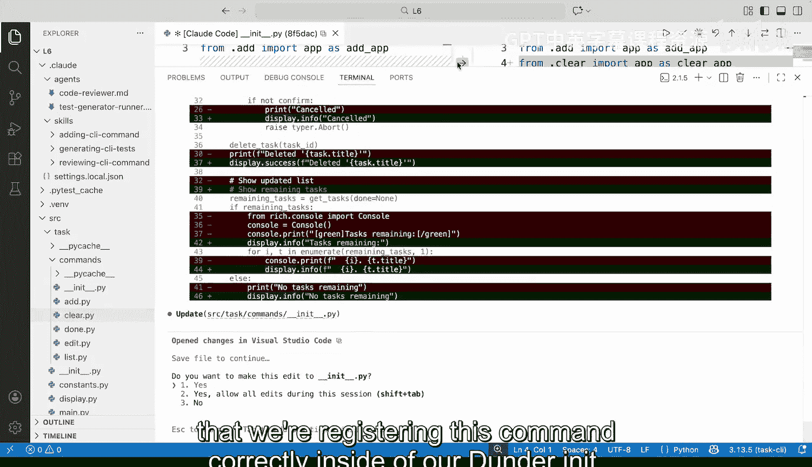
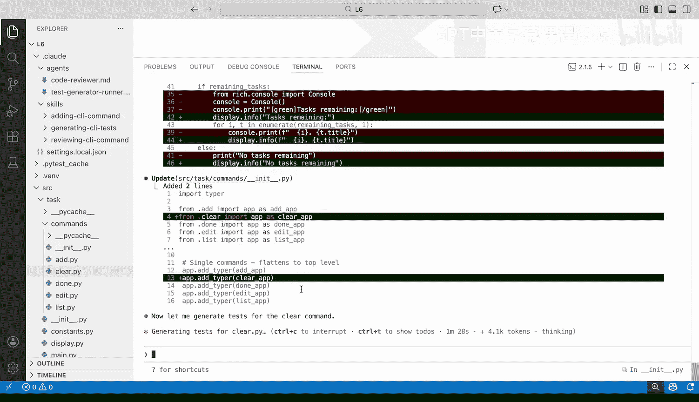
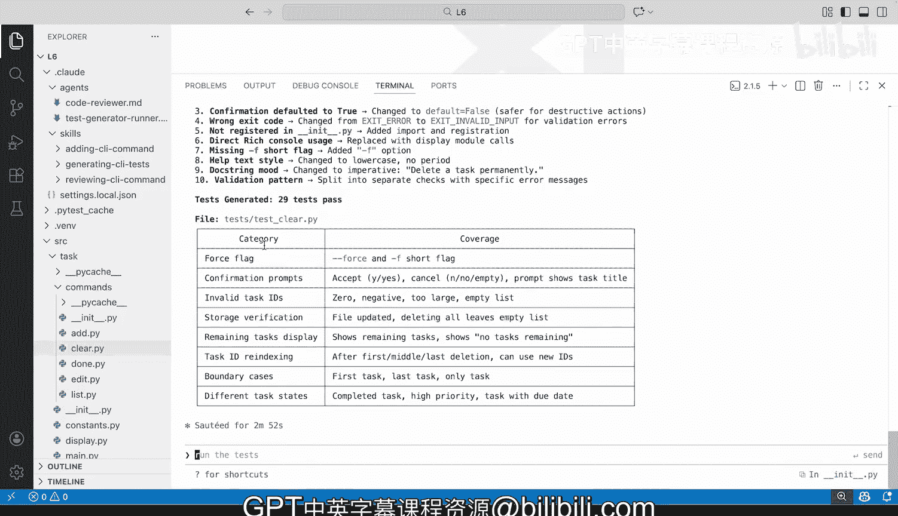

# 008：在 Claude Code 中使用技能

在本节课中，我们将学习如何在 Claude Code 环境中使用技能进行代码生成、审查和测试。我们还将学习如何设置子智能体，并为它们配备特定的技能，以实现更高效、更结构化的开发工作流。

## 概述

我们将从一个命令行待办事项管理应用项目开始。该项目使用 Python 和 `typer` 框架构建，数据存储在 JSON 文件中，并使用 `uv` 进行依赖管理。我们的目标是向该应用添加一个 `edit` 命令，并在此过程中演示如何使用技能来确保代码遵循一致的约定和最佳实践。

## 项目结构与 `claude.md` 文件

首先，让我们了解一下项目的基本结构。在 Claude Code 中，你可以创建一个 `claude.md` 文件。这个文件可以通过 `/a init` 命令创建，也可以由用户手动创建。它始终位于你的项目上下文中，用于指定关于代码库、技术栈以及 Claude 在每次对话中需要了解的通用信息。

我们的项目是一个使用 Python 的命令行任务管理应用。架构遵循以下模式：
*   入口点位于 `src/task/__main__.py`。
*   每个命令都有自己独立的 Python 文件。
*   数据模型定义在 `models.py`。
*   存储逻辑（序列化/反序列化）位于 `storage.py`。
*   终端显示逻辑位于 `display.py`。
*   此外还有常量文件和测试文件。

`claude.md` 文件包含了这些信息，帮助 Claude 理解项目结构和约定。

## 演示应用功能





在深入技能之前，我们先快速演示一下现有应用的功能。

1.  激活虚拟环境：`source .venv/bin/activate`
2.  同步依赖：`uv sync`
3.  查看可用命令：`task --help`。可以看到有 `add`、`done`、`list` 等命令。
4.  添加一个任务：`task add “write the final report” --priority high --due 2024-12-01`
5.  列出任务：`task list`。可以看到新添加的任务。
6.  标记任务为完成：`task done <task_id>`
7.  再次列出任务（使用 `--show-done` 标志）：`task list --show-done`。可以看到已完成的任务。

我们的计划是为应用添加一个新的 `edit` 命令，用于编辑现有任务的标题和优先级。

## 技能定义与存放

技能定义在项目根目录下的 `.claude/skills` 文件夹中。你也可以在用户主目录下创建技能，供所有项目使用。本节课我们专注于项目特定的技能。

我们的项目准备了三个技能：
1.  **添加 CLI 命令** (`adding-cli-command.md`)
2.  **生成 CLI 测试** (`generating-cli-tests.md`)
3.  **审查 CLI 命令** (`reviewing-cli-command.md`)

让我们逐一深入了解这些技能的设计。

### 技能一：添加 CLI 命令

这个技能指导 Claude 如何遵循特定模式创建新的命令行命令。

以下是该技能的核心要点：
*   **工作流**：技能明确了创建新命令的步骤，包括在正确的目录（`src/task/commands/`）中创建文件，以及在 `__init__.py` 中注册命令。
*   **模式匹配**：对于编码任务，明确告知 Claude 应遵循的具体模式和风格至关重要。例如，技能中指定了参数类型注解应使用的现代约定（`Annotated`）。
*   **用户交互**：技能要求使用项目中的 `display` 对象来调用 `success()`、`info()` 等方法，以确保向用户显示正确的信息。
*   **标志与帮助文本**：技能规定了命令行标志的简写、长格式以及帮助文本的格式。
*   **子命令与危险操作**：技能还提供了处理子命令的示例，以及对于像“清除”这样的危险操作，应如何添加确认步骤。
*   **注册约定**：技能详细说明了如何在 `__init__.py` 中注册单个命令或命令组。
*   **通用性**：技能使用通用名称（如 `cli_app`），因此可以轻松适配到任何遵循类似约定的 CLI 项目。

这个技能的价值在于，它为一系列任务（添加命令）提供了可预测的工作流和一致的代码风格，而不是将这些约定分散在 `claude.md` 或整个代码库中。

### 技能二：生成 CLI 测试

在添加新命令后，我们需要确保其功能正确。这个技能指导 Claude 如何为 `typer` 命令生成 `pytest` 测试。

以下是该技能的核心要点：
*   **触发条件**：技能明确说明了何时使用它，例如当用户要求“为我的 CLI 编写测试”或“增加测试覆盖率”时。
*   **使用 Fixtures**：技能强调利用 `pytest` 的 fixtures 来为每次测试安排（Arrange）数据，例如设置临时存储和示例数据。
*   **测试结构**：技能规定了测试应遵循 **Arrange-Act-Assert** 模式。
*   **示例与模式**：技能提供了具体的测试代码示例，展示了我们期望的测试模式。
*   **边界情况**：技能包含了一个检查清单，提醒考虑无效输入、状态确认、未找到项等情况。
*   **运行测试**：技能指定了如何运行测试，包括详细模式和针对特定文件运行。

### 技能三：审查 CLI 命令

最后一个技能用于在命令编写完成后，对其代码质量进行审查。

以下是该技能的核心要点：
*   **审查范围**：技能不仅检查代码结构（位置、装饰器、注册），还检查具体实践，如类型注解、参数标志等。
*   **正反示例**：技能提供了正面和反面代码示例，例如展示正确的 `Annotated` 用法和应避免的旧式用法。
*   **检查清单**：技能包含一个详细的检查清单，用于确认所有最佳实践都得到遵循。
*   **输出格式**：技能要求审查输出必须包含总结和建议的修复方法。
*   **作用**：你可以将此技能视为对其他技能（如添加命令、生成测试）产出的“评估”。它确保我们构建的功能是生产级的，有测试支持，并遵循最佳实践。

## 整合技能：添加 Edit 命令

现在，让我们将所有这些技能结合起来，为我们的应用添加 `edit` 命令。

首先，我们需要确认技能已正确加载。在 Claude Code 中输入 `/skills`，可以列出当前可用的项目技能及其占用的令牌数。

**注意**：在 Claude Code 中创建新技能后，需要关闭并重新打开 Claude Code 实例，新技能才能被识别和加载。

现在，我们要求 Claude 添加一个新的 `edit` 命令，允许用户编辑任务的标题和优先级，并确保遵循创建新 CLI 命令的约定。



```
请为我们的任务应用添加一个 `edit` 命令，用于编辑现有任务的标题和优先级。请遵循项目约定。
```

Claude 识别到应使用“添加 CLI 命令”技能。它会：
1.  读取现有文件以理解约定。
2.  参考其他命令（如 `add`, `done`）的示例。
3.  在 `src/task/commands/` 目录下创建 `edit.py` 文件。
4.  在 `src/task/commands/__init__.py` 中注册新的 `edit` 命令。
5.  运行一些命令来测试新功能是否按预期工作。

这个过程是有效的，但测试环节（步骤5）可能会在对话中反复进行，占用大量上下文窗口，对于大型系统来说可能非常耗时。

## 使用子智能体优化工作流

为了解决上述问题，我们可以利用 Claude Code 的**子智能体**功能。我们可以创建专门的子智能体来负责代码审查和测试生成，而让主智能体专注于开发。这样，每个子智能体都在自己的上下文窗口中运行，主智能体可以更高效地整合它们的反馈。

**重要提示**：子智能体**不会**从父智能体继承技能。我们需要为每个创建的子智能体明确指定其可用的技能。

### 创建代码审查子智能体

我们使用 `/agents` 命令来创建新智能体。选择“手动配置”。

*   **名称**：`code-reviewer`
*   **提示词**：一段指导其进行代码审查的文本，强调提供具体、可操作的见解。
*   **描述**：`当需要审查代码质量、安全性等问题时使用。`
*   **工具**：我们限制其工具集，只提供必要的 `bash`、`glob`（查找文件）、`read`（读取文件）。
*   **模型**：继承自父智能体。
*   **颜色**：紫色（用于在界面中区分）。
*   **技能**：最关键的一步，在技能字段中指定 `reviewing-cli-command`。

保存后，我们就在项目的 `.claude/agents` 文件夹中创建了一个代码审查子智能体。当这个子智能体被调用时，它会加载整个 `reviewing-cli-command.md` 技能文件。

### 创建测试生成/运行子智能体

同样，我们创建第二个子智能体。

*   **名称**：`test-generator-runner`
*   **提示词**：指导其生成和运行测试的文本。
*   **描述**：`当用户要求测试或运行测试时，运行测试并在缺失时生成测试。`
*   **工具**：除了 `bash`、`glob`、`read`，还需要 `edit` 和 `write` 权限来创建或修改测试文件。
*   **模型**：继承自父智能体。
*   **颜色**：黄色。
*   **技能**：指定 `generating-cli-tests`。

## 实战：使用子智能体工作流

现在，我们用新的工作流来完善 `edit` 命令。

1.  **代码审查**：我们调用 `code-reviewer` 子智能体来审查刚创建的 `edit.py` 文件。
    ```
    @code-reviewer 请审查 src/task/commands/edit.py 文件。
    ```
    子智能体会使用其技能对代码进行审查，并输出警告、问题及修复建议。主智能体可以接收这些反馈。

2.  **生成测试**：我们调用 `test-generator-runner` 子智能体为 `edit` 命令生成测试。
    ```
    @test-generator-runner 请为 src/task/commands/edit.py 生成测试。
    ```
    子智能体会使用其技能创建测试文件（如 `test_edit.py`），并运行测试以确保通过。

通过这种方式，主智能体的上下文保持了简洁，专注于开发任务，而审查和测试这些消耗上下文的任务则由专门的子智能体高效完成。

## 综合案例：修复不符合规范的 Clear 命令

假设团队中有人添加了一个 `clear` 命令文件 (`clear.py`)，但没有遵循最佳实践，也未使用我们设置的技能。

我们可以用我们的子智能体工作流来修复它：

1.  **代码审查**：调用 `@code-reviewer` 审查 `clear.py`。审查结果会指出一系列问题，例如未使用正确的 `display` 方法、标志格式错误、退出码不正确等。
2.  **主智能体修复**：主智能体根据审查报告，修改 `clear.py` 文件，并确保在 `__init__.py` 中正确注册。
3.  **生成测试**：调用 `@test-generator-runner` 为修复后的 `clear` 命令生成并运行测试。

最终，我们不仅修复了所有代码质量问题，还为该功能添加了完整的测试覆盖，确保了功能的可靠性和一致性。

## 总结









在本节课中，我们一起学习了在 Claude Code 中利用技能和子智能体构建高效开发工作流的方法。

*   我们首先了解了 **`claude.md` 文件** 的作用，它是项目的持久化上下文。
*   然后，我们深入探讨了**技能**的创建，它能够为特定任务（如添加命令、生成测试、代码审查）提供可预测、一致的工作流和模式。
*   接着，我们引入了**子智能体**的概念。通过创建专门的子智能体（如代码审查员、测试运行器）并为其配备特定技能，我们可以将复杂任务分解，让主智能体更高效地工作，同时保持上下文整洁。
*   最后，我们通过完整的实战演示，展示了如何综合运用这些工具，以标准化、高质量的方式为应用添加新功能，并修复不符合规范的现有代码。



这种结合技能和子智能体的模式，极大地提升了在 Claude Code 中进行复杂编码任务的效率、一致性和代码质量。在下一节课中，我们将把视角从 Claude Code 转移到 Claude 智能体 SDK，学习如何在构建自己的智能体时使用同样的技能框架。