# 009：使用 Claude Agent SDK 构建技能 🛠️

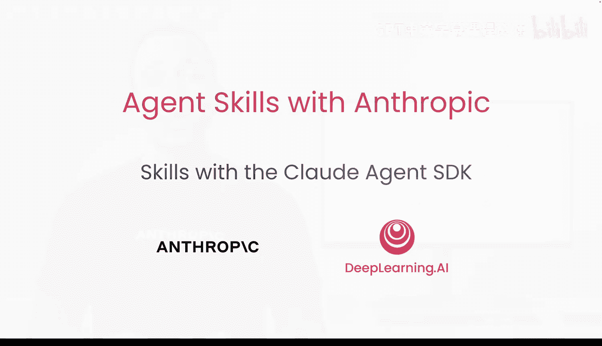

在本节课中，我们将学习如何使用 Claude Agent SDK 构建一个研究型智能体。这个智能体将利用技能，基于开源工具的文档、GitHub 仓库和网络搜索，为其创建一份学习指南。

## 概述

我们将创建一个通用的研究型智能体。主智能体能够从多个来源研究信息并综合成摘要。它将派遣三个不同的子智能体，分别用于分析文档、分析和下载仓库，以及通过网络搜索研究信息。

## 智能体架构设计

上一节我们介绍了项目的目标，本节中我们来看看智能体的具体架构和提示词设计。

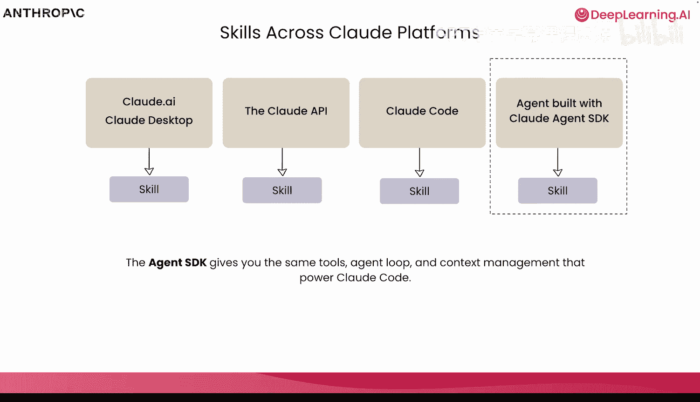

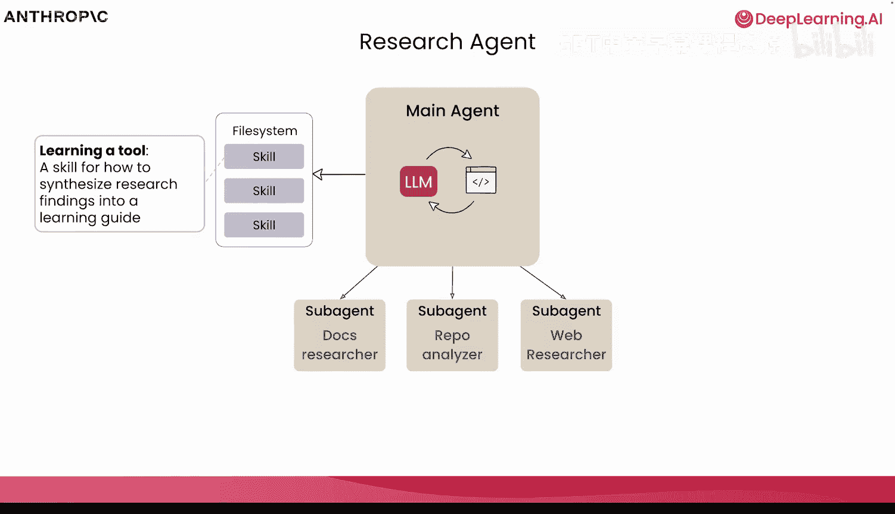

### 主智能体提示词

主智能体是协调者，它拥有三个可用的子智能体，具备以下能力：
*   从文档中查找信息
*   分析仓库结构
*   查找文章、视频和社区内容，并将所有信息整合在一起。

在这个特定的应用中，我们提到如果提供了技能，我们希望智能体遵循特定的模式。我们构建的应用可能提供也可能不提供技能，但在本例中，我们将提供一个。如果技能与用户请求匹配，则需要精确遵循该技能的指令。由于我们是从头开始构建这个智能体应用，因此需要明确当提供技能或未提供技能时该如何处理。

以下是高级别的委托指南，用于指导如何生成子智能体以及在收到结果后如何综合所有信息。

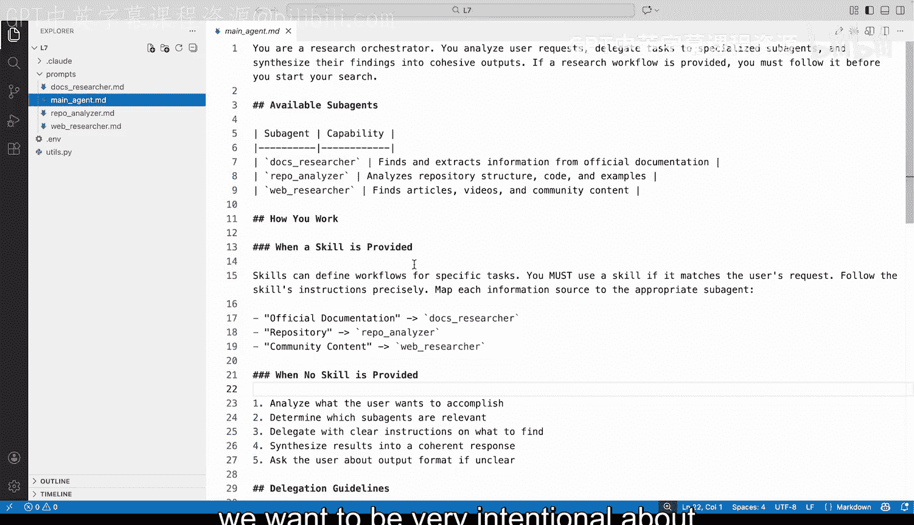

### 子智能体提示词

现在，让我们简要了解一下子智能体的提示词。

**文档研究员**可以访问网络搜索和网页抓取工具。我们提供了一个流程来定位文档、特定的输入格式、指南，以及以特定方式返回研究结果的输出格式。

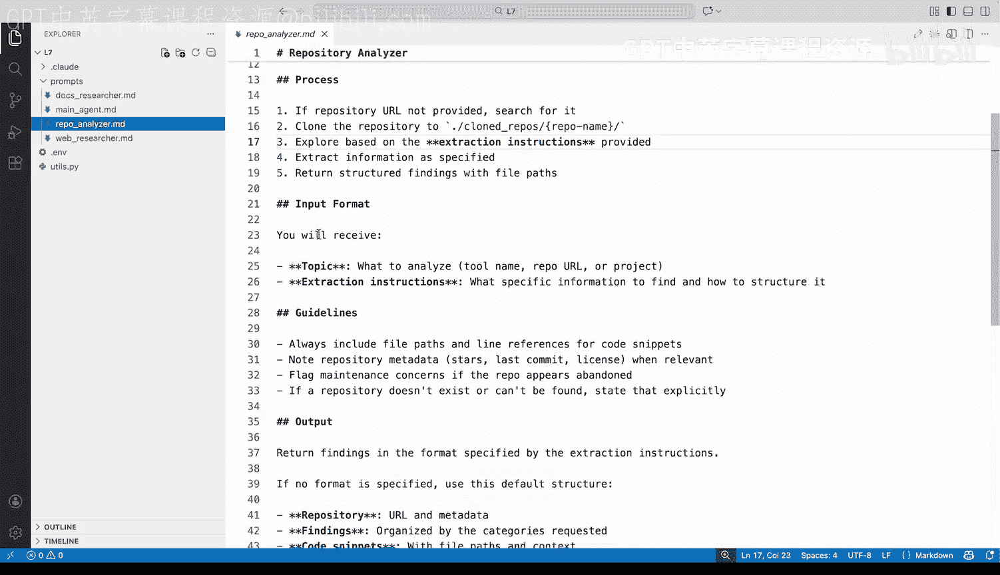

**仓库分析器**同样可以使用网络搜索来查找仓库、使用 `bash` 命令运行 Git，以及读取和查找文件及文件内的数据。类似地，我们也提供了流程、输入格式、指南和输出格式。

**网络研究员**也使用网络搜索和网页抓取工具。这允许我们搜索与主题相关的内容，并从主智能体接收提取指令。我们还提供了指南以及必要的输出格式；如果未指定输出格式，则遵循默认结构。

所有这些提示词将在我们设置使智能体工作所需的代码时一起使用。

## 技能设计

上一节我们介绍了智能体的架构，本节中我们来看看将要用到的技能。

我们有一个名为 **学习一个工具** 的技能。这个技能的目的是指导主协调器。我们不会在单个子智能体中使用这个技能，而是将其作为一种创建可预测模式的方式，以便主智能体知道理想的工作流程以及如何派遣子智能体。

我们为技能指定了名称和描述。在本例中，我们希望为编程工具创建学习路径，以确定应研究哪些信息，并指定从研究开始到创建全面学习路径的最佳方法。

我们有一个非常具体的工作流程：
1.  从研究阶段开始，我们为负责官方文档的子智能体指定具体要查找的内容。
2.  对于仓库分析器，采用类似的方法。
3.  对于我们的网络研究员，方法也非常相似。

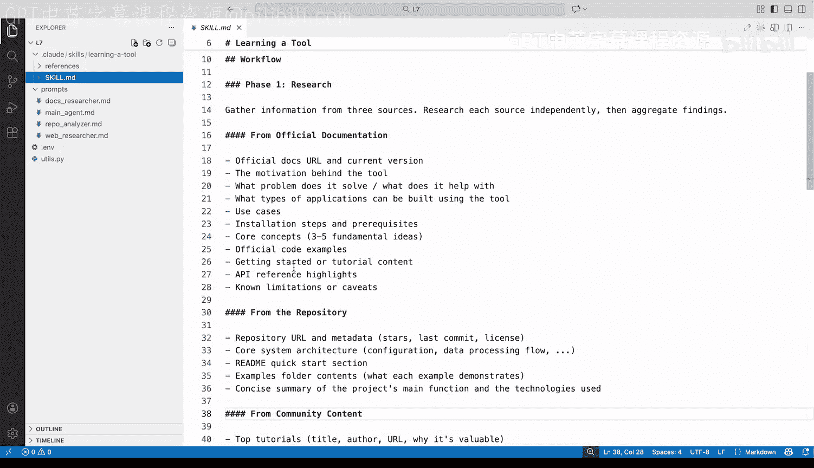

因此，我们使用这个技能为主智能体拥有的子智能体提供一个恒定且可预测的最佳协作工作流程。

一旦数据收集完毕，我们就会将这些内容组织成渐进式的级别。这里我们使用渐进式披露，加载另一个 Markdown 文件作为渐进式学习文件的真实来源。在这个渐进式学习文件中，我们可以看到从概述和动机，到安装、核心概念、实践模式，再到后续深入方向等各个级别。这种渐进式学习允许我们构建级别，以便我们知道如何从基础开始，并最终知道如何深入。

虽然这个初始技能对于学习工具很有用，但您也可以想象，根据我们处理的数据，我们可能还会有其他技能，例如比较一个工具与另一个工具。

随着我们进入使用此技能的后续阶段，我们获取数据，指定结构，然后指定输出。我们对所使用的确切格式要求非常严格。

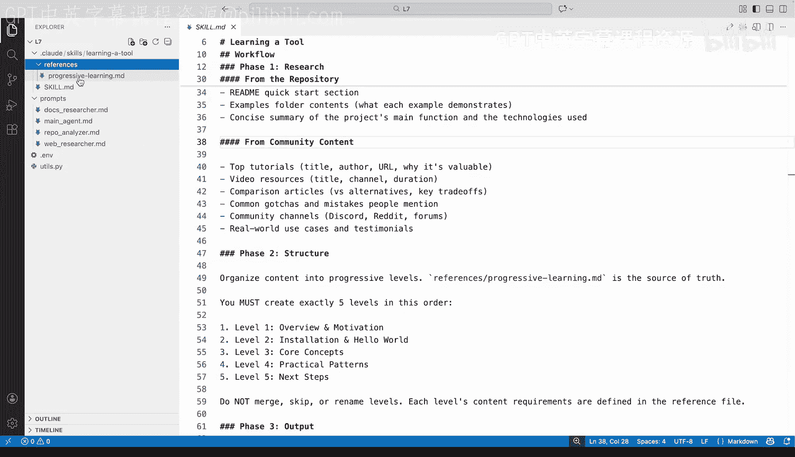

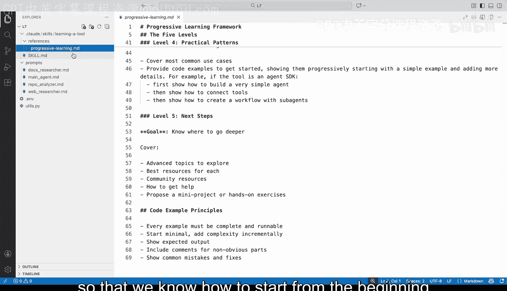

这里的目的是获得一个学习环境，该环境能提供概述、资源、路径和代码示例。目标是将所有子智能体的研究成果合并成我们想要的特定输出格式，并确保一致性和可预测性。

## 代码实现

现在我们已经从高层了解了要构建的应用，还有最后一部分需要添加。我们可以设想，我们希望获取输出并将其写入一个集中的位置，以便与团队成员分享，并且可能拥有更友好的界面。为此，我们将使用 Notion。为了连接到 Notion，我们将使用一个 MCP 服务器，并引入执行此操作所需的工具。

### 项目初始化与依赖

现在我们已经检查了主智能体、子智能体以及将要使用的技能的底层提示词，让我们开始运行 `uv init` 来初始化一个项目，并添加必要的依赖项，如 `claude-agent-sdk`、`python-dotenv` 和 `asyncio`。

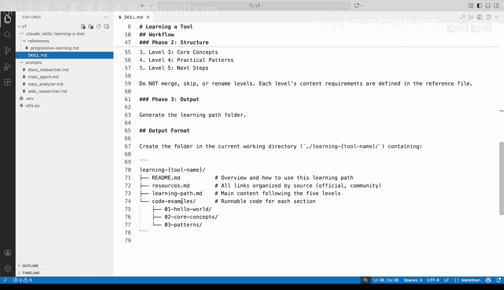

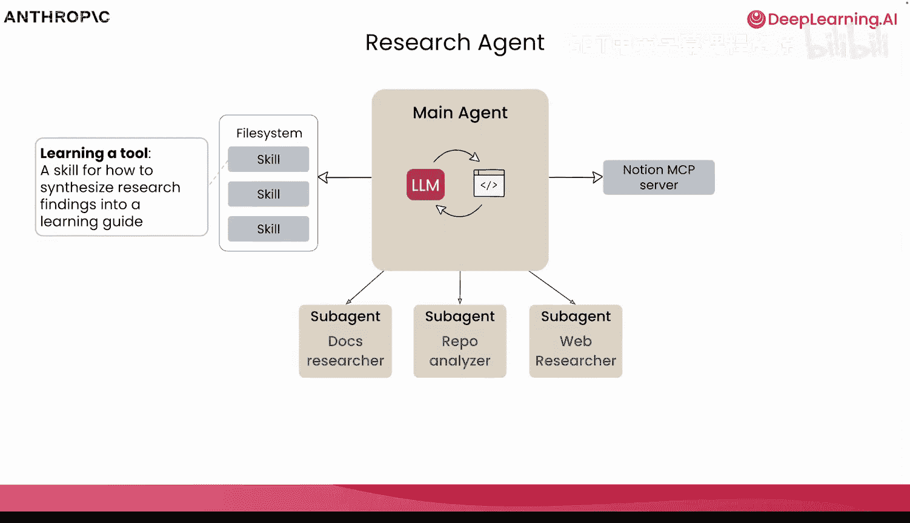

安装这些依赖项后，让我们创建一个名为 `agent.py` 的文件。

在我们的 `agent.py` 文件中，我将添加必要的代码，以便使用 Claude Agent SDK 从一个简单的示例开始。

这里的样板代码引入了 `asyncio` 来运行此环境，`dotenv` 来加载环境变量，然后从我们的工具中引入 `display_message` 函数。

为了提供一些背景信息，`display_message` 为我们提供了一系列用于截断和格式化输入的辅助函数，并为我们提供了一种很好的方式来直观显示来自主智能体和子智能体的信息。这与我们使用 API 时看到的代码非常相似，当时我们为每个工具操作和迭代都获得了很好的输出。

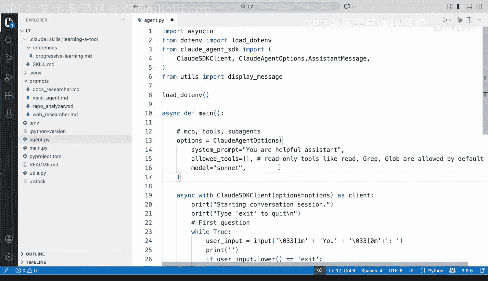

### 基础智能体设置

首先，我们设置 Claude 智能体，传入一个系统提示（这里会更改），并传入允许的工具（这里也会更改），但我们只想从基础开始。

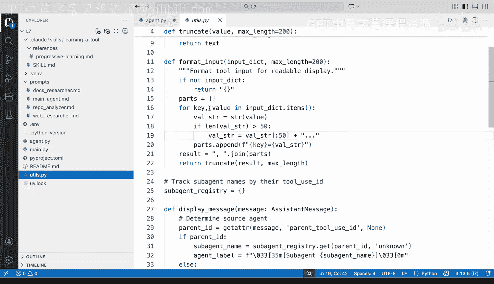

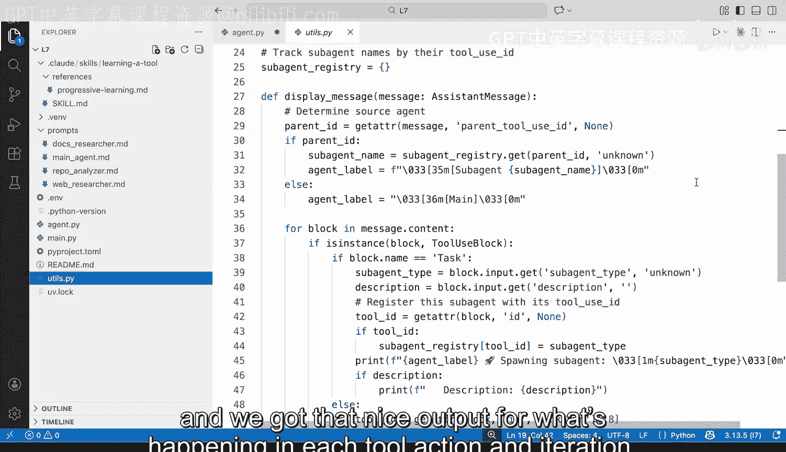

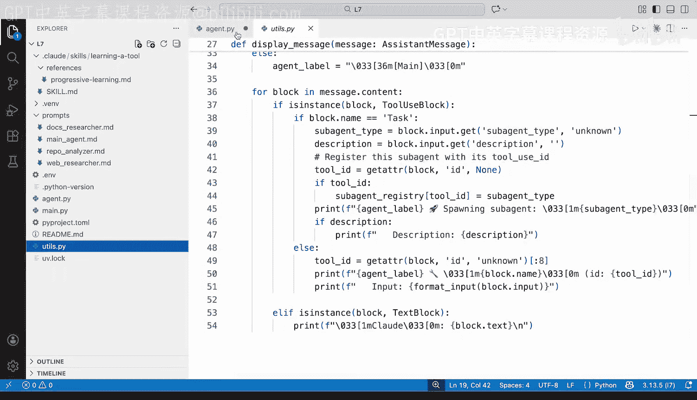

为了开始一个简单的对话，我们设置一个循环。接受一些用户输入，通过我们的模型运行它，获取响应并将其发送回用户。

让我们看看效果如何。我将再次打开终端，运行 `uv run agent.py`。

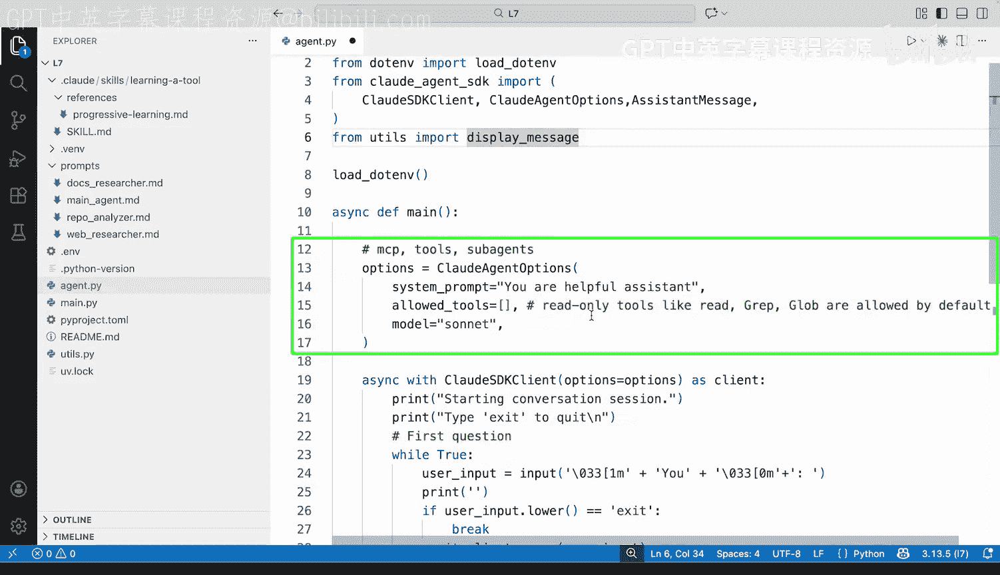

这将为我们提供一个终端环境，我们可以开始对话。我先问：“你好吗？” 在这种情况下，我不会得到太多有价值的信息，因为我只有一个乐于助人的助手。所以，我们现在要开始添加的功能是让我们的智能体能够访问 MCP 服务器和正确的工具。

### 添加工具与 MCP 服务器

让我们对主函数进行一些修改。如前所述，允许的工具将会改变。因此，我们将开始添加子智能体需要使用的工具，以便它们能按预期工作。

默认情况下允许只读工具，如 `read`、`grep` 和 `glob`。但是，当我们想要开始执行诸如写入文件、搜索网络和执行 `bash` 命令等操作时，需要显式传入这些工具。

所以，我们将引入正确的工具：`bash` 工具、`web_search` 和 `web_fetch` 工具。

我们之前看到，我们的子智能体将使用这些特定的工具：分析仓库的智能体需要 `bash` 来运行 git 命令和写入文件，而我们的文档研究员和网络研究员将使用搜索和抓取功能。

现在我们已经引入了这些工具，接下来要添加的是要连接的 MCP 服务器。

我们将使用 `mcp_servers` 关键字参数，并指定 MCP 服务器的名称，在本例中是 `notion`。我们将传入一些默认配置，并指定运行 Notion 服务器的命令以及我们拥有的 Notion 环境变量。

因此，在继续之前，我们需要确保从 `.env` 文件中加载我们的 Notion 令牌，并导入 `os` 模块以确保能够正确读取该文件。

现在我们已经正确加载了 MCP 服务器，我们需要使用 Notion 提供的工具。如果我们愿意，现在可以问 Claude：“你从这个 MCP 服务器获得了哪些工具？”或者我们可以显式地添加它们。

通过使用 `mcp`，后跟我们的服务器名称，再后跟工具名称，在本例中，我们将使用 Notion 提供给我们的所有工具。

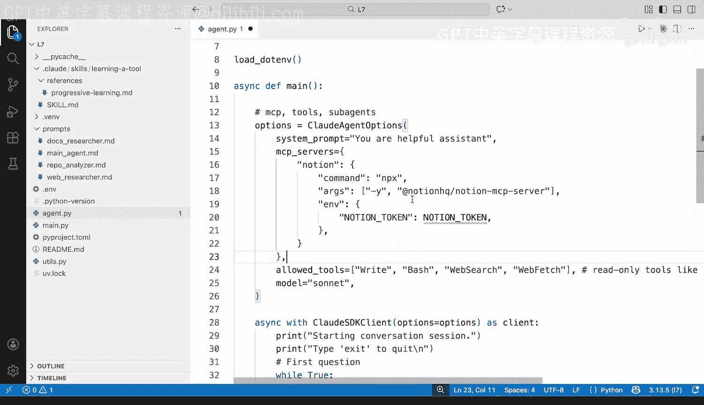

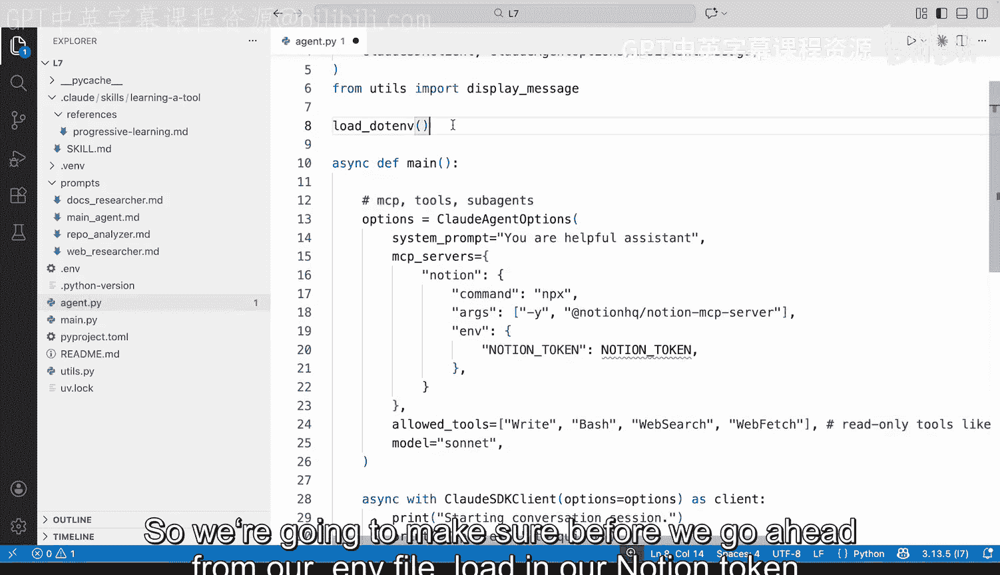

我们需要确保这个 `mcp_notion` 存在于 `allowed_tools` 中，以便授予主智能体使用这组工具的权限。我们可以显式添加工具名称，或者在本例中，我们将直接包含 MCP Notion 提供的所有可用工具。

### 集成子智能体与技能

现在我们已经设置了 MCP 服务器和允许的工具，接下来让我们引入子智能体及其定义。

我们提到系统提示将会更改。首先，我们将加载所有已有的提示词。我们将引入一个常量和一个辅助函数来加载所有这些提示词。

我们将调用该函数来引入这些提示词到我们的主函数中。我们将利用这些 Markdown 文件来加载必要的文本，并将其传递给我们的智能体选项。

在更新主智能体之前，我们将添加一个字典来引用所有具有定义的智能体。我们引入了 `AgentDefinition` 类，需要确保正确导入。

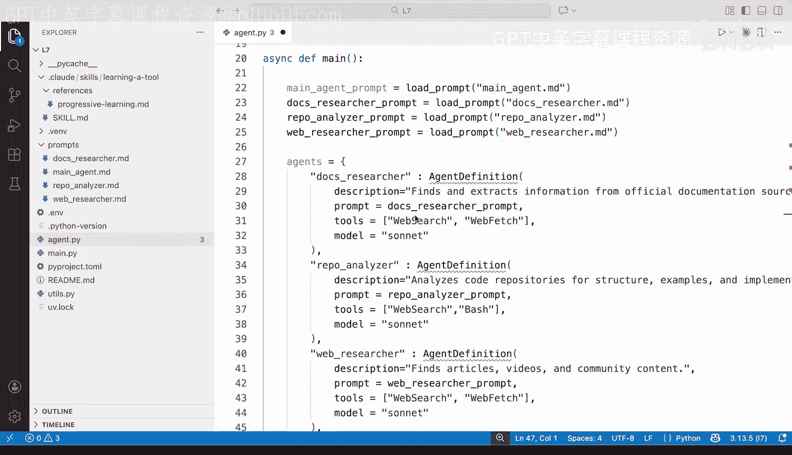

在 `AgentDefinition` 中，我们可以看到子智能体的描述、指定智能体指令的提示词，以及我们希望该智能体使用的工具。这与我们在 Claude Code 中看到的配置类似。

这里我们仍然需要使用我们的主智能体提示词，以及这个智能体字典。

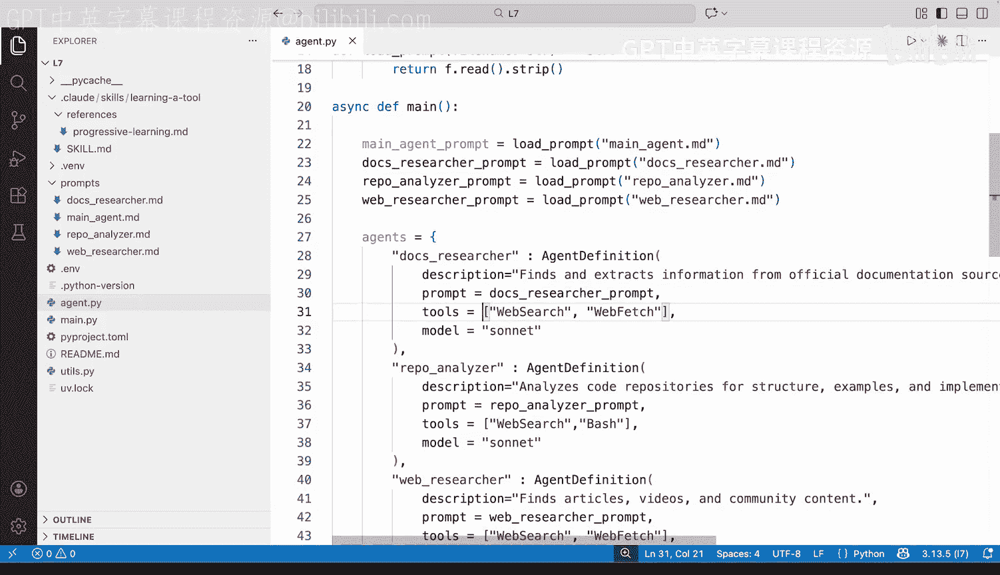

因此，我们将使用主智能体提示词更新系统提示，并确保传入一个额外的关键字参数 `agents`，该参数引用我们包含智能体定义的字典。

如您所见，我们的研究员、分析器和网络研究员也使用了我们在此定义的工具。重要的是要确保在 `allowed_tools` 中列出主智能体和子智能体需要使用的所有工具，否则即使在此包含了工具，子智能体也不允许使用它们。

### 添加任务与技能工具

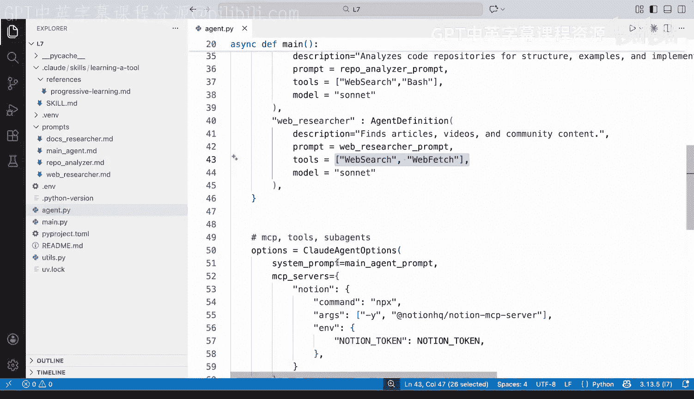

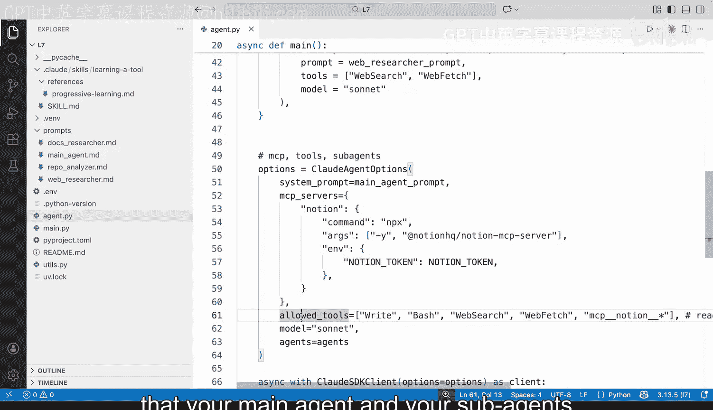

现在我们已经设置了智能体，还需要确保包含非常重要的 `task` 工具，以确保我们可以派遣子智能体并向它们分配任务。

我们需要添加的最后一个部分是技能。好消息是，为了添加技能，我们只需要再添加一个工具，那就是 `skill` 工具。由于我们这里有一个可以执行代码的环境（使用 `bash` 工具），我们只需要添加这个 `skill` 工具，以便能够正确读取技能并了解如何最好地使用它们。

与 Claude Code 类似，技能定义在 `.claude` 文件夹内，后跟一个名为 `skills` 的文件夹。请确保您的 Markdown 文件是 `skill.md`，并且您的文件夹名为 `skills`（复数形式）。

现在我们已经添加了用于处理技能的工具，这里还需要传入一个关键字参数。我们需要指定在哪里找到这组特定的技能，我们通过一个名为 `skill_sources` 的关键字参数来实现。在这里，我们将指定我们希望在家目录（如果我们有技能的话）以及项目目录（我们为此特定应用程序加载技能的位置）中查找技能。

## 运行与测试

现在我们已经将所有部分整合在一起，让我们来测试一下我们的智能体。

我将再次打开终端，退出，然后运行我们已做更改的应用程序。

我们将从了解一点关于 `minu` 的知识开始。对于那些不熟悉的人来说，`minu` 是一个用于 PDF 提取的开源库。我们使用这个例子的原因是，Claude 可能从其初始训练数据中对此了解不多，这将需要外部研究、分析代码仓库、社区文档和其他来源。

我们将要求创建一个学习指南，然后先展示计划。

在这里，我们将开始看到技能被调用，输入是我们指定的参数所调用的名为“学习一个工具”的技能。

所以在这里，我们可以看到我们首先指定了计划。我们仍然需要运行子智能体将要执行的操作，但就像在 Claude Code 和计划模式中一样，我们可能希望在开始行动、消耗令牌和时间之前先看看计划是什么。

我们可以看到研究阶段，我们的不同研究员进行并行调查；我们可以看到根据技能所需的结构；最后是我们期望的输出。这看起来是个好计划。

所以我们就让它继续执行。它将开始生成文档研究子智能体、仓库分析器和网络研究员，并使用我们添加到允许工具中的工具（这些工具也已传递给我们的子智能体）并行执行这些任务。

我们可以看到，文档研究员正在前往文档，仓库分析器正在 GitHub 上查找，网络研究员正在搜索教程和 YouTube 指南。我们正在使用 `bash` 命令从 GitHub 仓库提取信息，同时搜索 YouTube 频道以获取视频演示。

这些智能体并行交互，从不同的数据源获取信息，将所有内容整合成一个引人入胜的教程。

现在子智能体已经完成了它们的工作，我们将创建全面的指南，根据我们已有的研究结果整合所有必要的文件。

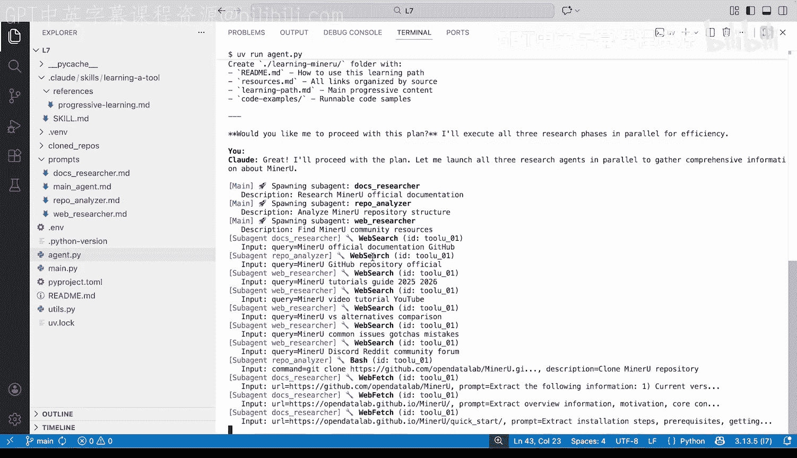

按照仓库分析器的指示，我们已经克隆了 `minu` 的仓库并保存在这里，并开始为此构建文件夹结构。

在这里，我们可以看到我们有我们的 `README` 和资源，以及正在整合的代码示例。

在 `README` 文件中，它为我们提供了学习路径：我们将学习什么、如何使用本指南，以及重要的是，我们可能需要的时间估计。

在这里，我们可以看到它为我们创建了 `README`，资源部分和学习路径仍在进行中。在我们的资源中，我们有 `minu` 的链接和参考资料。让我们看看。

在我们的资源中，我们有文档、仓库、`pip` 包和该库的基础论文；我们有快速入门指南、文档和相关项目。

当我们从社区引入更多信息时，我们拥有各种文章和新闻报道的深度解析。

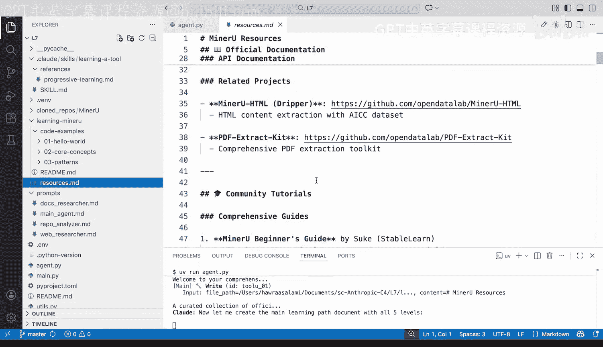

现在我们可以看到学习路径已经创建。

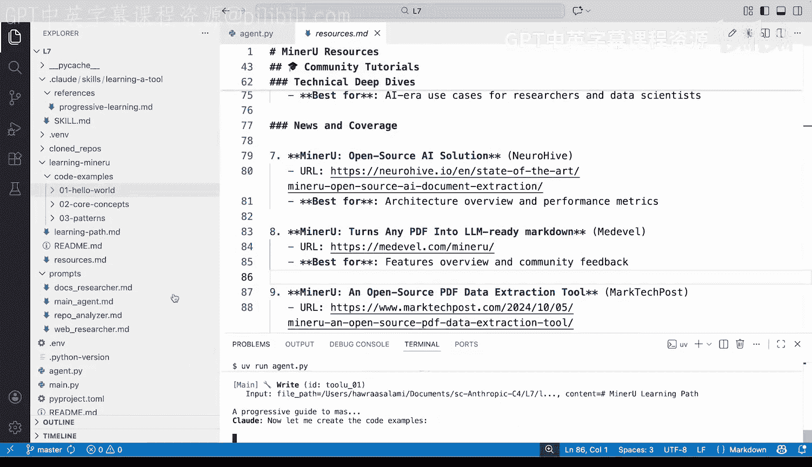

是时候创建代码示例了。让我们看看这个学习路径。

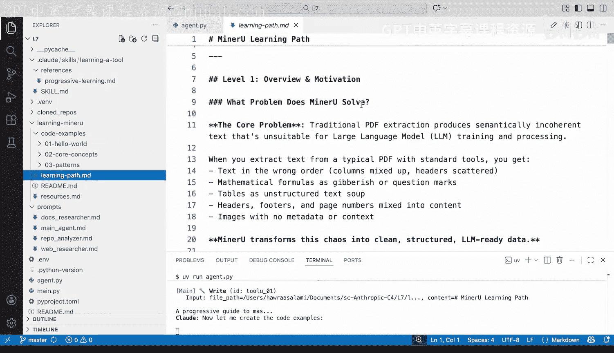

从概述和动机开始，它解决了什么问题？我们描述了该库的起源故事、之前存在的内容以及那些库的一些问题。

我们可以看到，这是一个相当深入的学习指南和路径。您可以想象，这将是一个需要很长时间才能掌握的内容，从几乎一无所知到成为使用该库的专家。

我们深入探讨了该库后端的一些独特功能，一直到代码示例和许多关于如何尽可能高效地使用它的特性。

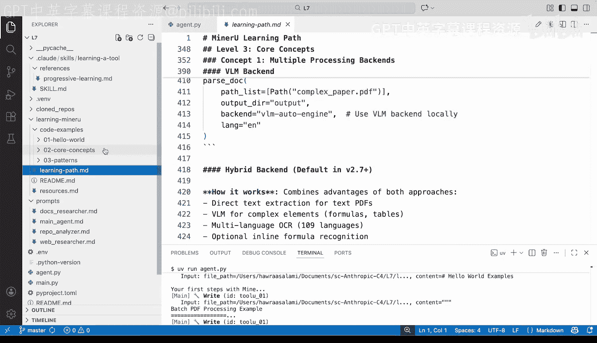

我们开始看到我们的代码文件正在为“Hello World”示例、概念和模式编写。

对于我们的“Hello World”示例，我们有一个很好的 `README` 来开始一些第一步，简单的提取以了解如何开始使用这个库，以及安装步骤。

如果我们想为安装或模式使用特定的库，我们总是可以将其添加到我们的技能中，但现在这将为我们提供一个很好的起点来启动和运行这个库。

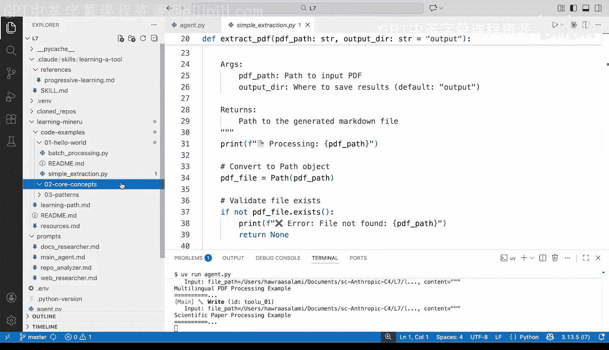

当我们查看一些核心概念时，这些概念目前正在创建中。

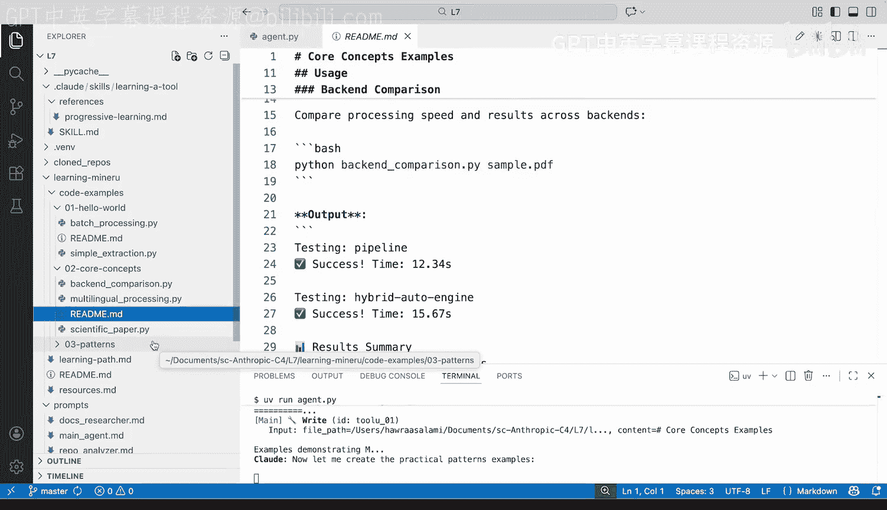

现在这些完成后，我们可以在 `README` 中看到下一步该去哪里。一旦我们启动并运行了该库，我们就可以开始查看该库拥有的一些基本概念，以及比较不同后端的速度。

最后，我们将使用第三个文件夹创建实践模式和示例。

我们可以看看这个文件夹，在这里我们可以看到真实世界的处理流程和生产用例。这包括某些模式的示例，以及使用该库的相当深入的代码示例，包含文档字符串、注释以及充分利用该库所需的一切。

我们将通过验证和创建摘要文档来结束，确保一切都已正确完成。我们可以查看输出，它为我们提供了一个完整的学习指南、技能中指定的目录结构、我们请求的级别的学习路径，以及关键功能和快速入门指南。

我们要做的最后一件事是将这个特定的文件 `resources.md` 写入 Notion 中的一个名为“资源”的子页面。这个页面已经存在，所以让我们看看它是什么样子，然后提示继续使用我们的 MCP 服务器进行必要的写入操作。

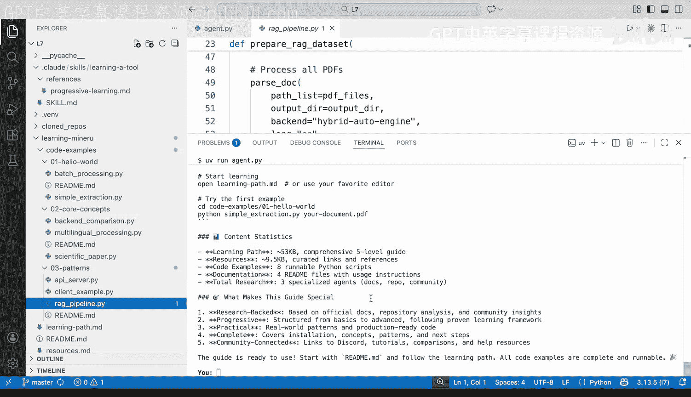

在这里，我们可以在 Notion 的“学习”部分下看到一个名为“资源”的子页面。这里的目的是使用 MCP 服务器将我们 `resources.md` 中的内容填充到这里。

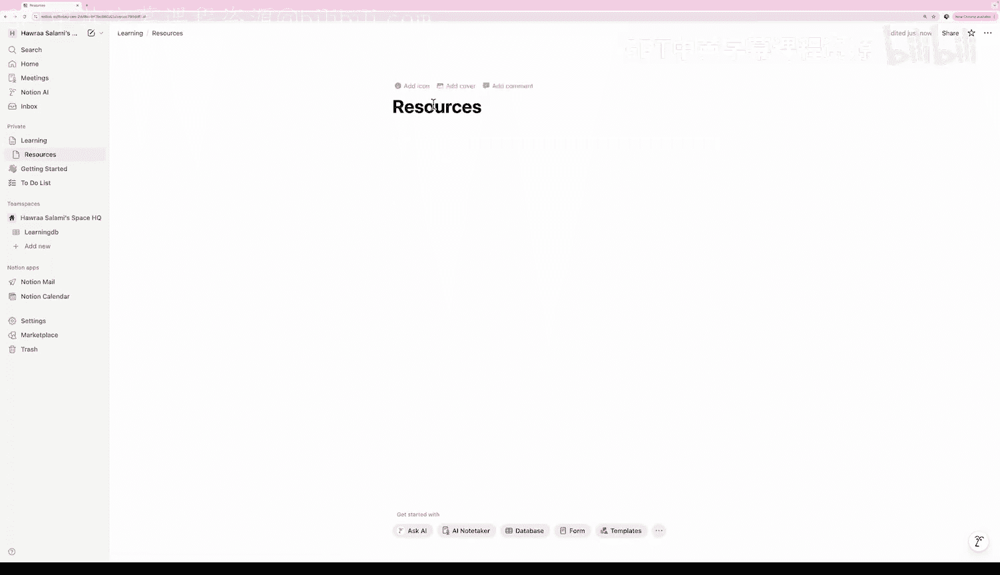

所以，让我们要求我们的智能体将该文件写入 Notion 中的那个子页面。我们将明确说明我们在 Notion 中使用的工具，并允许它使用我们可用的工具。

我们找到了资源页面，我们将读取 `resources.md` 并将其转换为 Notion 中正确的格式，使用丰富的 Notion 块。

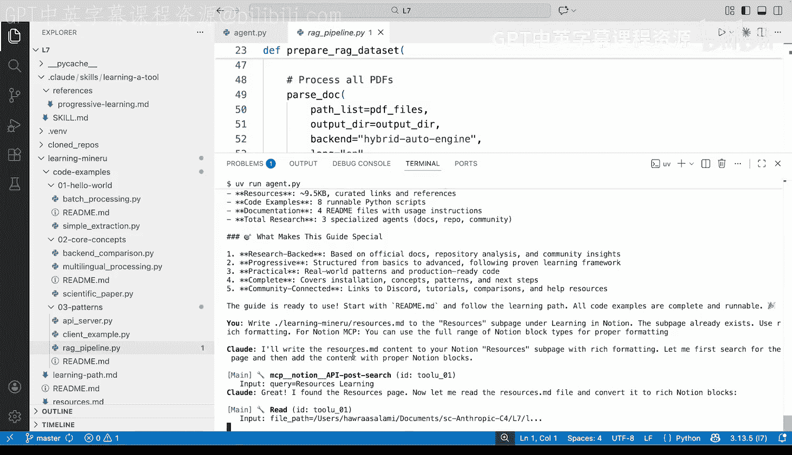

在这里，您可以看到我们使用了 Notion 的多个工具，分批进行，添加了快速入门指南、API 文档以及我们 `resources.md` 中的其余信息。

在这里的资源文件中，我们可以看到它正在根据文档和我们的 `resources.md` 动态更新。当这个过程完成时，我们将看到该文件中的所有内容出现在我们的 Notion 页面上。

现在它已经完成了，让我们看看我们的 Notion 页面是什么样子。

在这里，您可以看到我们有官方文档、教程、视频资源、社区频道，所有来自那个 Markdown 文件的数据现在都已写入 Notion。我们使用了技能、MCP 服务器、智能体和子智能体，所有这些都使用了 Agent SDK。

您可以想象为更复杂的工作流程添加更多技能，或添加更多子智能体来执行各种任务。

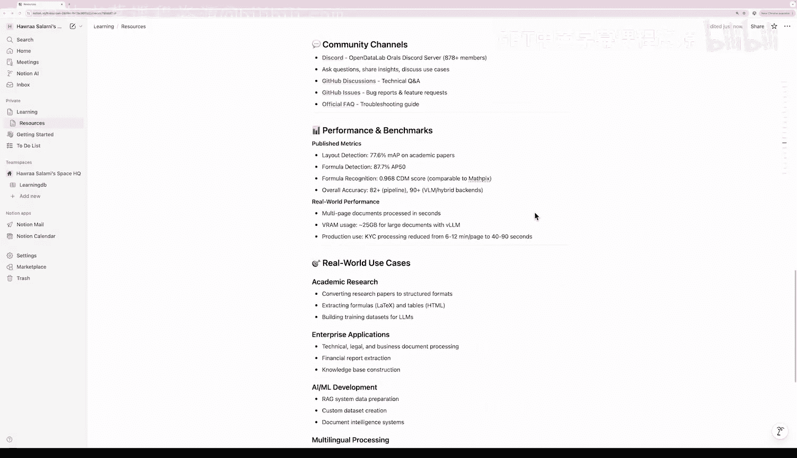

## 总结与展望

在本节课中，我们一起学习了如何使用 Claude Agent SDK 构建一个功能强大的研究型智能体。我们涵盖了从智能体架构设计、提示词编写、技能定义，到代码实现、工具集成（如 `bash`、`web_search`、`web_fetch`）和 MCP 服务器（如 Notion）连接的全过程。通过一个为开源 PDF 提取库 `minu` 创建学习指南的实例，我们看到了智能体如何并行协调多个子智能体，从文档、代码仓库和网络收集信息，并最终综合输出结构化的学习材料和资源。

我们刚刚开始触及功能的表面，并且仍然需要注意一些安全问题。首先，我们允许执行诸如写入和 `bash` 之类的命令，而无需用户许可。这里的下一步是构建一个类似于 Claude Code 的界面，确保允许用户确认他们希望为特定操作使用这些工具。

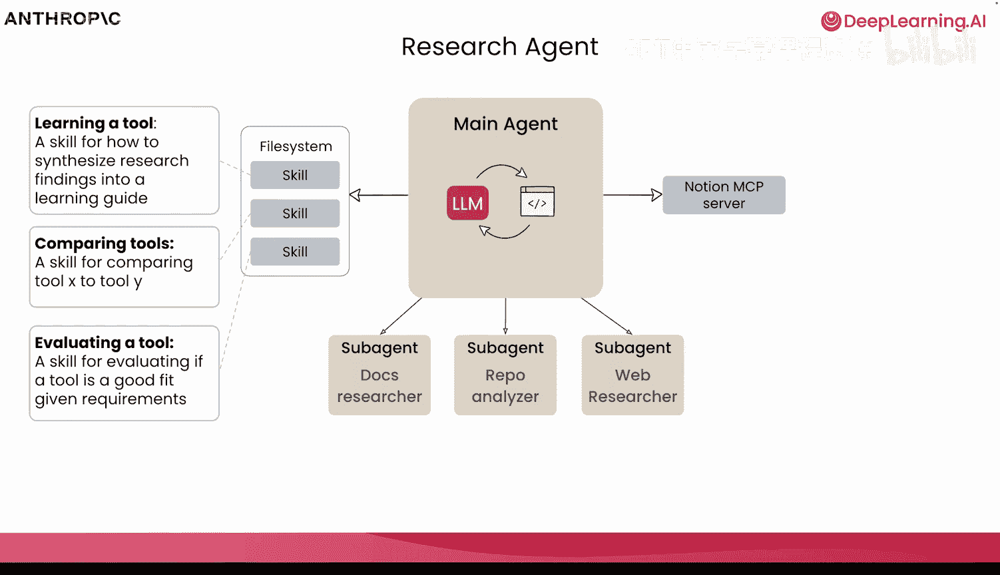

我们也刚刚开始为我们的智能体和子智能体添加类似 Claude Code 的中断功能。因此，我们为您提供了继续构建强大智能体应用的基础，我们迫不及待地想看到您接下来会构建什么。