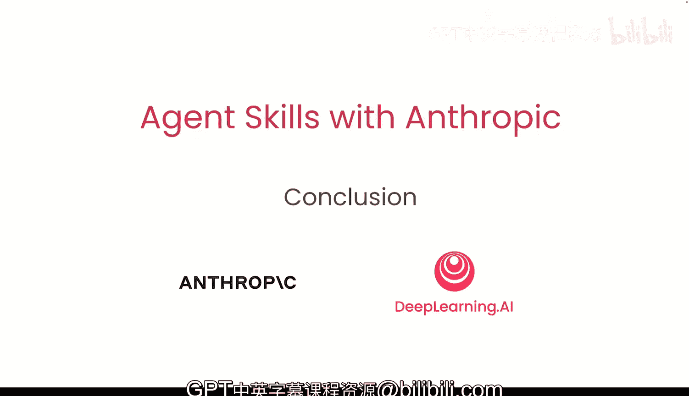
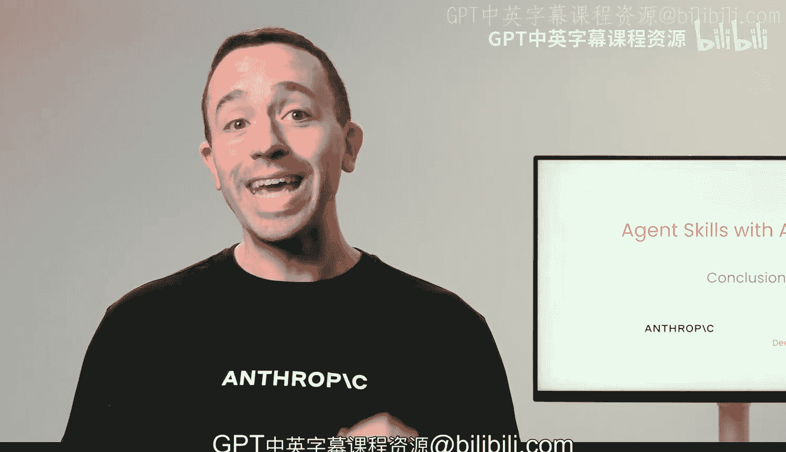

# 010：总结 🎯

在本节课中，我们将对之前学习的内容进行总结，回顾创建智能体技能的核心要点与最佳实践。

---

恭喜你坚持学习到这里。你已经学会了如何创建技能，探索了相关的最佳实践，并看到了它们在不同平台上的实际应用。

上一节我们介绍了技能的实际应用与迭代，本节中我们来对整个课程内容进行总结。

以下是创建技能时需要牢记的几个关键步骤：

1.  **从基础开始**：创建技能时，从基本的 Markdown 格式指令开始。
2.  **逐步扩展**：随后遵循**渐进式披露**的原则进行扩展。
3.  **监控与迭代**：在真实场景中监控你的智能体如何使用技能，并根据观察结果进行迭代优化。
4.  **提供清晰描述**：确保技能描述包含足够的细节，以便你的智能体知道何时应该使用该技能。

另外，请记住，Claude 非常了解什么是技能。因此，你始终可以从一次简单的对话开始创建技能，然后利用“技能创建器”技能来遵循最佳实践。

感谢你与我一同完成这段学习旅程。我迫不及待想看到你运用智能体技能构建出精彩的应用。

---

本节课中我们一起学习了智能体技能的创建流程与核心原则，包括从基础指令起步、采用渐进式披露、持续监控迭代以及编写清晰的技能描述。掌握这些方法将帮助你有效地构建和优化智能体技能。