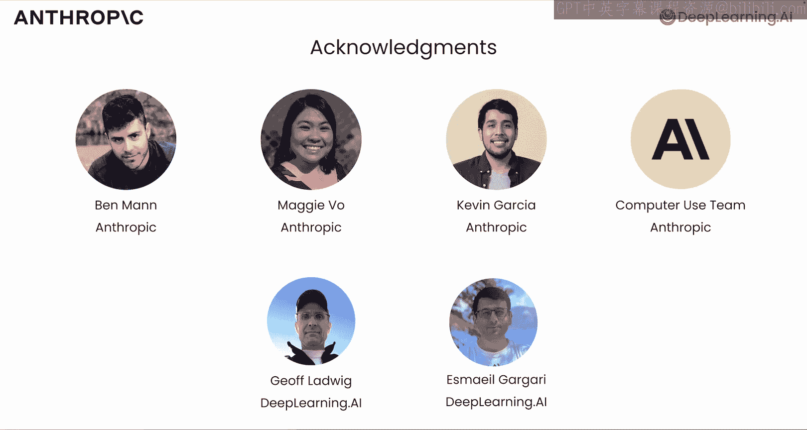
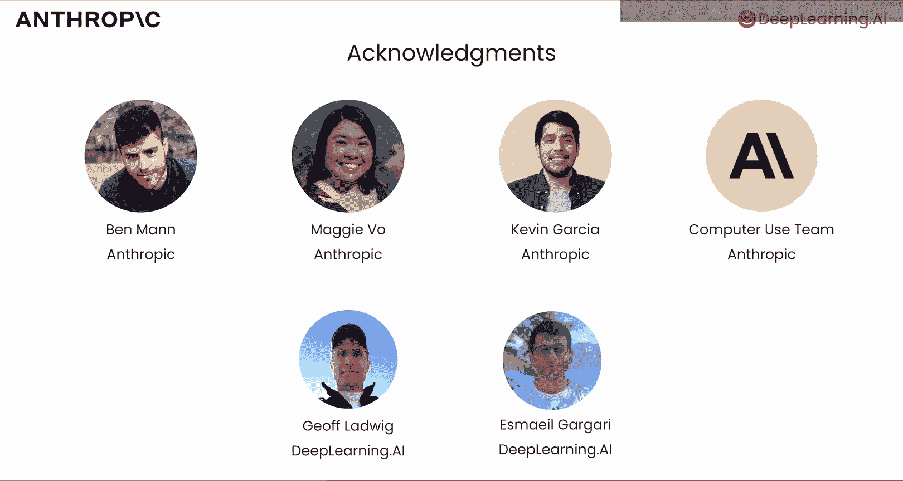

# 001：课程介绍

在本节课中，我们将一起学习由吴恩达与Anthropic合作推出的课程《构建计算机操作应用》。本课程将介绍Anthropic模型如何通过理解屏幕截图并生成鼠标点击和键盘输入序列，来实现自动化操作计算机的能力。我们将从基础概念开始，逐步深入到实际应用。

---

Anthropic近期取得了一项突破，发布了一个能够操作计算机的模型。该模型可以观察计算机屏幕（通常在虚拟机中运行）的截图，并按顺序生成鼠标点击或键盘敲击，以执行特定任务。例如，使用浏览器搜索网页并下载图片。

这种计算机操作能力是通过结合大型语言模型的多种特性构建而成的。这些特性包括模型处理图像（如理解屏幕截图内容）的能力，以及使用工具生成鼠标点击和键盘输入的能力。这些功能被封装在一个迭代的智能体工作流程中，通过在该计算机上执行多次操作来完成复杂任务。

在本课程中，你将学习到这些独立的特性，这些知识即使在不基于计算机操作的应用程序中也非常有用。同时，你也会看到它们如何协同工作以实现计算机操作。Co将向你展示这一切是如何运作的。

---

在课程中，你将学习如何使用多种模型和功能，它们共同实现了计算机操作。以下是课程的进展安排：

首先，你将了解一些关于Anthropic的背景、愿景以及其模型家族的独特之处。

接着，你将使用API来发起一些基础请求。

然后，课程将引导你进入多模态请求的学习，你将使用模型来分析图像。

之后，你将深入探讨提示工程。Anthropic非常注重通过扎实的提示工程使模型行为更具可预测性。你将学习真正重要的提示技巧。

以下是几种关键的提示技巧：
*   **思维链**：引导模型展示其推理过程。
*   **少样本提示**：通过提供少量示例来指导模型。
*   你还有机会使用我们的提示改进工具。

最近，语言模型开始支持超长的输入上下文。例如，Anthropic的模型支持超过20万个输入标记，这相当于500多页文本。

处理长输入的成本可能很高。实际上，在聊天机器人的长对话中，如果你为了持续生成下一个回复而反复处理整个对话历史，那么随着对话的进行和历史记录变长，成本也会增加。

这正好引出了我们的下一个主题：提示缓存。

提示缓存能在多次调用模型之间，保留部分提示处理的结果。这可以显著节省成本和降低延迟。

你还将学习如何使用模型来调用外部工具，并生成结构化输出，例如JSON。

在课程的最后，我们将一起演练一个完整的计算机操作示例，你可以在自己的机器上运行它。

请注意，由于该工具的性质，你需要在计算机的Docker镜像中运行它，而不是直接在DeepLearning.AI的笔记本中运行。

---

我个人已经尝试过使用Anthropic模型进行计算机操作，发现它非常酷。我认为这项能力将催生许多新的应用，你可以构建一个AI助手来操作计算机，为你执行任务。

这有点像RPA（机器人流程自动化），后者擅长处理重复性任务。但现在，基于大语言模型的工具使得构建这类应用更加容易，且适用性更广。

或者，随着这项技术变得更好，它甚至能处理更灵活、更开放式的任务，逐渐像一个真正的个人助手一样为你做越来越多的事情。

我非常同意这一点，并对它的未来感到非常兴奋。

---

许多人共同努力创建了这门课程。我要感谢来自Anthropic的Ben Mann、Maggie Vo、Kevin Garside以及计算机操作项目团队。同时，也感谢来自DeepLearning.AI的Jeff Ludwig和Ashmar Gagari。

Anthropic已经构建了许多非常出色的模型，我本人也经常使用它们。Co将在下一个视频中分享这些模型的详细信息。

好的，让我们开始吧。

---

本节课中，我们一起学习了《构建计算机操作应用》课程的概述。我们了解了Anthropic模型如何通过结合图像理解、工具调用和迭代工作流来实现自动化计算机操作，并预览了课程将涵盖的核心主题，包括API使用、多模态分析、提示工程、长上下文处理、提示缓存以及工具调用。在接下来的课程中，我们将深入探讨这些内容。