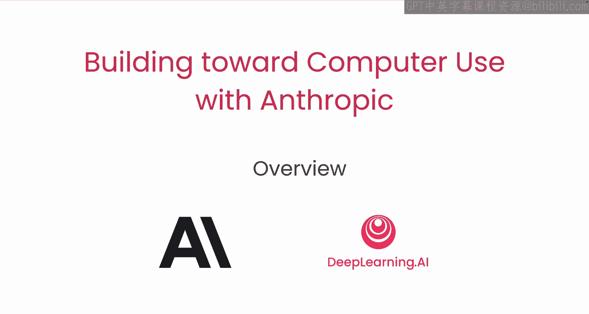
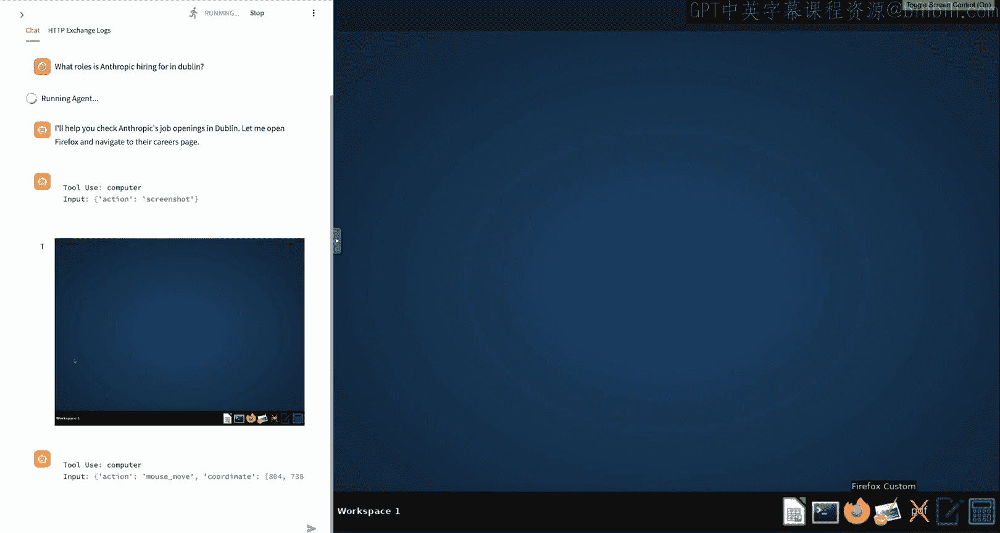
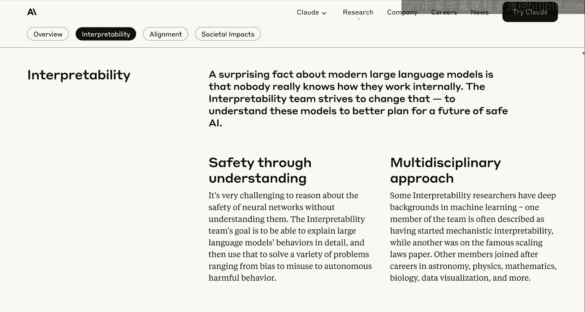
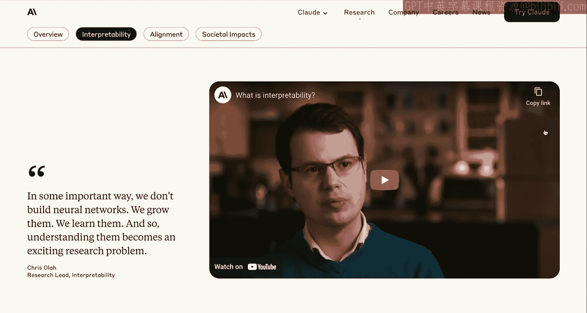
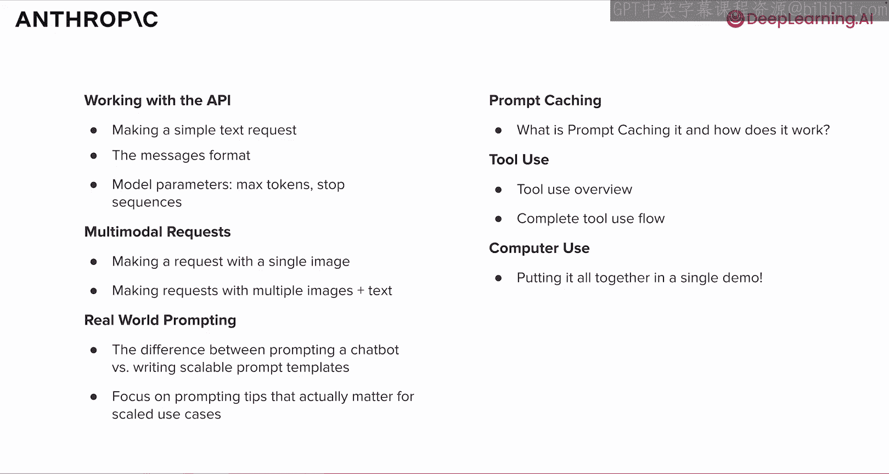

# 002：课程概述 🚀

在本节课中，我们将学习Anthropic在人工智能研究与开发方面的独特方法，了解AI安全、对齐和可解释性的核心原则，并区分Anthropic的模型家族。课程结束时，你将能够解释这些概念，并为后续的实践操作打下基础。

---

## Anthropic的使命与研究重点

上一节我们介绍了课程的整体目标，本节中我们来看看Anthropic这家公司本身。Anthropic是一个独特的人工智能实验室，其研究将安全性置于最前沿。本质上，它致力于构建前沿模型（有时是全球最好的模型），并同时利用这些模型进行尖端研究。

下图的时间线浓缩了这些理念：

Anthropic成立于2021年，你可以看到从那时起直到2024年Claude 3.5 Sonnet发布的一系列模型发布时间线。在时间线底部，你还可以看到同时发布的一些关键研究论文。

虽然这不是一门研究课程，但我想提醒你关注Anthropic网站的研究页面。这是一个很好的资源，可以通过易于理解的形式或完整的研究论文来深入了解我们的研究。

我们重点关注的领域包括：
*   **可解释性**
*   **对齐**
*   **社会影响**

---

## 深入理解“对齐”与“可解释性”

接下来，我们特别关注一下“对齐”和“可解释性”这两个核心概念。

**对齐科学**专注于确保AI系统的行为符合人类的价值观和意图。其核心问题是：我们如何创建能够可靠地追求我们设定的目标和任务的AI系统，即使它们的能力变得越来越强？

**可解释性**是Anthropic另一个重点研究领域，这个词有点拗口，但它是AI研究中一个非常迷人且关键的方面。可解释性是关于理解大型语言模型内部如何工作的，本质上是对它们进行逆向工程，或者给模型做“MRI”或“脑部扫描”，以便我们能在任何时间点准确理解其内部发生了什么。

如果不理解模型的工作原理，改进模型并确保其安全性将非常困难。如果你感兴趣，我鼓励你阅读我们的一些博客文章，观看关于可解释性的视频，特别是这篇相对易于理解的论文《Scaling Monosemanticity》。我知道这个名字听起来不那么平易近人，但它在阐述一些关键的可解释性研究时，充满了非常酷的图表和可视化。它也是一篇很有趣的读物，包含一些有趣的例子。

---

## Anthropic的模型家族

正如开头提到的，Anthropic不仅是一个专注于安全、对齐和可解释性的研究实验室，我们还发布最先进的大型语言模型。在我们的文档模型页面上，你可以找到我们当前模型的最新列表。像AI领域的一切一样，这个列表更新得非常快，所以它可能看起来和下图不完全一样。

如图所示，Claude 3.5 Sonnet 目前是我们最智能的模型，其次是 Claude 3.5 Haiku。Haiku 能力稍弱，但仍然非常智能，并且速度更快。这是目前提供给你的两个主要选择。

如果我们放大这个模型对比表格，你会看到 Claude 3.5 Sonnet、Claude 3.5 Haiku 以及原始的 Claude 3 系列模型。但两个最新、能力最强的模型是左边的 3.5 Sonnet 和 3.5 Haiku。我们可以看到它们的能力、优势和视觉能力的详细对比。

以下是核心模型的简要对比：

*   **Claude 3.5 Sonnet**：这是我们提供的最智能、能力最强的模型。它支持多语言、多模态（支持图像输入），并支持我们的批量API。需要注意的一点是，它有多个版本，包括最新的升级版 **Claude 3.5 Sonnet 2024-10-22**。我们将在下一个视频中详细讨论模型字符串，但这是目前最新的 Claude 3.5 Sonnet 版本。它速度很快，但不如 Claude 3.5 Haiku 快。
*   **Claude 3.5 Haiku**：这是我们提供的最快的模型。它在非常快的速度下仍然非常智能，速度比 Claude 3.5 Sonnet 更快，在一些流行基准测试上能力稍弱，并且目前不支持视觉功能。

关于上下文窗口，这两个模型都支持 **200,000个令牌** 的上下文窗口，最大输出令牌数为 **8192**。显然，Claude 3.5 Haiku 更便宜、更快，但 Claude 3.5 Sonnet 是最智能的模型。它也是本课程中我们将主要使用的模型，并且价格相当实惠。此外，由于它支持图像输入，目前在计算机使用任务上表现最佳。

在下一个视频中，我们将学习如何使用这些模型并开始发送请求。但我希望你先了解一下这个文档页面，以便随时了解最新模型，并查看这些模型在各种指标上的对比情况。

---

## 课程结构与核心主题

以上是对Anthropic的简要介绍：一个创建前沿或尖端模型的前沿研究实验室。这也包含了关于本课程及其大致结构的一点信息。

现在，我们将深入探讨如何使用API，发送我们的第一个简单文本请求，并逐步构建，最终完成计算机操作代理的顶点演示。

本课程将涵盖使用Anthropic API所需了解的一切，包括使用我们的模型，并逐步构建对计算机操作代理工作原理的理解。

那么，什么是计算机操作代理？下面是一个例子。在左侧，你可以看到我正在输入一个提示：“Anthropic在都柏林招聘哪些职位？”（注：右侧演示视频已加速，以便节省时间）。

你可以看到模型正在操作右侧的电脑。它点击、移动鼠标、选择下拉菜单、展开折叠菜单。最终，它找到了Anthropic的招聘页面，按都柏林进行筛选，然后展开两个职位：一个技术项目经理和一个安全审计与合规职位。

这就是我所说的计算机操作代理。你刚才看到的那个代理建立在API的所有基础知识之上。

因此，我们将按顺序讲解以下主题，最终以计算机操作代理演示结束。以下是本课程将涵盖的核心主题列表：

1.  **基础API请求**：该计算机操作代理会向API发送基本请求，如文本提示。它将使用消息格式和各种模型参数。这将是我们接下来要讲的内容。
2.  **多模态请求**：你可能已经注意到，模型使用屏幕截图来决定点击、拖拽或输入的位置。因此，你将学习如何发起涉及图像（包括屏幕截图）的请求。
3.  **真实世界提示工程**：这部分重点在于与像Claude.ai这样的聊天机器人以对话方式交流，与使用API进行可扩展、可重复的提示模板工程之间的巨大差异。
4.  **提示缓存**：这是计算机操作代理采用的一种策略，也是一种很好的节省成本和延迟的措施。
5.  **工具使用**：这使模型能够执行点击、滚动、键入等操作，或其他工具，如连接API、执行bash命令或运行代码。我们可以为模型提供各种工具，模型可以告诉我们它想要执行哪个工具。
6.  **计算机操作代理实战**：在最后，你将看到如何运行刚才看到的计算机操作代理。它结合了我们所涵盖的所有主题，外加一些其他内容。这是一个略有进阶的项目，但它是一个很好的顶点项目，涵盖了使用Anthropic API的所有核心概念。

---

## 总结

本节课中，我们一起学习了Anthropic作为一家前沿AI研究实验室的定位，其核心研究重点——对齐与可解释性，并初步了解了其主力模型家族（Claude 3.5 Sonnet 和 Haiku）的特点与区别。我们还预览了整个课程的结构，它将从基础的API调用开始，逐步深入到多模态、提示工程、工具使用，最终构建出一个能够实际操作计算机的智能代理。现在，我们已经为动手实践做好了知识准备，下一节我们将开始发送第一个API请求。