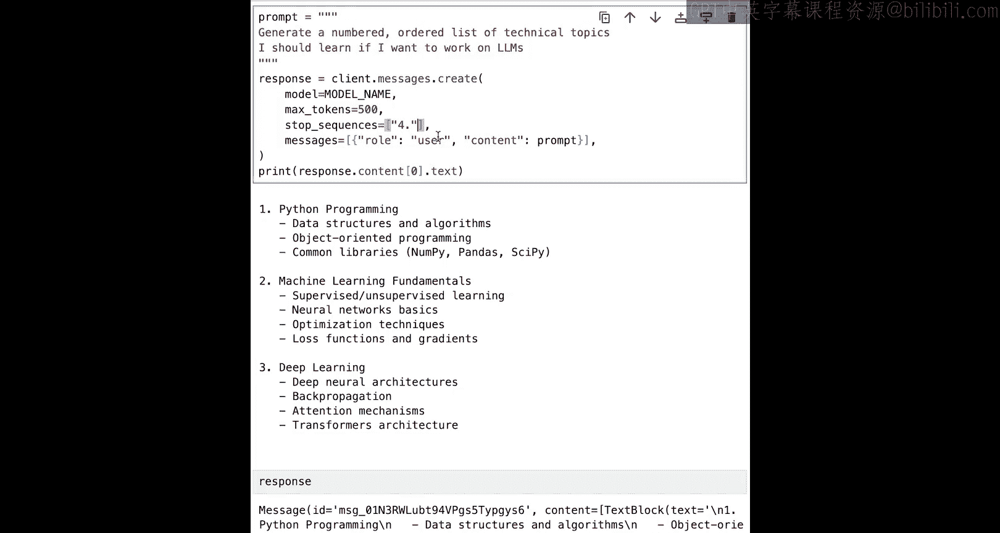
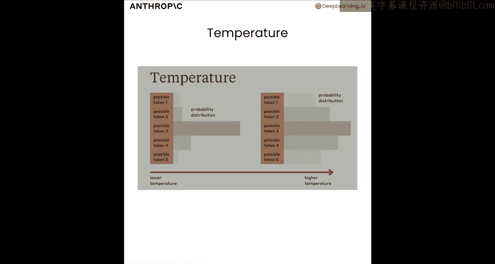
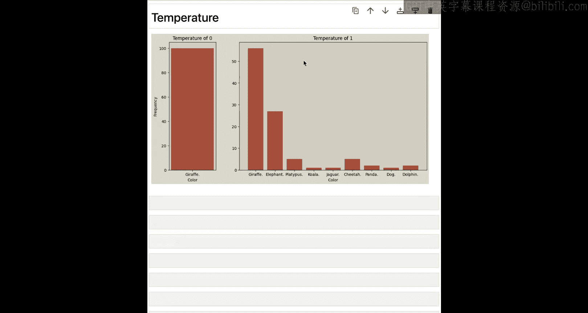
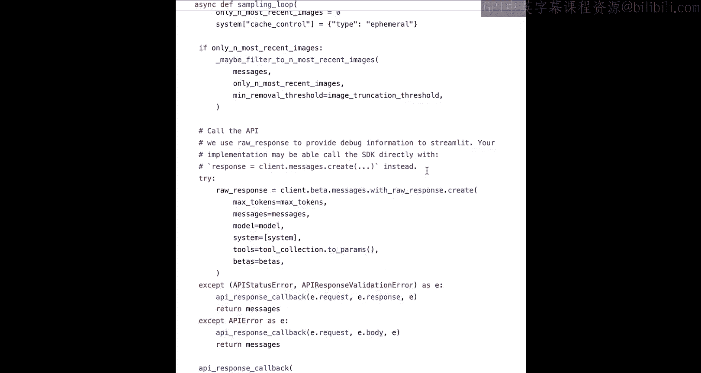

# 003：API基础


在本节课中，我们将学习如何向Claude API发送请求。你将能够创建自己的API请求，有效地格式化消息以获得最佳AI响应，并控制各种API参数，如系统提示、最大令牌数和停止序列。

---

## 环境设置与第一个请求

上一节我们介绍了课程目标，本节中我们来看看如何设置环境并发出第一个API请求。

首先，我们需要安装并导入Anthropic Python SDK。第一步是确保SDK已安装，只需运行 `pip install anthropic` 即可。安装完成后，我们导入它并实例化一个客户端。

```python
import anthropic

client = anthropic.Anthropic()
```

现在我们已经有了客户端。下一步是发出我们的第一个请求。我添加了两个代码单元格。第一个只是一个模型名称变量，我们将在整个课程中重复使用这个模型名称。

```python
model_name = "claude-3-5-sonnet-20241022"
```

接下来是这个较大的代码块。这里最重要的部分是我们如何实际发出一个简单的请求。我们使用客户端变量的 `messages.create` 方法。

```python
response = client.messages.create(
    model=model_name,
    max_tokens=100,
    messages=[
        {
            "role": "user",
            "content": "写一首关于Anthropic的俳句。"
        }
    ]
)

print(response.content[0].text)
```

我们运行这些单元格，然后打印 `response.content[0].text`，看看得到了什么。我们得到了一首关于Anthropic的俳句。

让我们更多地讨论一下返回的响应对象。首先，我们有我们刚刚讨论过的 `content`。`content` 是一个列表。如果我们查看第0个元素，我们可以查看它的 `text`，并看到实际的俳句。我们还有使用的模型。我们有 `role`。请记住，我们原始消息的 `role` 是 `user`，所以这个返回的响应是一个 `role` 为 `assistant` 的消息。我们还有 `stop_reason`，它告诉我们模型停止生成的原因。在这种情况下，它显示 `end_turn`，这基本上意味着它到达了一个自然的停止点。`stop_sequence` 是 `None`。我们稍后会更多地讨论停止序列。然后在 `usage` 下，我们可以看到输入中涉及的令牌数量，即实际的提示，以及生成的输出令牌数量。

请你自己尝试一下。在这里用任何你想要的提示替换“写一首关于Anthropic的俳句”。

---

## 消息列表的格式

上一节我们发出了第一个请求，本节中我们来看看消息列表的具体格式。

SDK的设置方式是，我们传递一个消息列表。这是必需的，同时还需要 `max_tokens` 和模型名称。到目前为止，这个消息列表只包含了一条 `role` 设置为 `user` 的消息。

消息格式的理念是，它允许我们以对话的形式构建我们对Claude的API调用。我们不一定非要那样使用它，目前还没有，但如果我们正在构建任何类型的对话元素或需要保留任何先前的上下文，这通常很有用。

目前，关于消息你需要知道的是，它们需要将 `role` 设置为 `user` 或 `assistant`。

让我们尝试提供一些先前的上下文。假设我们一直在用西班牙语与Claude交谈，我希望Claude继续用西班牙语说话。

```python
response = client.messages.create(
    model=model_name,
    max_tokens=100,
    messages=[
        {"role": "user", "content": "Hola, solo háblame en español."},
        {"role": "assistant", "content": "¡Claro! Estaré encantado de hablar contigo en español. ¿En qué puedo ayudarte hoy?"},
        {"role": "user", "content": "¿Cómo estás?"}
    ]
)
```

我更新了消息列表，添加了一些历史记录，其中我有一个用户消息说“你好，只用西班牙语和我说话”，然后我有一个助手消息回复说“好的”，然后我有我的最终用户消息。唯一改变的是这个 `role`，从 `user` 到 `assistant` 再回到 `user`。我向Claude提供了一些对话历史，然后我最后说“你好吗？”。如果我运行这个，模型将考虑整个对话，然后我们得到一个西班牙语的回复。

这在几种不同的场景中很有用。第一个也许最明显的是在构建对话助手、构建聊天机器人时。

以下是一个利用此消息格式构建的非常简单的聊天机器人实现。

```python
messages = []

while True:
    user_input = input("You: ")
    if user_input.lower() == "quit":
        break

    messages.append({"role": "user", "content": user_input})

    response = client.messages.create(
        model=model_name,
        max_tokens=100,
        messages=messages
    )

    assistant_response = response.content[0].text
    print(f"Claude: {assistant_response}")

    messages.append({"role": "assistant", "content": assistant_response})
```

我们从一个空的消息列表开始。然后我们有一个 `while` 循环。我们将永远循环，除非用户输入单词“quit”，这时我们将跳出循环。我们需要提供一个退出机制。但如果他们不输入“quit”，我们会要求用户输入，然后创建一个新的消息字典，`role` 为 `user`，`content` 为用户输入的任何内容。然后我们使用客户端的方法将其发送给模型。然后我们获取助手响应，将其打印出来。然后我们还将该助手消息作为新消息附加到我们的消息列表中。然后我们重复，并在对话的每一轮中不断增长这个列表。我们添加用户消息，获取响应，添加助手消息，然后下次当我们获得新的用户消息时，我们将整个内容发送回模型。

让我们试试看。运行这个。让我们从一些简单的内容开始。“嗨，我是Colt。”我们发送出去。我们得到一个回复。“嗨Colt，我是一个AI助手。很高兴认识你。我能帮你什么吗？”让我们测试一下它是否确实拥有完整的上下文。让我问它“我的名字是什么？”好的，我们发送出去。“你的名字是Colt。正如你之前介绍的那样。”让我们尝试一些更有趣的东西。我请它帮我了解更多关于LLM如何工作的信息。所以它会为我生成一个回复。这个可能有点长，它给了我一些信息。我会跟进“展开第三点”。再次强调，这只是为了演示它自己获取了完整的对话历史。这个消息本身对模型来说没有任何意义，但有了我发送给它的完整对话历史，现在它展开了第三个要点。

这是以消息格式发送消息的一个用例。

另一个用例是我们所说的“预填充”或“把话放进模型的嘴里”。本质上，我们可以使用助手消息来告诉模型“以下是你将开始回应的词语”。我们可以把话放进模型的嘴里。

例如，我让它写一首关于Anthropic的短诗。让我们把它改成别的。写一首关于猪的短诗怎么样？当然。如果我直接运行这个，它可能会告诉我类似“哦，这是一首关于猪的短诗”的内容。但出于某种原因，我真的希望这首诗以“墨水”这个词开头。我坚持这一点。现在，我可以告诉模型“写一首关于猪的诗。你必须以‘墨水’这个词开头。另外，不要给我这个前言，直接开始写诗。”但另一个选择是简单地添加一个以“墨水”开头的助手消息。

```python
response = client.messages.create(
    model=model_name,
    max_tokens=100,
    messages=[
        {"role": "user", "content": "写一首关于猪的短诗。"},
        {"role": "assistant", "content": "墨水"}
    ]
)
```

模型现在将从这个点开始它的回应，“墨水”。然后你可以看到我们得到的补全“墨水，粉红圆润的鼻子，在泥泞的地上快乐地打滚”。需要注意的是，它的回应中不包含“墨水”这个词，因为模型没有生成这个词，是我生成的。但模型通过以“墨水”开头生成了所有这些内容。所以，如果我愿意，我可以将“墨水”这个词与诗的其余部分结合起来。

这就是预填充回应。

---

## 控制模型行为的参数

上一节我们了解了消息格式，本节中我们来看看可以通过API传递给模型以控制其行为的一些参数。

第一个我们将介绍的是 `max_tokens`。我们一直在使用 `max_tokens`，但还没有讨论它的作用。简而言之，`max_tokens` 控制Claude在其响应中应生成的最大令牌数。请记住，模型不是以完整的单词或英语单词来思考，而是使用一系列我们称为令牌的单词片段，模型的使用也是根据令牌使用量来计算的。对于Claude，一个令牌大约相当于3.5个英文字符，尽管不同语言可能有所不同。所以这个 `max_tokens` 参数允许我们设置一个上限。我们可以基本上告诉模型“不要生成超过500个令牌”。或者让我们将其设置为较高的值，比如1000个令牌开始。

```python
response = client.messages.create(
    model=model_name,
    max_tokens=1000,
    messages=[
        {"role": "user", "content": "写一篇关于大语言模型的文章。"}
    ]
)
```

一个可能会生成大量令牌的提示，因为我要求写一篇文章。这是我们的回复，相当长，看起来是一篇相当不错的文章。

现在，如果我再次尝试，但将 `max_tokens` 设置为更短的值，比如100个令牌。

```python
response = client.messages.create(
    model=model_name,
    max_tokens=100,
    messages=[
        {"role": "user", "content": "写一篇关于大语言模型的文章。"}
    ]
)
```

这里会发生的是，模型基本上会在生成过程中被切断，我们只是切断了它，因为我们达到了100个令牌的生成。重要的是，如果我们查看响应对象，我们还会看到嵌套在其中的输出令牌数正好是100。它达到了那个数并停止了，但我们也看到这次的 `stop_reason` 是 `max_tokens`。所以模型没有自然停止，因为 `stop_reason` 设置为 `max_tokens`，这就是我们知道模型因为我们的 `max_tokens` 参数而被切断的原因。

所以这并不影响模型的生成方式。我们不是在告诉模型“给我一个简短的回复，写一篇适合100个令牌的完整文章”。相反，我们所做的是告诉模型“写一篇关于大语言模型的文章”，然后我们在100个令牌处切断了它。

那么为什么要使用 `max_tokens`，或者为什么要将其更改为较低或较高的值呢？一个原因是尝试节省API成本，并通过良好的提示组合设置某种上限。例如，如果你正在制作一个聊天机器人，你可能不希望你的最终用户与聊天机器人进行5000个令牌的对话轮次，你可能更希望这些对话轮次简短并适合聊天窗口。另一个原因是提高速度。输出中涉及的令牌越多，生成所需的时间就越长。

下一个我们将查看的参数称为 `stop_sequences`。这允许我们做的是提供一个字符串列表，当模型遇到它们时，当模型实际生成它们时，它将停止。所以我们可以告诉模型“一旦你生成了这个词或这个字符或这个短语，就停止”。这给了我们更多的控制，而不是仅仅截断一定数量的令牌。我们可以告诉模型“我们想在这个特定的词上截断你的输出”。

以下是一个我没有使用停止序列的示例。

```python
prompt = "生成一个编号的有序列表，列出如果我想从事大语言模型工作应该学习的技术主题。"
response = client.messages.create(
    model=model_name,
    max_tokens=300,
    messages=[
        {"role": "user", "content": prompt}
    ]
)
```

我得到了这个不错的编号列表。但它相当长，有12个不同的主题。显然，通过提示，我可以告诉模型“只给我前三个或前五个”。但我将用这个例子来展示。我复制这个并复制它。但这次，我提供 `stop_sequences`，这是一个列表。

```python
response = client.messages.create(
    model=model_name,
    max_tokens=300,
    messages=[
        {"role": "user", "content": prompt}
    ],
    stop_sequences=["4."]
)
```

它包含字符串。在我的例子中，假设我想在它生成“4.”之后停止。我们再次尝试运行它。你可以看到我们得到了什么。我们得到1，2，3。然后模型继续生成4，然后停止了。请注意，4本身并不包含在输出中。如果我查看响应对象，我们还会看到这次的 `stop_reason` 设置为 `stop_sequence`。这是API告诉我们它因为遇到了停止序列而停止。它遇到了哪个停止序列？“4.”。

所以 `stop_sequences` 是一个列表，我们可以在这里提供任意多个。这是控制模型何时停止输出或何时停止生成的一种方式。当我们学习一些更高级的提示技术时，会看到一些使用案例。

现在，下一个我们将讨论的参数称为 `temperature`。这个参数用于控制，你可以将其视为生成响应的随机性或创造性。它的范围从0到1，较高的值如1将导致更多样化和更不可预测的响应，措辞上会有变化，而较低的温度接近0将导致更确定性的输出，更倾向于更可能的措辞。

这张图表是我运行的一个小实验的输出。我不建议你运行它，因为它涉及发出数百个API请求，但我通过API要求模型挑选一种动物。我的提示类似于“挑选一种动物。给我一个词。”我用温度为0做了100次。你可以看到，100次中的每一次响应都是“长颈鹿”这个词。现在我又做了一次，但说温度是1。我们仍然得到很多长颈鹿的响应，但我们也得到一些大象、鸭嘴兽、考拉、猎豹等等。我们得到了更多的变化。所以再次强调，温度为0更可能是确定性的，但不能保证；温度为1输出更多样。





以下是一个你可以运行的函数，它将演示这一点。

```python
def generate_planet_name(temperature):
    response = client.messages.create(
        model=model_name,
        max_tokens=10,
        messages=[
            {"role": "user", "content": "为外星行星生成一个行星名称。用一个词回答。"}
        ],
        temperature=temperature
    )
    return response.content[0].text

for _ in range(3):
    print(generate_planet_name(temperature=0))

for _ in range(3):
    print(generate_planet_name(temperature=1))
```

我要求Claude三次为外星行星生成一个行星名称。我告诉它“用一个词回答”。我用温度为0做三次，用温度为1做三次。让我们看看会发生什么。我执行这个调用函数的单元格。当我使用温度为0时，我连续三次得到相同的行星名称。当我使用温度为1时，我得到Klara、Castrx和Caricx，拼写略有不同。所以我们确实在那里得到了更多的多样性。



---

## 关联到计算机使用

上一节我们了解了控制参数，本节中我们将所学内容关联到计算机使用这个核心目标。

现在我们已经看到了发出请求的基础知识。我想将其与计算机使用联系起来。我们将在本课程中学到的一切都以某种方式与使用Claude构建计算机使用代理相关。

以下是我们将在本课程结束时查看的计算机使用快速入门中的一些代码。我想强调几点。我们正在发出一个请求，其中我们提供 `max_tokens`，我们提供一个消息列表，我们提供一个模型名称，然后还有一些我们稍后会学到的东西。然后我们还使用对话消息格式，正如你在这里看到的，我们有一个消息列表。它在这个仓库或这个文件中更早定义。但我们有一个消息列表，我们将助手响应附加回该列表。所以与我们之前看到的聊天机器人非常相似，当然，要复杂得多。它使用计算机。涉及屏幕截图、工具和一大堆交互，但基本概念相同。我们向模型发送一些消息，然后我们获取助手响应。我们将其附加到我们的消息中。

如果我向上滚动足够高，我们可以看到它全部嵌套在一个 `while True` 循环中。当然，还有一大堆其他逻辑，但它归结为使用我们的客户端向API发送请求，提供诸如 `max_tokens` 和 `messages` 之类的东西，然后随着新响应的返回更新我们的消息列表，并每次提供这个不断更新的、持续增长的消息列表。我们一遍又一遍地这样做，使用我们到目前为止在本视频中学到的所有基础知识。

---

## 总结



在本节课中，我们一起学习了如何设置Anthropic Python SDK并发出第一个API请求。我们深入探讨了消息列表的格式及其在构建对话历史和预填充响应中的应用。我们还了解了控制模型行为的关键参数：`max_tokens` 用于限制响应长度，`stop_sequences` 用于基于特定内容停止生成，以及 `temperature` 用于调整响应的随机性和创造性。最后，我们将这些基础知识与构建计算机使用代理的更大目标联系起来，看到了如何在实际应用中使用这些概念。