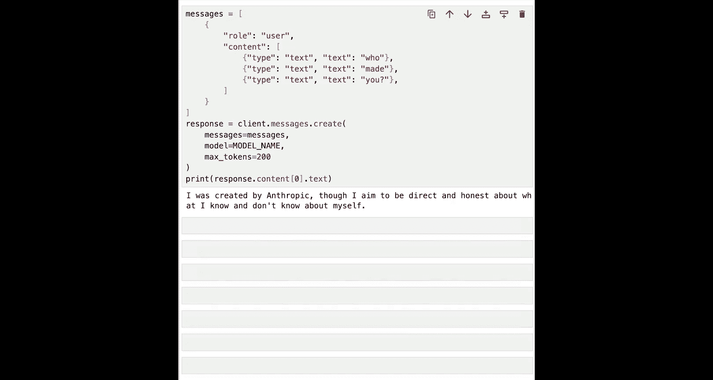
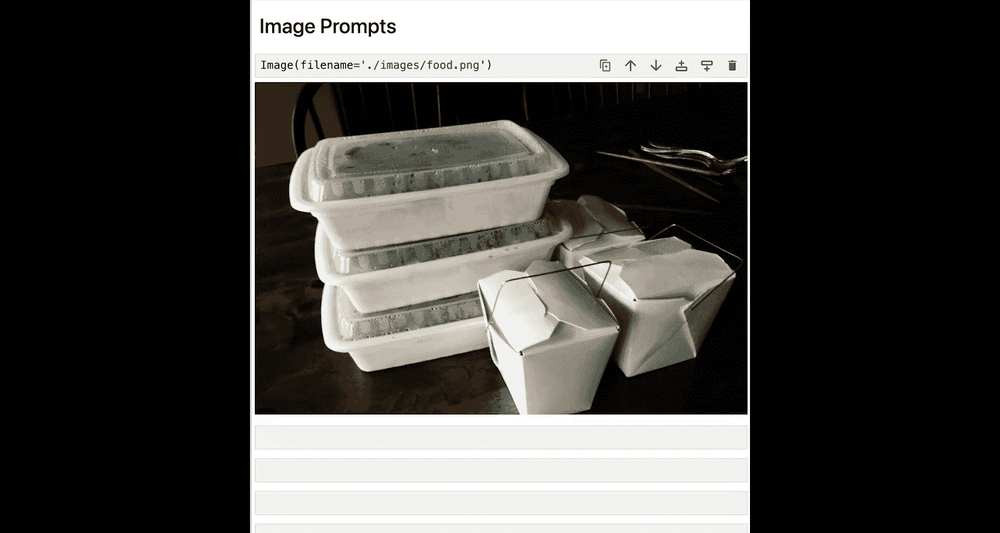
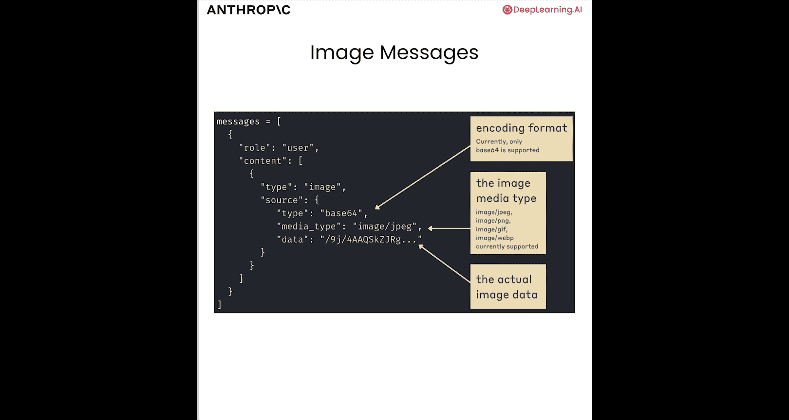
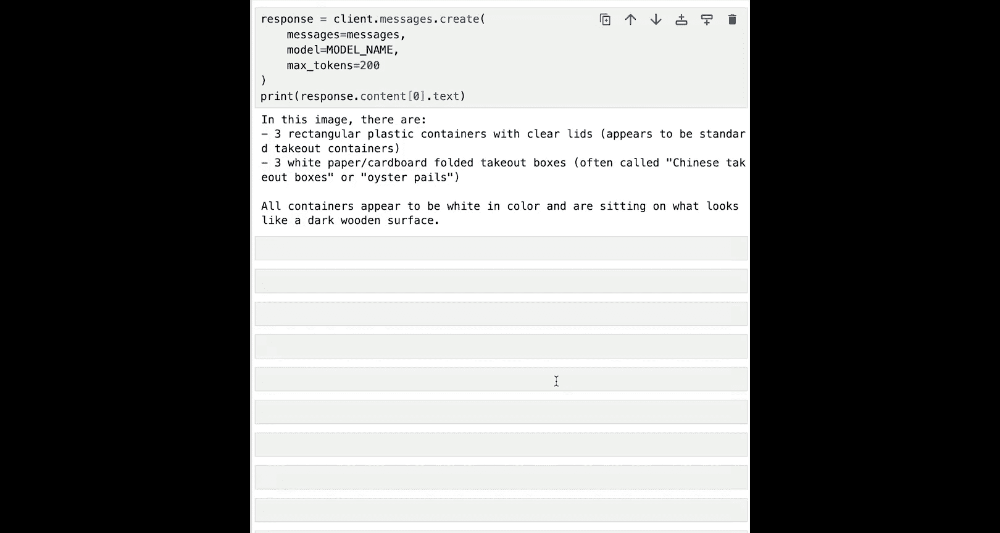
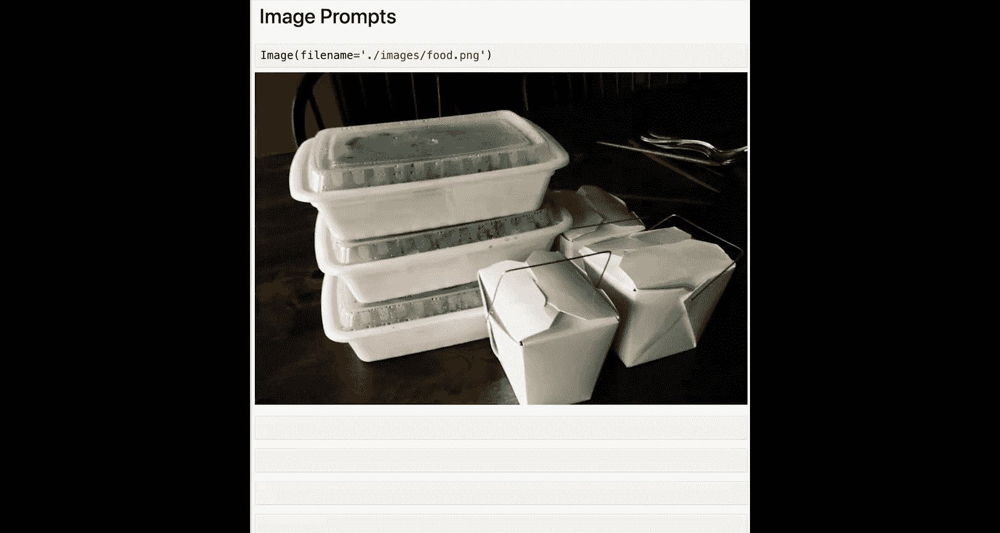
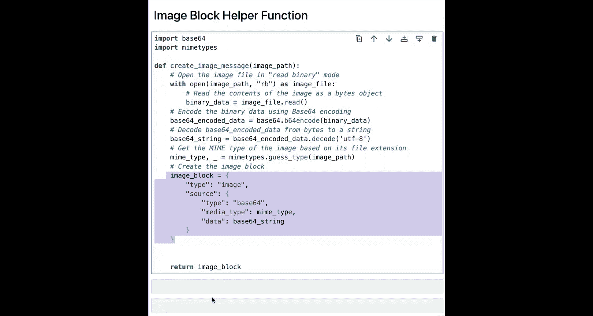
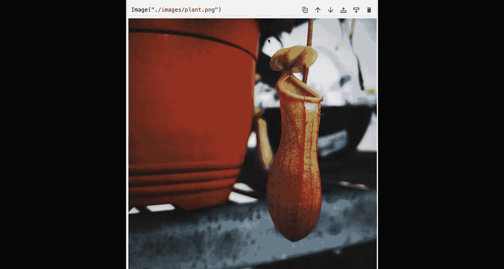
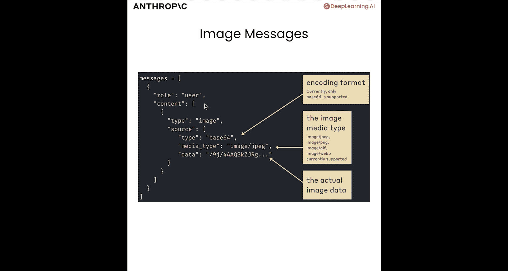
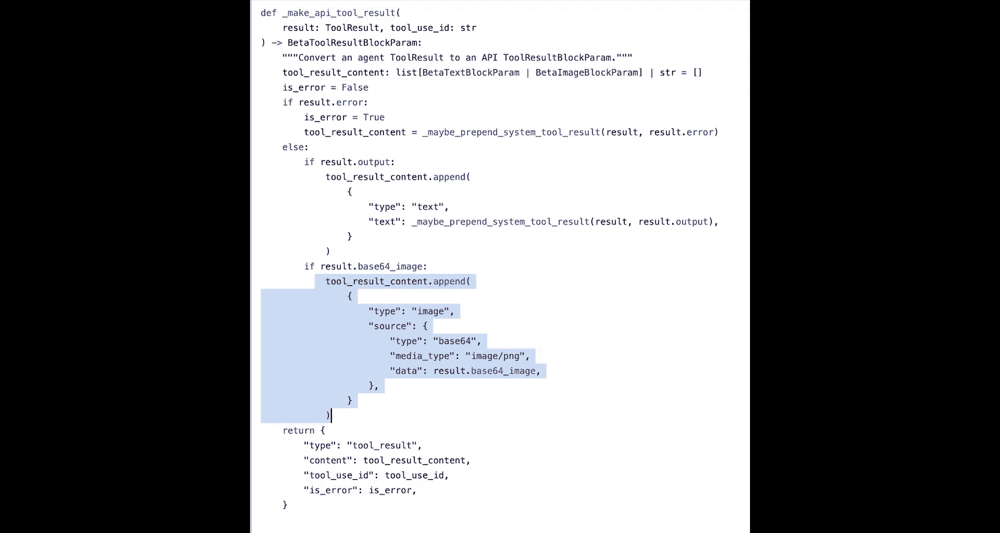

# 004：多模态提示与流式响应 🖼️💬


在本节课中，我们将学习如何构建结合图像和文本的多模态提示，并掌握如何处理API返回的流式响应。我们将从基础的消息结构讲起，逐步深入到图像处理和实时数据流。

---

## 消息结构回顾

上一节我们介绍了如何向模型发送简单的文本消息。本节中，我们来看看消息内容（`content`）更灵活的列表结构。

在之前的课程中，我们设置了一个消息列表，其中每条消息的`role`设为`user`，`content`设为一个字符串，例如“讲个笑话”。实际上，将`content`设置为字符串是以下语法的一种快捷方式：

```python
content = [{"type": "text", "text": "讲个笑话"}]
```

这里，`content`被设置为一个包含多个内容块的列表。目前，它只是一个类型为`text`的单一内容块。当我们仅进行文本提示时，使用字符串的快捷方式更简单。但接下来我们会看到，如果要提供图像，就需要使用内容块列表。

以下是一个包含多个文本块的示例消息：

```python
content = [
    {"type": "text", "text": "谁"},
    {"type": "text", "text": "创造"},
    {"type": "text", "text": "了你？"}
]
```

所有这些消息块在幕后被组合成一个单一的输入提示。

---

## 处理图像输入

现在，我们开始处理图像。我们的Claude模型可以接受图像作为输入。首先，我们需要准备一些图像进行处理。

假设我们运营一家食品配送初创公司，并使用Claude来验证客户的索赔。客户可能会发送截图说：“看，我只收到了一半的订单，要求退款。”我们将使用Claude来分析像下面这样的客户食品图像。


我们从简单的任务开始：让Claude告诉我们这张图片中有多少个餐盒和纸箱。





### 图像消息结构

包含图像的消息结构如下所示：


如图所示，我们有一个消息列表。其中一条消息的`role`设为`user`，`content`设为一个列表。在这个`content`列表中，我们有一个新的内容块类型——`image`块。其结构是：`type`设为`image`，`source`是一个字典，其中`type`设为`base64`，`media_type`设为图像类型（如`image/jpeg`或`image/png`），`data`则包含原始的图像数据。

### 准备图像数据



回到我们的代码，在创建消息之前，我们需要完成几个步骤来准备图像。

首先，读取图像文件。我们使用路径打开`food.png`文件。


然后，将图像内容读取为二进制对象。接着，使用base64对二进制数据进行编码。最后，将base64编码的数据转换为字符串。完成这些步骤后，我们就得到了一个很长的base64字符串。

### 构建并发送图像消息

现在，我们需要将这个包含正确格式图像数据的base64字符串放入一个格式正确的消息中，然后发送给模型。

以下是构建消息的代码：

```python
image_message = {
    "type": "image",
    "source": {
        "type": "base64",
        "media_type": "image/png",
        "data": base64_string  # 我们之前生成的长字符串
    }
}

text_message = {"type": "text", "text": "这张图片中有多少种不同类型的打包餐盒？"}

messages = [
    {
        "role": "user",
        "content": [image_message, text_message]
    }
]
```

我们发送这张装满食物的打包餐盒图片，并询问其中每种类型有多少个。然后，我们将这个消息列表发送给API。

运行后，我们得到了响应：“在这张图片中，有三个带透明盖的矩形塑料餐盒，以及三个白色纸质折叠外卖盒（通常称为中式外卖盒或牡蛎桶）。” 答案是正确的。回顾原图，确实有三个带塑料盖的餐盒和三个纸质外卖盒。

### 创建辅助函数

反复执行读取图像、转换为base64、编码为UTF-8字符串并添加到格式正确的消息中这些步骤，可能会有些繁琐。因此，创建一个辅助函数是个好主意。





以下是一个名为`create_image_message`的辅助函数，它整合了我们之前看到的功能：

```python
import base64
import mimetypes

def create_image_message(image_path):
    with open(image_path, "rb") as image_file:
        binary_data = image_file.read()
    base64_bytes = base64.b64encode(binary_data)
    base64_string = base64_bytes.decode('utf-8')
    mime_type, _ = mimetypes.guess_type(image_path)
    image_block = {
        "type": "image",
        "source": {
            "type": "base64",
            "media_type": mime_type,
            "data": base64_string
        }
    }
    return image_block
```




这个函数接收图像路径，执行上述步骤，猜测MIME类型，创建格式正确的图像块，然后返回它。

让我们用另一张图片试试。`images`目录中有一张`plant.png`的图片，这是一种猪笼草。


我们将使用定义好的函数，并询问模型识别这种植物。



```python
messages = [
    {
        "role": "user",
        "content": [
            create_image_message("images/plant.png"),
            {"type": "text", "text": "这是什么物种？"}
        ]
    }
]
```

运行后，我们得到响应：“这看起来是一种猪笼草，属于食虫植物……” 很好。这个辅助函数让事情变得简单了一些。你甚至可以进一步创建一个辅助函数来生成整个消息列表，只需提供图像路径和文本提示即可。

---

## 实际用例：文档分析

接下来，我们看一个许多客户正在使用Claude处理的更实际的用例：分析文档。

以这张名为`invoice.png`的发票为例，它包含大量重要信息。我们可以将其输入Claude，给出清晰的提示，并要求它以结构化数据（如JSON）的形式响应。这样，我们就能在几分钟内将数千张发票转换为JSON并存入数据库。

以下是单个示例的操作：

```python
# 使用辅助函数创建图像消息
image_block = create_image_message("images/invoice.png")
# 构建文本提示
text_prompt = {
    "type": "text",
    "text": "生成一个代表此发票内容的JSON对象。它应包含所有日期、金额和地址。仅用JSON本身响应。"
}

messages = [{"role": "user", "content": [image_block, text_prompt]}]
response = client.messages.create(model=MODEL_NAME, messages=messages, max_tokens=1024)
print(response.content[0].text)
```


我们得到了一个JSON响应，包含公司名称、地址、发票信息、账单接收方、物品清单以及总计金额。核对原图，所有这些信息都是准确的。

与识别植物物种相比，这是一个更贴近实际的图像提示用例。

### 多图像提示


需要说明的是，我们可以在单条消息中提供多张图像。回想一下，我们所有的内容块在输入模型时，本质上都被视为一个提示。因此，我可以在一条用户消息中组合多个图像块和多个文本提示块。`content`是一个列表，我只需将内容块添加进去，无论其类型是`image`还是`text`。

---

## 流式响应



本节课我们将涵盖的第二个主题是流式响应。

到目前为止，我们使用`client.messages.create`的方式效果很好。但如果我给出一个如“写一首诗”这样的提示，你会注意到，我们需要等待整个响应生成完毕才能得到结果。虽然时间不长（可能半秒或一秒），但我们是一次性获得整个生成内容。

当模型的输出较长时（比如用模型写一篇论文），在获得任何内容之前等待的时间会更长。在没有流式传输的情况下，我们需要等到整个输出生成完毕。

使用流式传输，我们可以做一些不同的事情：我们可以在内容生成的同时就获取到内容。这对于面向用户的场景非常有用，因为我们可以开始向用户展示正在生成的响应，而不是等到整个生成完成。

流式传输实际上并不会加快整体生成过程，它只是缩短了“首次令牌时间”，即你看到第一个响应迹象的时间。

代码略有不同，但非常相似：

```python
stream = client.messages.stream(
    model=MODEL_NAME,
    messages=[{"role": "user", "content": "写一首诗"}],
    max_tokens=1024
)

for text in stream.text_stream:
    print(text, end="", flush=True)
```


现在，我们遍历名为`stream`的对象中的`text_stream`，并打印出每一段文本。运行后，我们可以看到内容在生成的同时就返回了，而不必一次性等待整个内容生成。我们看到的是小块小块的内容逐个出现。

但再次强调，完成此生成所需的总时间保持不变。我们并没有神奇地比不使用流式传输更快地获得完整结果，我们只是在生成过程中逐步获得了输出的部分内容。

---

## 计算机使用示例

最后，我想再次通过我们“计算机使用”快速入门实现中的一个真实示例来结束本节。

这是一个执行多项操作的函数。如果你仔细观察，在突出显示的文本中，我们使用本节课早先讨论过的格式，附加了一个正确格式化的图像。


这些图像是我们提供给模型的屏幕截图。正如我们在介绍本课程计算机使用部分时所见，模型的工作原理是获取屏幕截图、分析截图，然后决定采取操作。因此，我们需要能够向模型提供图像，而我们使用的语法与本节课已经看到的完全相同：我们创建这些图像内容块。

这里的用例比识别植物复杂得多，但语法完全一致。

---

## 总结

本节课中，我们一起学习了如何构建多模态提示和处理流式响应。

1.  **消息结构**：我们回顾了消息内容可以是一个内容块列表，这为组合文本和图像提供了灵活性。
2.  **图像处理**：我们学习了如何读取图像文件，将其编码为base64字符串，并构建包含`image`类型内容块的消息，以将图像发送给Claude模型。我们还创建了辅助函数来简化这一过程。
3.  **实际应用**：我们探讨了图像提示的实际用例，如分析发票以提取结构化数据。
4.  **流式响应**：我们了解了如何使用`client.messages.stream`来获取实时生成的响应，这改善了用户体验，尤其是在生成长文本时。
5.  **综合应用**：我们看到了这些技术如何被集成到更复杂的“计算机使用”场景中，例如通过分析屏幕截图来指导自动化操作。



我们的工具箱正在逐步丰富。接下来，我们将讨论一些更复杂或更贴近现实世界的提示技巧。