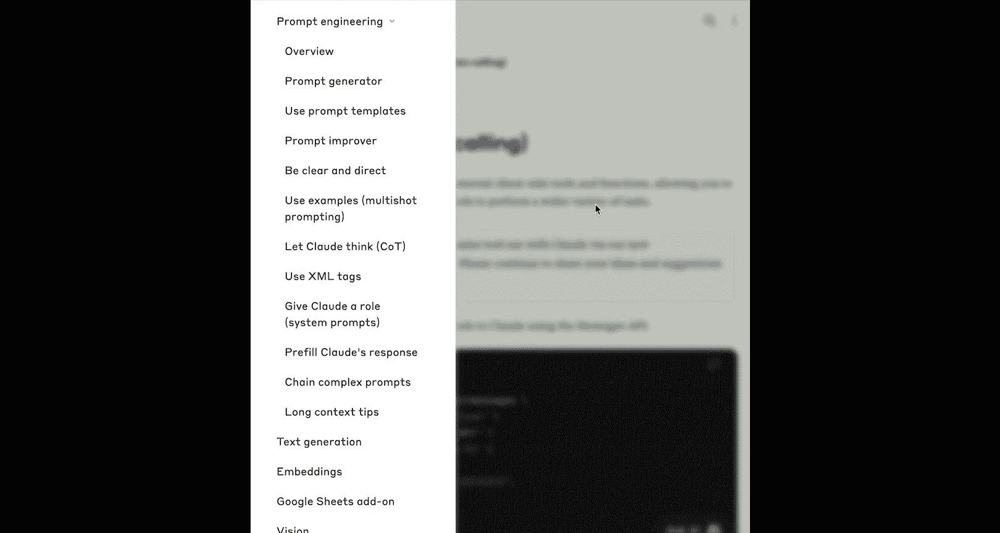
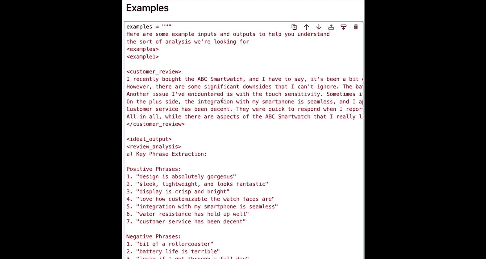
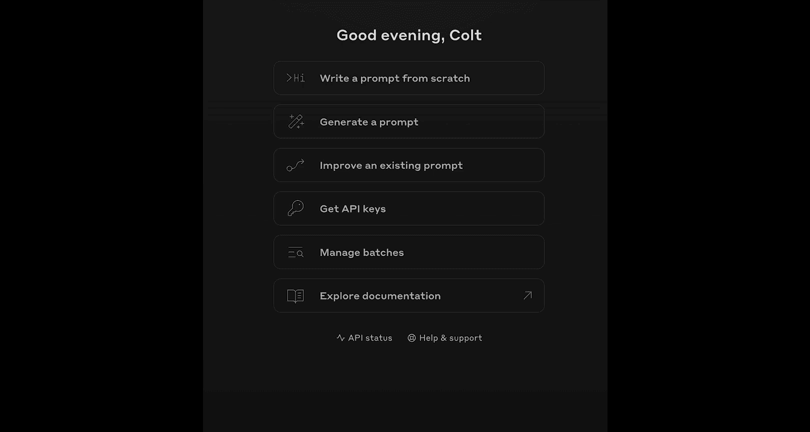
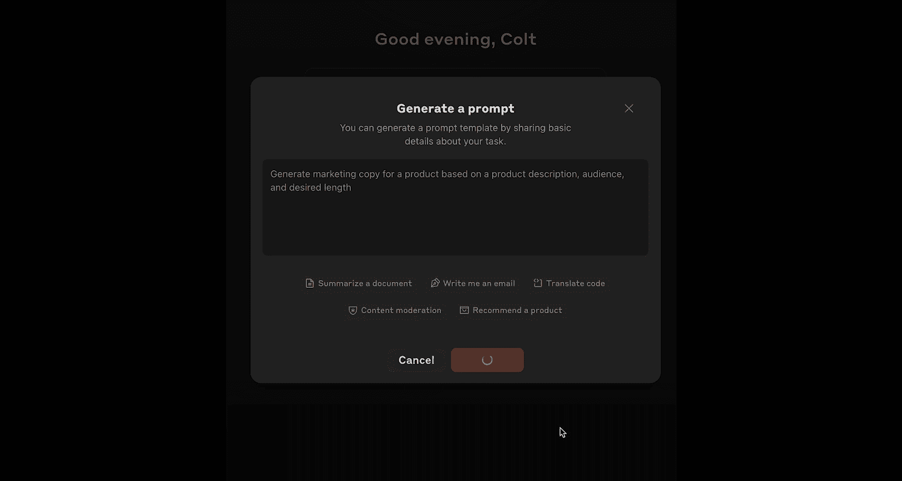
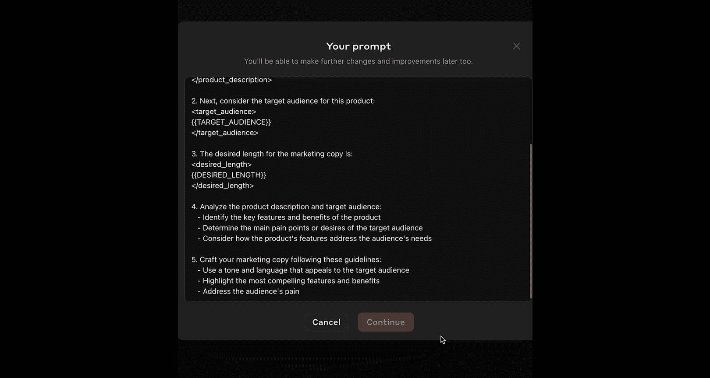
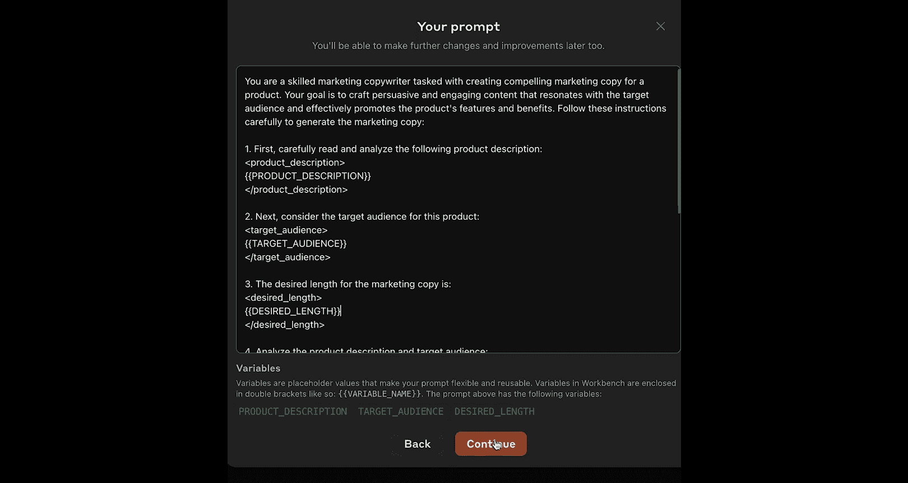
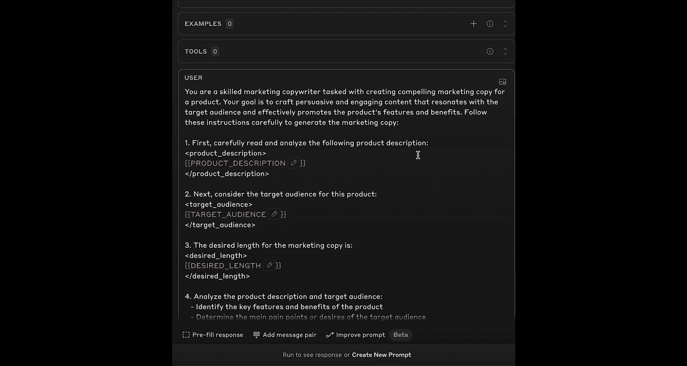

# 005：编写高质量提示词教程 🚀


在本节课中，我们将学习如何构建能获得一致、高质量回复的有效提示词。你将掌握在现实世界中真正重要的、经过验证的提示词技巧，并理解在聊天机器人（如Claude AI）上编写提示词与编写企业级、可重复使用的提示词之间的区别。

## 从聊天到生产：两种提示词的区别

上一节我们介绍了课程目标，本节中我们来看看编写提示词时面临的核心区别。主要焦点在于区分两种类型的提示词：一种是作为消费者或聊天机器人用户编写的提示词，另一种是大型客户或任何API客户编写的、需要可重复且可靠的提示词。

Anthropic文档中有一个关于提示词工程的章节，包含许多不同的技巧和策略。其中一些确实重要，但有些比另一些更重要。互联网上有很多关于提示词的内容，其中一些可能不太可靠。因此，我们将重点关注那些有实证支持的提示词技巧。



首先，我想展示一个例子来说明什么是消费者提示词，什么是真实世界的企业级提示词。

以下是一个潜在的聊天机器人或消费者提示词的例子，我可能会在Claude AI网站上输入：
```
help me brainstorm ideas for a talk on AI and education.
```
如果我满意结果，那就很好。如果不满意，我有无数次机会进行跟进，例如说：“哎呀，实际上你太关注AI了，对教育的关注不够。你能把它改成要点列表吗？你能用Markdown格式吗？”我可以一遍又一遍地跟进，有很大的回旋余地和容错空间。

现在，让我们看一个潜在的企业级提示词。我提前警告你，这个提示词相当长，无法在本视频中详细阅读和讲解。但这就是重点：我想让你看到这些提示词会变得很长、很复杂、有结构。创建这些提示词需要付出很多努力，而不仅仅是像与Claude AI对话那样，想出一个想法，然后再跟进另一个想法。

这是一个处理客户服务通话记录的提示词示例，它会生成JSON摘要。我们可能每小时甚至每分钟都要这样做数千次，例如，如果我们运营一个大型呼叫中心或拥有庞大的客户支持团队。

我们不会逐条讲解这个提示词，但我会留给你，以便你自行查看。这里面有一些东西我们稍后会提到。不过，我想强调的第一点是，对于企业级、可重复的提示词，我们真的应该把它们看作是**提示词模板**。我们有一个基本保持不变的大型提示词结构，其中包含一个或多个作为变量插入的动态部分。

在这个例子中，它以“分析以下客户服务通话并生成一个JSON对象。这是通话记录：”开始。然后在这一行，我们有一个占位符，实际上会在这里插入真实的通话记录。我们很可能会使用字符串方法动态地完成这个操作，用真实的记录替换这个占位符，然后成千上万次地重复这个过程。因此，我们更多地将其视为一个模板，而不是像考虑Claude AI提示词那样的一次性用例。

## 核心提示词技巧概览

回到幻灯片，我在这里列出了一些更重要的提示词技巧，并用粗体标出了我认为最重要或比其他任何技巧都更重要的那些。

其中之一是**使用提示词模板**，我们已经暗示了这个想法。其他技巧包括**让Claude思考**（也称为思维链），我们稍后会讨论；**使用XML结构组织你的提示词**，我们刚刚展示的提示词中已经看到了一点，但接下来几分钟我们也会重点讨论；以及**使用示例**。这些都是有真实数据支持、能证明其重要性的技巧。

现在，我想逐一讲解这些技巧，并尝试构建一个相对真实的提示词。它会变得有点长，提示词确实会包含大量文本和字符串。但我们将一步一步地构建。

我们将通过逐步构建一个更大的、真实世界或企业级的提示词来完成这个任务。我们将使用的想法是一个**客户评论分类和情感分析提示词**。假设我们经营一家虚构的电子商务公司Acme Company，我们有数百种产品和成千上万的客户评论。我们将使用Claude API来帮助我们理解这些评论的情感以及一些常见的投诉。

如果这是一个假设的评论：“我最近购买了XYZ智能手机。这是一次喜忧参半的体验。”它列出了一些优点和一些缺点。它说：“我期望的问题能少一些。”我希望Claude能够以可重复的方式告诉我，这是一个正面、负面还是中性的评论。并且我希望它能突出一些关键问题和反馈点。

具体来说，为了大规模处理成千上万的评论，我可能希望输出包含一些易于提取和处理的格式。通常，这会是**JSON**。也许是这样的：一个可重复的对象，总是包含一个情感分数（正面、负面或中性），在名为“sentiment_analysis”的键下有一些分析，然后列出实际的投诉，例如“性能滞后”、“性价比低”、“面部识别不可靠”等等。然后，我可以轻松地为成千上万的评论大规模地执行此操作，存储在数据库中，进行比较，制作图表，无论我想用这个可重复的输出做什么。

## 逐步构建企业级提示词

现在我们的任务已经定义：我们希望获取客户评论，并将其转换为包含情感分析信息和提取的客户投诉数据的JSON。我们将分部分完成，然后构建整个提示词。

### 1. 为模型设定角色

我们要讨论的第一个技巧是**为模型设定角色**。实际上，我对这个技巧的感觉没有那么强烈，所以我们会很快地过一遍。一个有用的做法是，一开始就给模型一个明确的角色和期望。

在这种情况下，它可能看起来像这样：
```
你是一位专门分析客户评论的AI助手。你的任务是确定给定评论的整体情感，并提取提到的任何具体投诉。请仔细遵循这些说明。
```
显然，这只是提示词的一部分。但我们正在设定角色或奠定基础，给模型一些关于它应该擅长什么的背景信息。

### 2. 提供明确的指令

下一步是**向模型提供实际的指令**。如果我们向上滚动，我们告诉模型“请仔细遵循这些说明”。现在，我们将给它一个非常清晰和直接的、有序的指令列表。

以下是第一个指令：
```
<instructions>
1. 审阅以下客户反馈：
<review>
{{customer_review}}
</review>
</instructions>
```
我们正在将其制作成一个提示词模板，我们实际上会在其中插入客户评论。你不必使用这些双花括号，你可以使用任何你想要的变量或占位符来替换。我们喜欢使用双花括号，但这绝对不是必须的。

另外，请注意我在这里使用了**XML标签**。这也不是必须的，但Claude模型往往与XML标签配合得很好。你可以使用任何语法或任何分隔符来告诉模型：“客户评论从这里开始，到这里结束。”有些客户评论可能很短，只有几句话，但对于一些非常不满或非常热情的客户，我们可能会看到数千个字符。因此，我们想清楚地告诉模型评论的开始和结束位置。

### 3. 实施“思维链”技巧

接下来要关注的是我们希望模型执行的实际步骤。我们已经提供了上下文并说“我们希望您审阅此客户反馈”。然后我们最终会在这里插入客户反馈。我们希望模型做什么？可能很想简单地说：“生成一个包含情感分数（正面、中性或负面）以及你提取的投诉列表的JSON。”这可能会奏效，在很多情况下很可能有效。

但我想在这里强调的一个提示词技巧是所谓的**让Claude思考**或**思维链**。本质上是告诉模型，在它做出决定或某种结论之前，我们希望它“大声思考”并输出一些分析来帮助它做出决定，然后最终做出判断。

以下是一个示例，说明这可能是什么样子。在变量指令的第二部分（另一个长字符串）中，我告诉模型这是你的第二步：
```
<instructions>
2. 一旦你审阅了客户反馈，请使用以下步骤分析评论：
   - 首先，在 <review_breakdown> 标签内展示你的工作。
   - 从评论中提取可能与情感相关的关键短语。
   - 考虑支持正面、负面和中性情感的论点。
   - 确定整体情感并说明你的推理。
   - 从实际客户评论中提取投诉。
   请彻底分解评论，此部分可以相当长。
</instructions>
```
这里有几件事我想强调。首先，这一行告诉模型在 `<review_breakdown>` 标签内展示其工作。再次强调，你不必使用XML，但模型（Claude系列模型）与XML配合良好。因此，一个常见的策略是告诉Claude将其输出的某些部分包含在特定的XML标签中，这样我们就可以告诉它在 `<review_breakdown>` 标签内进行“大声思考”，与实际分析分开。最终结果我们会告诉它放在某个单独的标签里。

我们告诉模型从提取可能与情感相关的关键短语开始。然后告诉模型考虑支持正面、负面和中性情感的论点。进行整体情感的实际确定并说明其推理。并从实际客户评论中提取投诉。然后我们告诉模型，此部分可以相当长，因为你彻底分解了评论。

现在，这并不是每个提示词都需要的东西。这可能会导致不必要的输出令牌，因为模型在实际生成最终结果或最终JSON分析之前，会生成一大堆“思考”。因此，这不是你需要立即转向的东西，但我在这里展示它，因为它是从模型获得更好结果的更强大技巧之一。

### 4. 定义最终输出格式

这引出了我们的下一组指令：关于我们想要的最终输出。因此，除了关于“思考”的指令之外，我们将在指令的第三部分告诉模型（记住，我们将所有这些部分组合成一个提示词）：
```
<instructions>
3. 生成一个具有以下确切结构的JSON输出：
   {
     "sentiment_score": "positive|negative|neutral",
     "sentiment_analysis": "详细分析文本...",
     "complaints": ["投诉1", "投诉2", ...]
   }
   将此JSON放在 <json> XML标签内。
</instructions>
```
我想得到一个情感分数（正面、负面或中性）、一个情感分析（这是更详细的分析）以及一个投诉数组。我希望这在 `<json>` XML标签内完成。再次强调，不必是XML，但我需要某种简单的方法来提取它。这是响应的核心。如果我成千上万次地重复这样做，我需要一种简单、可重复的方法来获取那个JSON。

最后，我以一些基本提醒结束：
```
<instructions>
注意：如果没有投诉，请使用空数组 []。
</instructions>
```

## 组装完整提示词并测试

现在我们有了提示词的所有部分，让我们把它们组合起来。我将创建一个最终的提示词变量，使用f-string，并动态插入我们提示词的各个部分。

以下是组合后的完整提示词示例（为简洁起见，此处为示意）：
```
你是一位专门分析客户评论的AI助手。你的任务是确定给定评论的整体情感，并提取提到的任何具体投诉。请仔细遵循这些说明。

<instructions>
1. 审阅以下客户反馈：
<review>
{{customer_review}}
</review>

2. 一旦你审阅了客户反馈，请使用以下步骤分析评论：
   - 首先，在 <review_breakdown> 标签内展示你的工作。
   - 从评论中提取可能与情感相关的关键短语。
   - 考虑支持正面、负面和中性情感的论点。
   - 确定整体情感并说明你的推理。
   - 从实际客户评论中提取投诉。
   请彻底分解评论，此部分可以相当长。

3. 生成一个具有以下确切结构的JSON输出：
   {
     "sentiment_score": "positive|negative|neutral",
     "sentiment_analysis": "详细分析文本...",
     "complaints": ["投诉1", "投诉2", ...]
   }
   将此JSON放在 <json> XML标签内。

注意：如果没有投诉，请使用空数组 []。
</instructions>
```

我的建议不一定是你必须像我这样分成单独的块来写。我只是为了更容易讨论和逐步讲解而将其分解。

现在，让我们看看我们的最终提示词。我已经把它打印出来了。现在我们要做的是编写一个函数，该函数接收一个客户评论，将其插入到这个提示词中，然后发送给Claude，最后提取JSON输出。

以下是一个名为 `get_review_sentiment` 的简单函数，它使用我们刚刚从小片段组装的最终提示词。它期望我们传入一个客户评论。然后，因为我们使用的是提示词模板，我们将用传入函数的实际客户评论替换我们的小占位符 `{{customer_review}}`。

然后我们向Claude发送请求。我们构建最终提示词，称之为 `prompt`，然后将其发送到消息列表中。然后我做两件事：第一件事，只是为了让我们知道它在工作，我打印出模型的整个输出，这允许我们看到思考过程。记住，我们告诉模型执行一些“大声”的思考和分析。然后我们将提取JSON标签之间的内容。我在这里使用正则表达式来帮助我完成这个。我搜索 `<json>` 开始标签和 `</json>` 结束标签之间的任何内容。如果你记得，当我们构建这个提示词时，我们告诉模型“生成一个遵循此结构的JSON输出。在JSON XML标签内，放入你的JSON。”我们这样做，然后我们将打印出最终的JSON输出，这才是我们真正想要的。然后，如果由于某种原因我们没有找到它，我们会打印“出现错误或响应中没有情感分析”。

让我们用一个非常简单的评论来试试。我现在就写一个非常简单的。好的，这是一个非常简单的评论：“我爱死我的AcmePhone了。太不可思议了。有点贵。但物有所值。我喜欢它的颜色。”相当正面。

让我们用我们的函数 `get_review_sentiment` 和我们的第一个评论来运行这个。好的，我来运行这个单元格。我们将看到我们的响应被打印回来。它提取关键短语，进行“大声思考”，这是一些积极的东西，这是一些消极的东西，这是分析，整体情感，投诉，实际上只有一个：“有点贵”。最后，在底部，我们可以看到我们提取的实际JSON。所以情感分数是正面的。这是分析。这是投诉。没有很多投诉，只是“有点贵”。

这是另一个评论，更长一些，更混合一些，列出了更多问题。我们不会一起阅读它，但这可能更接近某人可能写的评论。现在，让我们尝试通过模型运行这个。我将为我们的 `review_two` 变量运行这个。这次，我们又得到了输出，相当多的输出。它提取了积极短语、消极短语，它自己进行了分析，有点矛盾，是混合的，但它说消极方面超过了积极方面。这也给了我们一种追踪，我们可以理解为什么Claude生成了某个输出，这是让它“大声思考”的另一个优势。然后它提取投诉，最后，它给了我JSON输出，我可以提取并用它做点什么，存储在数据库中，并重复这个过程数万次。

## 补充技巧：使用示例（少样本提示）

我选择不展示的一个技巧是**使用示例**，也称为**少样本提示**，因为它往往会变得非常庞大和冗长。这里的想法是，我们可以在提示词中向模型展示相应的输入和输出作为示例。

以下是一个可能的样子示例。它相当长，在这个例子或这个特定的提示词中不是必需的。但如果你试图让模型做一些它难以完成、不准确或不遵循正确格式的事情，这是首选策略之一。

我们在这里做的是告诉模型：“这里有一些输入和输出的例子，以帮助你理解我们正在寻找的分析类型。”然后我简单地说：“这里有一些在XML标签内的例子。这是第一个例子：这是一个作为输入的客户评论。这是你应该给我的理想输出。”正如你所看到的，它变得相当长，因为在这种情况下理想输出很长。而这只是一个例子。在现实世界中，当你在提示词中提供示例时，你通常希望涵盖许多不同的情况。所以在这种情况下，至少需要一个正面评论、一个负面评论、一个中性评论，也许是一个边缘情况，比如没有评论、评论为空或评论是另一种语言。我们想涵盖我们的基础。因此，编写这些生产级别的提示词真的需要很多工作。

## 工具推荐：Anthropic控制台的提示词生成器

最后，我们来看看Anthropic控制台的提示词生成器工具。这不是完成本课程所必需的，但这个工具可以帮助你完成编写真实生产级提示词的前75%的工作。





例如，我点击“生成提示词”。也许我需要帮助生成的提示词是一个营销文案生成器，我传入诸如产品描述（要点形式）、可能一张图片、我希望触达的受众以及期望长度等信息。也许我正在尝试写一条推文、一篇博客文章或一则广告。我想要帮助生成营销文案。所以我点击生成。我们将得到一个生成的提示词。它使用了一些流式传输（我们之前介绍过），你可以看到它流式传入。这个提示词，如果我们仔细看，将包含诸如提示词变量之类的东西，我可以在其中插入产品描述、目标受众和期望长度。然后我可以决定使用这个提示词。我可以改进提示词，我也可以向上滚动并实际添加示例，这些示例将被动态添加到提示词中。





这是一个工具，它使编写这些长提示词的初始痛点变得容易得多。它仍然不会按需给你一个完美的提示词，但比从空白页开始要好得多。

## 总结





本节课中我们一起学习了如何构建有效的企业级提示词。我们探讨了消费者提示词与企业级可重复提示词之间的关键区别，后者通常作为模板使用，包含动态变量。我们介绍了几个核心技巧：为模型设定角色、提供清晰指令、使用XML结构组织提示词、实施“思维链”技巧让模型展示推理过程，以及定义结构化的输出格式（如JSON）。我们还通过构建一个客户评论情感分析提示词的完整示例，演示了如何将这些技巧组合应用。最后，我们了解了使用示例（少样本提示）的威力以及Anthropic控制台的提示词生成器工具如何辅助初始构建。记住，编写生产级提示词需要细致的工作，但遵循这些经过验证的技巧将帮助你获得更一致、可靠的结果。