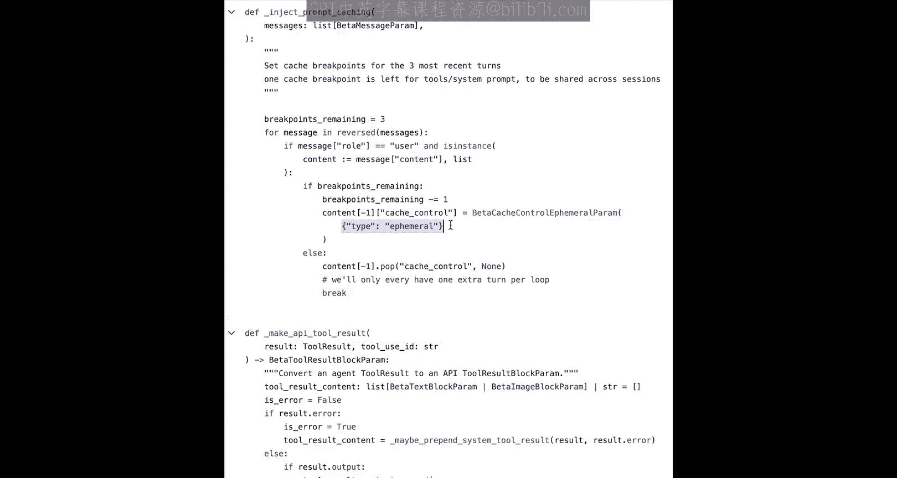

# 006：提示缓存

在本节课中，我们将学习如何使用提示缓存功能。这是一种强大的优化技术，可以显著降低API调用成本和延迟，尤其适用于处理长提示或重复性任务的场景。

## 概述

提示缓存允许我们将提示中保持不变的前缀部分缓存起来，在后续的API调用中重复使用，从而避免重复处理相同的令牌。这可以大幅减少处理时间和费用。

上一节我们介绍了基本的API调用，本节中我们来看看如何通过缓存来优化这些调用。

## 什么是提示缓存？🤔

提示缓存是一项功能，旨在通过允许从提示共有的特定前缀处恢复处理，来优化API使用。

简而言之，我们可以将那些在多次API调用间保持一致的提示前缀内容缓存起来。这能极大地减少处理时间和成本，尤其适用于重复性任务或重用固定前缀元素的提示。

为了更好地理解其工作原理，我们先来看一些示意图。

左侧是一个假设的提示，用形状表示。这是我们准备发送的请求，初始时没有任何内容被缓存。我们将这个请求发送给API进行处理。假设我们决定缓存发送给API的所有内容。

此时，我们已将第一个请求中的整个提示前缀存储在缓存中。在后续请求中，我们有一个更长的提示。它包含了与第一个请求完全相同的前缀，但后面附加了许多新内容。

现在，API无需再处理整个提示。我们已经缓存了上一轮的前缀。因此，当我发送这个新请求时，将会发生缓存命中。我们将从缓存中读取数据，这意味着我们不必重新处理所有这些令牌。根据令牌数量的多少，这可以为我们节省大量时间。如果我们反复重用这些内容，还能节省大量资金。

然后，我们可以向缓存写入更多内容，并持续这个过程。随着对话的增长，我们可以选择增量地添加到缓存中，或者只缓存提示中某个特别长的部分。

## 实践：无缓存调用

回到你的笔记本中，我们使用相同的基本设置：导入Anthropic库、设置客户端，并定义模型名称字符串变量。

为了最直观地看到提示缓存的效果，我们将对比使用和不使用缓存的情况。我们将使用一个非常长的提示——整本玛丽·雪莱所著的《弗兰肯斯坦》的文本，该文本保存在一个名为 `Frankenstein.txt` 的文件中。

第一步是打开这个文件，将其内容读入一个变量，我们称之为 `book_content`。`book_content` 将是一个非常长的字符串。

以下是该内容的一小段切片，以便查看书籍的部分内容。

下一步是将整本书连同一些提示（例如“第三章发生了什么？”）一起发送出去。任何与《弗兰肯斯坦》相关的简单提示都可以。所有这些都封装在一个名为 `make_uncached_api_call` 的函数中。

你会看到函数内部有一些计时逻辑，用于在请求发送前后启动计时器，以计算从发送请求到收到响应之间的时间差。

最后，函数返回整体响应以及时间差。需要明确的是，这个版本完全不使用任何缓存。

高亮显示的行是提供整本书内容（那个巨大的字符串）的地方。注意，它被包裹在 `<book_xml>` 标签内。这不是必需的，但这是一个很好的方式，用于向模型标示出这个庞大文档的范围。最后是问题“第三章发生了什么？”，它与实际的书籍内容是分开的。这样我们就界定了这本巨著的边界。

接下来是调用这个函数。这行代码调用函数，下一行打印出所花费的时间，再下一行打印出从模型返回的实际内容。

运行这个单元格并等待。这是一个非常长的提示，所以可能需要一段时间。

响应返回了。在这个特定实例中，它花费了 **17.77 秒**，同样，没有涉及任何缓存。

这是实际的响应内容。坦白说，在这个函数中，响应内容是最不重要的部分。更重要的是关注时间元素以及实际的使用量。

你可以看到处理了相当多的输入令牌：**108,000 个输入令牌**，接着是 **324 个输出令牌**（这只是生成过程中使用的令牌数量），以及 **0 个缓存创建输入令牌**和 **0 个缓存读取令牌**，因为我们尚未涉及任何缓存。

## 实践：使用缓存调用

现在，你可以继续学习实际利用我们显式缓存API的缓存版本。

这是一个函数，几乎与上一个函数完全相同，只是它被命名为 `make_cached_api_call` 而不是 `uncached`。这里有一个非常重要的新增部分。

在这个提供庞大书籍内容的内容块中，现在有一个 `cache_control` 属性（或键），其值被设置为一个字典 `{"type": "ephemeral"}`。任何时候，当你想要设置一个缓存点——即告诉API“我想缓存到此为止的所有输入令牌，以便下次重用”——你都需要这个标签。我们的API会执行此操作。它需要查找这个标签，标签必须存在，API才能知道我们想要写入缓存。

现在，当你第一次运行这个函数时，它仍然需要很长时间。因为我们尚未写入任何缓存，所以不会有任何缓存命中。你可以执行它。同样，由于尚未缓存任何内容，它需要一段时间。

但作为此请求的一部分，直到此 `cache_control` 点之前处理的输入令牌将被缓存。

运行完成了。这是你可能得到的响应，即模型实际生成的所有内容。但就我们的目的而言，下面这部分是最重要的。

我们看到这次的输入令牌数仅计为 **11**，输出令牌数为 **324**，而**缓存创建输入令牌数**为 **108,427**。现在已有大量令牌存储在缓存中。

下一步是尝试从缓存中读取。回到你之前运行的 `make_cached_api_call` 函数。这个 `cache_control` 标签实际上具有双重作用。

第一次我们的API遇到它时，它将执行到此点的缓存写入，即将所有108,000个令牌写入缓存。

在后续请求中，当它再次遇到这个 `cache_control` 点时，它将查看是否有任何内容缓存到此点，本质上充当一个读取点。因此，它具有双重目的：既是写入点，也是读取点。

所以，你可以发送完全相同的函数，再次运行相同的函数调用，向API发送完全相同的请求。这次它将充当读取操作。

再次运行这行代码，使用新的变量名 `response2` 和 `duration2`。

运行完成后，你可以查看 `response2` 的 `usage` 属性，注意到**缓存创建输入令牌**为 **0**，因为没有执行任何写入缓存的操作。**缓存读取输入令牌**为 **108,000** 个令牌。

与上一轮比较：上一轮缓存创建输入令牌为108,000，缓存读取为0。请求结构完全相同，消息也相同。但这一次，发生了缓存读取。虽然没有写入缓存，但从缓存中进行了大量读取。

如果我们查看 `duration2`，是 **6.2 秒**。与完全未缓存的版本（17秒）相比，提示基本相同。这里有一个小区别：这个版本问的是“第三章发生了什么？”，而那个版本问的是“第五章发生了什么？”，但提示的基本长度相同，只是结尾的数字不同。所以是 **17.7 秒** 对比 **6.2 秒**。

这还没有考虑成本节省。接下来我们来谈谈这个。

## 定价与成本节省💰

提示缓存的定价方式非常直接。本质上，写入缓存需要支付少量溢价：**缓存写入令牌比常规基础输入令牌贵 25%**。

但显著的优点在于缓存读取：**从缓存中读取的令牌比未缓存的基础输入令牌便宜 90%**。

而实际的输入和输出（任何未缓存的部分以及生成的任何输出）仍然按照标准价格计费。

这意味着，可能没有必要为每条消息缓存所有内容。但是，如果你有一个提示前缀，它在一大批请求中保持不变，那么缓存这个长前缀并重复使用会非常高效且具有成本效益：支付一次 25% 的溢价进行缓存写入，然后在所有后续获得缓存命中的请求中，为这些输入令牌支付减少 90% 的费用。

## 缓存生命周期与注意事项

关于缓存命中，有一点需要注意：**缓存不会永久存在**。每个缓存都有一个 **5分钟的生命周期（TTL）**。目前我们至少支持临时性（ephemeral）缓存。每次从缓存读取时，都会重置这个5分钟的计时器。

因此，这实际上也取决于你的使用场景、你如何使用缓存以及你发送的提示类型。但任何时候，只要你有一个很长、想要节省成本的提示，并且你重用了该提示的很多部分，你就可以使用提示缓存。

提示缓存的一个常见难点是多轮对话缓存。想象你有一个很长的对话，可能是一个涉及《弗兰肯斯坦》这本书的对话，模型收到了整本书的文本，并且围绕它进行了长时间的讨论。这里有一个很长的公共前缀应该被缓存以节省令牌，特别是当对话有几十轮或几百轮且每轮都很长时。

你可以做的是将对话作为一个整体进行缓存。通过设置一个 `cache_control` 点（记住，它既可以作为写入点——“将此点之前的所有内容写入缓存”，也可以作为读取点——“尝试从缓存读取”），在处理多轮对话时，你可以使用两个 `cache_control` 点，并随着对话的进行不断向下移动它们，这样你就能始终缓存最新的用户消息，并在倒数第二条用户消息上设置一个 `cache_control` 点。

为什么要这样做？它是如何工作的？这又回到了其双重目的性。

想象这是一个有数百条消息的非常长的对话。这个 `cache_control` 点（假设在倒数第二条用户消息上）很可能会从上一轮获得读取命中（因为上一轮它曾是最后一条用户消息，然后我们得到了响应，接着它被写入缓存）。现在它充当读取点，将会发生缓存命中。

然后，在对话的最末尾，这个新的 `cache_control` 点（在最后一条用户消息上）充当新的写入点，告诉API：“将到此为止的所有内容写入缓存。”

然后你继续这个模式。如果对话增长（正如这个消息列表所示），也是同样的模式：在倒数第二条用户消息上放置一个 `cache_control`，在最后一条用户消息上放置一个 `cache_control`。

同样，这告诉API：写入到此点（最后一条消息）的所有内容（这是新的），并从此点（倒数第二条消息）读取所有可能的内容（因为这条“告诉我更多关于火星”的消息，之前曾是最后一条消息）。

你继续这种将这两个 `cache_control` 点沿着对话向下移动的模式：始终在最后一条用户消息和倒数第二条用户消息上设置，以便持续从最新的缓存中读取，并写入到对话的末尾，以便下次可以从中读取。如此反复进行。

这一点有时会让人困惑，我们的文档中也有说明，当然，这个笔记本里也有。这里我没有发出任何请求，这只是一个你可以参考的消息列表示例。但再次强调，它确实容易让人出错。

## 与计算机操作的关联💻

最后，将内容联系回计算机操作。这是我们从过去几节课中反复查看的“计算机操作快速入门演示”中的一个小片段。

我只想强调，我们确实使用了缓存控制。`cache_control` 被设置为 `{"type": "ephemeral"}`，以缓存与模型交互的漫长消息历史，其中包含大量截图（这可能占用相当数量的令牌）。因此，如果这个模型正在执行操作，假设是一个两、三或四分钟的交互，期间它尝试某些操作、进行截图，并且有10张不同的截图以及大量不同的工具调用（我们尚未讨论），那么缓存可以显著减少实际计算机操作使用的时间和成本。

稍后我们将有机会更仔细地查看这段代码。这里主要是向你展示：看，缓存不仅在我们的教学笔记本中是真实的，在实际应用中也同样如此。

## 总结

本节课中，我们一起学习了提示缓存的核心概念与实践。我们了解到，通过使用 `cache_control` 参数并设置 `{"type": "ephemeral"}`，可以将长提示中不变的前缀缓存起来。首次调用执行缓存写入（成本增加25%），后续调用则可实现缓存读取（成本降低90%），并能显著降低响应延迟。我们还探讨了在多轮对话中移动缓存点的模式，以及缓存5分钟TTL的特性。这项技术对于处理长上下文、重复性提示或像计算机操作这类包含大量固定内容（如截图历史）的场景，能带来极大的效率和成本优势。