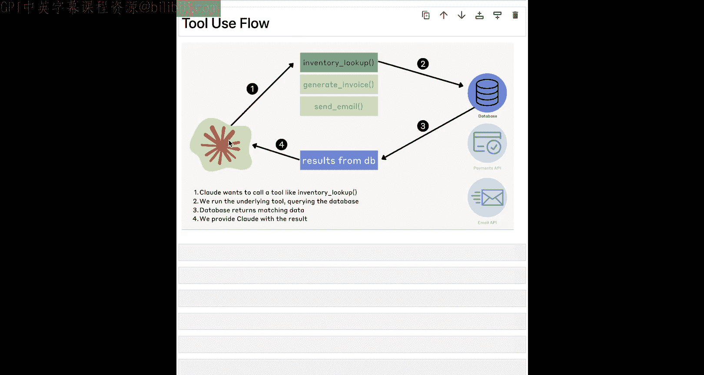
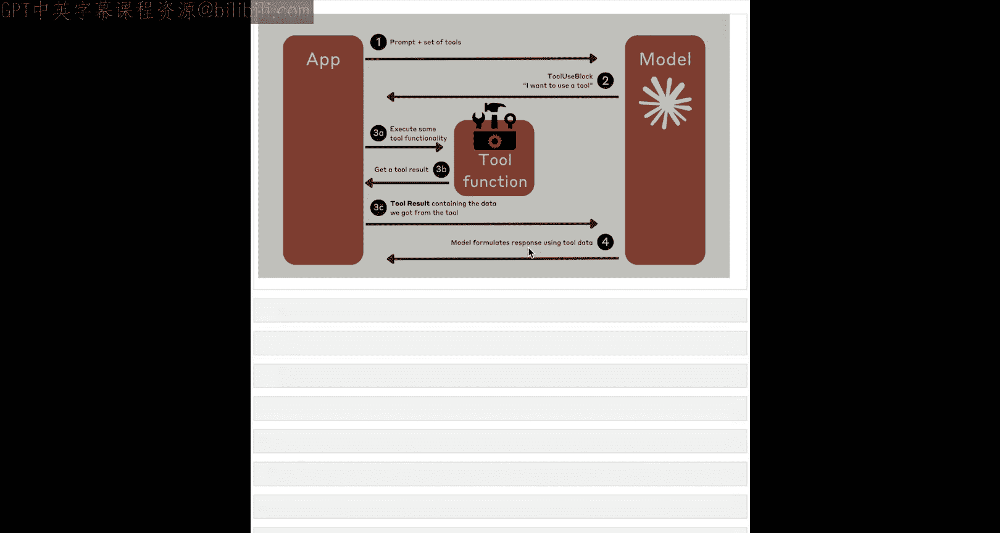
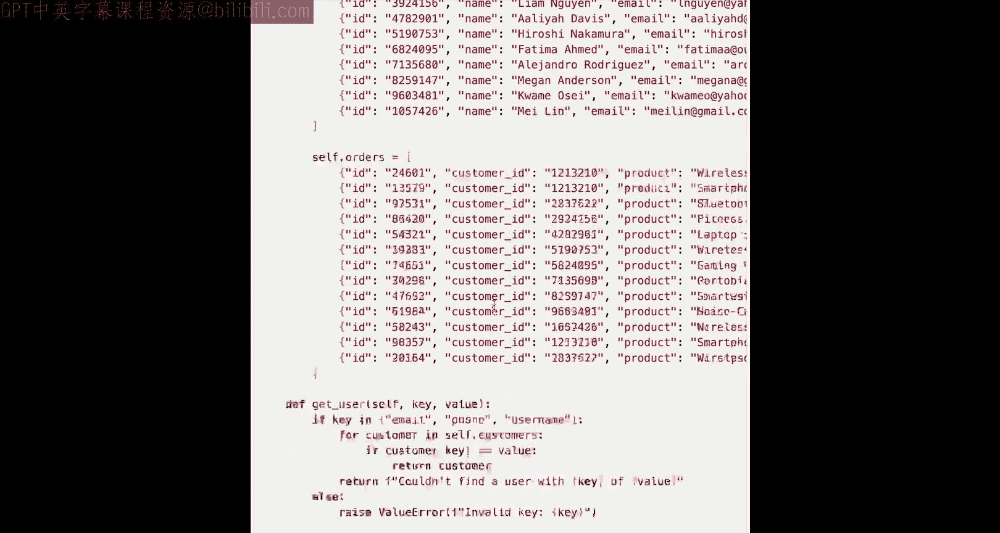
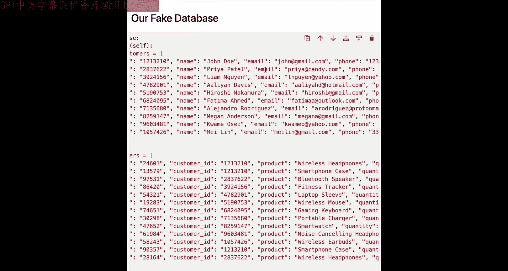
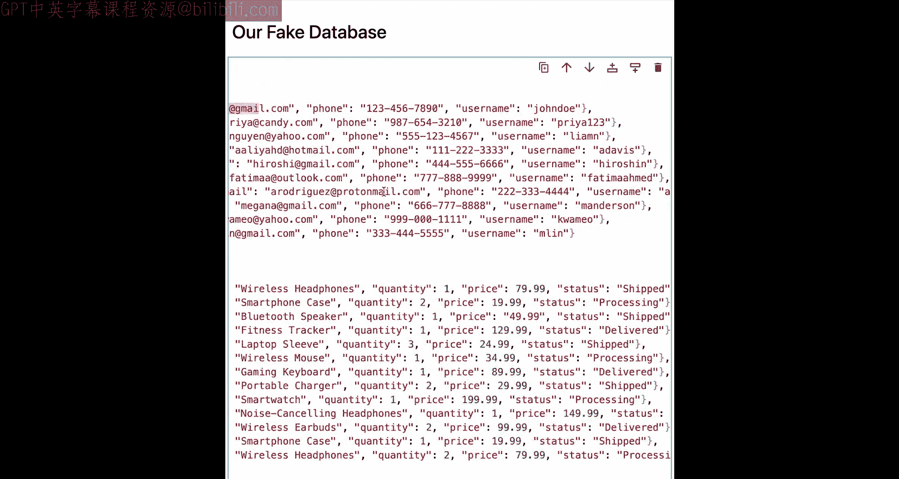
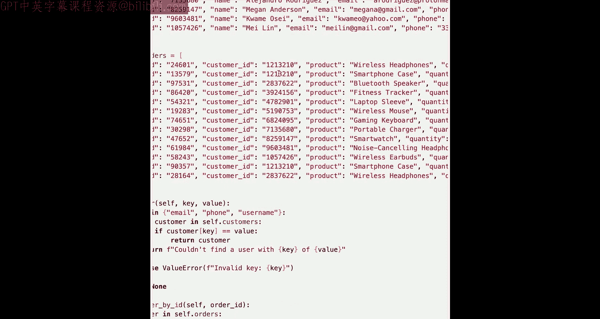
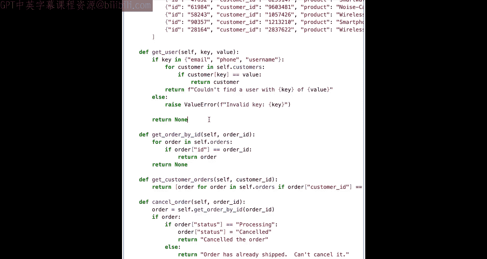
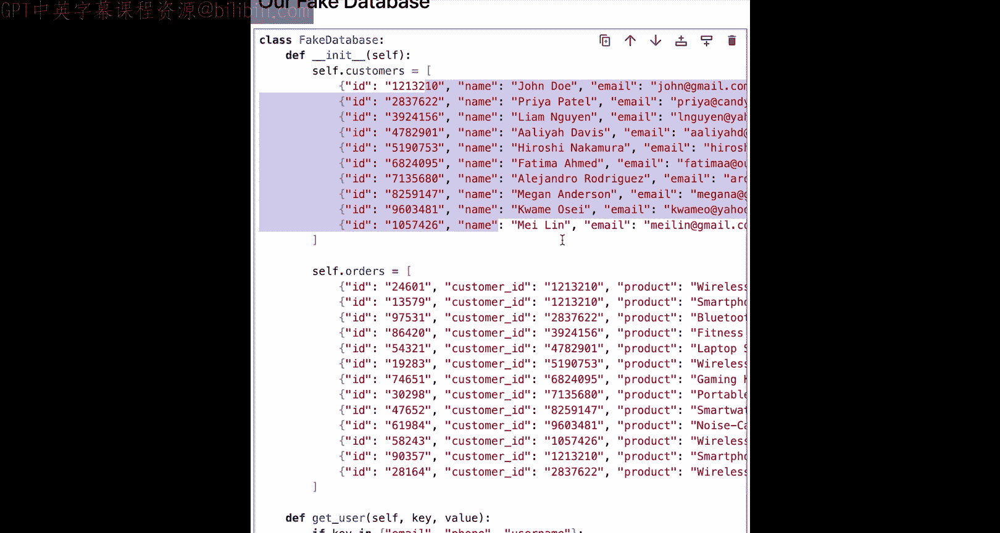
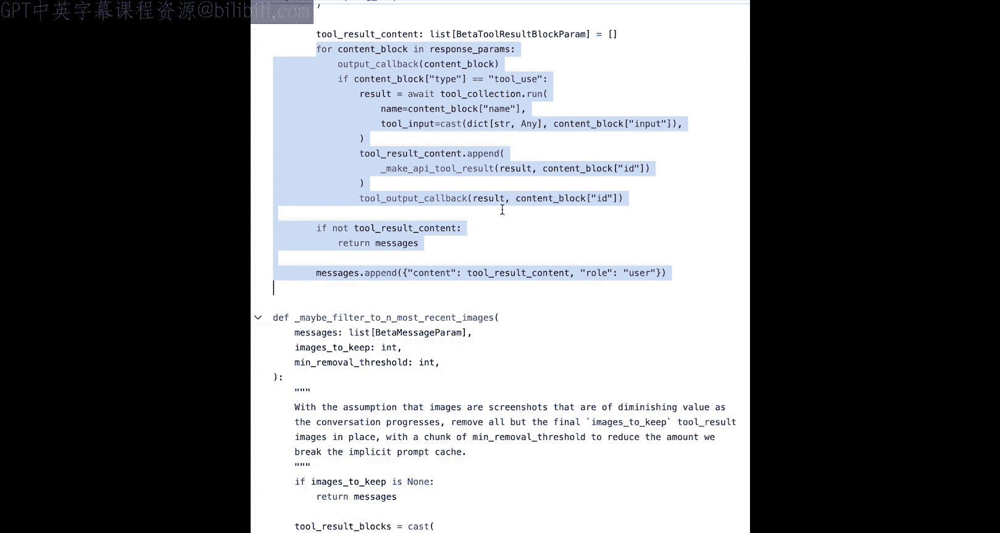

# 007：工具使用 🛠️


在本节课中，我们将学习Claude模型的核心功能之一：工具使用。我们将了解什么是工具使用，为什么它很重要，并从头到尾学习如何定义自己的工具以及实现基于工具的工作流。

## 什么是工具使用？

上一节我们介绍了课程概述，本节中我们来看看工具使用的核心概念。

工具使用，也称为函数调用，本质上是扩展Claude模型固有能力的一种方式。我们可以为Claude提供一组外部工具或函数，允许模型在需要时调用它们。更具体地说，模型本身只是请求调用一个工具或函数，而实际的调用和执行则由我们来完成，然后将结果返回给模型。

**核心流程**可以概括为：
1.  模型请求调用工具。
2.  我们执行该工具。
3.  我们将结果告知模型。
4.  模型根据结果继续其任务。

## 为什么工具使用很重要？



工具使用极大地扩展了Claude模型的应用场景。我们可以将常规的文本或图像提示与对外部函数的调用结合起来。这使得模型能够完成许多其自身无法独立完成的任务，例如：
*   检索动态数据。
*   查询内部数据库。
*   与API交互。
*   执行代码。
*   搜索网络。
*   控制计算机（这是本课程最终目标的基础）。

## 工具使用的工作流程

为了理解工具使用的具体步骤，我们需要查看其详细的工作流程。









以下是工具使用的基本步骤：
1.  **定义工具**：首先，你需要拥有一组希望提供给模型的工具。
2.  **格式化工具**：其次，你需要以正确的格式（JSON Schema）定义这些工具，并告知模型。
3.  **处理交互**：最后，你需要理解来回交互的流程，以及将工具结果返回给模型的正确格式。

## 一个简单的示例：客户支持聊天机器人



为了将理论付诸实践，我们将构建一个简单的客户支持聊天机器人示例。我们将使用一个模拟数据库来替代真实数据库，以简化操作。

### 模拟数据库

我们假设运营一家名为“Acme Corporation”的公司。这个模拟数据库类包含客户和订单信息。



```python
# 示例：模拟数据库结构（非实际代码，仅为说明）
class FakeDatabase:
    customers = [
        {"customer_id": 1, "username": "john_doe", "email": "john@gmail.com"},
        {"customer_id": 2, "username": "priya123", "email": "priya@example.com"}
    ]
    orders = [
        {"order_id": 101, "customer_id": 1, "product": "Widget", "status": "shipped"},
        {"order_id": 102, "customer_id": 2, "product": "Gadget", "status": "processing"}
    ]

    def get_user(self, key, value):
        # 根据邮箱、电话或用户名查找用户
        pass
    def get_customer_orders(self, customer_id):
        # 根据客户ID查找订单
        pass
    def cancel_order(self, order_id):
        # 取消指定订单
        pass
```



### 定义工具模式

要让Claude使用这些数据库方法，我们需要将它们定义为工具。这需要使用JSON Schema格式来描述每个工具。

以下是`get_user`工具的JSON Schema定义示例：

```json
{
  "name": "get_user",
  "description": "根据邮箱、电话或用户名查找用户信息。",
  "input_schema": {
    "type": "object",
    "properties": {
      "key": {
        "type": "string",
        "enum": ["email", "phone", "username"],
        "description": "查找依据的字段类型。"
      },
      "value": {
        "type": "string",
        "description": "与key对应的具体值，例如邮箱地址。"
      }
    },
    "required": ["key", "value"]
  }
}
```

我们需要为所有四个方法（`get_user`, `get_order_by_id`, `get_customer_orders`, `cancel_order`）创建类似的模式定义，并将它们放入一个工具列表中。

### 与模型交互

定义好工具后，我们就可以在调用模型时将其传入。

```python
# 示例：调用模型并传入工具列表
response = client.messages.create(
    model="claude-3-sonnet-20240229",
    max_tokens=1024,
    messages=[{"role": "user", "content": "我的用户名是priya123，请帮我查看订单。"}],
    tools=tools_list  # 这里传入我们定义好的工具列表
)
```

模型在分析用户请求后，可能会决定调用工具。它的响应中会包含一个`tool_use`块，指明它想调用哪个工具以及传入什么参数。

### 执行工具并返回结果

当我们收到模型的工具调用请求后，需要执行相应的函数，并将结果以特定格式返回给模型。

以下是处理工具调用和返回结果的核心逻辑：

```python
# 1. 执行工具调用
def process_tool_call(tool_name, tool_input):
    # 根据 tool_name 调用对应的数据库方法，例如 db.get_user(...)
    result = call_database_function(tool_name, tool_input)
    return result

# 2. 将工具结果返回给模型
# 我们需要在对话历史中添加一条新消息
new_message = {
    "role": "user", # 注意：这里是“user”角色
    "content": [
        {
            "type": "tool_result",
            "tool_use_id": tool_use_id_from_model, # 必须与模型请求中的ID匹配
            "content": tool_execution_result
        }
    ]
}
# 然后将这条消息加入messages列表，再次调用模型
```

### 构建完整聊天循环

将以上步骤整合，就形成了一个支持工具调用的完整聊天机器人循环。其核心逻辑是：
1.  接收用户输入。
2.  将包含所有历史消息和工具列表的请求发送给模型。
3.  检查模型响应。如果它想调用工具，则执行工具并将结果作为新消息加入历史。
4.  如果模型直接生成文本回复，则将其展示给用户。
5.  重复此过程。

## 连接到计算机使用

工具使用是实现计算机控制的基础。在计算机使用的快速启动实现中，我们导入了一系列计算机操作工具（如点击、移动鼠标、输入等），并将它们作为一个工具集合提供给模型。

其底层机制与我们刚刚构建的客户支持机器人完全相同：
*   模型接收包含`tools`参数的请求。
*   模型分析当前屏幕状态（通过图像输入）和用户指令。
*   模型输出`tool_use`请求，例如`click`工具。
*   我们的程序执行这个点击操作。
*   我们将操作结果（例如“点击已完成”）和新屏幕截图返回给模型。
*   模型根据新状态决定下一步操作。

## 总结



本节课中我们一起学习了Claude模型工具使用的完整流程。我们了解到，工具使用是通过JSON Schema定义外部函数，允许模型在推理过程中请求调用这些函数，并由我们执行后将结果反馈给模型的一种强大机制。我们从解释核心概念开始，通过一个客户支持聊天机器人的示例，逐步实践了定义工具、处理模型请求、执行函数和返回结果的每一步。最后，我们看到这一机制正是实现更复杂的“计算机使用”功能的基石。掌握工具使用，将为你打开利用Claude模型自动化各种任务的大门。