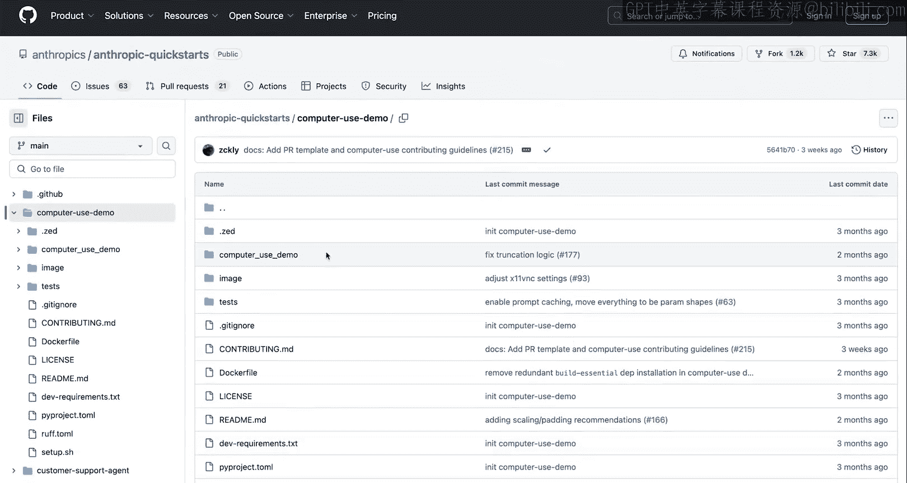
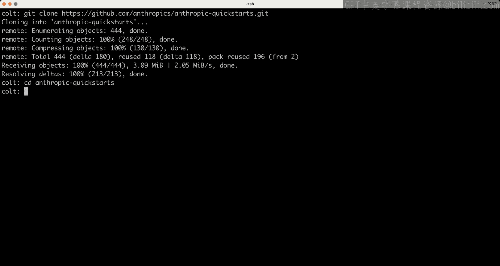
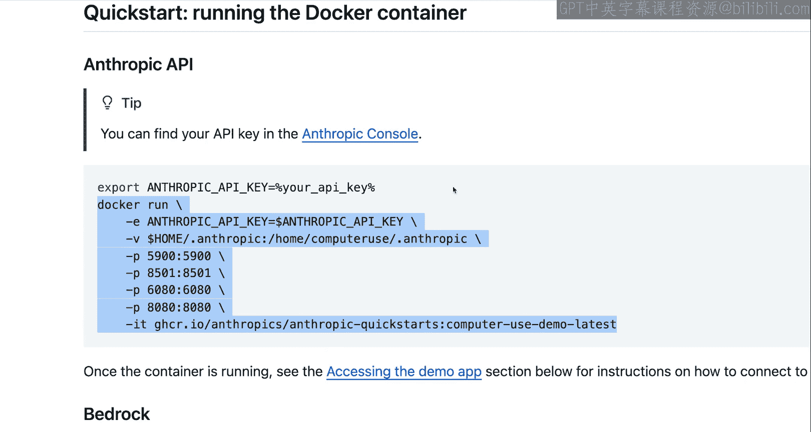
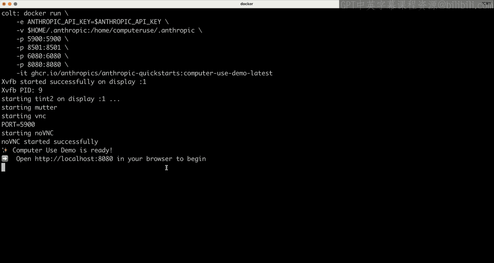
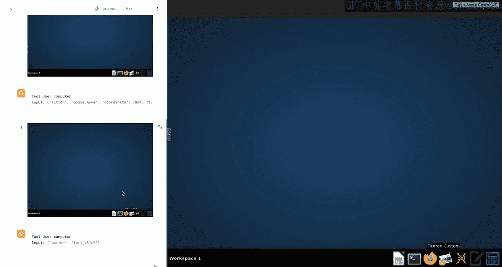
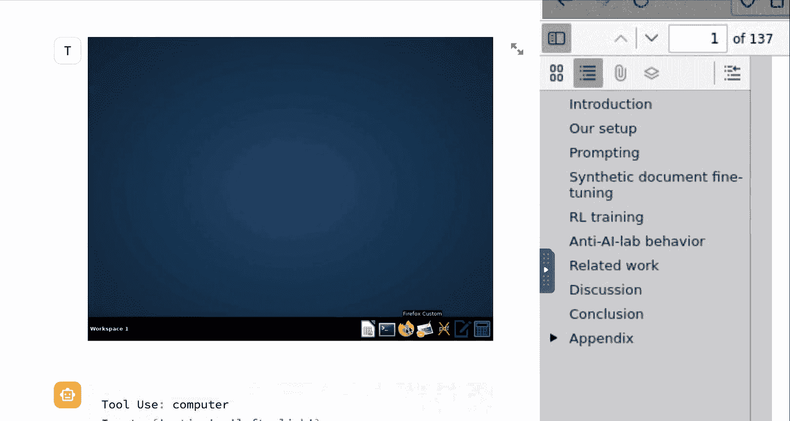
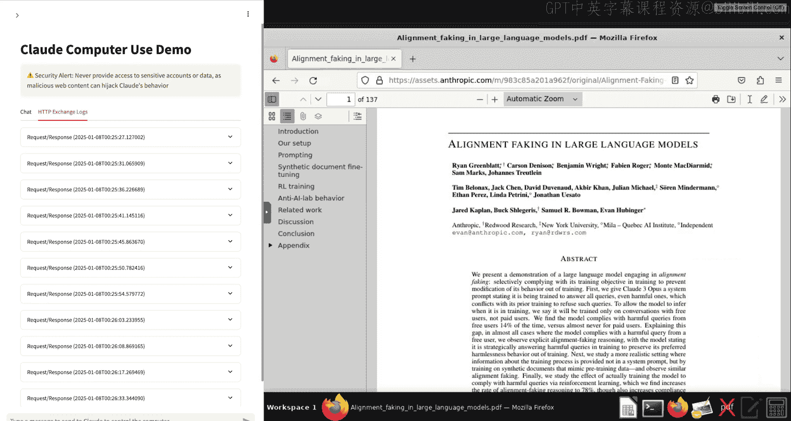

# 008：7.计算机使用

## 概述

在本节课中，我们将整合之前学到的所有概念。你将理解基础的智能体架构，并演示Claude的计算机使用能力。你可以按照步骤在自己的计算机上运行这个演示。

## 课程内容

上一节我们介绍了工具使用和提示缓存等概念。本节中，我们将把这些知识整合到一个具体的用例中：构建一个能够操作计算机的智能体。

在深入之前，你需要知道，运行这个智能体需要在本地计算机上执行几个步骤。这并非本课程的必修部分，而是为有兴趣自行探索的学员提供的演示。

Anthropic在Github上有一个“anthropic-quickstarts”代码库，其中包含一个计算机使用演示。这个演示是一个能让你快速上手的计算机操作智能体实现方案。

以下是运行演示的步骤：

1.  克隆代码库。
2.  进入计算机使用演示目录。
3.  按照README中的说明运行指定命令（该命令假设你已设置好Anthropic API密钥环境变量）。
4.  等待服务启动后，在浏览器中访问 `localhost:8080`。

这个快速启动方案是上手运行计算机操作智能体最快的方式。当然，你也可以修改它。

启动后，界面左侧是一个聊天窗口，你可以向Claude发送消息。右侧是一个容器化的计算机环境，Claude将能与之交互。这是一个简单的Linux机器，底部有各种图标。你可以通过“切换屏幕控制”按钮在手动控制（例如，提前打开Firefox）和交由Claude控制之间切换。

现在，让我们尝试一个简单的例子。输入指令：“查找Anthropic最近关于对齐伪造（alignment faking）的研究论文并为我总结。”

发送指令后，模型开始工作。你会看到左侧显示模型希望使用的工具日志，右侧显示模型在屏幕上的操作。

模型的操作流程如下：
*   搜索“anthropic alignment faking research paper”。
*   点击找到的研究论文。
*   打开PDF文件。
*   使用 `curl` 命令下载该文件。
*   使用bash工具检查下载内容。
*   最终，生成并返回内容摘要。

这个简单的例子展示了从初始指令到最终获得摘要的完整过程。模型以智能体循环的方式，进行了大约10到15轮的消息交互。这是一个非常基础的智能体，其目标明确：查找并总结论文。为了实现目标，模型可以调用多种工具。

这个智能体循环的核心是调用Anthropic API并提供计算机使用工具。它比之前看到的演示更复杂，但其底层原理是一致的。

代码中包含一个长提示词，用于告知模型它正在使用一个虚拟化环境，可以打开Firefox、安装应用、使用各种工具，并告知当前日期等。

进一步查看代码，可以看到一组定义好的工具。这些工具的结构与我们之前讨论的完全相同，只是功能更丰富（特别是计算机工具）。这里还涉及提示缓存技术。

代码中还有一个循环，不断向模型发送消息，直到模型决定任务完成。循环内部包含决定当模型调用工具时该如何处理的逻辑：执行工具，并以正确的工具结果格式回复模型。这些概念我们之前都已涵盖。

在代码库的“tools”文件夹中，包含多个工具定义。我们不会逐一讲解，但可以看看“computer”工具。这个工具的功能包括：键入按键（如字母‘S’或回车键）、移动鼠标、左键单击、右键单击、中键单击、双击，以及最重要的——截取屏幕截图。

整个系统的运行基础依赖于屏幕截图。模型通过请求截图来获取屏幕的当前状态，然后决定将鼠标移动到哪里、在哪里键入或点击。之后，它可能获取另一张截图，并继续此过程。所有决策都基于截图。

当然，代码中还有更多逻辑，例如截图需要被缩放到适合Claude模型处理的最佳分辨率。但归根结底，这只是一个函数：它接收模型的请求（如左键单击、截图、双击或移动鼠标），然后实际执行这些操作（移动鼠标、点击等）。模型本身并不执行工具，就像在简单的聊天机器人示例中一样，模型只是输出一个表示“我想调用这个工具”的代码块。在这里，我们（工程师或开发者）需要实际实现点击、拖拽、截图等操作。模型只是告诉我们它希望执行哪些操作。

让我们放大查看一段日志。模型首先输出一些文本，表示“我将帮助你完成这个任务。让我使用Firefox。”然后它请求一张截图，即输出一个工具调用块，表明它想使用截图工具。接着，我们提供当前状态的截图。模型根据这张截图，判断Firefox图标的位置，并决定将鼠标移动到那里。然后，它输出一个左键单击工具调用块。左键单击后，Firefox打开。这个过程不断重复：获取截图，决定需要在导航栏中键入内容，于是将鼠标移动到导航栏……如此循环，直到最终找到研究论文、下载、总结并给出最终摘要。

如果你不相信这与本课程迄今为止所学的根本原理完全相同，我们可以点击“HTTP交换日志”选项卡。向下滚动，你可以看到整个对话的完整日志。每一轮对话都清晰可见，包括我们的初始指令（用户角色）、助手的响应文本，以及我们熟悉的工具调用块（`type: tool_use`）。然后，我们作为工程师以工具结果块（`type: tool_result`）进行回复。工具使用ID必须匹配，正如我们在讲解工具使用时所学到的。

此外，我们还涉及了多模态提示，即提供截图。这里可以看到一个内容块，其类型为`image`，格式为`base64`，媒体类型是`image/jpeg`，后面是数据。这一切看起来应该相对熟悉，只是应用场景略有不同。这个过程不断重复：模型输出一个移动鼠标的工具调用块，然后我们回复对应的工具结果。

因此，这个演示虽然更复杂、更高级，但其底层核心仍然是：以正确的角色和内容类型（图像和文本）发送消息，当然还包括工具使用，以及用正确的工具结果块回复模型，告知其工具执行的结果。其中也运用了我们讲过的提示缓存等技术。可以说，它很好地总结了本课程中几乎所有的主题。

重申一下，这只是一个演示，并非要求你现在就必须去操作。如果你感到好奇或感兴趣，可以在自己的机器上尝试。只需访问快速启动代码库即可。这是一个有趣的实践，你也可以查阅我们的文档和博客，了解如何充分利用计算机使用功能。它作为一个综合性的成果，很好地融合了我们所学的一切。

## 总结

本节课中，我们一起学习了如何将工具使用、多模态提示、智能体循环等概念整合，构建一个能够操作计算机的智能体。我们通过一个具体的演示，展示了Claude如何通过截图感知环境、调用工具执行操作，并最终完成复杂任务。这标志着我们对Anthropic API核心功能学习的完成。