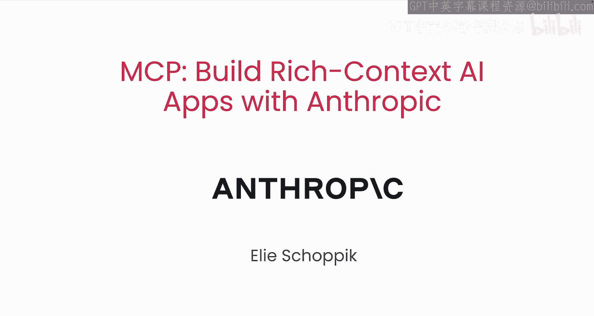
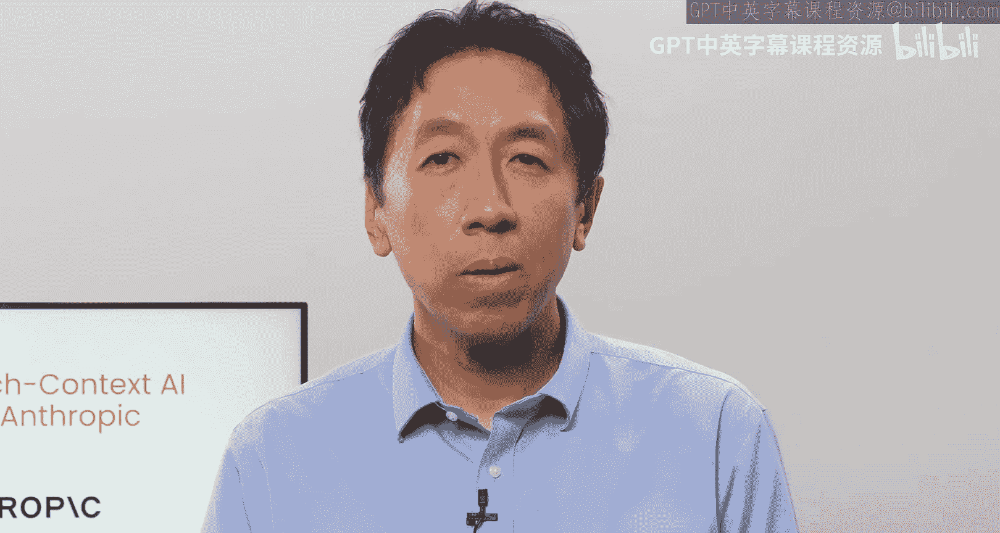
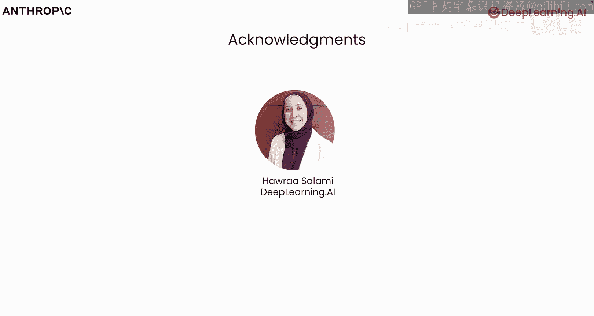
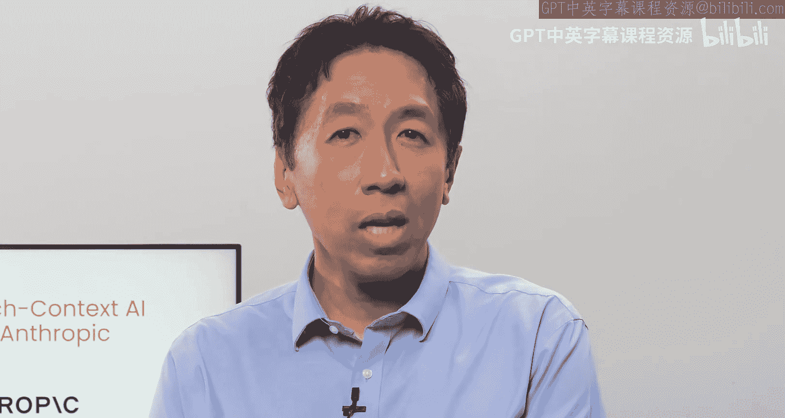

# 001：1.课程介绍

欢迎来到《使用Anthropic构建具有丰富上下文的AI应用》课程。

本课程是与Anthropic合作开发的。在本课程中，你将学习MCP的核心概念以及如何在你的AI应用中实现它。

模型上下文协议，即MCP，是一个开放协议。它标准化了你的语言模型应用如何以工具和数据资源的形式获取上下文。

它基于客户端-服务器架构。该协议定义了运行在你自身应用内部的MCP客户端，与对外暴露工具、数据资源和提示模板的MCP服务器之间如何进行通信。

自Anthropic于2024年11月发布MCP以来，MCP生态系统一直在飞速发展。

我很高兴地宣布，本课程的讲师是Eddie Schic。他是Anthropic的技术教育主管。谢谢Andrew。我很兴奋能与你一起教授这门课程。

MCP起源于一个内部项目。当时我们认识到一个机会，可以扩展Claude Desktop的能力，使其能够与本地文件系统和其他外部系统交互。

我们发现我们开发的协议在许多有类似需求的AI应用中都非常有用。

为了让更多开发者能够使用它，我们发布了规范，并将其开发开放给开源社区。

MCP生态系统包含了越来越多由开源社区以及Anthropic的MCP团队开发的MCP服务器。

MCP是模型无关的，并且设计得易于接入多个应用。

假设你正在构建一个研究助手智能体，并且希望这个智能体能与你的GitHub仓库交互，从你的Google Drive文档中读取笔记，或许还能在你的本地系统中创建一些内容。与其编写自定义工具，你可以将你的智能体连接到GitHub、Google Drive和文件系统服务器。这些服务器将提供工具或API调用定义，并处理工具的执行。

我将带你深入了解MCP协议的细节。我们首先将深入探讨MCP客户端-服务器架构的细节。然后，你将着手开发一个聊天机器人应用，使其兼容MCP。你将构建并测试一个MCP服务器，并将你的聊天机器人连接到它。你的MCP服务器将为你的聊天机器人提供工具、提示模板和资源。你还将把你的聊天机器人连接到其他受信任的第三方服务器，以扩展其能力。之后，你将复用你的MCP服务器。

并将其连接到其他MCP应用，例如Claude Desktop。

最后，你将学习如何远程部署你的MCP服务器。

我要感谢来自DeepLearning.AI的Harra Salami，他对本课程做出了贡献。

MCP是一项非常重要的技术。它让AI应用开发者能够更容易地将他们的系统连接到许多工具和数据资源。

对于构建工具和提供数据的团队来说，这项技术也让他们更容易地使自己构建的内容被众多开发者使用。

因此，这是一项值得学习的技术。下一个视频将讲解为什么以前将AI应用连接到资源如此困难，以及MCP如何解决这个问题。请前往下一个视频了解更多内容。