# 002：为什么需要MCP？ 🤔

在本节课中，我们将学习模型上下文协议（Model Context Protocol， MCP）如何解决AI开发中的碎片化问题，并标准化AI应用与外部数据源之间的连接方式。

## 概述

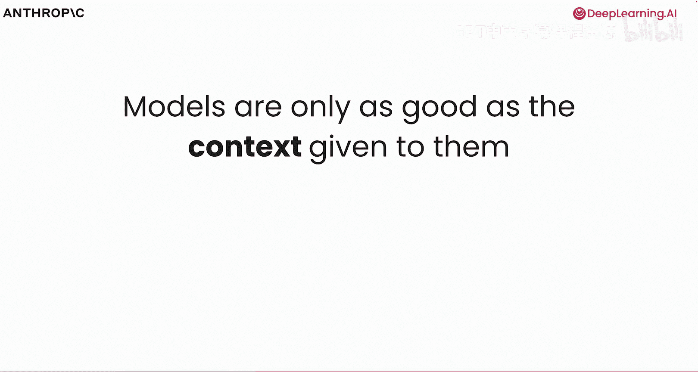

模型的能力取决于提供给它的上下文。即使拥有最前沿的智能模型，如果它无法连接外部世界并获取必要的数据和上下文，其效用也会大打折扣。MCP作为一个开源协议，旨在标准化大型语言模型与工具及数据源的连接和工作方式。

## 核心目标：标准化而非重复发明

上一节我们介绍了MCP的基本概念，本节中我们来看看其核心目标。MCP的理念不是重新发明诸如工具使用之类的方法，而是标准化AI应用与数据源的连接方式。这类似于我们使用REST等协议来标准化Web应用与后端及其他系统的通信方式。

**核心思想**：`MCP ≈ 标准化AI应用与外部系统的交互协议`

## MCP的价值：一次构建，处处使用

在当今世界，众多不同的模型需要与众多不同的数据源甚至彼此通信。MCP确保我们使用同一种“语言”，避免了为不同模型或数据源反复构建相同集成的困境。

以下是MCP带来的主要优势：

*   **标准化交互**：统一AI应用与外部系统的交互方式。
*   **提高效率**：构建一次集成，即可在多个地方使用。
*   **借鉴成熟经验**：MCP借鉴了其他旨在实现类似目标的协议思想，例如微软在2016年推出的语言服务器协议（LSP），它标准化了集成开发环境与语言特定工具的交互。

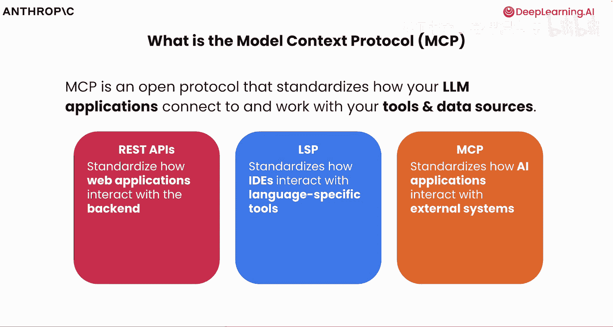

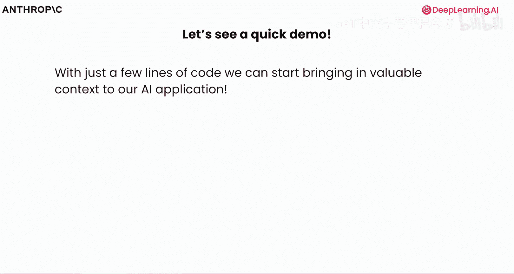

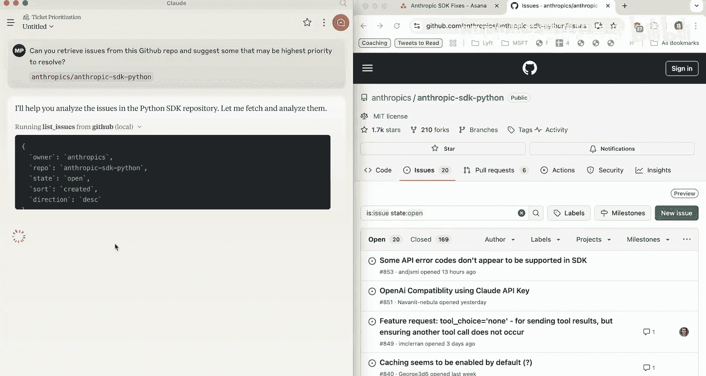

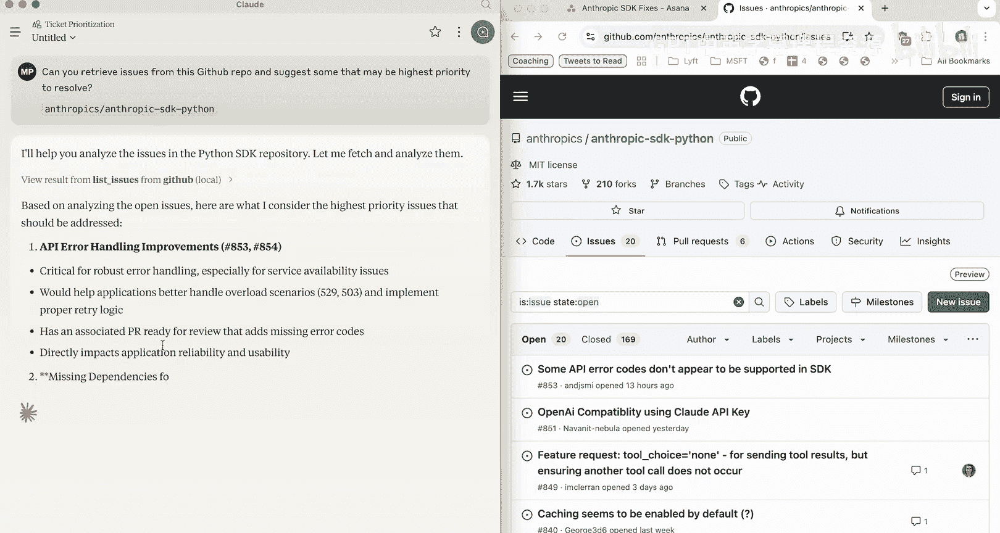

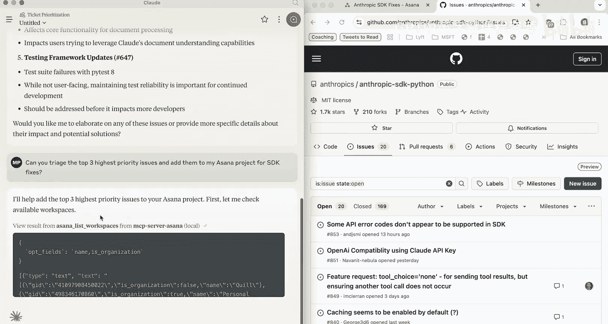

## 实践演示：MCP的强大能力

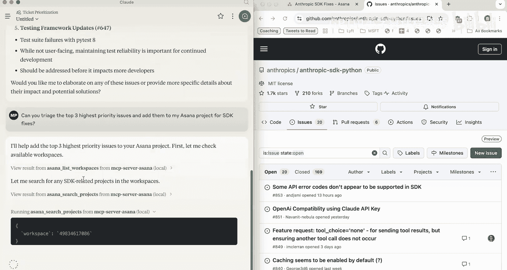

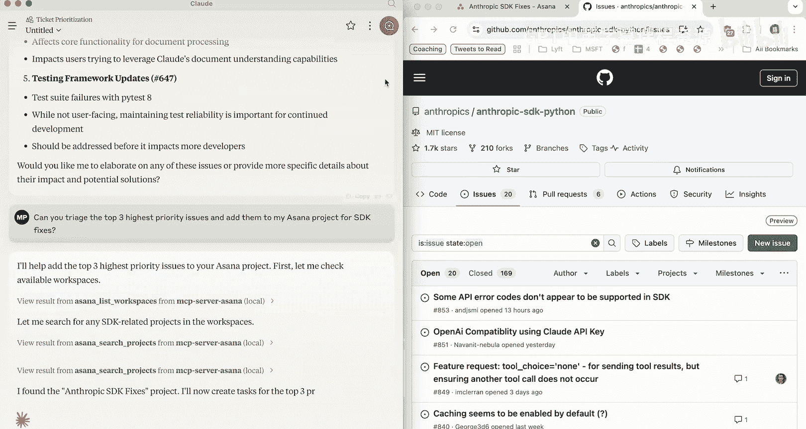

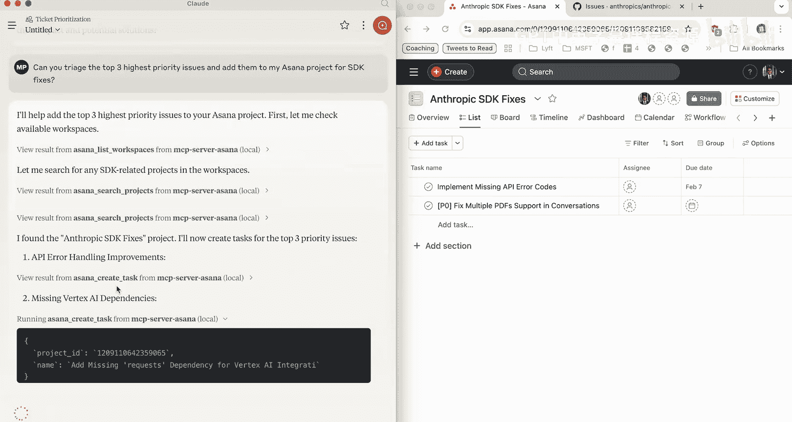

理论阐述之后，让我们通过一个快速演示来直观感受MCP的能力。演示中，仅用少量代码，我们就能为AI应用引入上下文。

在演示中，左侧使用Claude桌面应用，通过自然语言询问从GitHub仓库检索问题。右侧可以看到GitHub仓库。通过连接到一个提供GitHub数据的MCP服务器，以及另一个为项目管理工具Asana提供服务的MCP服务器，我们能够从GitHub读取数据，并请求在Asana中对特定问题进行分类和分配工单。

演示界面中有人参与循环，以验证要执行的操作。通过极少的代码，我们就能轻松地与外部数据源通信。

**演示核心**：`自然语言指令 -> MCP服务器（GitHub/Asana）-> 执行操作并返回结果`

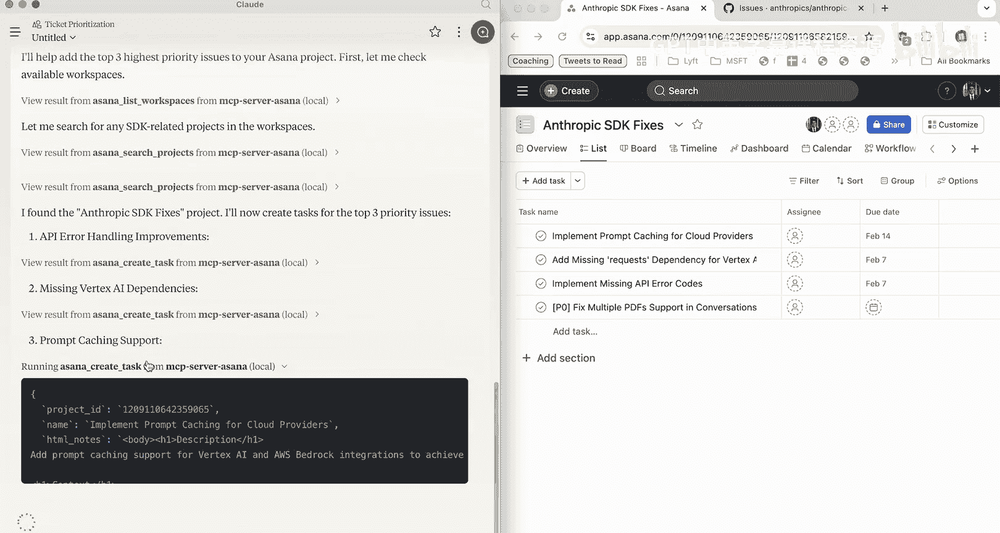

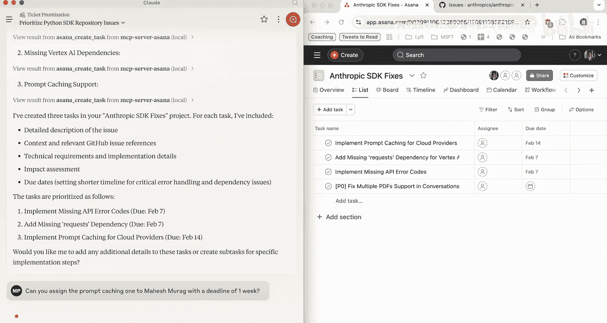

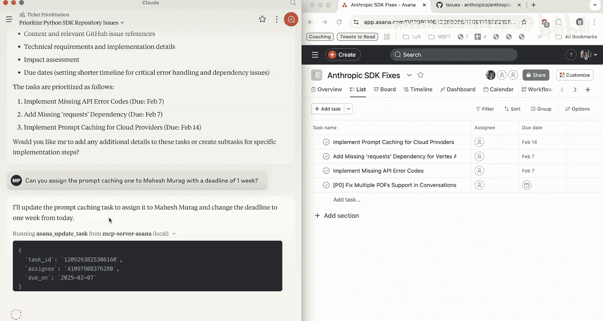

## MCP的架构优势：关注点分离

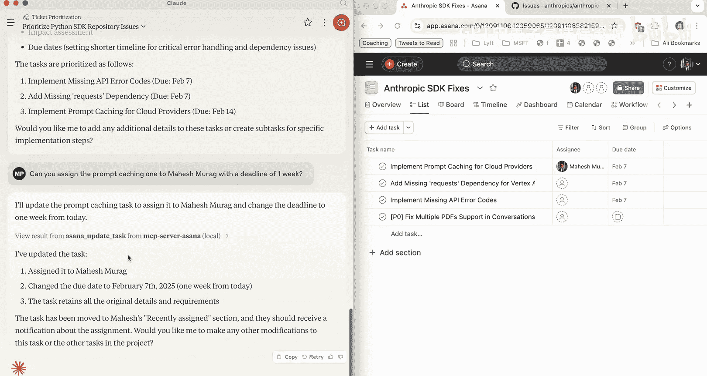

如前所述，没有MCP也能实现这些功能。但在构建这些集成时，问题随之而来：工具存储在哪里？自定义提示词存储在哪里？数据访问层和身份验证逻辑又存储在哪里？

我们发现许多不同的团队在重复造轮子，许多不同的AI应用以不同的方式与相似的数据源通信。MCP不仅是模型无关的，而且完全开源。这些工具和数据连接性由开源社区提供，或者您可以自己构建。

MCP以非常清晰的方式分离了关注点。我们构建或使用MCP兼容的应用程序，并根据需要连接到许多不同的服务器以获取特定类型的数据访问。

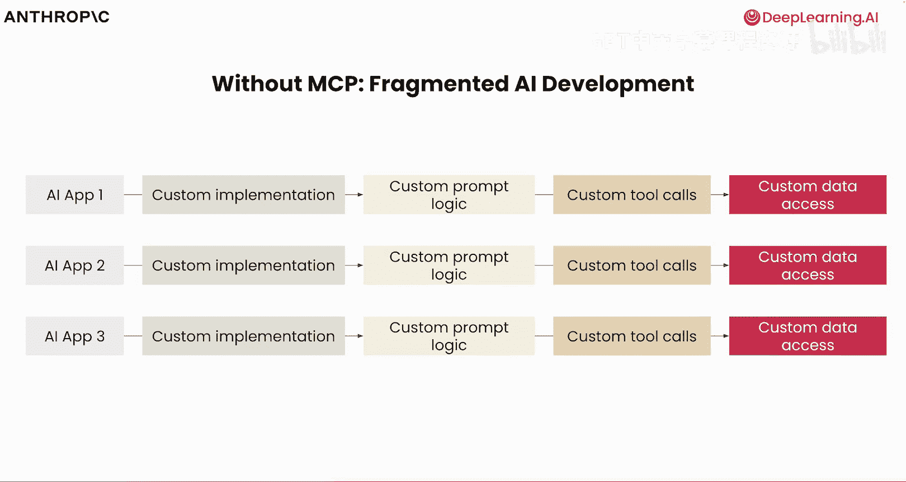

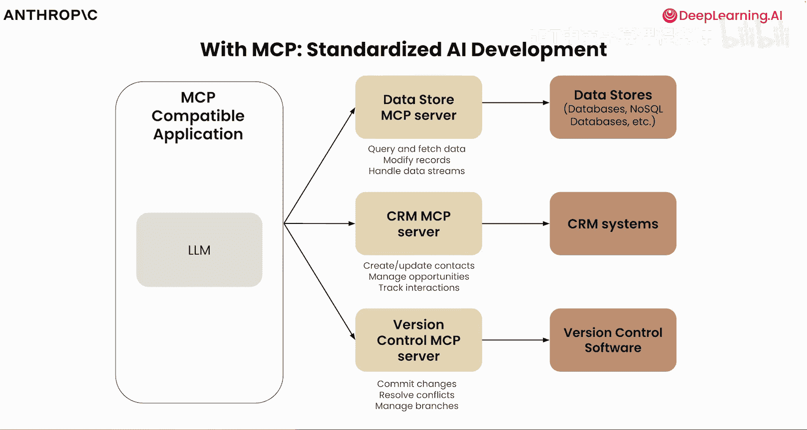

我们可以拥有用于数据存储的服务器、用于客户关系管理工具（如HubSpot或Salesforce）的服务器，甚至用于版本控制等功能的服务器。目标是通过自然语言与这些数据存储对话，而无需自己编写所有逻辑。

MCP服务器的美妙之处在于它可以在许多不同的应用程序中重用。我们可以使用参考服务器，甚至可以内部构建并在多个应用程序之间共享。

## MCP的受益者

MCP为不同的受众带来了诸多好处：

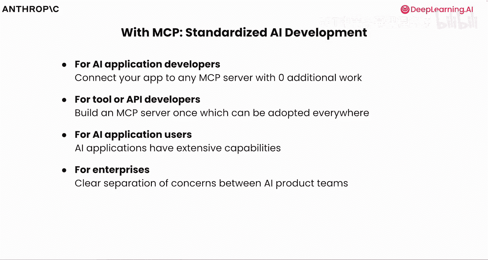

*   **对于应用开发者**：只需极少工作即可连接到MCP服务器。
*   **对于API开发者**：构建一次MCP服务器，即可在任何地方被采用。
*   **对于AI应用用户**：MCP背后的理念可以被抽象化，您只需提供一个MCP服务器的URL，就能将所需的数据访问引入您的应用。
*   **对于企业和大型组织**：可以考虑关注点分离和构建独立集成的好处，以便不同团队使用。

## 生态发展与常见问题

MCP生态系统正在快速发展。我们不仅看到大公司的开发，也看到前沿初创公司的参与，开源社区和私有领域都在构建许多不同的服务器。支持MCP的SDK（软件开发工具包）用多种语言编写，由开源社区和许多不同的公司及AI开发者共同推动。我们看到了跨Web应用、桌面应用甚至智能体产品的MCP兼容应用。

在结束之前，让我们回答几个关于MCP的常见问题。

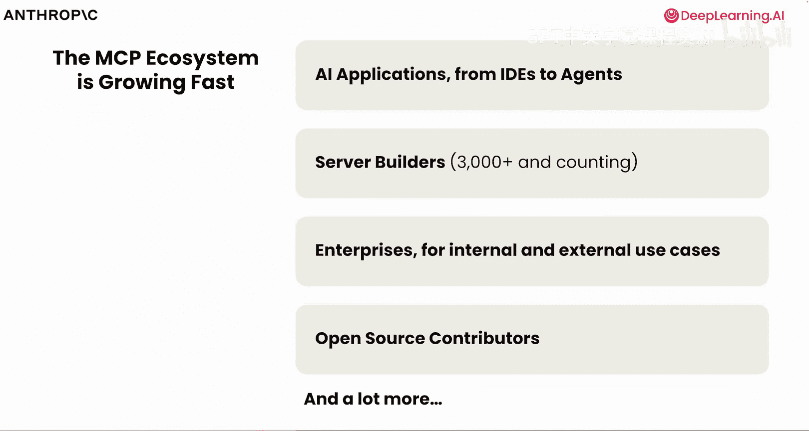

**谁编写这些MCP服务器（从GitHub到Asana到Google Drive）？**
任何人都可以。您作为开发者可以自己构建，也可以直接使用社区采纳的服务器。在接下来的课程中，我们将看到如何构建MCP服务器，并会亲自构建几个。

**MCP服务器类似于API吗？**
可以这样理解。您可以将MCP服务器视为API之上的网关或包装器。如果您不想直接调用API，可以使用自然语言，让MCP服务器为您处理。MCP服务器支持工具使用，但这只是其功能的一部分。服务器为您提供可用的函数和模式。正如我们将在下一课中看到的，MCP提供的功能远不止于此。

## 总结

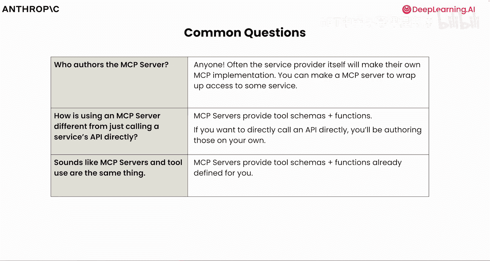

本节课中，我们一起学习了为什么需要模型上下文协议（MCP）。我们看到了一个非常精彩的演示，展示了它如何以极少量工作实现强大功能。在下一课中，我们将开始探索MCP的内部工作原理，介绍主机、客户端和服务器的概念，并讨论协议中的一些底层原语，如资源、工具和提示。