# 003：MCP架构详解 🏗️

在本节课中，我们将深入探讨模型上下文协议（MCP）的架构。我们将了解MCP如何通过客户端-服务器模型工作，以及它提供的核心功能，如工具、资源和提示模板。通过理解这些基础概念，你将能够更好地利用MCP来构建连接外部数据源的强大AI应用。

## 架构概述

上一节我们介绍了MCP在连接AI应用与外部数据源方面的实用性。本节中，我们来看看支撑这一切的底层架构。

与许多其他协议类似，MCP遵循**客户端-服务器架构**。其中，MCP客户端与MCP服务器维持着一对一的连接。两者之间通过MCP自身定义的消息进行通信。

这些客户端存在于一个**宿主**环境中。宿主可以是Claude Desktop、Claude.ai等应用程序。宿主的职责是存储和维护所有客户端及其与MCP服务器的连接。

让我们更深入地看看这个结构：
*   **宿主**：希望访问数据的LLM应用。
*   **服务器**：通过MCP协议暴露特定能力的轻量级程序。

很快，我们将开始构建自己的服务器、客户端以及包含多个客户端的宿主。虽然相关代码会涉及一些底层细节，但本节的目标是理解架构。这样，当你使用Claude Desktop、Cursor或Windsurf等工具时，就能明白其背后的工作原理。

## 核心原语

在讨论客户端和服务器的具体职责前，我们先来了解协议的一些**原语**或基本组成部分。

### 工具 🛠️

如果你熟悉工具调用，那么MCP中的工具看起来会非常相似。**工具是可由客户端调用的函数**。

这些工具允许执行检索、搜索、发送消息和更新数据库记录等操作。工具通常用于那些可能需要POST请求或某种修改操作的数据。

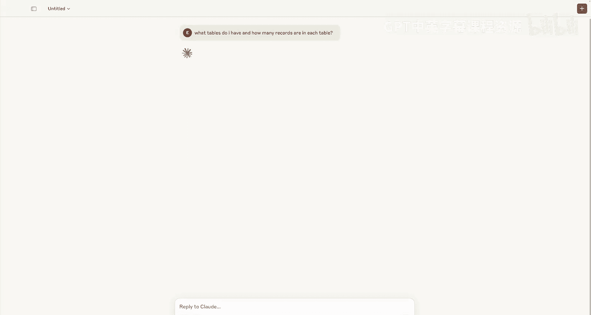

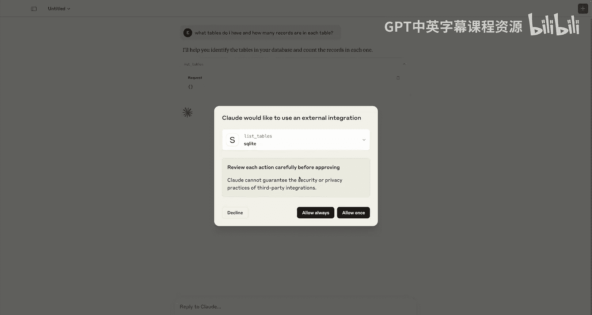

以下是使用Python MCP SDK声明一个工具的示例代码：
```python
@mcp.tool()
def list_tables() -> list[str]:
    """返回数据库中的所有表名。"""
    # ... 执行逻辑 ...
    return table_names
```

### 资源 📄

资源与GET请求更为相似。**资源是服务器暴露的只读数据或上下文**。

你的应用可以选择是否使用这些资源，但不一定非要将其纳入上下文。资源的例子包括数据库记录、API响应、文件、PDF等。

以下是声明一个资源的示例：
```python
@mcp.resource(uri="demo://documents")
def get_documents() -> str:
    """返回文档列表。"""
    return "文档1内容\n文档2内容"
```

对于动态信息，可以使用模板化资源：
```python
@mcp.resource(uri="demo://documents/{doc_id}")
def get_document(doc_id: str) -> str:
    """根据ID返回特定文档。"""
    return f"这是文档 {doc_id} 的内容。"
```

### 提示模板 💬

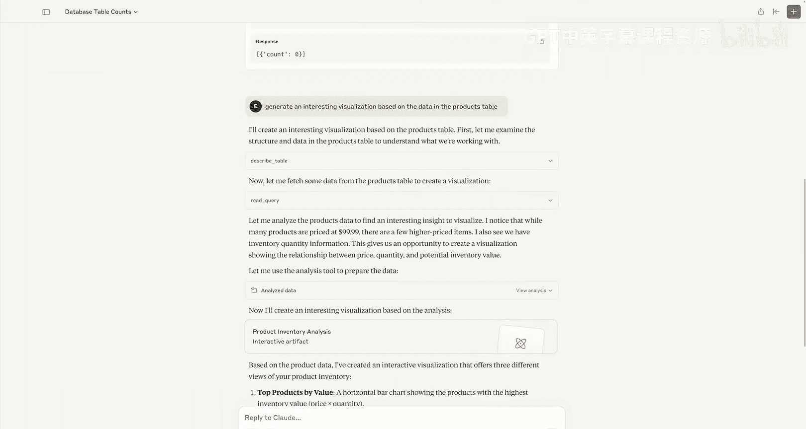

我们要探讨的第三个原语是**提示模板**。提示模板旨在完成一个非常合理的任务：**减轻用户的提示工程负担**。

你可能会有一个MCP服务器，其职责是查询Google Drive中的内容并进行总结等。但用户本身需要编写提示，才能以最高效的方式完成所有这些任务。提示模板是存在于服务器上的预定义模板，客户端可以访问它们，并在用户选择时提供给用户。这样就不强制用户编写整个提示并摸索提示工程的最佳实践了。

在接下来的课程中，我们将看到如何在服务器和客户端上构建工具、资源和提示模板。客户端的职责是发现资源和工具，而服务器的职责是将这些信息暴露给客户端。

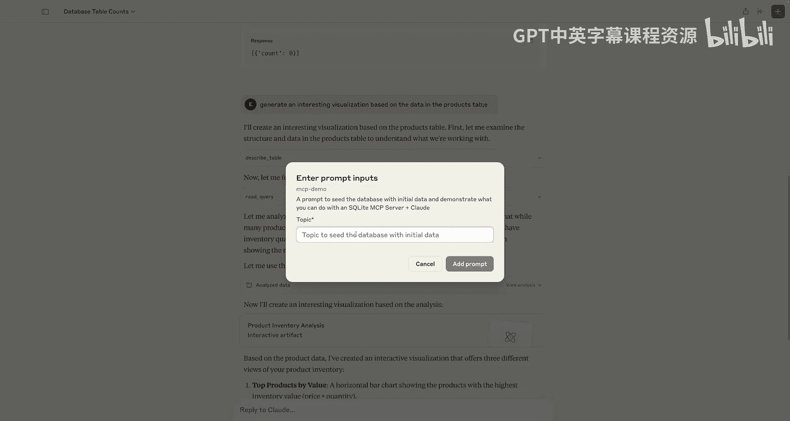

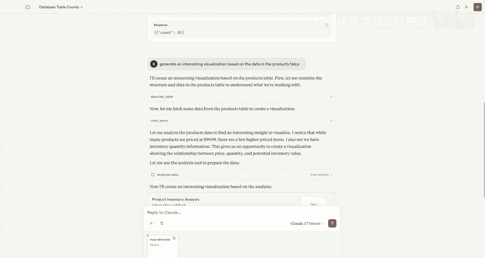

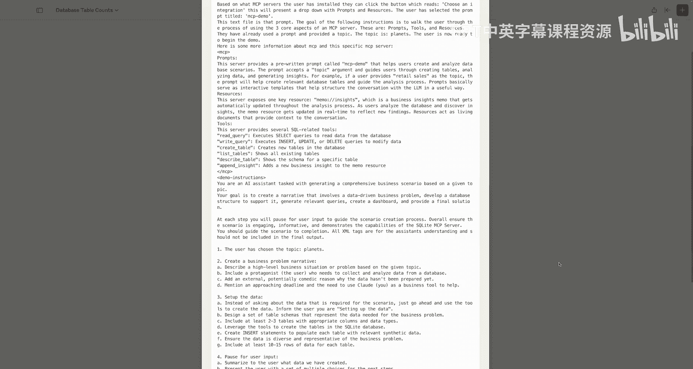

## 实战演示

现在我们对这些原语有了基本了解，让我们通过一个宿主（Claude Desktop）来实际看看它们是如何运作的。我将连接到一个为SQLite暴露工具、资源和提示的MCP服务器。

连接后，我可以开始用自然语言与我的数据对话。例如，询问：“我有哪些表？每个表里有多少条记录？”

这时，Claude会连接到外部世界，并使用来自SQLite服务器的一个名为`list_tables`的工具。在请求中，我们看到没有发送动态数据。执行后，我们可以看到结果：有30个产品、30个用户和0个订单。

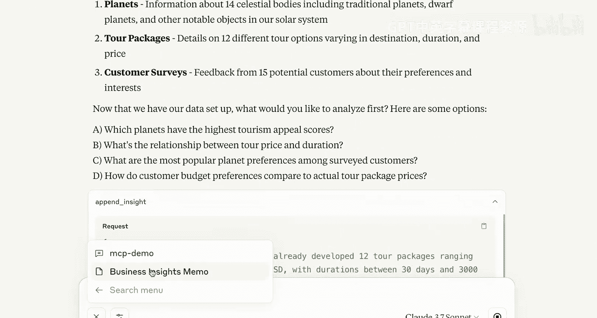

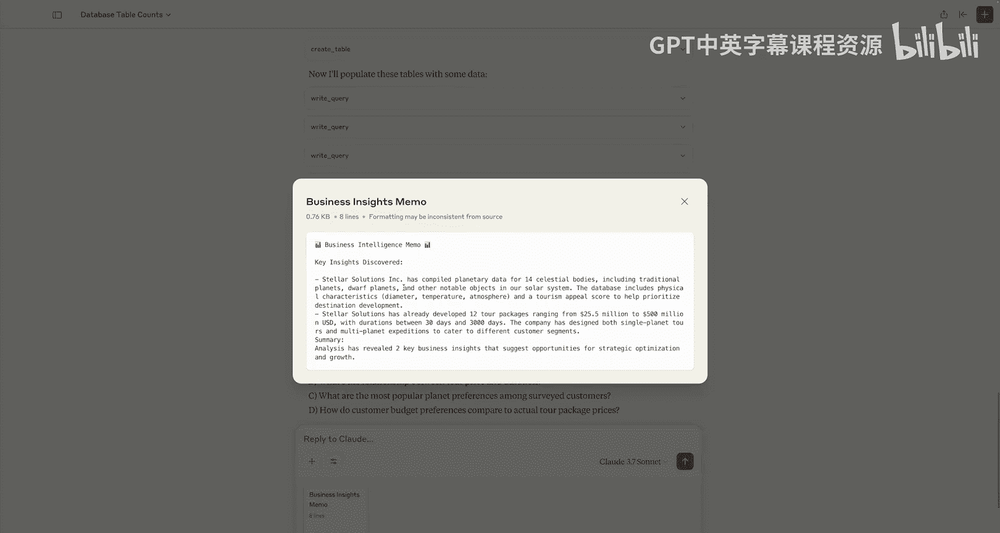

我们还可以进行更有趣的操作，例如利用工具生成可视化图表。输入：“基于产品表中的数据生成一个有趣的可视化图表。”

即使有拼写错误，系统也能查询到所需信息：找到表，运行必要的查询并获取数据。分析工具会分析数据并告诉我们许多商品的价格分布，以及存在少数高价商品。通过MCP，我们可以立即构建出非常有趣的应用程序。

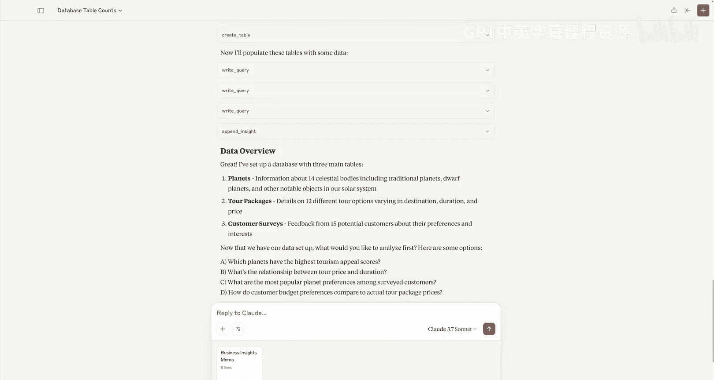

接下来，让我们探索其他原语。在SQLite示例中，有一个“MCP演示提示”。这是一个从服务器发送过来的提示模板，用户只需传入一些动态数据即可。

例如，使用提示“用一些关于行星的数据来填充数据库”。当将其添加到提示中时，我们会立即看到一个由服务器提供的文本文件生成。这不是用户必须编写的内容，用户只需选择动态数据，然后运行该特定提示即可。这样，用户就可以使用经过充分测试和评估的提示，而无需自己动手。

在演示中，我们还看到了一个“数据洞察”或“业务洞察备忘录”，它会随着我们不断添加新数据而更新。这就是一个**资源**的例子。资源是动态的，可以随着应用程序中数据的变化而更新。我们不需要使用工具来获取这些信息，服务器会直接发送数据给客户端，由应用程序决定是否使用这些数据。

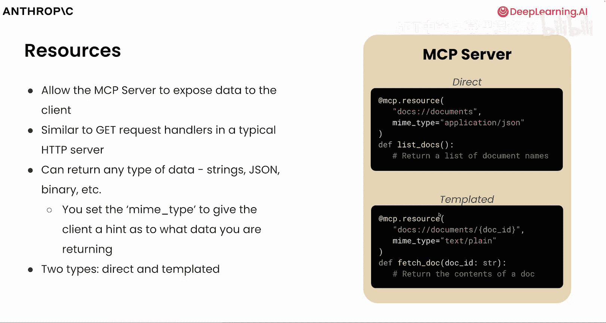

在这个小例子中，我们看到了宿主（Claude Desktop）、来自SQLite MCP服务器的各种工具、提示以及资源，它们共同允许我们执行非常强大的操作。

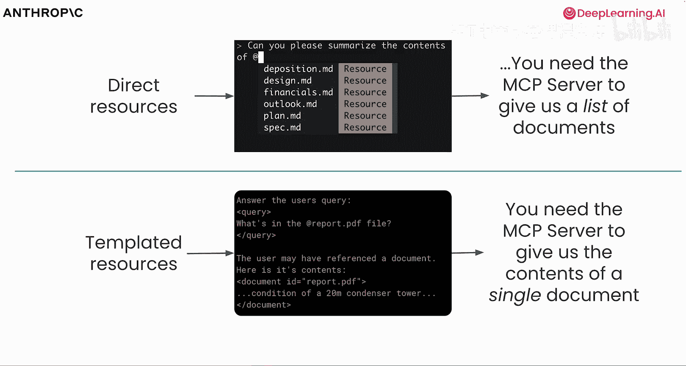

## 通信与传输

既然我们已经了解了如何使用MCP服务器的工具，接下来让我们谈谈如何实际创建它们。

MCP为多种语言提供了用于构建服务器和客户端的软件开发工具包。在本课程中，你将使用Python MCP SDK，它可以非常方便地声明工具、资源和提示。

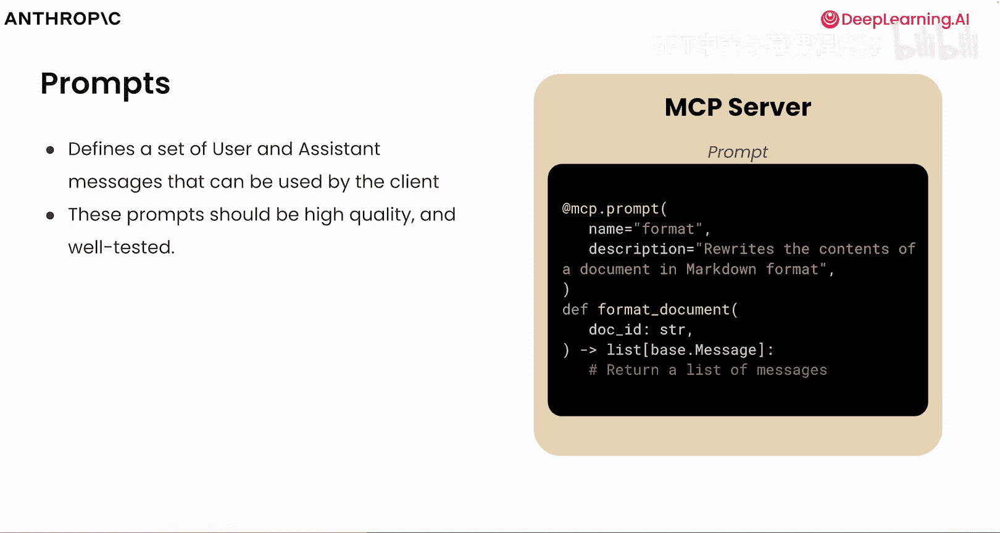

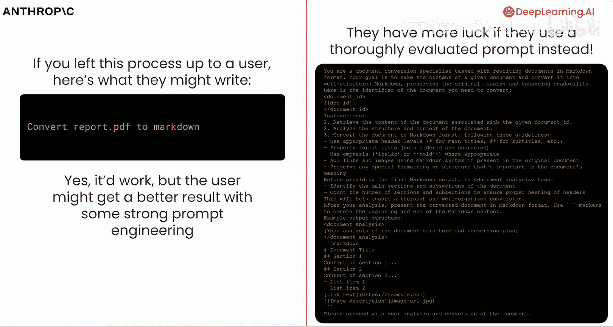

现在我们对一些原语有了概念，让我们简要谈谈客户端和服务器之间的通信。

当客户端打开与服务器的连接时，会有一个初始化过程：发送请求、接收响应并发送通知以确认初始化。一旦初始化完成，就会发生消息交换。了解这些步骤很重要，因为在代码中你实际上会看到像`initialize`这样的方法。

客户端可以向服务器发送请求，服务器也可以向客户端发送请求，通知也可以双向发送。我们稍后会讨论其他一些协议，服务器可以通过这些协议向客户端采样或请求信息，通知也可以双向发送。最后，在通信结束时，连接会终止。

在进一步讨论连接和消息传递方式时，理解模型上下文协议的另一个部分很重要，那就是**传输**的概念。

传输处理客户端和服务器之间消息传递的机制。根据应用程序的运行方式，你将选择其中一种不同的传输方式，如果需要，也可以创建自己的传输方式。

*   **对于本地运行的服务器**，我们将使用标准输入/输出。
*   **对于远程部署的服务器**，我们可以在HTTP（及服务器发送事件）之间选择。在本课程后期部署远程服务器时，我们将使用可流式HTTP传输。

在录制本课程时，可流式HTTP尚未在所有SDK中得到支持。因此，在我们的示例中，我们将使用带有服务器发送事件的HTTP，以便让你了解其中的区别。

使用带有服务器发送事件的HTTP时，你需要打开一个有状态的连接，该连接保持开放以进行来回通信。对于某些类型的应用程序和部署，或者无状态部署，这并不适用。因此，在协议的新版本中，可流式HTTP传输允许有状态连接和无状态连接。

谈到我们的第一个传输方式——标准I/O，其过程涉及客户端将服务器作为子进程启动，服务器通过标准输入和标准输出与客户端一起进行读写操作。所有这些都将对我们抽象化，但重要的是要理解，在使用标准I/O时，这通常是在本地运行服务器时的做法。

当我们讨论远程传输时，你会看到基于协议的不同版本有不同的传输方式。远程服务器的原始传输涉及使用HTTP和服务器发送事件来建立有状态连接。在有状态连接中，客户端和服务器相互通信，请求之间没有关闭连接，数据可以在不同请求之间共享和记忆。

随着引入服务器发送事件的能力，服务器也能够将事件和消息发送回客户端。虽然这适用于多种应用程序，但许多应用程序在部署时既不是有状态的，也不需要是有状态的。事实上，有时为了扩展应用程序，使用短暂或无状态的服务器更高效，其中每个连接和每个请求都是不同的且不被记忆。

为了同时支持有状态和无状态连接，协议更新版本包含了一个新的传输方式，称为可流式HTTP。它允许将有状态连接的HTTP与服务器发送事件结合使用，或者将无状态连接的标准HTTP单独使用。

展望未来，可流式传输将是推荐和使用的方式，以便你可以支持无状态连接以及有状态连接。其工作方式是通过向某个端点（例如 `/mcp`）发送HTTP GET和POST请求来初始化请求，服务器返回响应。如果我们想选择加入或升级到服务器发送事件，我们可以继续发出可选的GET请求并来回发送通知。否则，我们发出POST请求并获取响应。

## 总结

本节课中，我们一起深入探讨了MCP背后的架构，从客户端、服务器和宿主，到演示如何使用一些最流行的原语，如工具、提示和资源。你还了解了一些用于发送数据的不同传输和机制。

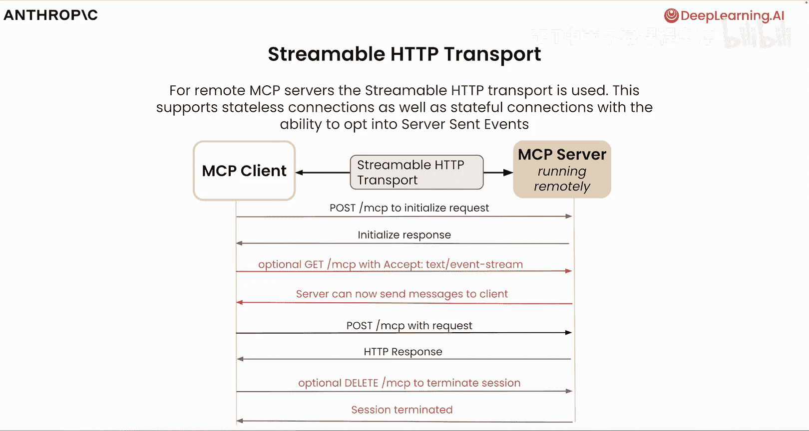

现在，是时候让你亲自动手编写一些代码了。在下一课中，我们将了解一些我们将要使用的功能和工具，然后开始叠加MCP逻辑来构建我们自己的服务器，并最终构建客户端和宿主。