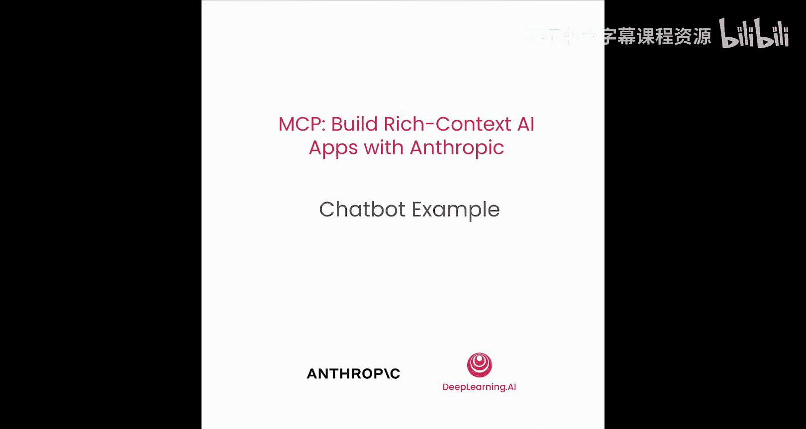
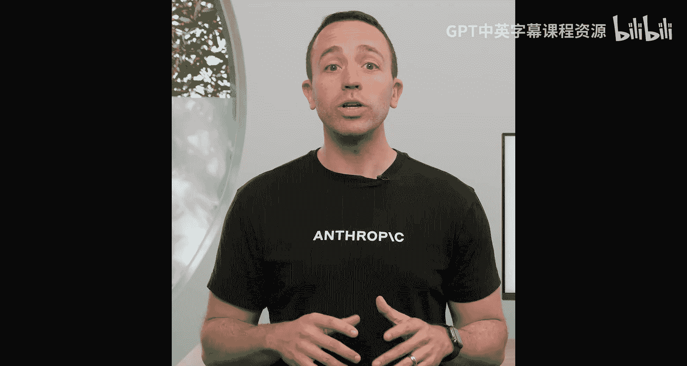
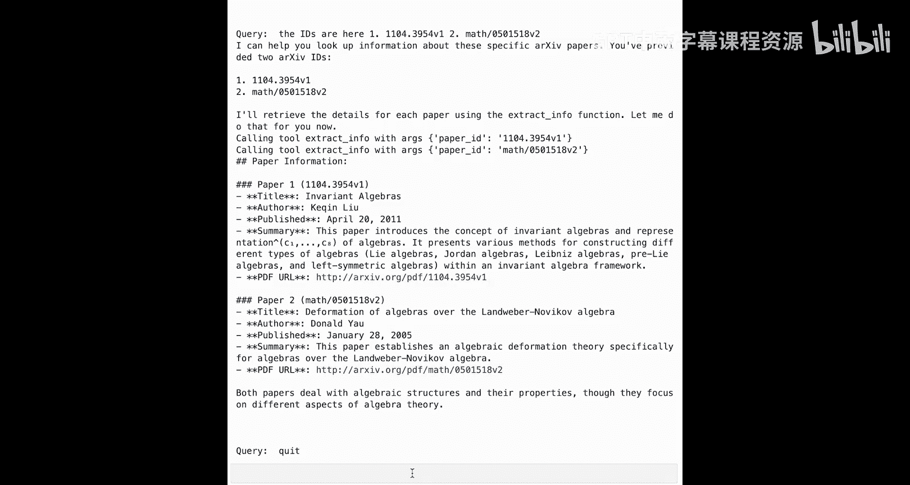

# 004：构建聊天机器人示例 🤖



在本节课中，我们将学习如何构建一个具备工具调用功能的聊天机器人。我们将使用Anthropic的Claude模型，并结合arXiv API来搜索和获取学术论文信息。

---



## 准备工作 🛠️

在开始使用MCP之前，确保你对大型语言模型的工具调用和提示工程有良好的基础。

现在，让我们开始编码。我们将从一个简单的聊天机器人应用开始，它利用arXiv来搜索论文并查找信息。如果你已经熟悉这部分内容，可以跳过本课，直接进入构建你的第一个MCP服务器。

---

## 导入必要的库

首先，我们需要导入一些必要的库。

```python
import arxiv
import json
import os
from typing import List, Dict, Any
import anthropic
```

以下是每个库的作用：
*   `arxiv`：用于搜索arXiv上的学术论文。
*   `json`：用于数据格式化。
*   `os`：用于处理环境变量。
*   `typing`：用于代码类型提示。
*   `anthropic`：用于调用Anthropic的Claude模型。

---

## 定义常量与第一个工具函数

我将首先定义一个名为`PAPER_DIRECTORY`的常量，它是一个字符串“papers”。这将用于将信息保存到文件系统。


```python
PAPER_DIRECTORY = "papers"
```

接下来，我们引入第一个函数。让我们来看看这个函数。

这个函数名为`search_papers`。它接受一个主题和一个结果数量参数（默认为5）。它的功能是在arXiv上搜索论文。如果你不熟悉，arXiv是一个开源存储库，包含从数学到科学等许多不同领域的已发表论文。

```python
def search_papers(topic: str, num_results: int = 5) -> List[str]:
    client = arxiv.Client()
    search = arxiv.Search(
        query=topic,
        max_results=num_results,
        sort_by=arxiv.SortCriterion.SubmittedDate
    )
    results = list(client.results(search))

    if not os.path.exists(PAPER_DIRECTORY):
        os.makedirs(PAPER_DIRECTORY)

    papers_info = []
    for paper in results:
        paper_info = {
            "id": paper.entry_id,
            "title": paper.title,
            "summary": paper.summary,
            "pdf_url": paper.pdf_url,
            "published": paper.published.isoformat()
        }
        papers_info.append(paper_info)

    file_path = os.path.join(PAPER_DIRECTORY, "papers_info.json")
    with open(file_path, 'w') as f:
        json.dump(papers_info, f, indent=2)

    return [paper['id'] for paper in papers_info]
```

我们将初始化客户端，然后开始搜索相关文章。获取搜索结果后，我们将创建一个目录（如果已存在则跳过），并将这些信息保存到一个名为`papers_info.json`的文件中。我们将处理每一篇论文并创建一个字典，然后将其写入文件。完成后，这个函数将返回一些论文ID。

让我们搜索一些关于“computers”的论文。

```python
paper_ids = search_papers("computers")
print(paper_ids)
```

我们可以看到，信息被保存到了本地文件，并且我们获得了一系列ID，可以用来获取更多相关信息。

---

## 定义第二个工具函数

现在，我们引入第二个函数来利用这些论文ID。

我们将定义另一个名为`extract_info`的函数。它将接收一个论文ID，在我们的`papers_info.json`文件中查找，并返回关于该论文的信息。如果找不到，则返回一个字符串提示。

```python
def extract_info(paper_id: str) -> str:
    file_path = os.path.join(PAPER_DIRECTORY, "papers_info.json")
    try:
        with open(file_path, 'r') as f:
            papers_info = json.load(f)
    except FileNotFoundError:
        return "No saved information for papers."

    for paper in papers_info:
        if paper['id'] == paper_id:
            return json.dumps(paper, indent=2)

    return f"No saved information for paper ID: {paper_id}"
```

我将获取第一个ID，然后运行这个函数，展示它的输出。

```python
if paper_ids:
    first_id = paper_ids[0]
    paper_details = extract_info(first_id)
    print(paper_details)
```

我们可以看到，返回的数据不仅包括论文标题，还有PDF的URL以及该论文的摘要。

我们将从这两个函数开始。然后，我们将开始将这些函数作为工具引入大型语言模型。

---

## 为模型定义工具列表

我们将能够为Anthropic的Claude模型传入一些工具。然后，我们将构建一个小型聊天机器人，它接收这些工具，并知道何时调用它们以及如何为这些函数返回数据。

让我们定义我们的工具列表。如果你熟悉工具调用，这应该不陌生。你创建的每个工具都需要有一个名称、描述以及它需要遵循的某种模式。

```python
tools = [
    {
        "name": "search_papers",
        "description": "Search for academic papers on arXiv based on a topic.",
        "input_schema": {
            "type": "object",
            "properties": {
                "topic": {"type": "string", "description": "The research topic to search for."},
                "num_results": {"type": "integer", "description": "Number of results to return.", "default": 5}
            },
            "required": ["topic"]
        }
    },
    {
        "name": "extract_info",
        "description": "Get detailed information and summary for a specific paper using its arXiv ID.",
        "input_schema": {
            "type": "object",
            "properties": {
                "paper_id": {"type": "string", "description": "The arXiv ID of the paper (e.g., '2401.12345v1')."}
            },
            "required": ["paper_id"]
        }
    }
]
```

记住，模型本身不会调用这些函数。我们实际上需要编写代码来调用这些函数并将数据传回模型。但这些工具的目的是允许模型扩展其功能。这样，模型就不会回答“我不知道”或产生幻觉，而是能返回我们想要的答案。

---

## 编写模型交互与工具执行逻辑

现在，让我们开始编写与大型语言模型交互和执行这些工具的一些逻辑。

我们引入一个工具映射。这里有一个函数，它将根据我们拥有的工具名称映射来调用底层的函数。

```python
def execute_tool(tool_name: str, arguments: Dict[str, Any]) -> Any:
    tool_map = {
        "search_papers": search_papers,
        "extract_info": extract_info
    }
    if tool_name in tool_map:
        return tool_map[tool_name](**arguments)
    else:
        return f"Error: Tool {tool_name} not found."
```

你可以看到，我们为每个工具名称准备了一个字典，它们指向我们下面定义的函数。然后，这个方便的辅助函数会去调用特定的函数，并以各种传入的数据类型将结果返回给我们。

---

## 构建聊天机器人主循环

现在，让我们开始构建我们的聊天机器人。首先，引入环境变量中的API密钥，然后创建Anthropic客户端的一个实例。我们需要这个实例来调用我们的模型并获取返回的数据。

```python
# 假设你的API密钥已设置在环境变量 ANTHROPIC_API_KEY 中
client = anthropic.Anthropic(api_key=os.environ.get("ANTHROPIC_API_KEY"))
```

让我们引入样板函数来开始与模型交互。如果你以前使用过Anthropic或其他模型，这会看起来很熟悉。

```python
def chat_loop(user_query: str, conversation_history: List[Dict] = None) -> str:
    if conversation_history is None:
        messages = []
    else:
        messages = conversation_history.copy()

    messages.append({"role": "user", "content": user_query})

    while True:
        response = client.messages.create(
            model="claude-3-sonnet-20240229", # 请使用你可用的最新模型版本
            max_tokens=1000,
            messages=messages,
            tools=tools
        )

        # 处理响应
        for content_block in response.content:
            if content_block.type == 'text':
                # 如果有文本数据，将其添加到消息中
                text_response = content_block.text
                messages.append({"role": "assistant", "content": text_response})
                # 如果这是最终响应，返回它
                if response.stop_reason == 'end_turn':
                    return text_response, messages
                # 否则，继续循环（模型可能在请求工具调用）
            elif content_block.type == 'tool_use':
                # 如果模型检测到需要使用工具
                tool_name = content_block.name
                tool_args = content_block.input
                # 调用我们的辅助函数执行工具
                tool_result = execute_tool(tool_name, tool_args)
                # 将工具结果附加到消息列表中
                messages.append({
                    "role": "user",
                    "content": [
                        {
                            "type": "tool_result",
                            "tool_use_id": content_block.id,
                            "content": str(tool_result)
                        }
                    ]
                })
        # 继续循环，让模型处理工具结果并生成下一步响应
```

我们将从一个消息列表开始。我们将传入用户输入的查询。我们将与Claude 3 Sonnet对话。我们将为聊天启动一个循环。如果有文本数据，就将其放入消息中。如果传入的数据是工具调用，即模型检测到需要使用工具，我们将调用执行工具的辅助函数，然后将工具结果附加到消息列表中。

---

## 运行聊天机器人

让我们看看它的实际运行效果。引入我们的聊天循环，我们已经拥有了开始使用工具调用并与模型对话所需的所有功能。

现在，让我们从一个非常简单的例子开始，看看实际使用这个函数是什么样子。

我们将运行一个无限循环，直到输入字符串“quit”为止。

```python
def main():
    conversation_history = []
    print("Chatbot started. Type 'quit' to exit.")
    while True:
        user_input = input("\nYou: ")
        if user_input.lower() == 'quit':
            print("Goodbye!")
            break
        response, conversation_history = chat_loop(user_input, conversation_history)
        print(f"\nAssistant: {response}")

if __name__ == "__main__":
    main()
```

现在，让我们开始与大型语言模型对话。调用我们的聊天循环函数。

现在，我们可以开始输入查询来与模型对话。让我们从一个非常简单的开始，比如打个招呼，确保它能按预期工作。

```
You: hi
```

我们可以看到，模型不仅会告诉我们它是一个AI助手，还会让我们知道它有哪些可用的工具。这很好。

---

## 使用工具进行查询

现在，让我们开始使用这些工具。让我们搜索关于感兴趣主题的最新论文。

我们为什么不搜索关于“algebra”的论文呢？这应该会使用我们已有的工具来搜索论文。

```
You: Search for recent papers on algebra.
```

我们可以看到主题被传入，结果被保存到这里。这很好。它甚至还会跟进问：“Would you like me to extract more detailed information?”

所以我会回答：“是的，请提取你找到的前两篇论文的信息并为我总结它们。”

我们将利用之前得到的工具结果，并传入它。它会告诉我们它对哪些ID感兴趣。所以我要确保传入那些特定的ID，以便正确完成。

ID在这里。我们将看到，它将使用这些特定的ID来提取信息。然后我们将得到结果以及这里的总结。

我们得到了一些关于不变代数和代数变形的信息。老实说，我无法告诉你这是什么。但希望我能阅读论文并了解这些信息。

需要记住的一点是，这里没有持久性记忆。所以，当你继续搜索查询并获取ID时，没有任何东西会被永久存储。因此，请确保在持续查询时，你传入了那些ID，并将每次对话都视为全新的开始。

如果你想退出这个聊天，记住，我们总是可以输入“quit”。确保你运行它。然后我们会看到我们在这里都完成了。

---

## 总结 📝

在本节课中，我们回顾了大型语言模型、工具调用以及arXiv SDK的使用。我们看到了如何构建一个能够搜索和总结学术论文的聊天机器人。接下来，我们将学习如何重构此代码，将这些工具转化为MCP工具，以便服务器能够将信息传递给我们。然后，我们将测试该服务器并查看结果。



我们下节课再见。