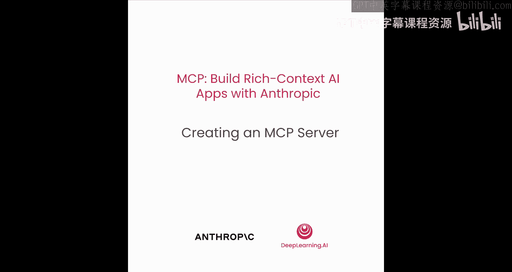
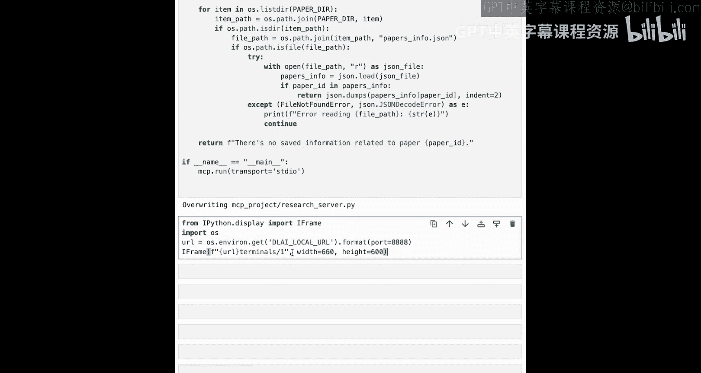
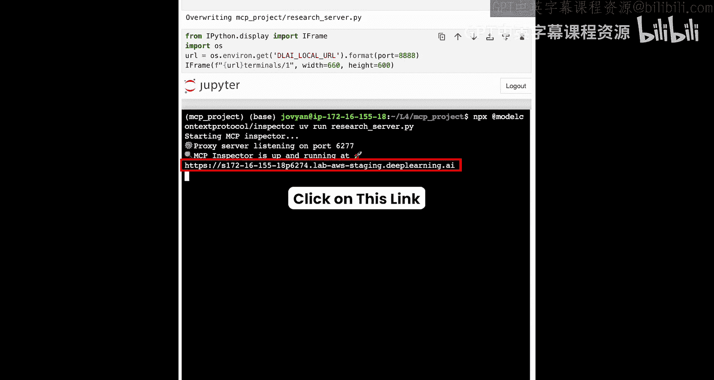
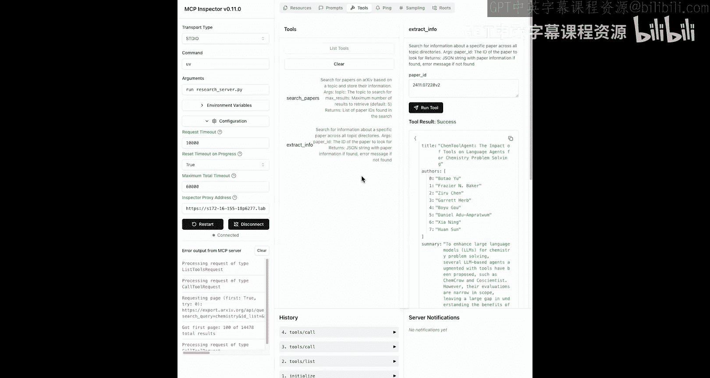
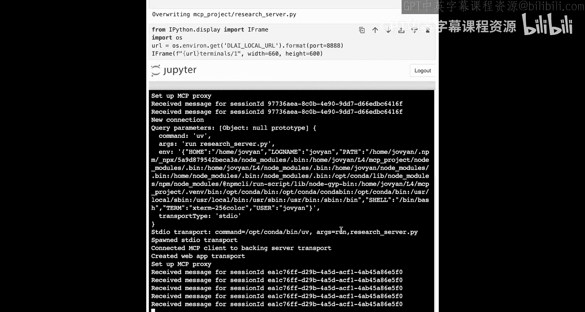
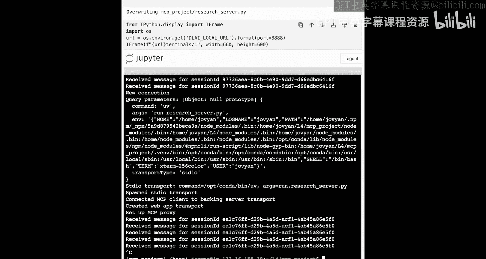
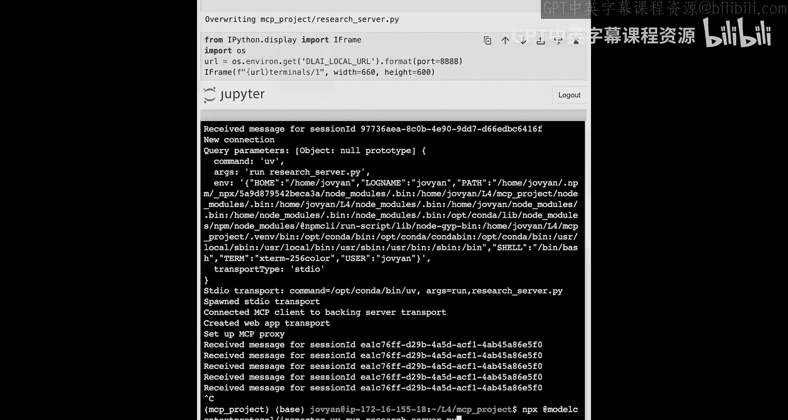

# 005：创建MCP服务器 🛠️




在本节课中，我们将学习如何将之前为聊天机器人实现的工具，封装成一个标准的MCP服务器。我们将使用Fast MCP库来简化构建过程，并利用MCP Inspector工具来测试我们的服务器。

## 概述

上一节我们介绍了如何将函数定义为工具并传递给大语言模型。本节中，我们将把这些工具的定义和模式抽象出来，创建一个独立的MCP服务器。我们将使用Fast MCP库，它提供了一个高级接口来快速构建MCP服务器。

## 开始编码

我们将从上一节课结束的地方开始，那里我们定义了两个函数：`search_papers`（用于在arXiv上查找论文）和`extract_info`。现在，我们将使用一个名为Fast MCP的库来创建MCP服务器。

首先，我们需要导入必要的模块并初始化MCP服务器。

```python
from mcp.server.fastmcp import FastMCP
```

初始化MCP服务器并为其命名。

```python
mcp = FastMCP("research")
```

模型上下文协议包含多个基本元素，例如工具、资源和提示。我们现在从定义一个工具开始。这可以通过使用`@mcp.tool`装饰器来轻松实现。

```python
@mcp.tool()
def search_papers(query: str, max_results: int = 5):
    # 函数实现代码...
```

我们需要为下面的函数也添加相同的装饰器。

```python
@mcp.tool()
def extract_info(paper_id: str):
    # 函数实现代码...
```

这样就在我们的MCP服务器上定义了两个可以运行和测试的工具。



最后，我们需要确保有正确的命令来启动这个服务器。我们将添加一段标准的Python代码。

```python
if __name__ == "__main__":
    mcp.run(transport="stdio")
```

这段代码允许我们直接运行此文件，而如果它被导入，则不会运行。我们通过调用`mcp.run()`并传入`transport="stdio"`来初始化和运行服务器。在本地运行服务器时，我们几乎总是使用标准输入/输出（stdio）传输方式。

执行以上代码后，我们将生成一个名为`research_server.py`的Python文件。这个文件将在我们启动MCP服务器时使用。

## 设置环境并测试服务器

接下来，我们需要设置环境并测试我们的服务器。我们将打开一个新的终端，并进入代码所在的目录。

以下是设置步骤：



1.  使用`uv`包管理器初始化项目并创建虚拟环境。
2.  激活虚拟环境。
3.  安装必要的依赖项（`mcp`和`arxiv`）。

虚拟环境是一种将依赖项独立封装的方式，以避免与全局安装的包发生冲突。

安装完依赖项后，下一步是测试我们的服务器文件。我们将使用一个名为“Inspector”的浏览器工具来探索服务器提供的工具、资源和提示等基本元素。

在终端中运行以下命令来启动Inspector：

```bash
npx @modelcontextprotocol/inspector uv run research_server.py
```

这个命令会启动MCP Inspector，并在浏览器中打开它。在Inspector界面中，我们需要选择传输类型为“stdio”，并输入运行命令`uv run research_server.py`。

连接服务器后，我们可以看到可用的基本元素。我们目前只创建了一些工具。在Inspector的“Tools”部分，我们可以列出所有可用的工具，并运行它们进行测试。

例如，我们可以运行`search_papers`工具来搜索“chemistry”主题的论文。运行后，我们将得到返回的结果。同样，我们也可以测试`extract_info`工具。

MCP Inspector对于构建服务器或测试他人编写的服务器来说，是一个非常有价值的沙箱环境。



测试完成后，我们可以返回终端，使用`Ctrl+C`来停止服务器进程。如果需要再次启动，可以使用上箭头键调出之前的命令。





## 总结



本节课中，我们一起学习了如何将函数封装为MCP工具，并使用Fast MCP库快速构建一个MCP服务器。我们设置了Python虚拟环境来管理依赖，并利用MCP Inspector工具在浏览器中测试了服务器的功能。在下一节课中，我们将在此基础上添加MCP主机和客户端，并将这个MCP服务器集成到我们构建的聊天机器人中。