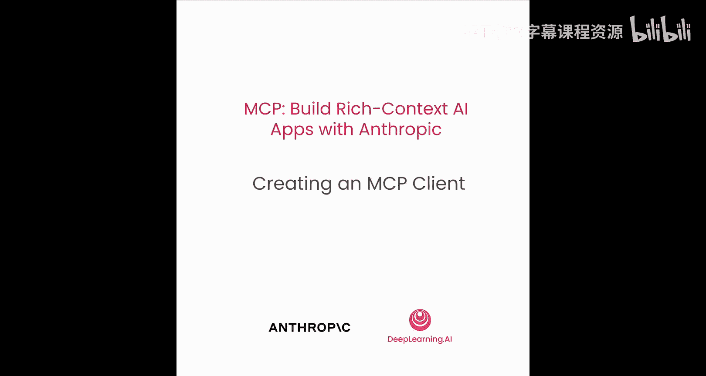
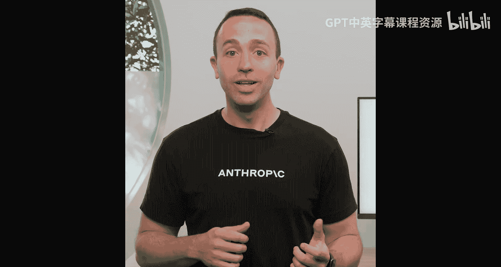
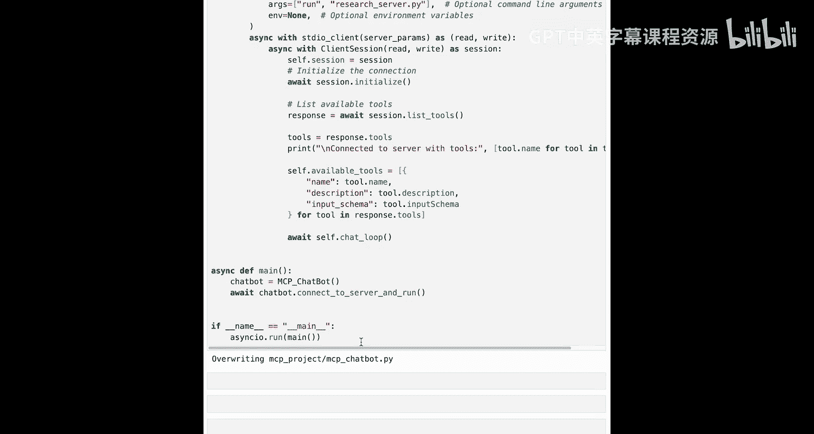
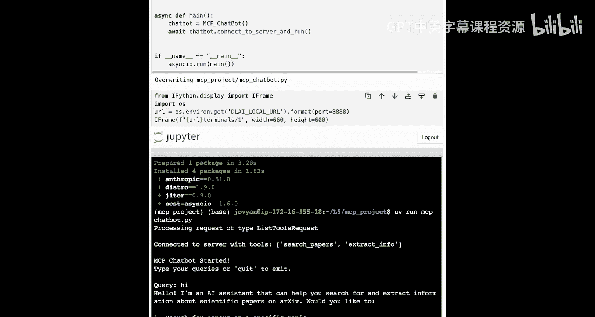
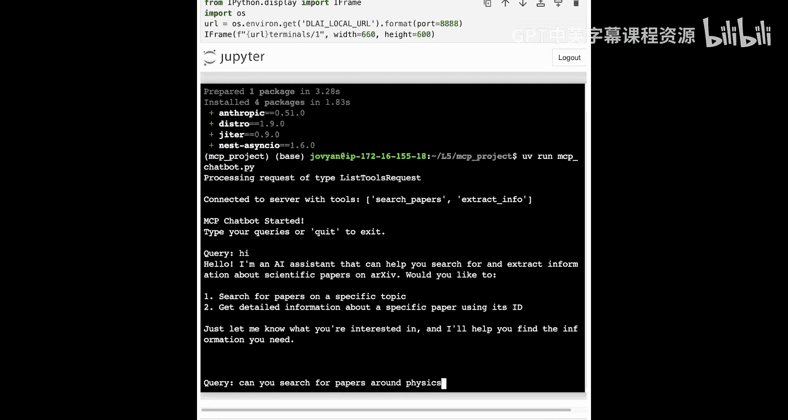
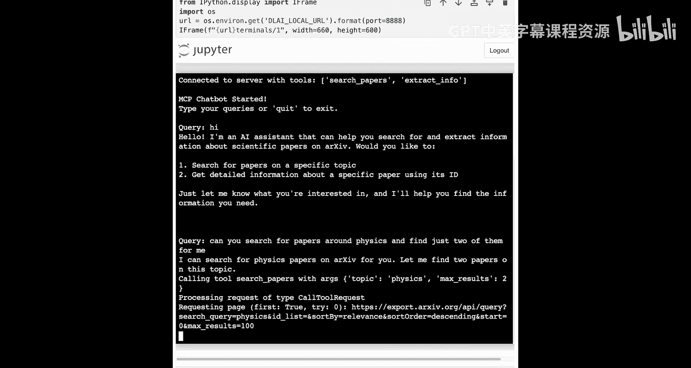
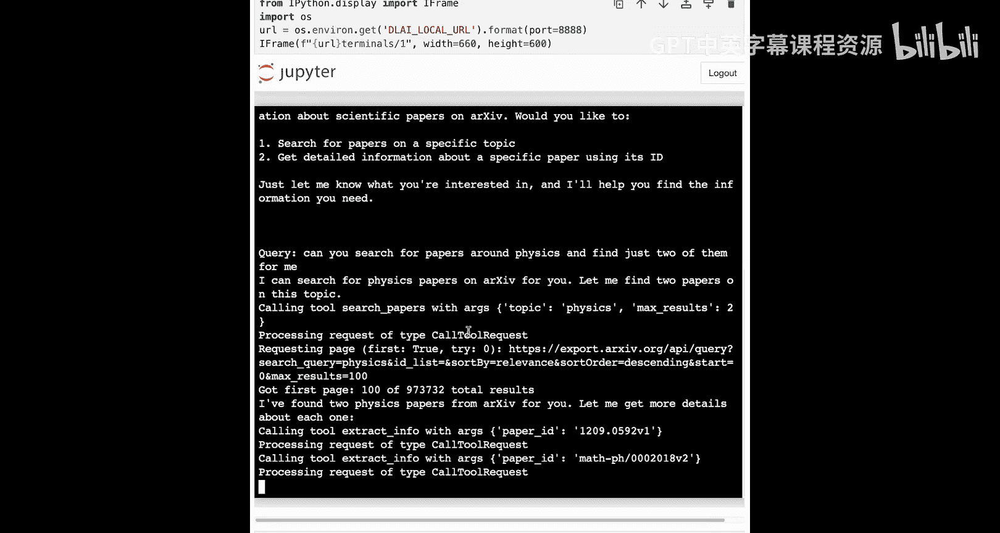
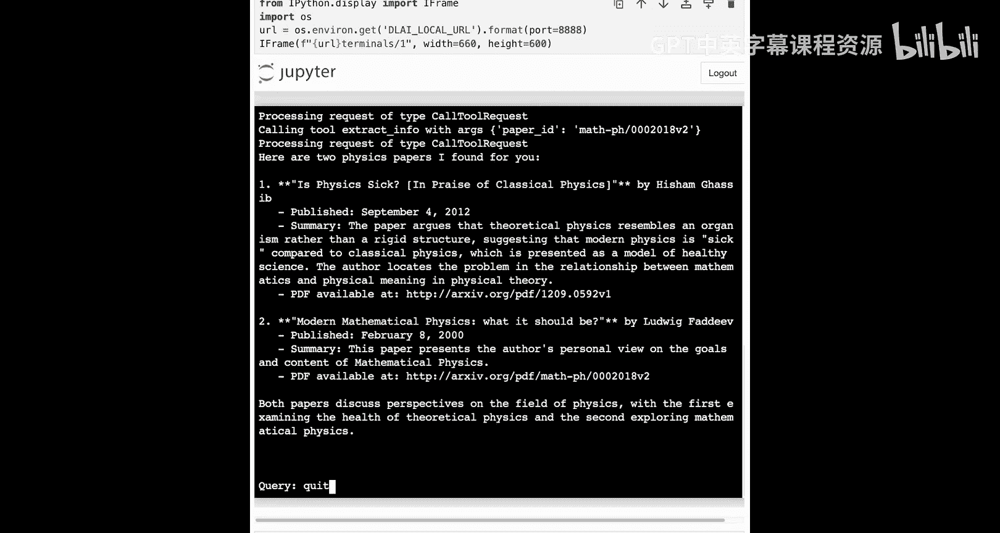

# 006：创建MCP客户端

## 概述
在本节课中，我们将学习如何创建一个MCP客户端，并将其集成到聊天机器人中。客户端将负责与MCP服务器通信，获取工具定义，并执行工具调用。我们将从底层代码开始，逐步构建一个功能完整的客户端。

## 从服务器到客户端
上一节我们介绍了如何使用MCP构建服务器。本节中，我们来看看如何创建一个MCP客户端，让聊天机器人能够与服务器通信，并访问工具定义和结果。

现在我们已经了解了如何用MCP构建服务器，接下来我们将超越检查器，构建自己的主机来容纳一个客户端，以便与我们的MCP服务器对话。

我们将直接处理聊天机器人。如果你想查看其他文件，比如我们之前制作的服务器，可以随时查看。我们将从回顾之前在聊天机器人示例中看到的代码开始。

你会再次看到很多这段代码，但随着我们开始引入客户端，我们将在此基础上增加一些内容。这里看到的所有内容我们之前都见过。这只是使用Claude 3 Sonnet以及工具使用来处理查询的能力。

我们可以看到，这里我们实际上没有定义任何工具，所有工具都在我们制作的服务器中定义。

## 创建MCP客户端
在上一课的基础上，我们现在开始讨论如何引入和创建MCP客户端。

我将从底层的MCP库中引入一些代码，因为我想解释这里实际发生了什么。请记住，当我们创建一个位于主机内部的MCP客户端时，我们需要确保该客户端与MCP服务器建立连接。

**重要提示**：我们正在查看的代码层级略低。你并不总是需要从头开始构建客户端，但当你看到其他工具（如Claude Desktop或Claude AI）时，了解其底层原理非常重要。因此，如果这段代码看起来有些复杂，请不要担心，我们将逐步讲解。这里的目的是确保你理解客户端是如何创建的，以及它们如何与服务器建立连接。

我们在这里看到的是从底层MCP库导入的一些必要类，用于建立与服务器的连接，以及从客户端启动子进程的能力。

以下是创建客户端连接的主要步骤：

1.  **建立服务器连接参数**：首先，我们需要指定要连接的服务器及其必要参数。这看起来会非常熟悉，就是我们之前运行 `uv run research_server.py` 的命令。我们在这里指定，让客户端知道如何启动服务器。如果需要任何环境变量，我们可以在这里传入。

2.  **启动服务器子进程**：下一步是实际建立连接并将服务器作为子进程启动。由于我们可能不希望这成为阻塞操作，我们将在Python中大量使用 `async` 和 `await`。如果你不太熟悉这些，没关系，我会引导你完成需要做的事情。我们将定义一个名为 `run` 的函数，并设置一个上下文管理器。

3.  **建立会话与握手**：一旦我们建立了要连接的服务器，我们将获得一个读写流，然后可以将其传递给一个更高级的类，即 `ClientSession`。当我们传递读写流到这个客户端会话时，我们将获得一个底层连接，允许我们使用列出工具、初始化连接等功能。

4.  **列出与使用工具**：我们要做的第一件事是建立握手并初始化会话。然后，我们将列出服务器提供的所有可用工具。记住，客户端的职责是查询工具，获取这些工具，并将它们传递给大语言模型。我们将利用之前看到的聊天循环功能，如果需要调用某个工具，我们将让MCP服务器来完成这项工作。

5.  **执行工具**：我们将看到一段略有不同的代码来执行底层工具。我们将从MCP服务器引入工具。如果需要执行某个工具，我们会通知MCP服务器该做什么。我们在上一课中已经定义了工具执行时所需的所有代码。

由于我们在异步环境中工作，我们将不再使用 `mp.run`，而是使用 `asyncio.run`。

## 集成客户端到聊天机器人
考虑到以上几点，让我们把所有内容整合起来。我们将把MCP客户端添加到我们的聊天机器人中。

我们将编写一个名为 `mcp_chatbot.py` 的文件，因为这是我们将在终端中运行以开始与聊天机器人交互的文件。

我们将引入之前看到的所有导入，以及 `nest_asyncio`，这是不同操作系统与Python事件循环正常配合所必需的。我们将引入我们拥有的任何环境变量，然后初始化我们的聊天机器人。

当我们初始化聊天机器人时，我们还没有当前的会话，也没有任何可用的工具。我们将看到，一旦开始建立连接，这些值就会改变。

我们的 `process_query` 函数看起来与上面非常相似，只是在需要调用工具时略有不同。我们使用已建立的会话返回到MCP服务器并执行必要的工具。

然后，我们将遵循类似的逻辑来追加消息并使用我们之前见过的工具调用。我们的聊天循环也将看起来非常相似。我们将持续运行，直到有人输入 `quit`，并在有数据输入时处理该特定查询。

为了总结，我们将定义一个名为 `connect_to_server_and_run` 的函数，它就像我们之前看到的那样执行：建立与MCP服务器的连接，获取读写流和底层会话，以便建立连接、列出我们需要的工具，然后获取这些工具并将它们传递给模型以进行工具使用。

最后，我们初始化聊天机器人并调用 `connect_to_server_and_run` 函数。在 `if __name__ == "__main__":` 中，我们使用 `asyncio` 运行主函数。

## 运行与测试
让我们运行这段代码来创建必要的 `mcp_chatbot.py` 文件。

打开终端，进入 `L5` 目录，然后 `cd` 进入 `mcp_project` 文件夹。查看当前内容，我已经有一个存在的虚拟环境。所以，我将激活那个虚拟环境：`source .venv/bin/activate`。

我们还需要一些其他依赖项才能使这个项目工作。所以，我将添加Anthropic SDK、用于环境变量访问的 `python-dotenv` 模块以及 `nest_asyncio`。

添加这些依赖项后，我应该拥有启动聊天机器人所需的一切。在启动聊天机器人之前，让我们确保了解这是如何组合在一起的。

当我输入 `uv run mcp_chatbot.py` 时，我们将连接到我们的MCP服务器，使用定义的工具，将这些工具传递给Claude，然后创建一个良好的界面，让我们开始与Claude对话，以访问这些工具和我们想要的任何其他数据。

我们可以看到，当建立连接时，我们正在处理 `list_tools` 请求。这是协议中允许我引入必要工具的底层功能。

我们已经连接到服务器，并获得了以下工具，现在可以开始与聊天机器人对话了。我们总是可以从一些简单的事情开始，以确保一切正常，比如向聊天机器人发送一个友好的问候查询。

现在，让我们继续使用我们拥有的一些工具。例如，我可以问：“你能搜索关于物理的论文吗？并只为我找到其中的两篇。”

我们将在这里使用那些特定的工具。我们将看到，通过 `call_tool` 请求，MCP客户端正在将这些数据发送到服务器。服务器正在调用该工具并将其返回给我们。然后，我们使用Claude和额外的上下文来返回一个很好的摘要给我们。

## 总结
本节课中，我们一起学习了如何构建一个MCP客户端。虽然我们做了一些底层的编程工作来实现这个功能，但我们已经为构建极其强大的应用奠定了基础。

我们首先建立了客户端会话，使其能够与MCP服务器通信并利用其工具。接下来，我们将建立多个客户端会话，以允许使用许多不同的MCP服务器，这样它们就可以开始协同工作。然后，我们将开始添加其他原语，如资源和提示，以真正看到这项工作在更大规模上的应用。

下节课再见。别忘了，如果你想退出聊天机器人，随时可以输入 `quit`。