# 007：连接MCP聊天机器人到参考服务器

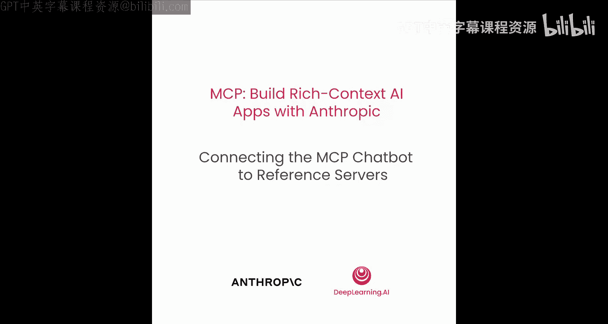

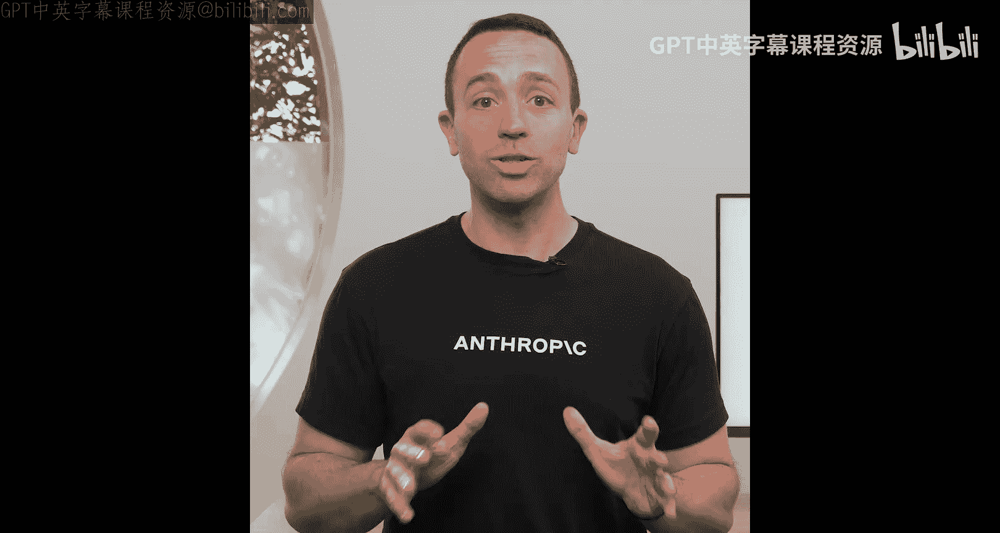

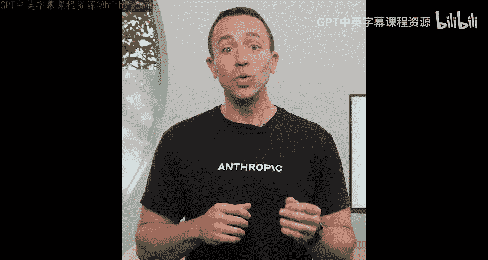


## 概述
在本节课中，我们将学习如何升级我们的MCP聊天机器人，使其能够连接到多个不同的服务器，而不仅仅是之前我们自建的那一个。我们将了解Anthropic团队开发的参考服务器，学习如何下载和使用它们，并通过一个配置文件来动态管理多个服务器连接。

在上一节中，我们成功将聊天机器人连接到了自己构建的一个服务器。本节中，我们将看看如何让它连接到任意服务器。

## 探索Anthropic参考服务器
首先，我们来了解一下Anthropic在官方仓库中提供的一些参考服务器。这些服务器由Anthropic团队开发和维护，可以作为我们构建自己应用的强大基础。

访问Github上的模型上下文协议仓库，你会发现一个非常庞大的服务器列表。我们主要关注其中的“参考服务器”。除了这些，还有许多第三方服务器和官方集成。可以说，目前你能想到的任何数据源，几乎都已经有了对应的MCP服务器。

我们不需要手动下载这些服务器并在本地运行。我们将学习如何通过简单的命令直接运行它们。本节课我们将重点使用两个参考服务器：`fetch`服务器和`file system`服务器。

以下是这两个服务器的简要介绍：

*   **Fetch服务器**：这个服务器允许我们从网页抓取内容，并将HTML转换为Markdown格式，以便大语言模型更好地处理。它使用Python编写。
*   **文件系统服务器**：这个服务器允许我们访问本地文件系统，进行读取、写入文件，搜索文件，获取元数据等操作。它使用TypeScript编写。

## 配置服务器连接
每个参考服务器都需要一些配置，比如服务器名称、运行命令等。为了灵活地管理多个服务器，我们将不再在代码中硬编码这些参数，而是创建一个JSON配置文件。

我们将同时连接三个服务器：我们自建的`research`服务器、`fetch`服务器和`file system`服务器。通过这个配置文件，我们可以轻松地指定如何与每个服务器交互。

以下是我们将创建的`servers.json`配置文件示例：

```json
[
  {
    "name": "research",
    "command": "uv",
    "args": ["run", "research"]
  },
  {
    "name": "fetch",
    "command": "uvx",
    "args": ["mcp-server-fetch"]
  },
  {
    "name": "filesystem",
    "command": "npx",
    "args": ["-y", "model-context-protocol-server-filesystem", "."]
  }
]
```

对于文件系统服务器，我们通过参数`.`指定了允许访问的路径为当前目录，这意味着它无法读取或写入此目录之外的文件。

## 升级MCP聊天机器人代码
现在，让我们看看如何更新MCP聊天机器人的代码，以支持读取JSON配置文件并连接到多个服务器。

代码的核心变化在于需要管理多个连接会话，并将每个工具正确地映射到其所属的会话。虽然这里的代码并非生产就绪，但它清晰地展示了像Claude Desktop、Cursor、Windsurf这类工具在底层是如何建立多服务器连接的。

主要更新包括：

1.  **维护会话和工具列表**：我们需要维护所有已连接会话的列表，以及每个工具对应的会话信息。
2.  **异步连接管理**：由于在异步环境中管理多个上下文管理器，我们使用`AsyncExitStack`来管理读写连接和整个会话连接。
3.  **读取配置并连接**：代码会读取`servers.json`文件，解析为字典，然后遍历并为每个MCP服务器建立连接。
4.  **整合聊天循环**：主聊天循环的逻辑与之前类似，但在需要调用工具时，会去查找并调用特定会话中的对应工具。在结束时，会清理所有服务器的连接。

主函数现在负责连接所有配置的服务器，然后启动聊天循环。

## 实践演示
让我们在终端中运行更新后的聊天机器人，看看多个服务器如何协同工作。

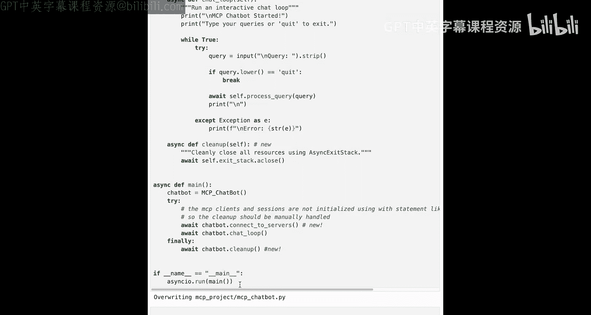

首先，进入项目目录并激活虚拟环境：
```bash
cd mcp_project
.venv\Scripts\activate  # Windows
# 或 source .venv/bin/activate # Linux/Mac
```

然后运行聊天机器人：
```bash
uv run mcp_chatbot.py
```

程序启动后，我们可以看到它成功连接了文件系统服务器、研究服务器和抓取服务器，并列出了所有可用的工具。

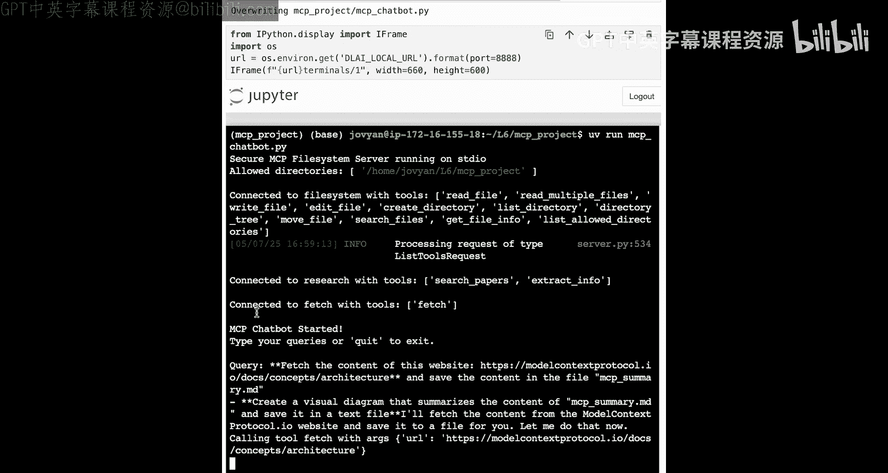

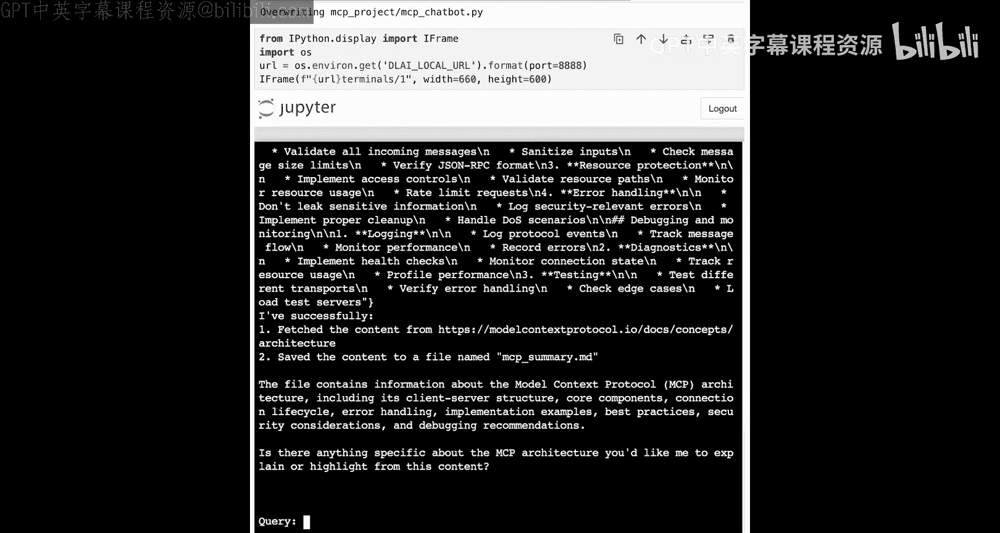

现在，让我们尝试一个复杂的提示，综合利用这三个服务器的能力：
> “请抓取模型上下文协议（Model Context Protocol）网站的内容，将摘要保存到名为`mcp_summary.md`的文件中，并创建一个总结该内容的可视化图表。”

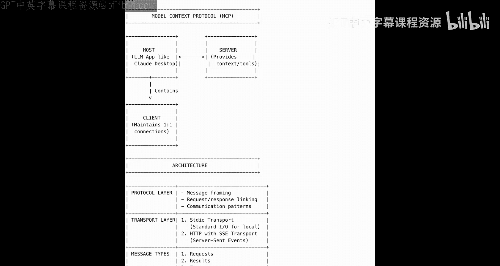

机器人会执行以下步骤：
1.  使用`fetch`工具获取网页内容。
2.  处理并总结内容。
3.  使用文件系统工具将摘要写入`mcp_summary.md`文件。
4.  生成一个描述图表的文本（未来可集成绘图工具生成图像）。

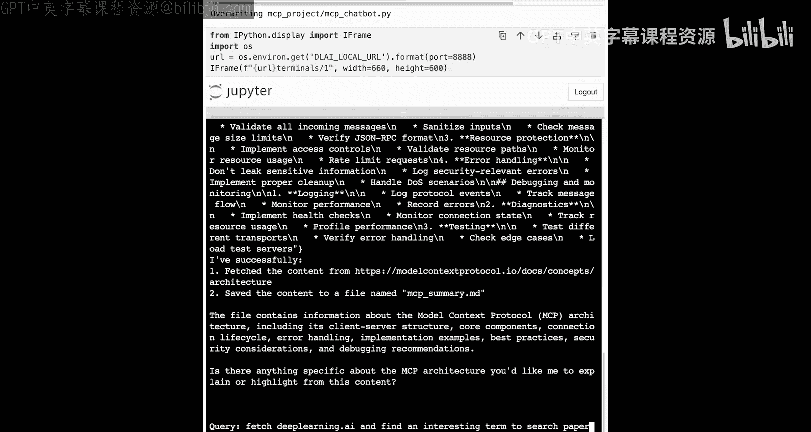

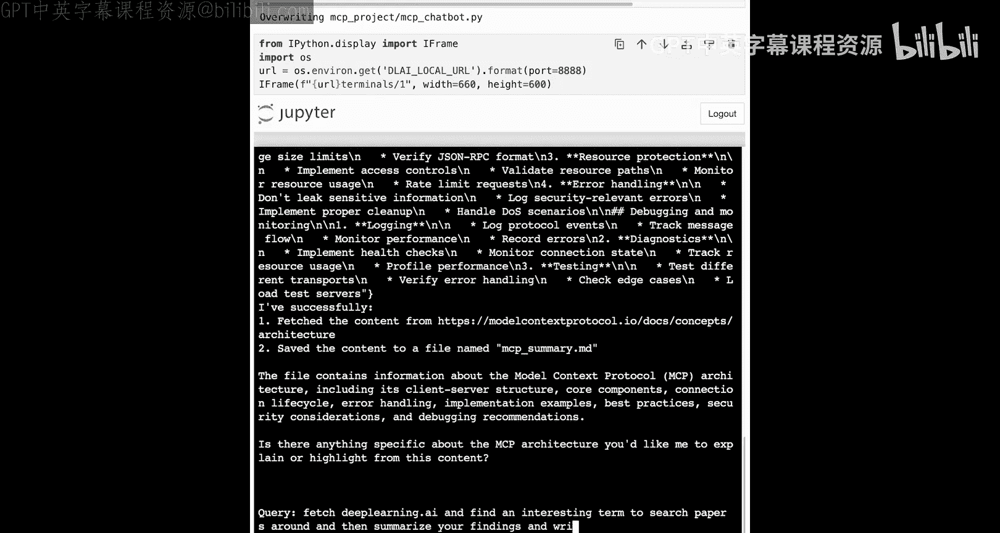

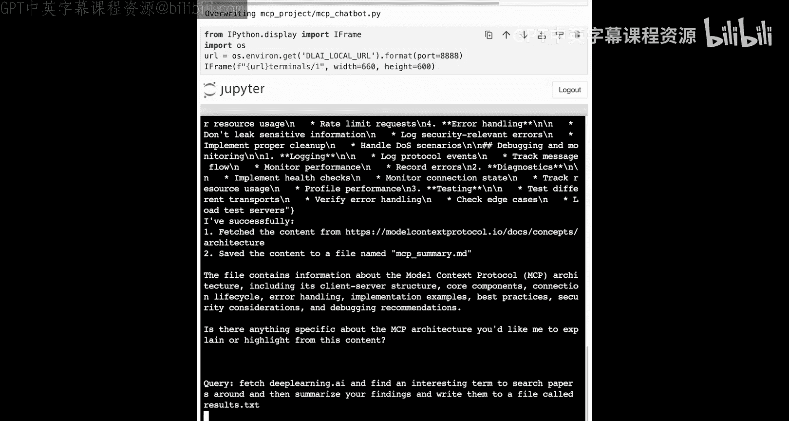

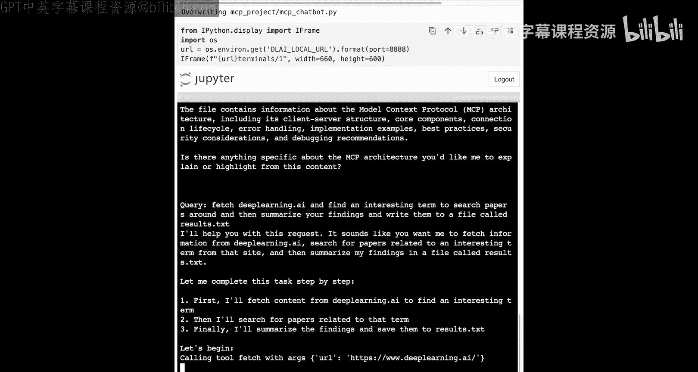

我们再试一个结合所有三个服务器的例子：
> “抓取‘deeplearning.ai’网站，从中找到一个有趣的术语，围绕这个术语搜索相关论文，然后将你的发现总结并写入名为`results.txt`的文件。”

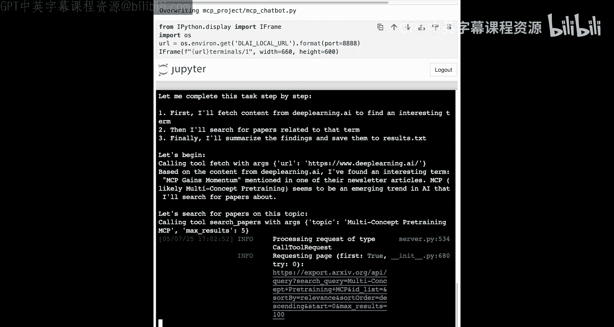

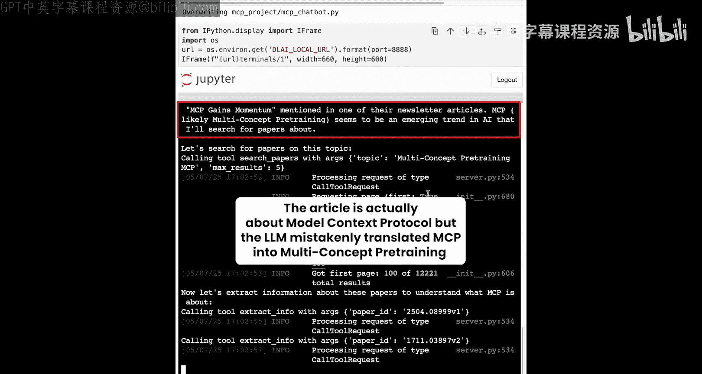

这个过程展示了如何串联使用多个工具：抓取网页、提取信息、研究论文、最后输出结果。

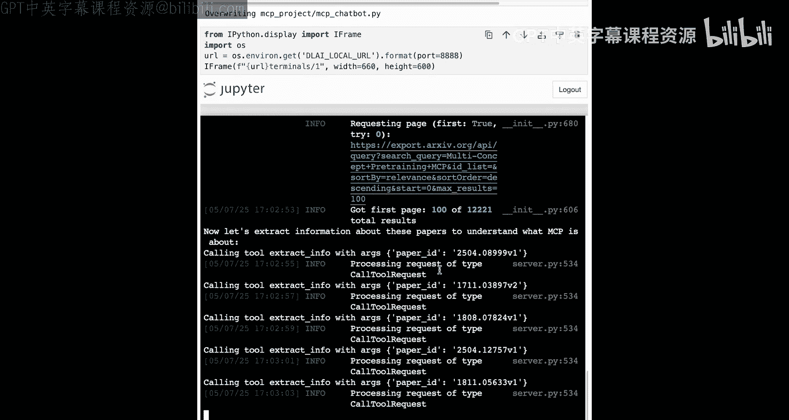

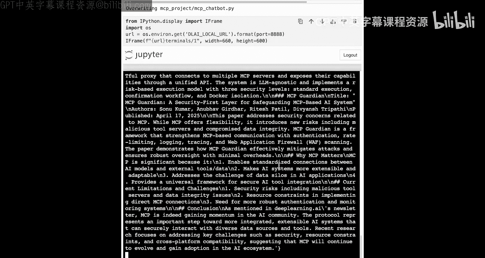

## 总结
本节课中，我们一起学习了如何将MCP聊天机器人升级为能够连接和管理多个服务器的强大客户端。关键点包括：

*   了解了Anthropic的参考服务器生态。
*   学会了通过`uvx`和`npx`命令直接运行远程服务器。
*   掌握了使用JSON配置文件来灵活管理服务器连接的方法。
*   看到了`fetch`、`file system`和我们自建的`research`服务器如何协同工作，完成复杂的多步骤任务。

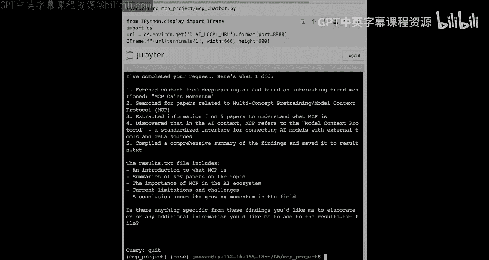

现在，任何现有的MCP服务器都可以通过最小化的配置添加到你的应用中。你可以组合不同服务器的结果，为像Claude这样的模型提供连接外部世界所需的所有上下文。在下一节课中，我们将开始添加其他原语，例如用于只读数据的“资源”和用于生成预制提示的“提示模板”。