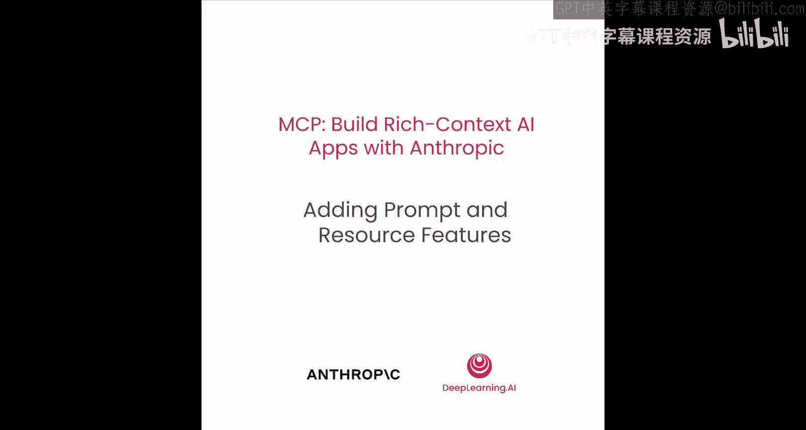
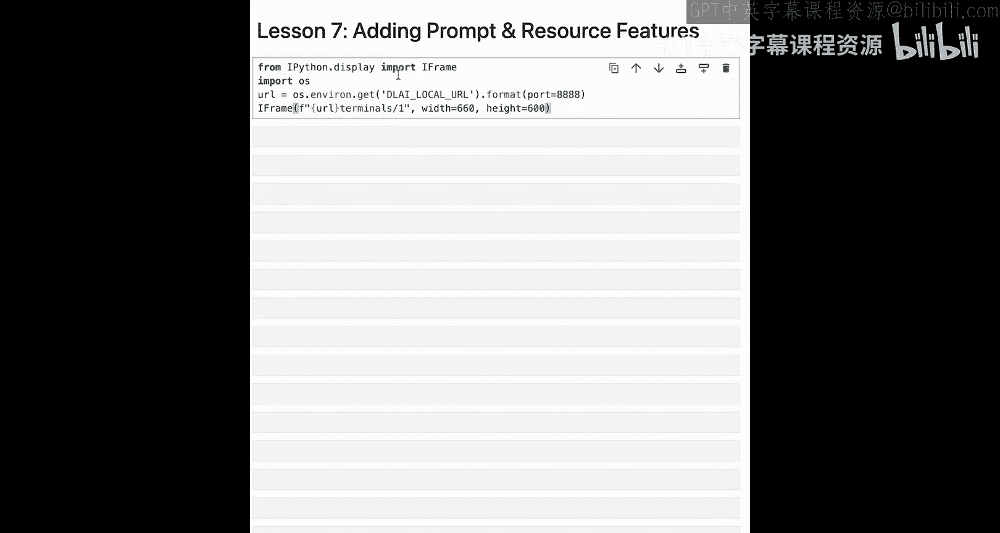
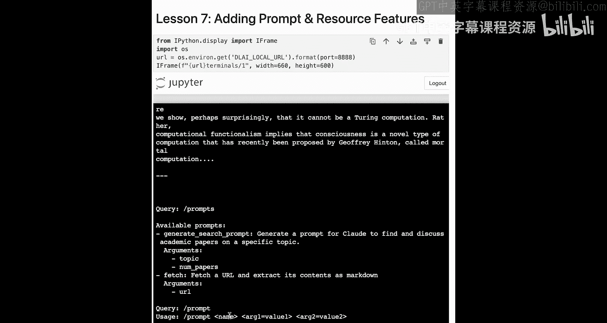
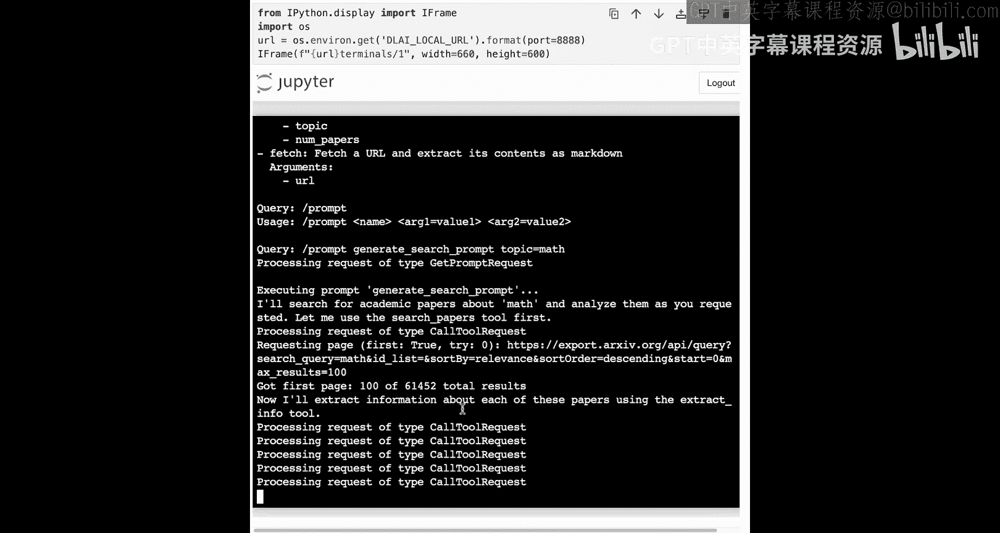
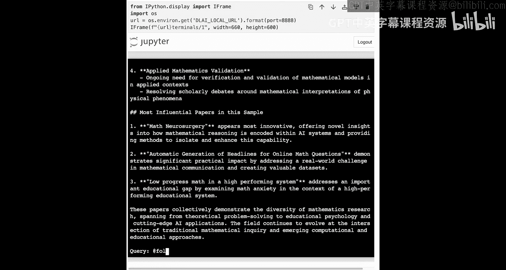
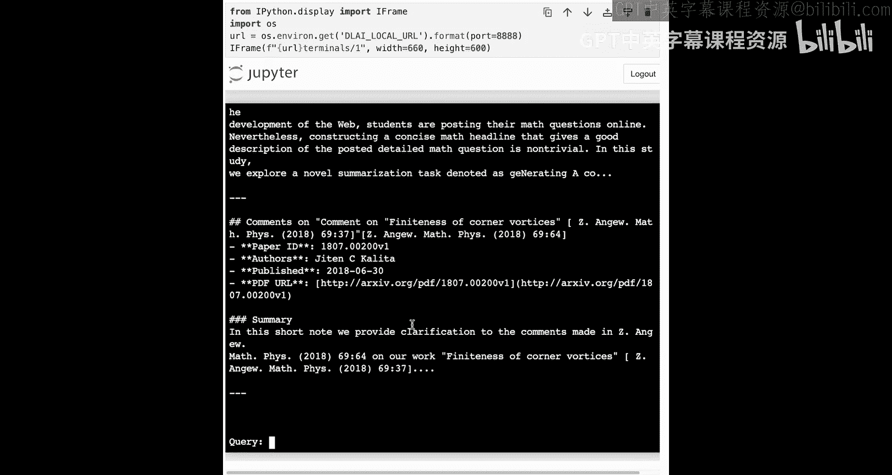

# 008：添加提示词与资源功能




## 概述

在本节课中，我们将学习如何为MCP服务器添加两个新功能：**资源**和**提示词模板**。我们将看到如何在服务器端定义它们，以及如何在客户端（聊天机器人）中消费和使用这些功能，从而为用户提供更丰富、更便捷的交互体验。

---

## 从工具到资源与提示词

上一节我们介绍了如何创建连接多个MCP服务器的客户端。现在，让我们回到协议中的其他核心概念，比如**资源**和**提示词**，并探讨如何在服务器端添加它们，以及如何让客户端具备消费这些数据的能力。

在我们的研究服务器代码中，你可以找到所有相关文件。接下来，我们将一起浏览服务器端和客户端的一些关键代码。

正如之前所见，添加一个工具非常简单，只需使用 `@mcp.tool` 装饰器。现在，让我们引入资源和提示词，并讨论如何添加它们。

---

## 在服务器端添加资源

当前代码运行在我们的服务器上。我们将为特定的文件夹以及特定主题的论文引入一些资源。

请记住，**资源**是只读数据，应用程序可以选择使用它，或者将其提供给模型。我们不是创建工具去文件系统中获取数据（就像用HTTP的GET请求获取数据一样），而是对资源做同样的事情。

在服务器端，我们定义了两个资源：
1.  一个URI为 `papers://folders` 的资源，用于列出论文目录中可用的文件夹。
2.  一个用于获取特定主题信息的资源。

目前，我们尚未实现这些资源的具体呈现方式或获取逻辑。在服务器端，我们只是设置了监听这些特定资源请求的方法。

代码中包含了一些字符串操作和文件读取逻辑，以获取必要的数据，并附带错误处理，确保在找不到论文时返回错误信息。我们可以看到，代码正在从 `papers_info.json` 文件中读取数据，然后返回包含相关内容的文本。

**服务器端资源定义示例（概念）**：
```python
@mcp.resource(uri="papers://folders")
def list_folders():
    # 读取目录并返回文件夹列表
    ...

@mcp.resource(uri="papers://topic/{topic_name}")
def get_papers_by_topic(topic_name: str):
    # 根据主题读取JSON文件并返回论文信息
    ...
```

---

## 在服务器端添加提示词模板

除了资源，我们还可以向MCP服务器添加**提示词**或**提示词模板**。

在深入代码之前，让我们回顾一下提示词模板这个原语的目的。提示词旨在由用户控制。作为AI应用的用户，你不需要自己进行复杂的提示词工程。实际上，你可能正在使用一个服务器，试图获取一些信息，但根据你已有的提示，你可能不知道获取或检索信息的最佳方式。

提示词模板在服务器上创建并发送给客户端，以便用户可以使用这些完整的模板，而无需自己进行所有的提示词工程。因此，我们不是要求用户指定如何搜索论文，而是将提供一个经过实战检验的提示词模板，其中包含他们可以填入的动态信息，比如主题或论文数量。你可以想象，我们可以进行一些相当复杂的评估和提示词工程测试，而到达用户手中时，这一切都被抽象化了。

我们通过使用 `@mcp.prompt` 装饰一个函数来创建提示词模板，然后返回该模板的样子。在客户端，我们只需要让用户输入论文数量（可选）和主题（必需）。

**服务器端提示词模板定义示例（概念）**：
```python
@mcp.prompt()
def generate_search_prompt(topic: str, num_papers: int = 5):
    return f"""
    请搜索关于 {topic} 的学术论文。
    请返回 {num_papers} 篇最相关的论文摘要。
    """
```

---

## 在客户端消费资源与提示词

现在我们已经了解了服务器将发送什么给客户端，接下来需要弄清楚如何开始引入这些资源和提示词，以及如何为它们创建用户界面。

我们创建的UI和呈现方式完全由开发者决定。MCP的强大之处在于，它并不强制所有界面看起来和工作方式都一样。它只专注于发送和操作数据，而呈现方式则由客户端和宿主应用来创建。

考虑到这一点，让我们回到聊天机器人代码。和之前一样，这里会有一些稍微底层的代码。幸运的是，它与我们之前看到的代码相对类似。

我们将存储可用工具和提示词的列表，以及所有特定资源的URI。在我们的 `connect_to_server` 函数中，代码看起来和之前很相似。我们将使用 `ExitStack` 在异步环境中管理所有连接，初始化会话，然后不仅仅是获取工具，对提示词和资源也做同样的事情：使用为每个客户端建立的会话来列出提示词、工具和资源。如果服务器不提供提示词或资源，我们会处理错误并打印异常。连接服务器时出现的任何问题也会被处理。

`connect_to_servers` 函数看起来和之前相似，读取JSON文件并加载所有服务器名称和必要配置。`process_query` 函数也相对类似，我们将创建一个包含可用工具的消息，如果使用工具调用，就追加该信息，并确保调用正确的工具。

代码开始有所不同之处在于处理资源和提示词模板的部分。

**处理资源**：
要获取单个资源，我们需要确保处理正确的URI。一旦有了正确的URI，我们就从该URI读取资源。在这里，我们只是简单地打印出该特定资源的内容。但根据你想要构建的界面，你可以对这些数据做任何你想做的事情。

**处理提示词**：
我们将列出所有可用的提示词。如果这些提示词需要任何参数，我们会将其展示给用户。当有提示词输入时，我们将执行它。对于我们所处的特定会话，我们获取该提示词，然后用查询来执行它。执行提示词的函数需要获取提示词名称及其可能需要的任何参数。一旦获取到特定提示词，我们就将其作为消息内容传入，并使用这些参数处理查询。

**聊天循环的不同之处**：
聊天循环是我们开始添加特定用户界面的地方，用于获取资源和提示词。这里进行了一些字符串操作，这完全取决于作为宿主和客户端开发者的你，希望如何呈现内容。
*   我们将使用 `@` 符号来获取特定资源。如果我们看到首先传入了一个主题，就使用该URI来获取它。
*   如果我们看到查询以 `/` 开头，这表示我们正在使用一个特定的提示词。
*   如果命令是 `/prompts`，我们将向用户展示所有提示词。
*   如果命令是 `/prompt`，我们将确保传入参数。为了传入参数，我们同样进行了一些字符串操作，寻找由等号分隔的键值对。一旦获得所需信息，就执行提示词。



我们还有与之前相似的清理逻辑以及连接聊天机器人的逻辑。

---

## 实战演示

代码部分很多，让我们退一步，在终端中实际查看效果。

进入项目目录并激活虚拟环境后，运行我们的聊天机器人：
```bash
python mcp_chatbot.py
```

我们将看到，这里连接到了许多不同的MCP服务器。代码中包含了一些错误处理，以防这些服务器不提供工具、资源或提示词。

我们不仅可以看到进行查询并与大语言模型对话的能力，还可以访问我们拥有的资源。例如，查看可用的文件夹，代码会读取特定URI的资源，并显示一个名为“computers”的文件夹（这是之前搜索的结果）。我们可以访问这些论文，相关信息会直接显示出来。

现在，我们无需编写工具来获取数据，也无需模型完成所有工作，而是可以直接向模型提供这个上下文。如果模型选择将其添加到上下文窗口中，并且应用程序需要，我们就可以利用它。



让我们看看可用的提示词。服务器上创建了一个名为 `generate_search_prompt` 的提示词，我们还可以看到 `fetch` 服务器也提供了一个用于获取URL内容并将其提取为Markdown的提示词，其参数是URL。

**使用提示词**：
使用方法是添加 `/prompt` 命令。我们会看到用法要求提供提示词名称以及任何必需的参数。让我们使用我们的 `generate_search prompt`：
```
/prompt name=generate_search_prompt topic=math
```
`num_papers` 参数是可选的，所以我可以传入一个数字，或者默认为5。使用这个带有我定义的动态变量 `topic` 的提示词后，我们将看到代码处理该提示词，生成必要的文本并执行它。

这个过程看起来很熟悉：与 `arxiv` 对话以获取特定论文，然后将这些论文添加到我们为“math”创建的文件夹中。完成后，我也应该能够通过资源访问这些数据。请记住，随着应用程序中数据的更改，这些资源是动态更新的。

查询完成后，我们可以看到模型给我的回复。查看我们的文件夹，现在可以看到“computers”和“math”主题。如果想访问该文件，可以查看其中的内容。这样，我们就结合使用了提示词和资源。

---





## 总结

本节课我们完成了不少内容。我们探索了如何在服务器上添加提示词和资源，然后在聊天应用中消费它们。我们将工具、资源和提示词等核心原语结合起来，并连接了多个MCP服务器。



在下一课中，我们将开始为更强大的界面引入其他类型的宿主应用，但会用到我们之前学到的许多概念。