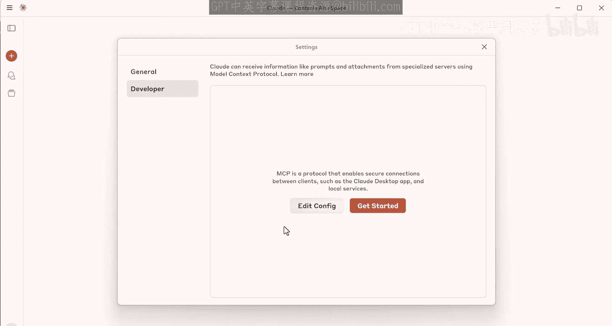
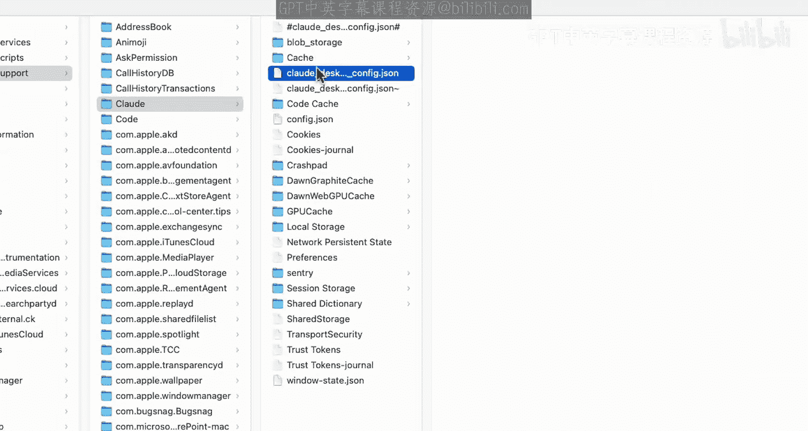
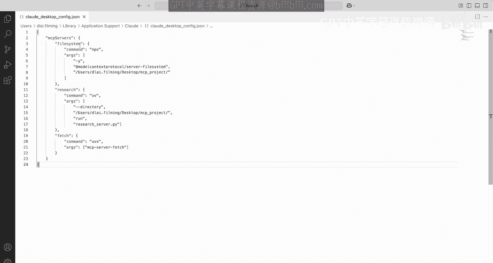
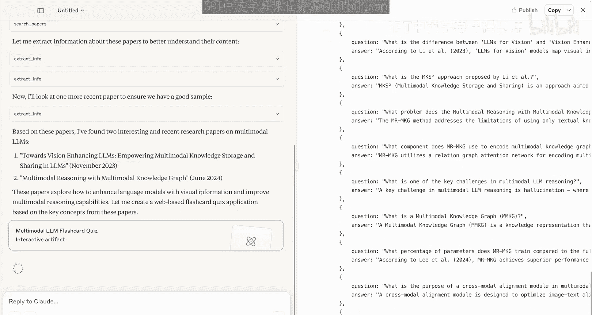
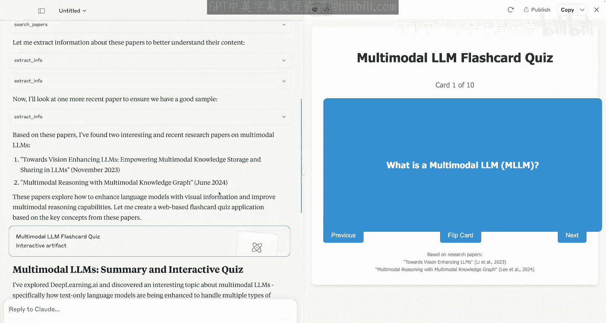
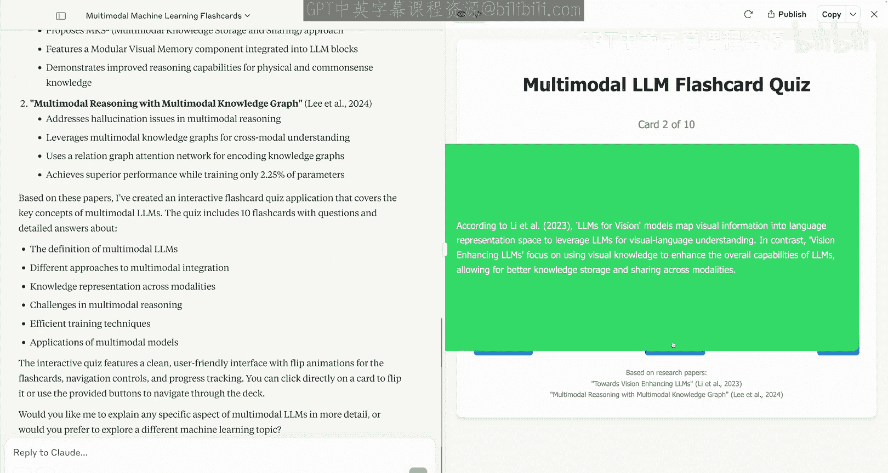
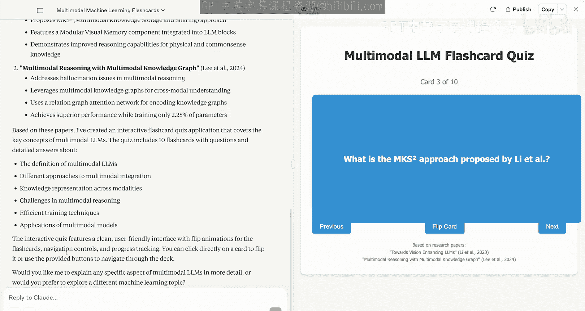
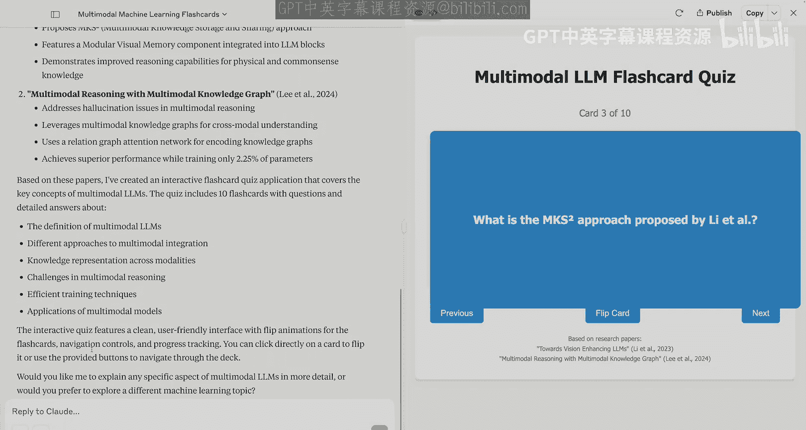

# 009：为Claude Desktop配置服务器 🖥️

在本节课中，我们将学习如何将我们构建的MCP服务器与Claude Desktop这类MCP兼容的应用程序连接起来。你将看到如何通过简单的配置，让Claude Desktop自动连接并管理MCP服务器，从而省去编写底层网络代码的麻烦。

## 概述

上一节我们介绍了如何构建自己的MCP服务器和客户端。本节中，我们来看看如何将服务器集成到像Claude Desktop这样的现成应用程序中。通过这种方式，我们可以利用这些应用程序的界面来使用服务器的提示词、资源和工具，而无需处理复杂的客户端代码。

## 配置Claude Desktop连接MCP服务器

首先，确保你拥有之前课程中构建的研究服务器。我们将在一个项目文件夹中设置环境并安装依赖，然后在Claude Desktop中配置服务器连接。

以下是配置步骤：

1.  **初始化环境与安装依赖**：在项目文件夹中，创建并激活虚拟环境，然后安装必要的依赖包。
    ```bash
    python -m venv venv
    source venv/bin/activate  # Windows系统使用 `venv\Scripts\activate`
    pip install anthropic mcp
    ```



2.  **配置Claude Desktop**：打开Claude Desktop，进入设置（Settings）的开发者（Develop）选项，编辑MCP配置文件。
    



3.  **编辑配置文件**：在打开的JSON配置文件中，粘贴服务器的配置信息。关键点在于，需要指定研究服务器的**确切文件路径**，以便Claude Desktop启动它。
    
    配置文件示例结构如下：
    ```json
    {
      "mcpServers": {
        "research-server": {
          "command": "python",
          "args": ["/完整/路径/到/你的/research_server.py"]
        }
      }
    }
    ```
    这个过程抽象了底层的子进程连接和网络通信，我们无需再手动编写这些代码。

4.  **重启应用**：修改配置文件后，需要关闭并重新启动Claude Desktop以建立连接。

## 探索MCP兼容的应用程序生态系统

成功重启后，你可以在Claude Desktop的界面中访问已连接服务器提供的工具、资源和提示词。



Claude Desktop只是众多支持模型上下文协议（MCP）的应用程序之一。在MCP官方文档中，你可以找到一个不断增长的支持MCP集成的应用程序列表。

以下是主要的应用程序类别：

*   **Web应用与代理程序**
*   **命令行界面（CLI）工具**
*   **集成开发环境（IDE）**

这些应用程序都支持MCP的核心原语，如资源、提示词和工具。你可以点击其中任何一个，了解如何在这些现成的应用环境中与MCP服务器交互。其强大之处在于，虽然这个生态系统看起来很庞大，但通过构建自己的服务器，你已经理解了其底层的工作原理。

## 实践：组合多服务器功能

现在，让我们将所有这些功能结合起来，进行一次实践。我们将使用来自不同MCP服务器的工具组合来完成一个任务。

我们将执行以下操作：
1.  使用 **fetch工具** 访问DeepLearning.AI网站，寻找一个有趣的机器学习主题。
2.  使用 **研究服务器** 的 `search_papers` 工具，查找并总结与该主题相关的几篇论文。
3.  利用Claude Desktop的 **“工件”（artifacts）** 功能，基于论文中的关键主题，生成一个带有闪卡集的Web测验应用。

这个过程展示了如何组合不同服务器的工具来获取所需数据，并利用应用程序的高级功能（如可视化）构建强大的跨领域应用。




虽然这只是一个简单的例子，但它启发了无数潜在用例，从摘要生成到交互式应用开发。

## 总结

本节课中，我们一起学习了如何使用像Claude Desktop这样的工具来连接MCP服务器，从而抽象掉大量的底层网络和编码工作。我们还浏览了众多不同的MCP兼容应用程序，它们可以帮助你在各种IDE、Web应用和桌面客户端中快速启动和运行。


在下一节中，我们将更深入地探讨如何构建远程MCP服务器。





我们下节课再见。
