# 010：创建与部署远程服务器 🚀

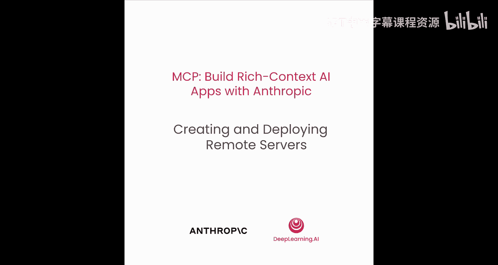

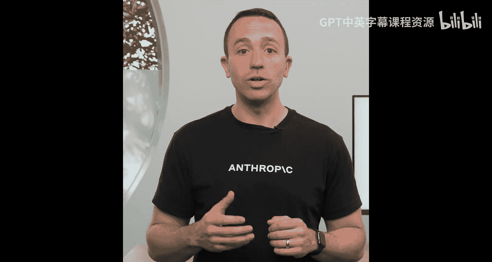

在本节课中，我们将学习如何构建、测试并部署一个远程MCP服务器。我们将了解如何将本地运行的服务器转换为可通过网络访问的远程服务，并使用云平台进行部署。

---

上一节我们介绍了如何在本地构建和连接MCP服务器。本节中，我们来看看如何让服务器在远程运行，以便任何地方的客户端都能连接。

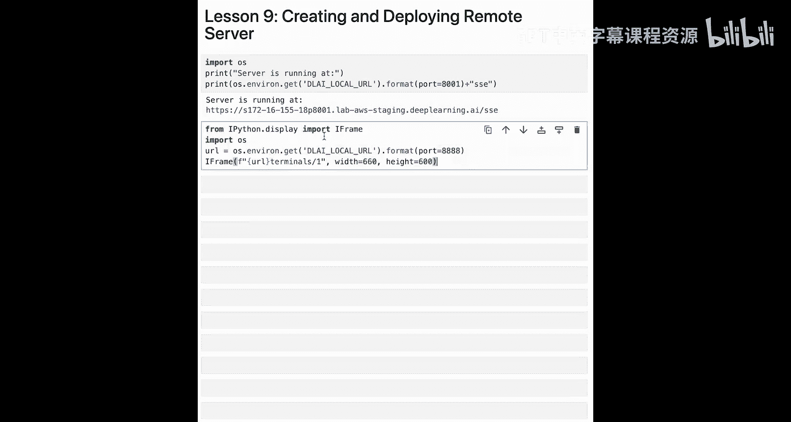

## 构建远程服务器

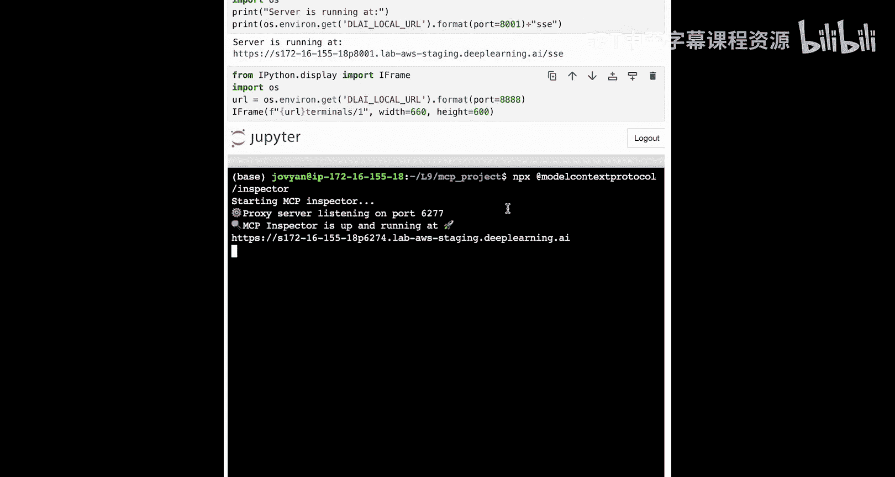

将本地服务器转换为远程服务器，其核心代码逻辑无需大幅改动。主要区别在于底层的通信传输方式。

以下是远程服务器的核心配置，关键在于指定了SSE传输方式：

```python
# 在服务器代码底部指定传输方式
# 当前SDK暂不支持HTTP流式传输，因此使用SSE
transport = SSETransport()
```

服务器中的工具、资源和提示词等核心功能保持不变。

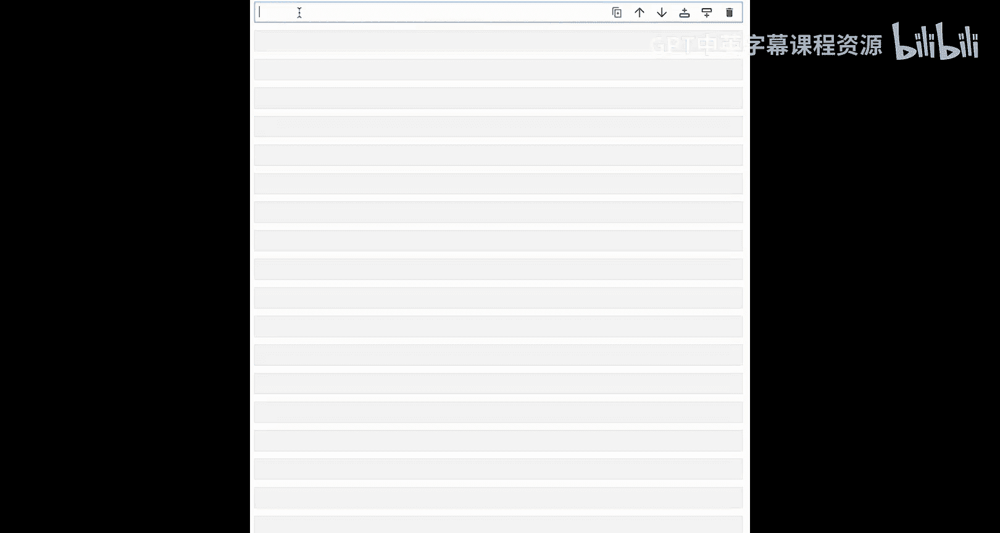

## 测试远程连接

服务器配置完成后，我们需要测试远程连接是否正常。

以下是使用MCP检查器连接远程服务器的步骤：

1.  启动检查器。
2.  在检查器界面中，确保代理地址正确。
3.  将传输类型设置为SSE。
4.  输入远程服务器的SSE连接URL。
5.  点击连接。

连接成功后，检查器将显示服务器提供的资源、提示词和工具列表，证明远程连接已建立。

## 部署到云平台

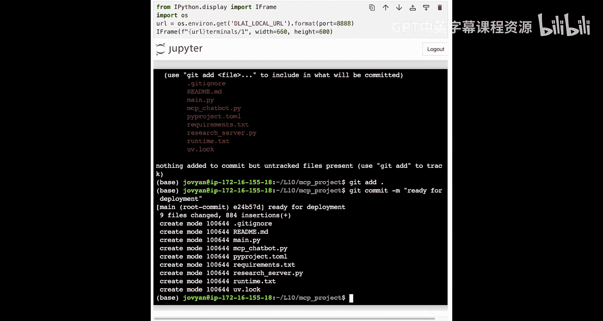

测试通过后，我们可以将服务器部署到云平台，使其公开可用。这里我们使用Render平台进行演示。

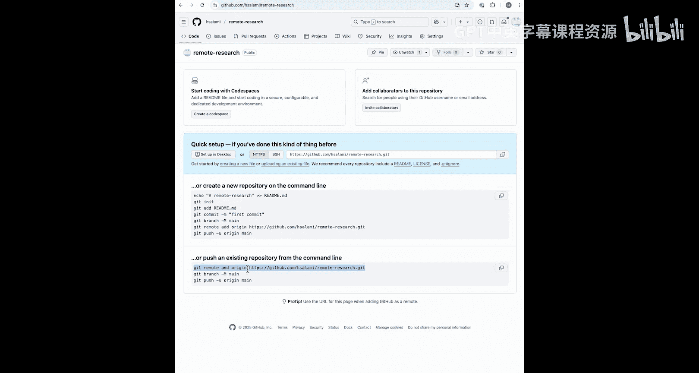

部署前需要将代码推送到GitHub仓库，以便Render拉取。

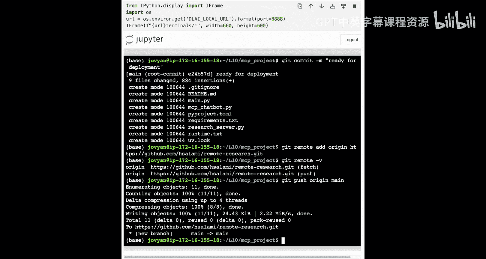

以下是准备代码仓库的步骤：

*   **初始化Git仓库**：在项目目录中执行 `git init`。
*   **创建.gitignore文件**：排除虚拟环境等不需要提交的文件夹，例如添加 `venv/`。
*   **转换依赖管理**：由于Render暂不支持Uv，需将依赖转换为Pip可识别的格式。使用命令 `uv pip compile pyproject.toml > requirements.txt` 生成 `requirements.txt` 文件。
*   **指定Python版本**：创建 `runtime.txt` 文件，并写入 `python-3.11.11` 以指定运行时版本。
*   **提交代码**：执行 `git add .` 和 `git commit -m "ready for deployment"`。
*   **关联远程仓库**：在GitHub创建新仓库，并按照提示将本地仓库推送到远程。

代码推送到GitHub后，即可在Render平台进行部署。

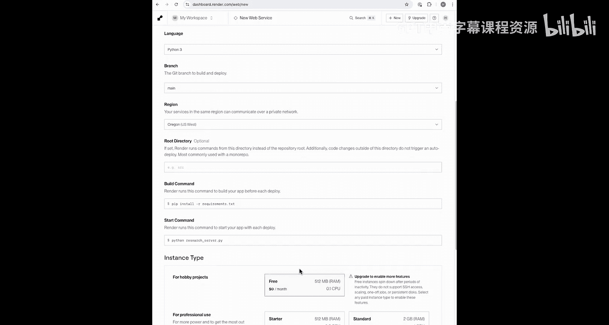

以下是Render部署流程：

1.  登录Render控制台，点击“New Web Service”。
2.  连接你的GitHub账户，并选择刚创建的代码仓库。
3.  在部署设置中，将启动命令修改为 `python research_server.py`。
4.  选择免费计划，然后开始部署。

部署过程需要几分钟。完成后，访问服务根URL可能会看到404错误，这是正常的。访问SSE端点（例如 `your-service.onrender.com/sse`）并看到返回的会话ID，即表示服务器已成功部署并运行。

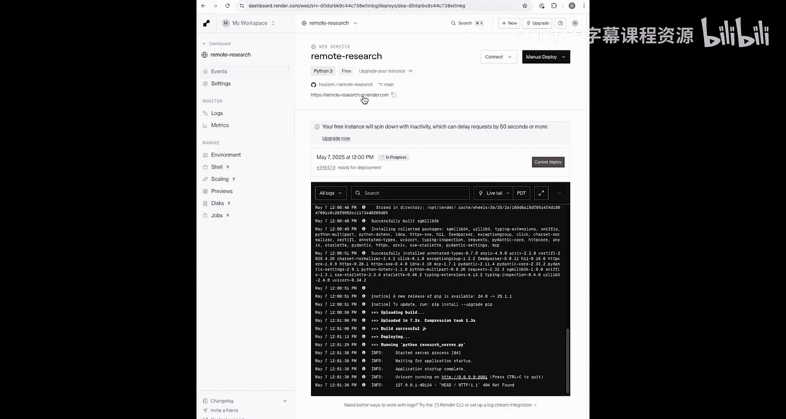

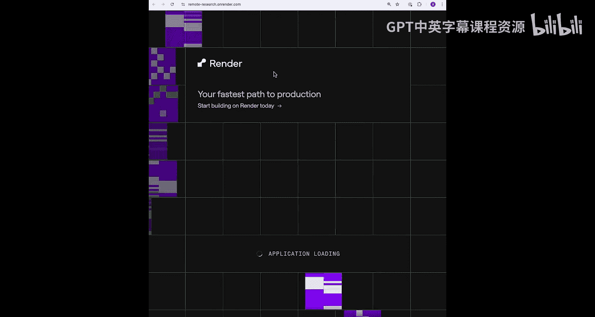

---

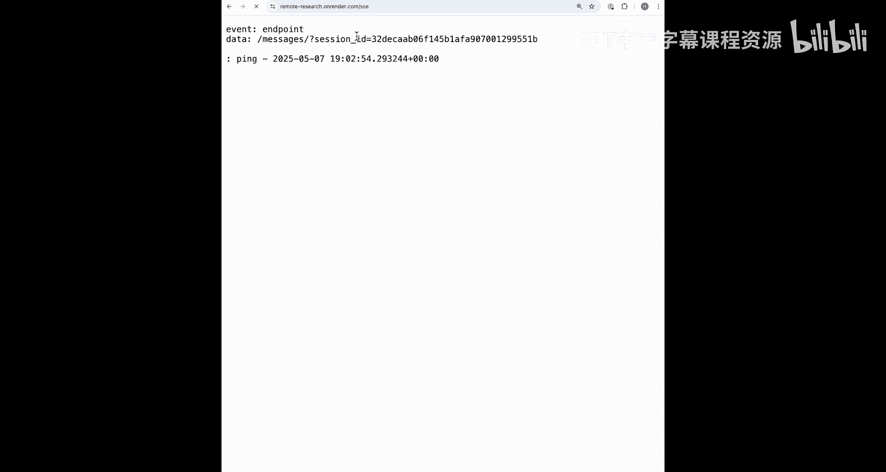

本节课中我们一起学习了如何将MCP服务器从本地运行扩展到远程部署。我们了解了修改传输配置、测试远程连接，以及通过GitHub和Render平台完成自动化部署的全过程。现在，你的AI应用已经可以连接到任何地方的远程MCP服务器了。