# 011：总结与展望 🎯

在本节课中，我们将回顾整个课程的核心内容，并探讨模型上下文协议（MCP）的未来发展方向，包括一些尚未深入介绍的高级功能与即将到来的新特性。

## 课程回顾

在之前的课程中，我们学习了MCP的核心概念。我们构建了一个能够暴露工具、资源和提示的服务器，开发了一个聊天机器人并连接到多个服务器，使用云桌面构建了更复杂的应用程序，并部署了自己的远程服务器。

MCP协议本身也在不断发展。在这最后一课中，我们将了解MCP的其他功能，以及协议即将推出的一些令人兴奋的新特性。

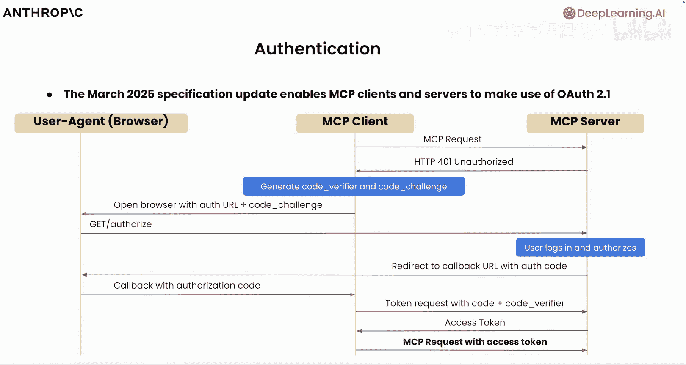

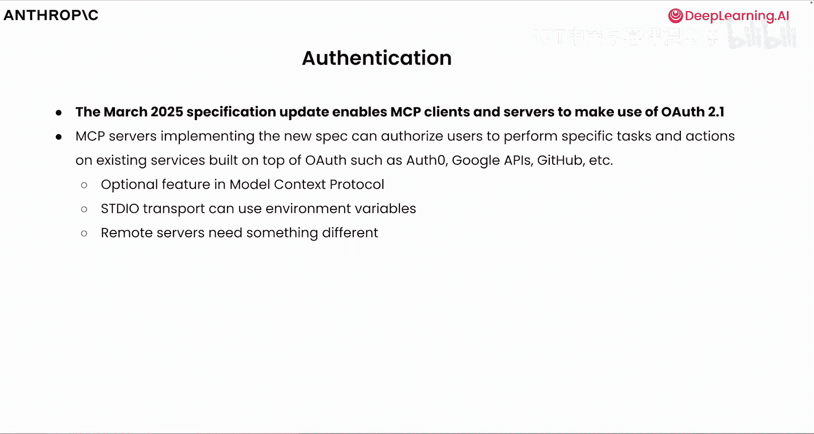

## 协议高级功能

我们已经学习了关于模型上下文协议的许多知识，包括主机、客户端、服务器、工具、资源和提示。我们也有机会编写代码，利用所有这些概念来驱动更大的应用程序。然而，关于模型上下文协议，仍有一些内容我们尚未涉及。其中许多功能正处于积极开发阶段，您始终可以通过Github上的规范说明和相关讨论来了解最新进展。

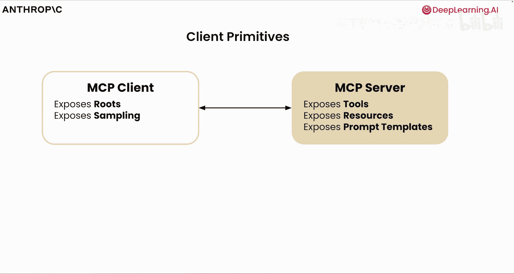

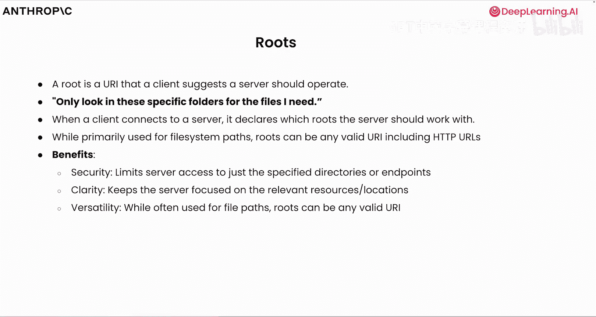

### 认证机制 🔐

我们尚未涉及的第一部分是模型上下文协议中的认证。在三月份的规范更新中，**OAuth 2.1** 被添加为与远程服务器进行认证的手段。这使得客户端和服务器能够进行身份验证，并向数据源发送经过身份验证的请求。您可以想象，许多不同的服务器需要访问需要某种形式认证的数据。这需要客户端向服务器发出请求，然后服务器要求某个用户进行身份验证。一旦认证过程成功完成，客户端和服务器就可以交换令牌，客户端可以向服务器（进而向数据源）发出经过身份验证的请求。协议的这一部分正在积极开发中，总是有新的功能和安全措施被添加进来。但认证将主要通过 **OAuth 2.1** 协议完成。需要强调的是，这是模型上下文协议的一个可选功能，但对于具有标准I/O的远程服务器，强烈推荐使用。我们使用环境变量，不需要这种认证。这是建立在既定标准之上的，您可以通过下面的链接查看。

### 客户端原语

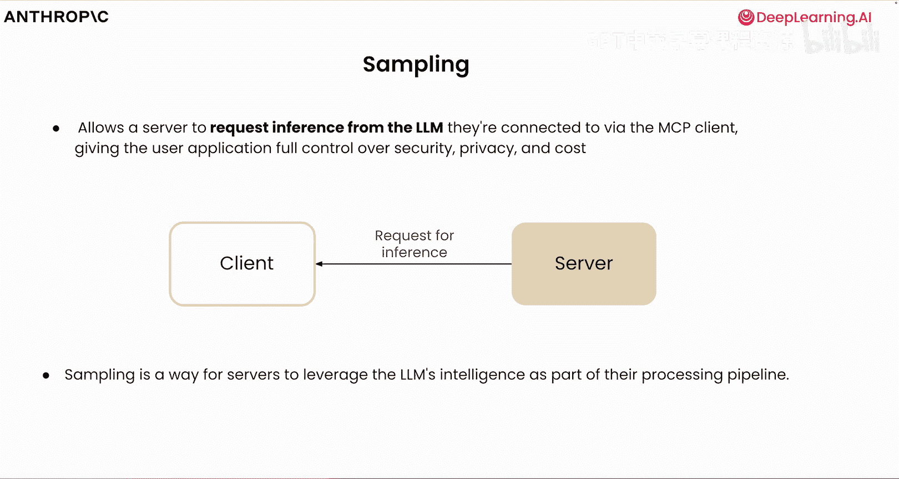

在探索了服务器可以暴露的原语（工具、资源和提示）之后，我们还有客户端可以暴露的原语。这些包括**路由**和**采样**。让我们深入了解它们。

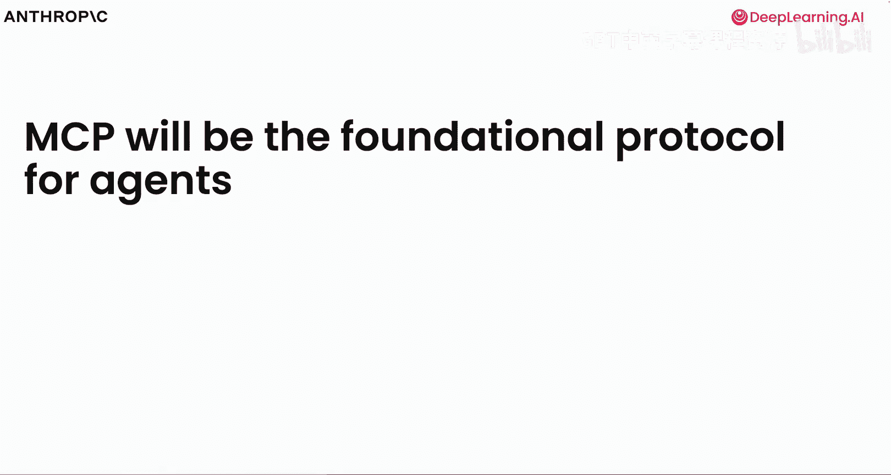

**路由**是客户端建议服务器应在其中操作的URI。其核心思想是，当客户端连接到服务器时，只查看特定文件夹中您可能需要的文件。它可以声明服务器应使用的路由。这对于文件系统路径很有用，但也可以是任何有效的URI，包括HTTP URL。路由的好处在于允许安全限制，使服务器专注于相关的文件路径或位置。路由也具有一些内置的通用性，它们对文件路径很有用，但也可以是任何有效的HTTP URI。我们正慢慢看到越来越多的客户端采用这个原语，这是一个随着协议发展需要关注的重要特性。

### 采样功能

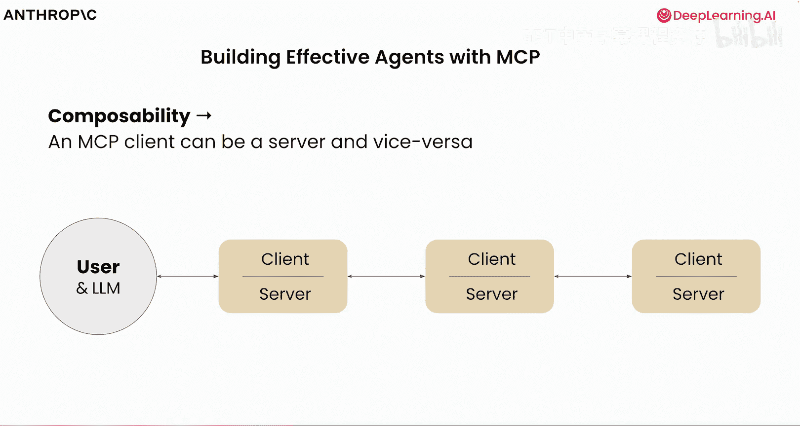

**采样**允许服务器向大型语言模型请求推理。这有点像通信的另一面，不是客户端与大型语言模型对话，而是服务器可以反过来与客户端对话并请求推理。一个例子可能是用户报告网站因某种原因变慢的情况。您的MCP服务器可以收集服务器日志、性能指标、错误日志，并与各种数据源通信以了解情况。服务器不是将这些数据返回给客户端（将所有内容放入上下文窗口，或可能导致服务器与客户端之间的任何安全漏洞），而是可以直接与大型语言模型对话，要求其诊断性能问题。大型语言模型分析模式并返回数据，然后服务器可以生成步骤以使网站不那么慢。当从安全角度存在担忧，或可能违反边界，或者您可能不希望所有数据返回后被放入上下文时，采样和创建采样循环是服务器请求推理的一种非常强大的方式，它切换了我们之前看到的通信方向。

当我们开始探索模型上下文协议的智能体能力时，这也非常强大。随着我们迈向更多模型与不同数据源对话的世界，并赋予模型更多自主权来调用不同的工具并自行行动，我们相信MCP将成为智能体的基础协议。

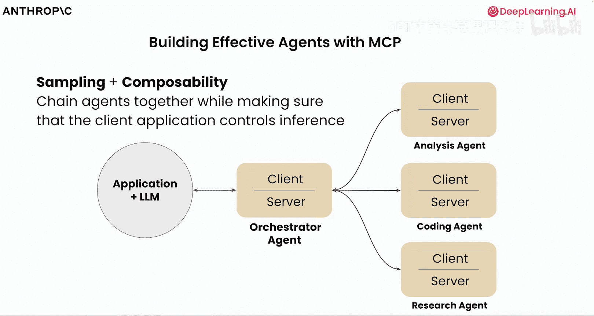

## 多智能体架构与未来路线图

当我们开始思考如何将MCP用于智能体能力时，您可以想象一个场景，用户和大型语言模型需要访问各种MCP服务器。模型上下文协议的强大之处在于它具有可组合性和某种递归性，客户端可以是服务器，服务器也可以是客户端。这使我们能够开始创建一种架构，利用客户端与服务器通信的能力，同时也让服务器能够通过采样向客户端请求所需的数据。我们在这里建立的是多智能体架构的概念，其中应用程序和大型语言模型与一个智能体通信。这个智能体恰好是一个MCP客户端和服务器，它可以将数据提供给应用程序，但也可以通过模型上下文协议连接到其他客户端和服务器。您可以想象，我们有用于分析、编码、研究的智能体，它们也恰好是MCP服务器。如果它们需要通过这种可组合的性质连接到其他服务器或客户端，我们可以开始思考允许多个智能体使用相同协议、说同一种语言的架构。

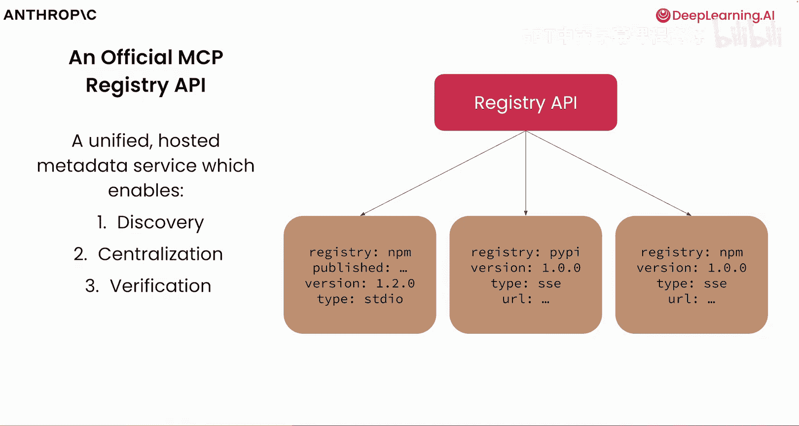

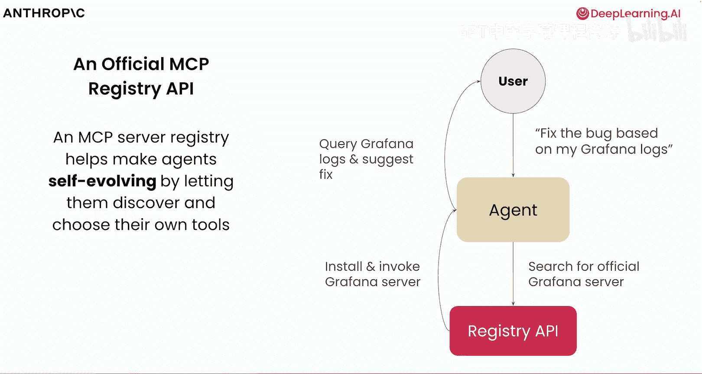

模型上下文协议路线图上的下一个重要部分是**统一注册表**的概念。其目的是标准化我们发现服务器本身的方式。正如我们之前所见，开源社区对此非常兴奋，有许多针对不同数据提供商（如Google Drive、Github等）的服务器，可能有数十个MCP服务器。但就像NPM或PyPI上的软件包一样，这些特定服务器内部可能存在恶意代码。因此，注册表API的用途在于发现服务器、集中管理这些服务器的位置，并验证这些服务器是否已得到社区和公司本身的信任。这也允许对特定的MCP服务器进行版本控制，锁定依赖关系，就像您在应用程序中所做的那样。令人兴奋的是，MCP服务器能够让智能体自行发现它们。您可以想象一个场景，用户需要根据某些日志中的内容修复一个错误。然后，智能体通过注册表API搜索官方的MCP服务器，安装它，查询并在这种特定用例中建议修复。这样，不需要应用程序从一开始就连接到各种服务器，我们可以开始构建能够动态发现和连接MCP服务器的应用程序。当我们结合认证来考虑这一点时，我们可以想象用户有一个请求，需要发现一个服务器（类似于其他协议，如OAuth和Google最近宣布的智能体到智能体协议），将Json文件放在一个众所周知的文件夹中的想法以前已经做过。但在这里，在这个MCP Json中，我们指定要连接的服务器的端点、它暴露的能力或原语，以及所需的认证。因此，用户可能会问：“帮助我管理我在Shopify上的商店。”智能体或AI应用程序将查看Shopify是否有一个众所周知的MCP Json文件。如果有，它将找出要连接哪个端点以及需要什么认证。一旦用户通过身份验证，智能体就可以通过注册表API执行必要的操作。我们可以允许这种动态发现的想法，并通过叠加OAuth 2.1，我们可以确保这些连接是安全的。

## 协议的未来发展

正如您可能在建议和讨论中看到的，协议还有更多内容即将推出。随着越来越多的客户端支持HTTP流式传输，目标是在有状态和无状态能力之间实现平滑过渡。随着远程MCP服务器的持续开发，扩展生态系统以支持更多此类服务器非常重要。您可以想象，当使用多个MCP服务器时，工具很可能出现命名冲突。您可以想象，服务器可能具有通用名称的工具，如“fetch_users”、“fetch_entities”，模型可能会对需要获取什么感到困惑。因此，思考如何防止冲突并创建服务器或工具的逻辑分组非常重要。我们谈到了采样或主动请求上下文。协议和我们进行的对话中投入了大量工作，以使采样等原语变得更加流行。最后，虽然OAuth 2.1对规范来说相对较新，但在大规模认证和授权方面仍有更多需要考虑。

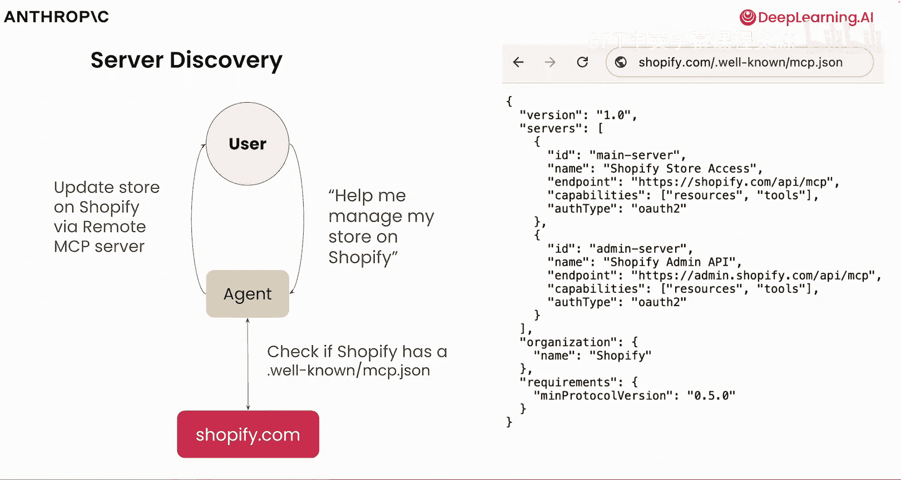

## 总结

在短短的时间内，您已经了解了关于模型上下文协议的许多内容。您从概念上学习了原语，构建了服务器、客户端和主机，并看到了如何部署远程MCP服务器。仍有更多内容有待发现。因此，我鼓励大家查看相关的讨论和对话，并尽可能多地继续构建和研究。

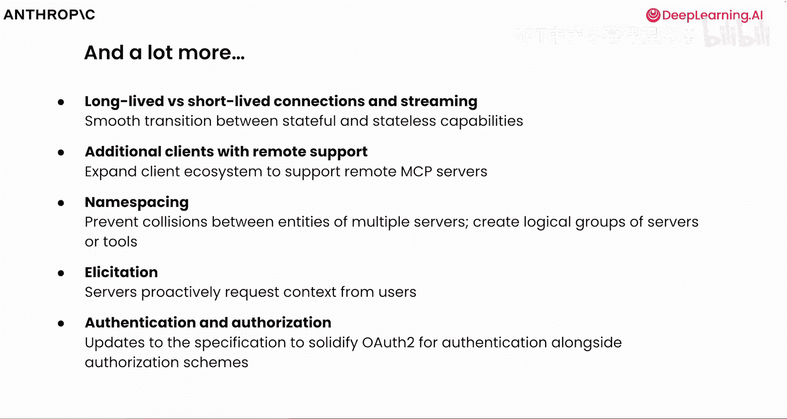

非常感谢您加入我的这次旅程，我迫不及待想看到您用MCP构建出什么。🚀