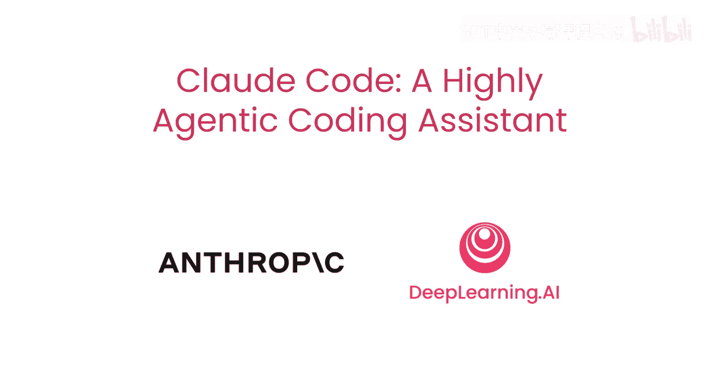
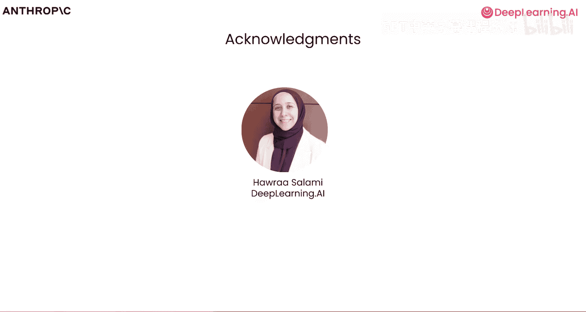
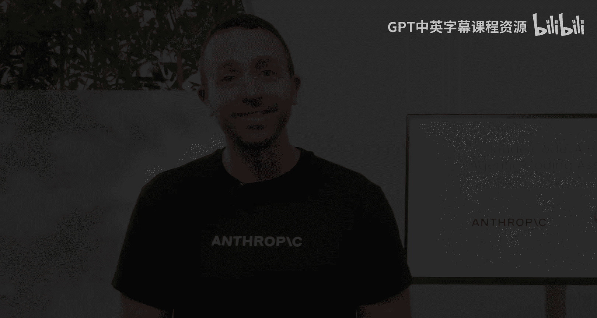

# 001：1.介绍

## 概述
在本节课中，我们将要学习Claude Code，一个高度主动的编程助手。我们将了解它的基本概念、核心优势以及本课程将要涵盖的实践内容。

欢迎来到Claude Code，这是一个高度主动的编程助手。本课程是与Anthropic合作构建的，旨在分享使用Claude Code的最佳实践。我对这个短期课程感到非常兴奋。

Claude Code目前是我最喜欢的编程助手。它极大地提升了我和许多其他开发者的生产力。这是一个具有深度的工具，因此我们希望与Anthropic合作，系统地教授关于如何使用它的最重要理念。

在过去的几年里，我观察到AI辅助编程发展迅速。它始于人们偶尔向AI询问编码问题，然后是GitHub自动补全，再到各种变得越来越自主的工具。Claude Code的发布在代理程度或编码助手能独立完成的工作量方面，无疑是一个进步。许多人惊讶地发现，你可以设置一个任务，让Claude Code工作数分钟，有时甚至超过几分钟。现在，有些开发者不仅协调单个Claude实例，甚至让多个实例并行处理代码库的不同部分。

协调所有这些工作需要遵循最佳实践，但这些实践并不广为人知。如果你没有接触过这些最佳实践，掌握它们可能会对你的工作效率产生巨大的提升。

## 核心实践与课程内容
在开始讨论这些最佳实践时，一个关键技巧是为Claude Code提供清晰的上下文，以帮助它高效地完成任务。这意味着需要将Claude Code指向相关文件，清晰地描述你所需的功能，并确保通过MCP服务器和其他工具来正确扩展Claude Code的能力。

在本课程中，你将把这些最佳实践应用到三个不同的示例中。

以下是本课程将要完成的三个实践项目：

1.  **构建RAG聊天机器人**：你将从前端到后端实现功能，包括重构代码、编写测试，然后使用GitHub集成来处理拉取请求和修复问题。你将利用许多Claude Code功能，如规划、思考模式、创建并行会话和管理Claude的记忆。
2.  **使用Jupyter Notebook分析电商数据**：我们将转换方向，使用Jupyter Notebook探索电商数据。将使用Claude Code重构Notebook，移除冗余代码，并创建带有Web应用程序的强大仪表板。
3.  **基于Figma设计构建前端应用**：我们将基于Figma创建一个视觉模型，并使用Claude Code、Figma MCP服务器和另一个MCP服务器来导入设计、迭代、测试并以代理方式构建一个强大的前端应用程序。

如果你目前还不是Claude Code用户，学习这套理念将为你作为现代软件工程师构建系统带来有意义的加速。即使你已经是Claude Code用户，以全面和系统的方式学习这些最佳实践，也希望能让你尝试一些对工作有用的新东西。

## Claude Code的架构特点
在下一个视频中，我们将分享Claude Code的底层架构。你可能会惊讶于其架构的简单性。

Claude Code仅依赖少量工具来搜索文件中的模式、查看目录、查看文件以及执行正则表达式操作。它不依赖于将你的代码在代码库中进行语义嵌入或将其转换为可搜索的结构。

我认为使Claude Code有效的一个方面是，它如何以代理方式浏览你的代码，在一个名为`cloud-do.md`的文件中做笔记，以自主地弄清楚你的代码库中正在发生什么，从而驱动关于如何推进代码的决策。

正因为如此，并且不需要索引代码库，你可以确保代码库保持本地化。我们还将讨论由此带来的一些安全影响。

## 总结
本节课中，我们一起学习了Claude Code编程助手的基本介绍、核心优势以及本课程的结构。我们了解到，通过提供清晰上下文和利用其代理能力，Claude Code可以显著提升开发效率。接下来的课程将深入其架构和具体实践。