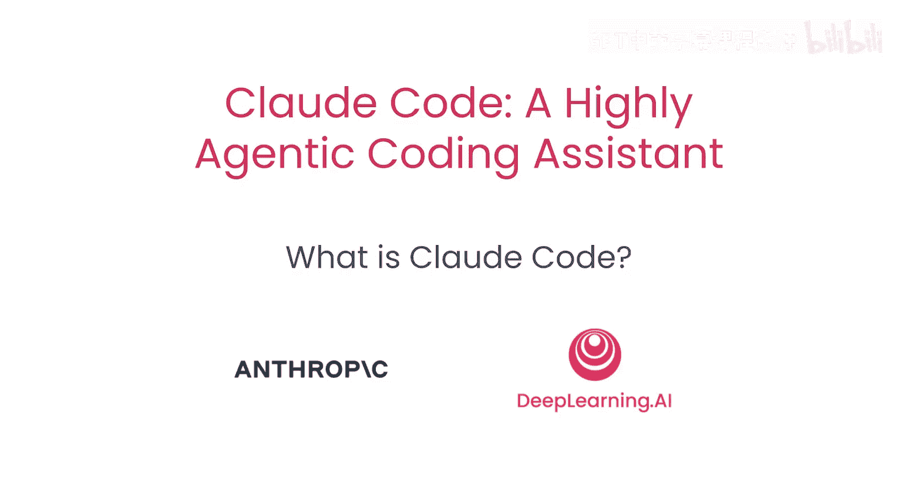
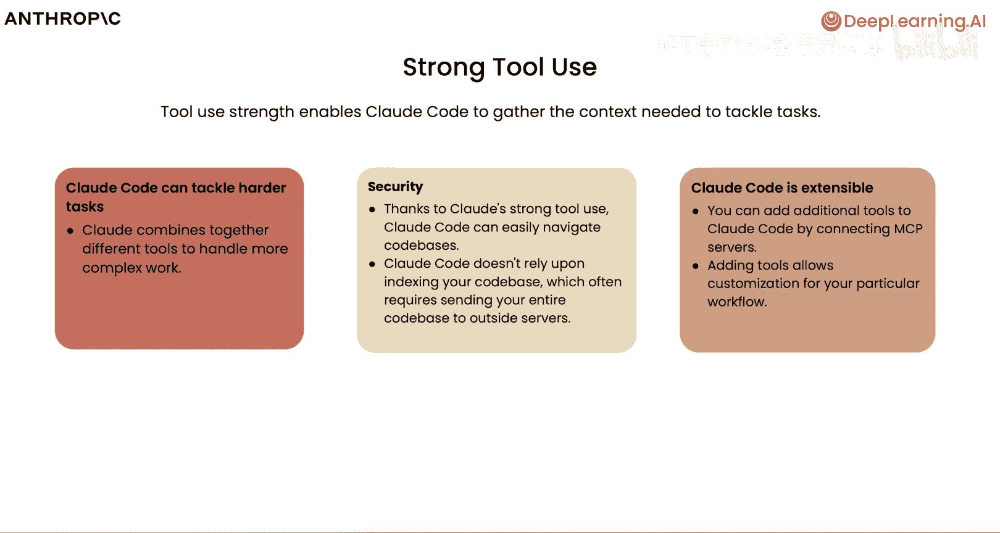
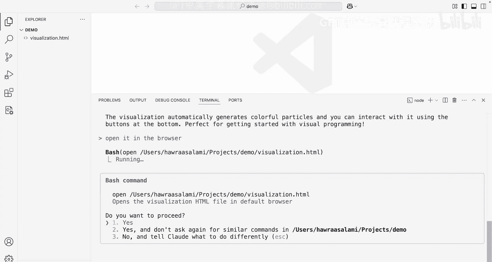

# 002：什么是 Claude Code



## 概述

在本节课中，我们将学习 Claude Code 的核心概念、工作流程、使用的工具以及它在会话间保持记忆的方式。我们将了解 Claude Code 如何从一个简单的模型助手转变为一个能够处理复杂编码任务的强大代理系统。

---

## Claude Code 的代理工作流程

上一节我们介绍了课程概述，本节中我们来看看 Claude Code 的代理工作流程。

当我们谈论代理系统时，通常会考虑三个核心组件：一个模型、一组工具以及运行这些工具的环境。模型擅长处理输入并返回输出。但在许多情况下，模型本身并不了解你的代码库，也不知道如何查找文件或处理多个任务。


因此，我们不是直接与模型对话，而是为模型提供一个非常轻量级的“**框架**”。通过命令行，我们将利用这个框架来发挥模型的智能，以执行复杂的编码任务。我们不是直接将任务交给模型并试图在代码库中查找各种信息，而是提供一组工具、一个环境以及其他一些功能，使模型能够梳理代码库并解决更复杂的问题。

---

## 核心功能组件

上一节我们了解了 Claude Code 的基本工作流程，本节中我们来深入探讨其核心功能组件。

以下是构成 Claude Code 代理能力的几个关键功能：

*   **记忆能力**：使模型能够记住用户的偏好、正在处理的代码库或当前任务。
*   **环境**：为模型提供一个环境，使其能够理解所需数据、制定计划，然后采取行动。
*   **工具使用**：通过少量代码，我们就能利用模型的智能取得相当显著的效果。

关于模型选择，Claude Code 提供 Opus 或 Sonnet 模型，具体取决于任务的复杂程度、类型以及你的订阅计划。

---

## Claude Code 的能力范围

Claude Code 的功能远不止编写代码。随着课程的深入，我们将从它最强大的功能之一开始：**发现、解释和设计**能力。

在你开始用 Claude Code 编写代码之前，可以先用它来快速熟悉一个代码库。我们将详细讨论如何使用 Claude Code 编写代码，同时也会探讨在终端之外的环境（如 GitHub）中使用它的方法。我们还将讨论代码重构、调试错误，以及这个工具真正大放异彩的领域。

Claude Code 不仅对编码有用，在数据分析和任何需要模型智能来创建引人注目的可视化、资源或交付成果的环境中同样适用。

---

## 工具使用详解

我们提到为模型提供了一个框架和环境来收集上下文并采取行动，也讨论了为模型提供的记忆功能。现在，让我们详细谈谈我们让模型知晓的**工具**或附加功能。

为了说明工具的使用，你可以想象用户询问某个特定文件中写了什么代码。模型本身不知道如何导航或查找文件，这时工具使用就派上用场了。

开箱即用的 Claude Code 提供了一个相对较小的工具列表，其中之一就是**读取文件**的能力。现在模型知道该做什么，可以继续读取该文件，获取文件内容，并将数据返回给用户。这种工具使用能力使模型从一个简单的助手转变为一个极其复杂的工具。

以下是 Claude Code 内置的工具列表：

*   用于编辑不同类型文件的工具。
*   用于读取不同文件的工具。
*   用于执行其他操作的工具，例如查找模式、在网络上搜索内容，甚至创建或运行**子代理**来处理非常困难和具有挑战性的任务。

最后，由于我们在命令行环境中，需要一个工具来执行 bash 或 shell 命令。工具使用是 Claude Code 收集所需上下文和信息的方式。这使得 Claude Code 能够处理更困难的问题，也意味着它不必索引你的整个代码库，从而避免了潜在的安全问题。

---

## 可扩展性与 MCP

Claude Code 具有很高的可扩展性。虽然你刚刚看到了 Claude Code 内置的工具列表，但你也可以通过连接到 **MCP 服务器**来添加额外的工具。

**MCP**（模型上下文协议）是一个开源的、与模型无关的协议，允许数据和 AI 系统轻松通信。这些 MCP 服务器可以为 Claude Code 添加各种不同任务的功能，我们将在本课程中探索其中的一些。



---

## 非索引化代码库方法

我想花更多时间谈谈“不索引代码库”的含义。与其创建代码库的结构化表示并不断分析它，Claude Code 使用了一个名为 **Gen 搜索** 的功能。

这种方法不要求将代码库发送到服务器，从而避免了代码离开你所在的生态系统。Claude Code 使用一个或多个不同的代理和工具集，在你的代码库中查找它需要的内容。这使你的代码不必完全添加到上下文中，也不必离开其所在的生态系统，从而避免了某些安全考虑。

---

## 记忆功能实现

当我们谈论 Claude Code 的记忆能力，即它记住先前对话或各种操作中发生的事情的能力时，这是通过一个名为 **`claude.md`** 的 Markdown 文件实现的。

在你的 `claude.md` 文件中，你可以定义常见的配置或风格指南。这些文件在启动时会自动加载到上下文中。你与 Claude Code 的对话会本地存储在你的机器上。你可以在对话过程中清除这些记忆，从而开启一个新的上下文窗口。但如果出于某种原因，你需要继续之前的对话或恢复更早的对话，你可以轻松做到。

---

## 实践演示

现在，我将切换到 VS Code 内的终端。可以看到我这里有一个名为 `demo` 的文件夹，里面是空的。

让我们从使用 `claude` 命令打开 Claude Code 开始。根据文件位置（尤其是第一次运行时），它可能会询问我是否信任此文件夹中的文件，我选择信任。

我们在这里看到了一些很好的入门提示，但我将从一个非常简单的提示开始：
```
Make a cool visualization for me. I'm just getting started.
```

我们将看到 Claude Code 开始制定一个待办事项列表。你可以想象这个任务可能是在代码库中搜索、编辑文件、编写测试、提供见解，或者在我们的案例中，创建一个可视化效果。

根据 Claude 的“想法”，这可能涉及粒子效果、烟花或其他东西。我只想向你展示，开箱即用，你能多快地开始看到 Claude Code 带来的变化。

由于我们在 Visual Studio Code 内部进行此操作，并且 Claude Code 与该编辑器有集成，我们将直观地看到正在进行的更改。我将接受这些更改，在未来的操作中，我会让 Claude Code 无需我的许可即可执行。

我们可以看到这里已经构建了一个可视化效果。让我们继续在浏览器中打开它。我将要求 Claude Code 为我执行此操作。它会确认这是要执行的命令。让我们去看看它是什么样子。

这就是我们的可视化效果。我们可以添加一些粒子，让它看起来更好。我们可以切换动画，看看发生了什么，并清除我们已有的内容。我们可以根据需要扩展它，可以更改功能，可以在这里添加任何我们想要的东西。但我只想向你展示，开箱即用，使用这个特定工具启动和运行是多么无缝。

---

## 总结



在本节课中，我们一起学习了 Claude Code 的核心概念。我们了解了它的代理工作流程，包括模型、工具和环境三个核心组件。我们探讨了它的关键功能：记忆能力、环境交互和强大的工具使用。Claude Code 的能力远不止编写代码，它还能用于代码库探索、解释、设计、重构和调试。其非索引化的工作方式（通过 Gen 搜索）保障了安全性，而通过 `claude.md` 文件实现的记忆功能则确保了对话的连续性。最后，我们通过一个简单的可视化创建演示，直观地感受了 Claude Code 的强大和易用性。

在下一课中，我们将探索如何在更大的代码库中使用 Claude Code，并退一步看看它在解释更大、更复杂的代码库方面有多么强大。