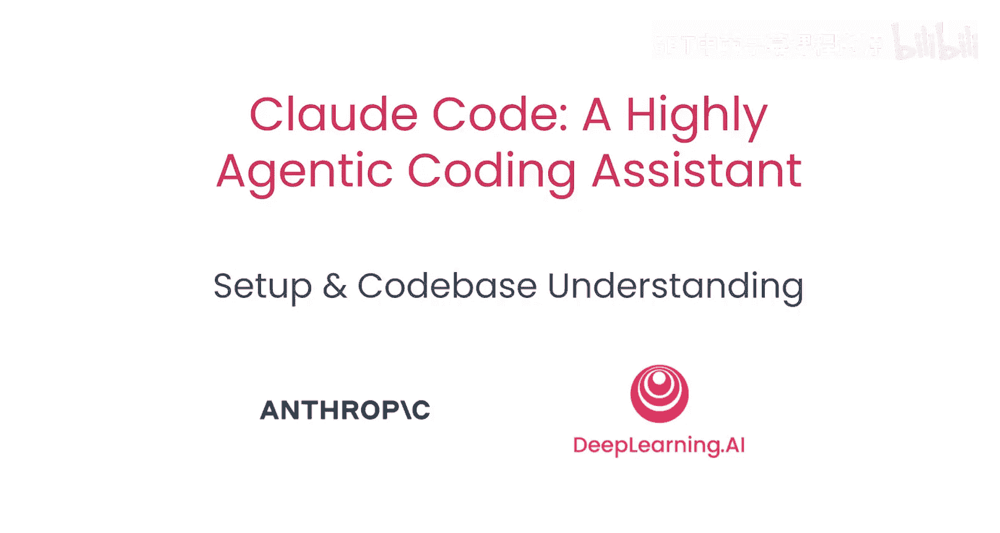
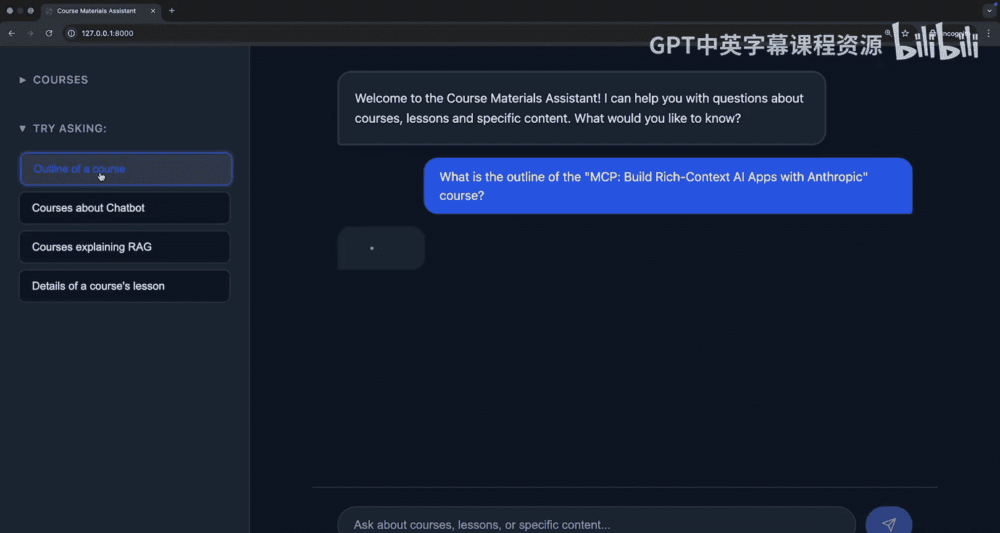
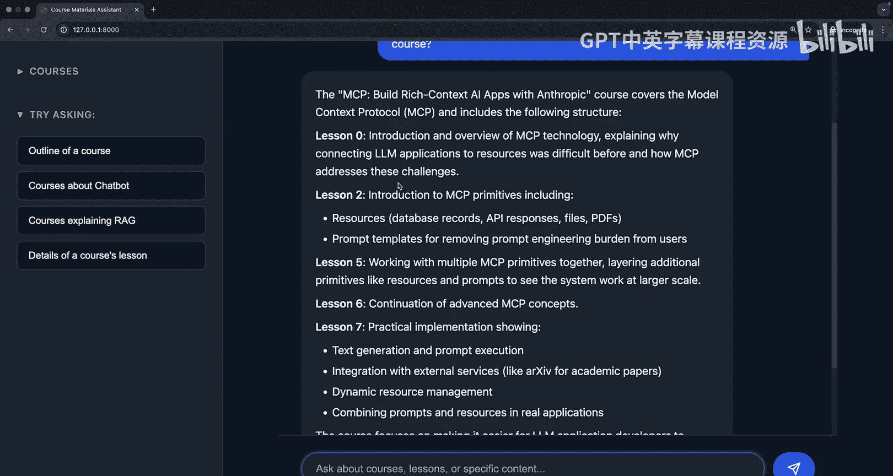
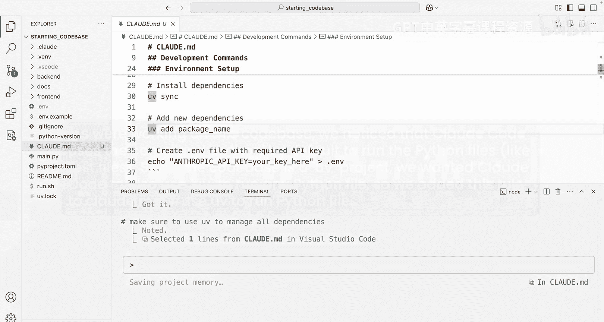
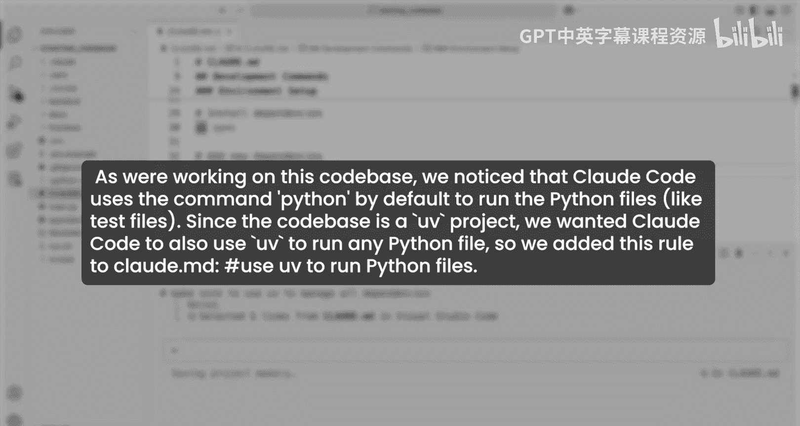
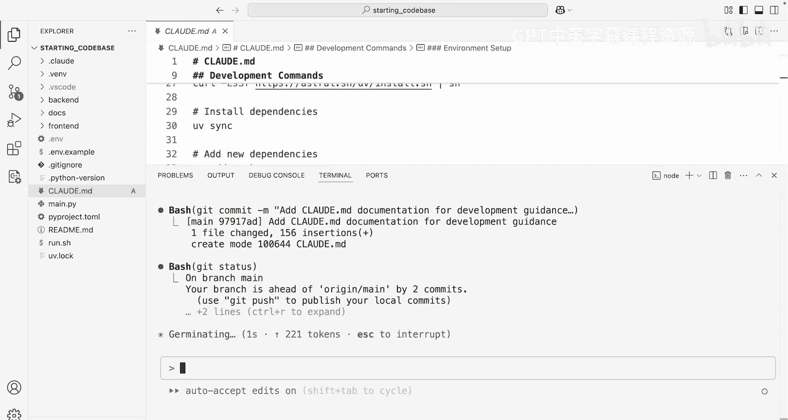

# 003：项目设置与代码库理解 🚀

在本节课中，我们将学习如何利用 Claude Code 来快速理解和上手一个全新的代码库。我们将通过一个端到端的 RAG 聊天机器人项目作为示例，探索 Claude Code 在代码库分析、架构理解、流程可视化以及项目初始化方面的强大能力。

## 概述：快速理解代码库

上一节我们介绍了 Claude Code 的基本概念。本节中，我们来看看如何利用它来高效地理解一个复杂的代码库。

我们将要处理的第一个示例是一个端到端的 RAG 聊天机器人。在开始让 Claude Code 为我们编写大量代码之前，我们先讨论如何使用这个工具来快速掌握大型代码库。

这里有一个应用程序，我可以与 Claude 就 DeepLearning.AI 的课程材料进行对话。让我们尝试询问一个课程大纲，例如：“MCP 课程‘使用 Anthropic 构建丰富上下文 AI 应用’的大纲是什么？”

我们会得到一个包含大量细节的回复，其中列出了每节课的内容和描述。基于此，让我们看看如何快速理解支撑这个应用程序的底层代码。

回到 VS Code，我在这里打开了终端，准备通过输入 `Cla` 并按回车键来进入 Claude Code。在这个应用程序中，我可以开始与我的代码库对话。我将从一个高层次的问题开始，以便了解概况。

## 探索代码库架构

以下是使用 Claude Code 探索代码库架构的步骤：

1.  **提出高层次问题**：首先，询问“代码库概述是什么？”。Claude Code 会主动搜索代码库，找出最重要的文件，并描述这个应用程序中正在发生的事情。它不会逐个文件搜索，而是会主动搜索并找到最相关的文件。

2.  **获取关键信息**：我们会得到关于架构、关键组件和一些功能的信息。如果我想深入了解特定部分，可以轻松做到。

3.  **询问具体流程**：我也可以询问其他高层次问题，例如“在这个应用程序中，文档是如何处理的？”。我们使用检索增强生成来获取有关这些课程的信息。如果我想了解更多关于这个过程的信息，可以提出类似这样的问题。

我们常说 Claude Code 是一个在你身边的出色工程师，但它更是一个优秀的解释者。因此，当你开始接触新的代码库或新的数据集时，首先将其用作向你解释事物的工具。这样，当你要求它编写代码时，你能更好地理解正在发生的事情。

在这里，我们可以看到代码库中实际将文本分割成块、添加上下文课程信息以及存储课程元数据的源代码。这种快速上手代码库的能力，尤其是在你可能不熟悉底层技术或语言的情况下，具有极高的价值。

## 可视化与流程追踪

上一节我们介绍了如何获取代码库的文本概述。本节中，我们来看看如何通过可视化和流程追踪来加深理解。

我们可以提出更具体的问题，甚至可以获得为我们制作的图表和可视化。因此，我要问 Claude 的第一件事是追踪处理用户查询的流程，从前端到后端。

你可以想象，你可能对技术栈的某一部分知识有限，或者不熟悉这一切是如何发生的。Claude Code 将在这里为我们提供相当有用的信息。

当你看到 Claude Code 工作时，它的一个有用之处是能够给你一个待办事项列表。这样你就可以开始理解在任何时间点正在发生的事情。你可以按 `Escape` 键并引导 Claude Code 遵循一组不同的待办事项。但在这种情况下，我对它的工作感到满意。

它将从前端开始追踪，遵循 API 端点，分析我们的检索增强生成系统，然后找出如何实际生成响应。它正在读取处理这些特定任务的相应文件，并完成其列表，为我们提供一个强大的总结。

在这个环境中，我们可以留在 VS Code 内，或者在它自己专用的终端实例中打开 Claude Code，这完全取决于你的工作方式。

一旦完成，我们可以看到这里发生的事情的非常详细的路径。我不仅可以逐步阅读这些步骤，甚至可以要求 Claude 将其写入文件。但我在这里看到了相当多的细节：前端发生了什么，使用了一些 JavaScript；一旦请求到达我的后端会发生什么；检索增强生成系统在做什么；我如何生成响应；最后，我如何搜索我的向量数据库，如何过滤必要的内容，获取响应，然后最终将其发送给用户。

这个应用程序中发生了很多事情，我可以使用 Claude 深入探究其中的任何部分。但假设我通过可视化学习效果最好。那么让我们要求 Claude 绘制一个说明此流程的图表。

我们可以要求 Claude 为网络可视化绘制图表，我们可以要求使用 `askDR`，但让我们看看 Claude 凭借其自身的智能和对应用程序工作原理的了解能提出什么。让我们看看 Claude Code 想出了什么。

我们得到了一个非常漂亮的图表，向我们展示了逐步的过程。我们无法创建这些可视化图表。如果我们想要像 Web 应用程序那样的东西，我们总是可以要求它使用像 D3.js 或 Recharts 这样的工具。但在这里，我们看到了一个非常漂亮的图表：从前端发出请求到后端，调用必要的函数，生成必要的响应（如果涉及任何历史记录），直接与大型语言模型对话（使用我们的系统提示词、工具和查询），找出下一步该做什么，使用 ChromaDB 搜索我们的向量数据库，获取结果，格式化，然后将其发送给模型以产生最终响应。

这其中包含了相当多的细节。如果我们愿意，甚至可以用额外的工具来增强 Claude，以生成我们想要的可视化效果。但开箱即用，快速高效地获取这些信息将帮助我们以比以往花费的时间少得多的时间来上手这个代码库。

## 项目初始化与运行

基于以上理解，让我们问一个非常简单的问题：“我如何运行这个应用程序？”

你可能处于这样一种情况：这里有一种新技术，一个新想法。很简单，仅仅知道如何启动和运行它就很不错。我可以在这里看到我的 API 文档、我的 Web 界面，以及我需要的任何环境变量。现在你已经了解了如何开始与 Claude Code 对话，让我们谈谈 Claude Code 的一些更强大的功能。

当你开始在 Claude Code 中处理一个应用程序时，我们建议你做的第一件事就是运行一个名为 `/init` 的命令。你可以在这里的 Claude Code 中看到，当我添加这个斜杠时，我们有一个我可以使用的许多内置命令的列表。`/init` 允许我使用代码库文档初始化一个 `.claude.md` 文件。

`.claude.md` 文件对于为 Claude Code 引入记忆至关重要，这样它就知道如何最好地在你的代码库中工作。`.claude.md` 文件对于指定你希望如何运行事物非常有用，这可以是你的测试、代码检查，以及你希望 Claude 在你每次处理这个特定项目时拥有的任何长期记忆。

与其从头开始创建这个文件，`/init` 将分析代码库，以从高层次上弄清楚每次你处理这个应用程序时它应该知道什么。

## 理解 `.claude.md` 文件类型

以下是三种不同的 `.claude.md` 文件类型：

1.  **项目级文件**：像用 `/init` 生成的那个，位于最左边。这个 `.claude.md` 文件存在于你的应用程序中，你可以在嵌套的子文件夹中有很多个，但它与其他工程师共享并提交到你的版本控制中。

2.  **本地级文件**：如果你有个人说明和自定义设置，特定于你的编辑环境和终端环境，你可以将其放在一个 `.claude.local.md` 文件中。这个文件被 Git 忽略，不与其他工程师共享。

3.  **用户级文件**：最后，在你的主目录的 `.claude` 文件夹中，你可以添加一个 `claude.md`。你可以将其视为适用于你机器上所有项目的 `.zshrc` 或 `.bashrc`。如果你希望 Claude 在你使用 Claude Code 构建的广泛项目范围内遵循指令，这将很有帮助。

我们可以继续允许 Claude Code 查找不同的文件，以便它知道如何最好地创建这个 `.claude.md` 文件。这个 `.claude.md` 文件旨在添加到您当前的 Git 项目中，并与团队的其他成员共享。随着更多人在代码库上工作，他们可以添加到这个 `.claude.md` 文件中，如果你需要更具体的指令，你甚至可以在子目录中嵌套 `.claude.md` 文件，例如后端、前端或我们这里的文档。

## 交互式编辑与记忆管理

使用像 Claude Code 这样的工具与 Visual Studio Code 配合的一个真正好处是，当我看到文件更改时，我可以在编辑器中直观地看到它们。每当我使用 Claude Code 中的工具时，它都会请求我的许可。这种关键的人机交互循环在你启动和运行时非常重要。如果你不需要 Claude 每次都问你，总是可以使用第二个选项，我们将自动接受这些编辑。

我们将看到已经为我们创建了一个 `.claude.md` 文件。为了给你一个快速的演示，我们可以看到它给了我们一个项目概述、关键技术、架构概述、这里的一个漂亮的小图表、一些核心组件等等。如果我们想对这个特定的 `.claude.md` 进行更改，可以轻松做到。随着它继续搜索代码库，它会对我的 `.claude.md` 进行额外的编辑，并给我一个已完成工作的总结。

当我在 VSCode 中使用像 Claude Code 这样的工具时，我有能力指定我所在的文件，甚至获取有关特定行的信息。为了设置这个，我将使用 `/ide` 命令，我可以在这里看到我已经与 Visual Studio Code 连接。现在我在 Visual Studio Code 中，可以在这里看到，在我访问文件的那一刻，它就在这里被标记了正在发生的事情。这为 Claude Code 提供了正确的上下文，知道我所在的文件，如果我有关于该文件的问题，这使 Claude Code 更容易识别。

如果我曾经想对我的 `.claude.md` 文件进行任何更改，我可以手动编写，或者我可以使用一个方便的命令，直接使用 `#` 键并直接添加到记忆中。所以我要在这里说：“始终使用 `uv` 来运行服务器。不要直接使用 `pip`。” 这是 Python 生态系统中的一个包管理器，我想确保在使用这个快捷方式时 Claude 不会感到困惑。

我们可以看到，这个记忆可以保存在不同的地方。我们提到过，有包含在 Git 中供团队每个人使用的项目记忆；有本地记忆，它被 Git 忽略，但仅对作为开发者的你有用；然后是适用于你使用 Claude Code 的所有项目的用户记忆。对于这一个，我将继续更新项目记忆。我可以在这里看到我已经做了那个更改。如果我查看我的 `.claude.md`，我会在这里看到一些关于使用 `uv` 的提及，以确保我正确地做到了这一点。

如果我想更具体，我也可以说“确保使用 `uv` 来管理所有依赖项”。我将把这个添加到我的 `.claude.md` 中，我们会在这里看到它已经被添加。如果我快速浏览一下这个特定的文件，我们可以看到任何关于依赖项的提及现在都包括了 `uv`。

## 实用命令与 Git 集成

我们稍微谈到了 Claude Code 中内置的一些命令，比如 `/init`。这里还有几个其他有用的命令我想在这里展示，事实上，我们将在本课程后面看到我们甚至可以创建自己的命令。

以下是几个关键的内置命令：

1.  **`/help`**：立即向我显示所有命令的快速描述和摘要。这在您上手 Claude Code 时非常有用。

2.  **`/clear`**：这个命令允许你清除对话历史并从头开始。这在您转换任务和构建新功能时非常有帮助，它允许你清除上下文窗口并重新开始。

3.  **`/compact`**：如果你想要继续对话，拥有一个较小的上下文窗口，但仍然保留已完成工作的摘要，我们也有这个 `compact` 命令，它允许你清除历史记录但保留摘要，以便你可以在此基础上继续，让 Claude 了解之前做了什么。

4.  **`Escape` 键**：另一个有用的命令是 `Escape` 键，它允许你退出你所在的任何命令。所以，如果我正在尝试做类似 `compact` 的事情，并且我想停止那个过程，我总是可以按 `Escape`。如果我启动了一个让 Claude Code 解释代码库内容的过程，我想停止那个过程，按 `Escape` 将允许我中断并继续。所以，如果你没有得到你需要的东西，不要觉得你必须等待 Claude Code。

在下一课中，我们将开始使用 Claude Code 来构建功能、添加到文件、修改更改，并确保我们在此过程中做正确的事情。在我们结束之前，Claude Code 最后一个有用的功能是它与 Git 协作的能力。

我已经对这个应用程序做了一些小的更改，我想添加并提交这些更改。与其让我手动编写 Git 命令、编写描述性的提交消息，我们将实际让 Claude Code 为我们做这项工作。Claude Code 能够添加和提交必要命令的能力非常棒。我将继续添加这个特定的文件。

我不仅可以提交，你还可以在这里看到我有一个非常好的描述性提交消息。当我们开始向 Claude Code 询问 Git 的历史更改，以及当我们将其推送到 GitHub 和其他人阅读我们所做的更改时，这非常有用。所以我们将添加并提交，在下一课中，我们将使用 Claude Code 开始为我们编写很多东西。

## 总结

本节课中，我们一起学习了如何利用 Claude Code 高效地理解和上手一个复杂的代码库。我们探索了如何通过高层次提问获取架构概述，如何追踪从前端到后端的完整流程，以及如何生成可视化图表来辅助理解。我们还深入了解了 `.claude.md` 文件的作用和类型，学会了使用 `/init` 初始化项目记忆，并掌握了 `/help`、`/clear`、`/compact` 等实用命令。最后，我们看到了 Claude Code 如何与 Git 集成，自动化提交过程。这些技能将为你后续使用 Claude Code 进行主动编程和功能开发奠定坚实的基础。