# 004：添加功能

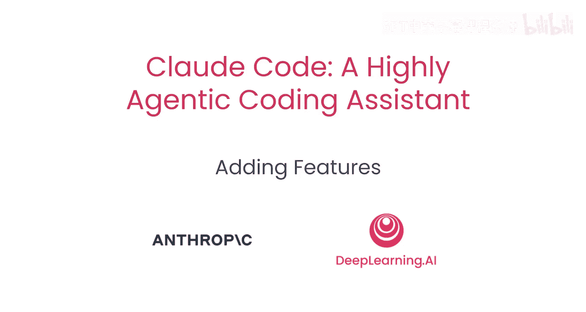

## 概述
在本节课中，我们将学习如何为现有的聊天机器人代码库添加新功能。我们将重点介绍两个核心工作流程：使用“计划模式”进行结构化开发，以及利用MCP服务器扩展Claude Code的能力。我们将通过实际案例，演示如何为前端添加可点击的引用链接和“新建聊天”按钮，并为后端添加新的工具来获取更详细的课程信息。

## 理解代码库与功能规划
现在你已经对聊天机器人代码库有了基本了解，让我们为UI添加一些功能，并为聊天机器人实现一个新工具。

我们已经熟悉了这个代码库，现在来讨论一些我们可能想要添加的功能。在这个应用程序中，当我们请求课程大纲时，会得到非常详细的信息，同时还能看到一些被引用的来源。当我们看到这些被引用的来源时，如果能将它们作为链接点击并跳转到原始出处，那将非常有用。因此，我们希望构建一个界面，让前端和后端能够正确渲染链接，以显示数据的来源，而不仅仅是文本。

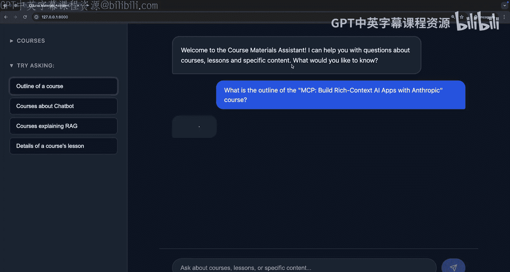

让我们转到Claude，讨论一下如何开始。

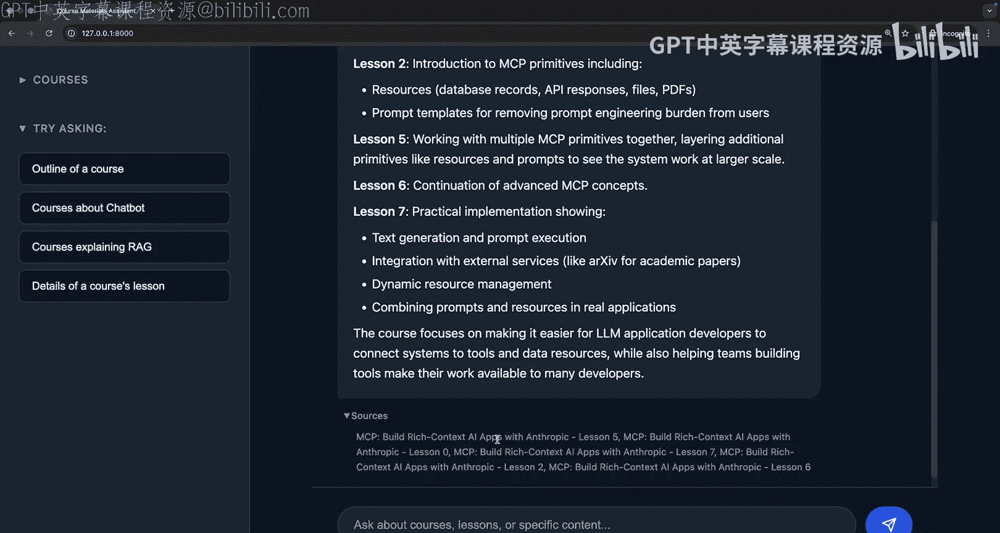

在这里，我们不会直接要求Claude实现必要的功能，而是利用两个重要的部分。第一个是引用正确的文件，第二个是使用计划模式。

## 引用正确的文件
当谈到引用正确的文件时，Claude Code的能力取决于你提供的上下文。当你要求Claude Code进行更改时，确保我们找出需要修改的正确文件非常重要。我们可以让Claude Code尝试解决这个问题，但如果我们一开始就知道哪些文件需要修改，直接给Claude Code提供这个上下文会使工具效率更高。

让我们看看具体如何操作。

我将打开Claude Code。要引用一个文件，我只需使用 `@` 符号并标记该文件。对于一个文件夹，我可以引用其中的文件；对于一个文件，我甚至可以使用Tab键自动补全完整的文件名。

## 使用计划模式进行开发
考虑到这一点，接下来谈谈构建功能或进行较大更改时的第二个重要部分。我们不会让Claude立即尝试弄清楚需要做什么并编写代码，而是遵循一个略有不同的模式：先做计划。

我们将首先创建一个详细的计划，说明需要做哪些更改。如果我们批准了该计划，然后才会让Claude Code对相当多的文件进行更改。

当你需要进行稍大的更改时，我们总是建议从计划模式开始，这样你可以给Claude机会在需要实际进行更改之前，先弄清楚需要做什么。

要激活计划模式，我将按两次 `Shift + Tab` 键。我们会看到这里计划模式已开启。

## 实施引用链接功能
让我们展示一下需要做什么。

我将引入一个我准备好的提示词，并要求它构建一个带有来源引用的界面。你可以注意到，我在这里引用了正确的文件，也引用了其他需要更改的文件。

让我们给Claude机会，为如何解决这个特定问题制定一个计划。和往常一样，它将通读它认为最必要的文件，从前端追踪到后端，并理解需要实现什么。

一旦我们得到了一个计划，我们将有机会批准它，或者给Claude一些反馈，说明可能需要更改什么。但在这里，Claude并没有直接编写任何代码。

我们可以看到这里，我们可以接受，然后继续自动接受编辑，这样我们就不必一直请求许可。我们可以手动批准它们，或者告诉Claude更改计划。

快速浏览一下这个计划，我觉得我们需要做的事情看起来不错，所以让我们使用那个计划，并开启自动接受编辑功能。如果你想单独开启这个功能，可以按一次 `Shift + Tab` 键。

我们将看到必要的待办事项列表，看到需要做哪些更改。现在，我们将让Claude Code写入它认为必要的文件，然后我们可以测试实现是否正确。

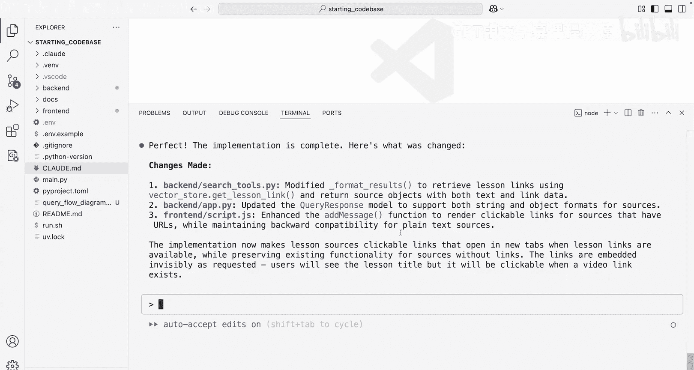

我们将看到文件正在被修改，代码库正在发生变化。由于我们添加了自动接受功能，我们不必一遍又一遍地给予许可。我们看到的非常常见的工作流程是，用户开始时每次都会请求许可。随着人类对Claude Code给予更多信任，自动接受编辑功能会更多地开启。

最后，我们可以看到，我们可以启动应用程序来测试实现。但实际上，服务器已经在运行了。所以我直接告诉Claude：“不，谢谢。”我会直接说，服务器已经在运行，不需要你自己启动。如果我希望Claude Code总是这样做，这也是一个很好的机会，可以将此信息放入 `.claude_m` 文件中。

现在我已经让Claude Code知道了这一点，它会告诉我已经做了哪些更改。

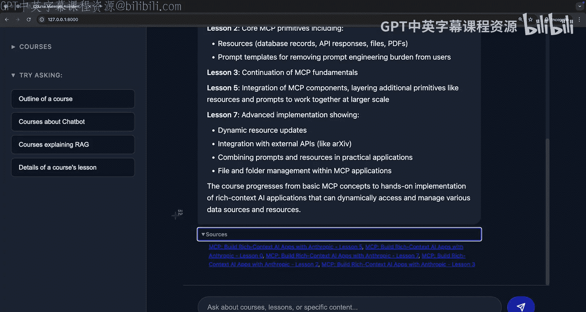

## 测试与视觉优化
让我们现在测试一下。尝试问同样的问题。让我们请求一个课程大纲。如果构建正确，我们应该能够看到每个特定功能下面的链接。

如果我在这里看一下，我有链接可以带我跳转到正确的位置，但由于这个蓝色链接颜色，界面有点难以看清。如果我愿意，我可以继续要求Claude Code进行必要的更改。

所以，让我们跟进Claude，要求它让这个界面看起来更舒服一些。

这里我有一个选择，就是直接告诉Claude我想要什么。另一个选择是利用Claude的视觉能力，查看截图并分析需要更改什么。让我们截取这个界面的截图，然后将其粘贴到Claude Code中。

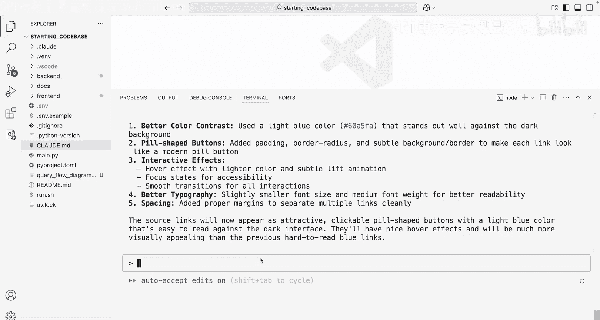

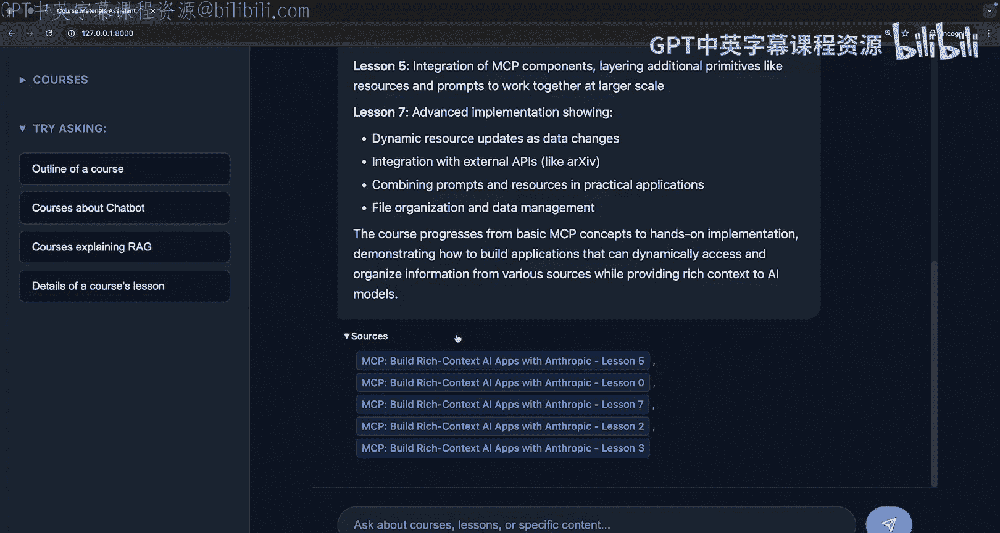

回到Claude Code，当我粘贴截图时，我会说：“这些链接很难阅读，你能让它看起来更美观吗？”我们将让Claude分析该图像，并弄清楚前端需要更改的地方。

我们可以看到这里，我可以看到问题所在：链接使用了默认的蓝色。让我继续做一个更改。当你需要Claude Code进行视觉更改时，截取屏幕截图并向Claude Code展示截图，是一种非常强大的快速迭代方式。

让我们回到浏览器，看看现在是什么样子。我们将再次请求课程大纲。如果这达到了我们的预期，我们应该看到这些链接看起来更舒服一些。

让我们看看我们的来源，看吧，好多了。Claude Code能够查看截图并进行更改，这是我们看到的最常用的功能之一，对于快速构建东西非常有价值。

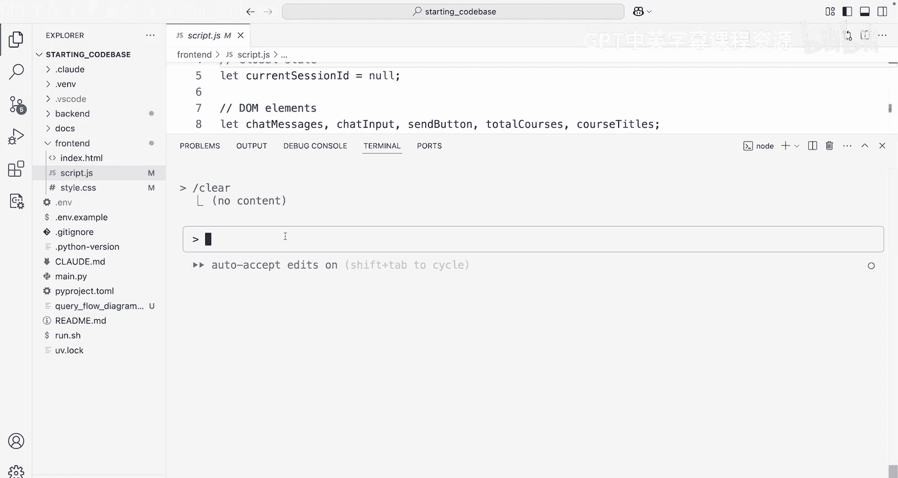

如果我想查看那些文件的更改，我可以在Vs code中打开它们。在这里的Claude Code中，我注意到我在那个特定的脚本中，我可以提问并获取这些文件所需的信息。

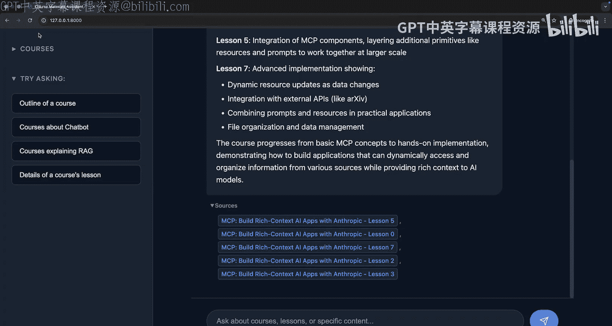

## 添加“新建聊天”按钮功能
这看起来不错。让我们添加一个新功能。与其在我现有的上下文窗口中继续构建，我将完全从头开始，清除对话历史记录。这将允许我有更长的上下文窗口来工作，并且不会让Claude被之前看到但与我现在构建的内容无关的东西所混淆。

正如我们之前看到的，当我们想要构建新功能时，我们将在这个特定应用程序中使用计划模式。我想在界面中添加启动新聊天的功能。所以，与其每次都必须刷新页面，我希望这里有一个按钮，允许我重置对话并重新开始一个新的聊天。

让我们构建这个功能。我将激活计划模式，然后继续引入我准备好的提示词。我将要求Claude Code添加一个新的聊天按钮，当点击时，它应该清除聊天窗口中的对话，开始一个新会话，并处理必要的清理工作。

如果你需要换行并添加上下文，可以使用反斜杠并按回车键。所以，如果这里有更多我想添加的内容，我可以轻松做到，这样看起来更舒服。

让我们让Claude Code弄清楚这里需要构建什么。正如我们之前看到的，如果前端有需要更改的地方，它会找到必要的文件夹；后端需要更改，也是同样的道理。在这里，它将制定一个全面的计划。

这种在采取行动之前能够计划和思考的想法，对于构建你想要的界面非常有价值。

我可以快速浏览一下这个计划，看看它试图做什么。我觉得不错，所以让我们构建它。如果在任何时候，我不喜欢正在做的事情，我总是可以按 `Escape` 键，并引导Claude Code走向不同的方向。

和往常一样，我们将看到需要构建的待办事项列表，看到这些文件正在更新，因为我开启了自动接受编辑功能。一旦完成，我们将进入下一步。

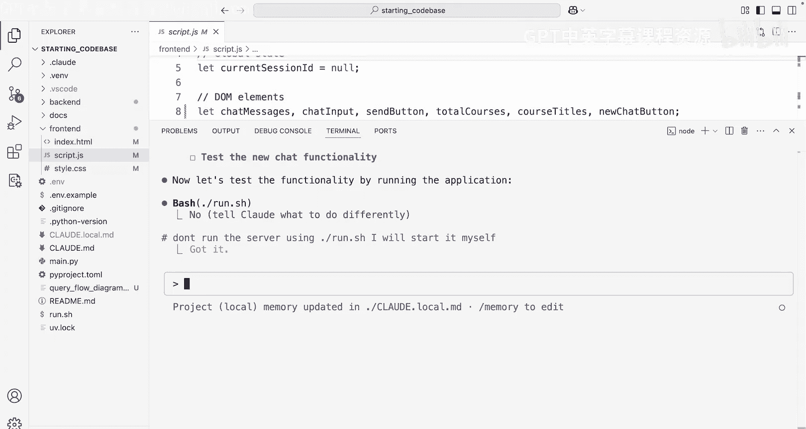

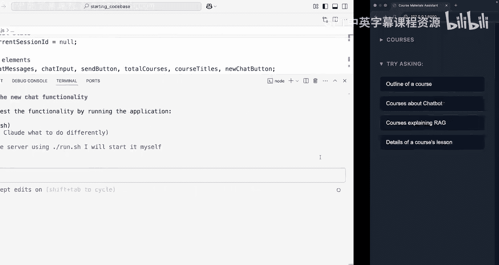

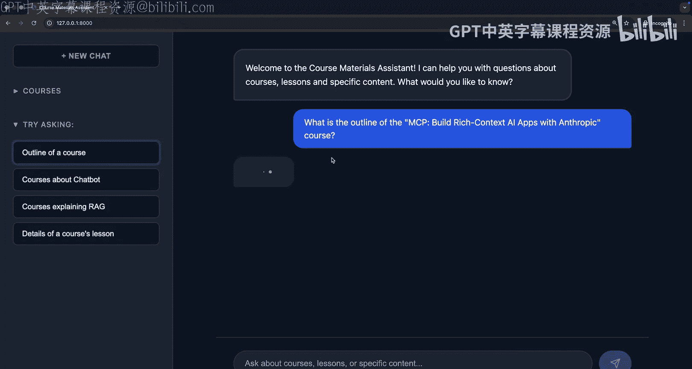

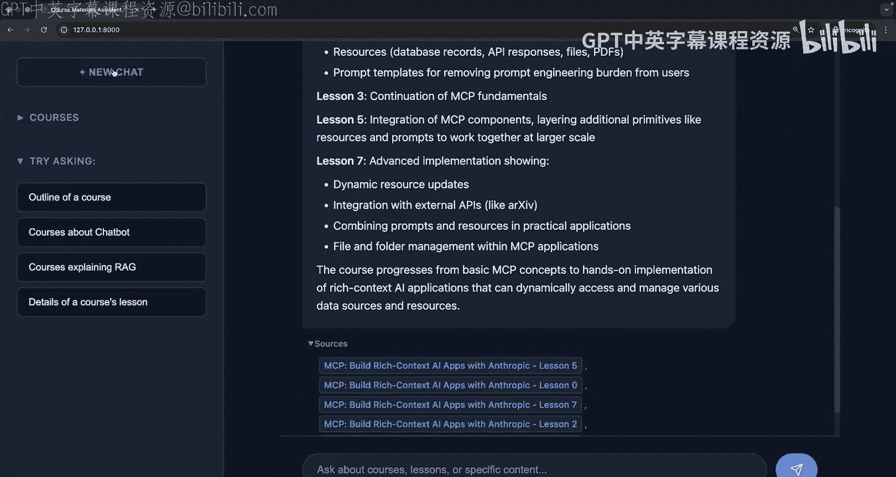

我们将开始看到添加一些JavaScript代码来处理点击事件、开始新对话、清除输入框和聚焦，现在正在构建一些样式以匹配现有部分。

我们可以看到这里，它将测试新功能。如果我需要告诉Claude不要运行服务器，我可以这样做。所以在这里，与其运行服务器，我直接告诉Claude不要这样做。由于我发现自己经常这样做，现在是一个好时机，可以说“不要运行服务器，使用 `npm run start`，我会自己启动它”。我实际上会把这个放到项目内存中，如果我希望所有其他开发者也这样做的话。但也许其他开发者可能想自己运行服务器，所以我会把它放在本地且被忽略的项目内存中。这可能是一个我喜欢自己运行服务器，但其他开发者可能不喜欢的场景，这是 `.claude_m` 本地文件的一个很好的用例。

现在让我们回到浏览器，看看构建了什么。我将刷新页面，我们在这里有了这个新的聊天按钮。让我们看看它是否有效。再次请求课程大纲。我们可以确保我们的来源链接看起来很棒，如果这达到了预期效果，我们可以点击这个按钮并开始一个新的对话。看起来不错，让我们开始一个新的聊天。

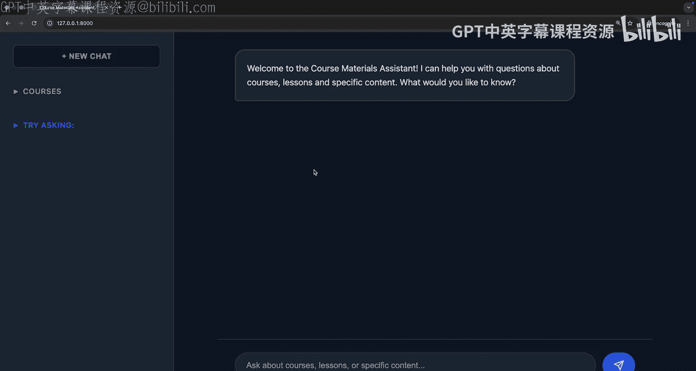

## 利用MCP服务器进行自动化界面调整
即使这能工作，它看起来仍然不完全是我想要的样子。我可以截取屏幕截图并与Claude来回沟通，或者我可以使用MCP服务器来增强Claude Code开箱即用的工具。

MCP，即模型上下文协议，允许像Claude Code这样的工具获得额外的功能，以连接到外部数据源和系统。

我在这里要做的是为Playwright添加一个MCP服务器，这是一个用于打开浏览器、截取屏幕截图和分析这些截图的流行工具。所以，与其我手动截取屏幕截图并与Claude对话，我们将让Claude自己完成所有工作。

我要做的第一件事是退出Claude Code，并添加必要的MCP服务器。这样做的命令是 `claude mcp add`，后面跟上我们的MCP服务器名称，即 `playwright`，然后是启动该MCP服务器的底层命令，即 `npx playwright-mcp-server@latest`。对于任何你想包含的MCP服务器，你可以参考文档。所有MCP服务器都会指定连接到该特定服务器所需的必要命令。

让我们再次打开Claude，看看我们的MCP服务器是什么样子。我们可以使用 `claude mcp list` 命令。在这里，我们可以看到我们已经成功连接到Playwright MCP服务器，并且可以看到Playwright服务器提供给我们的可用工具，比如评估JavaScript、上传文件、按键、导航、返回等所有这些我们可能手动测试的事情，Playwright可以为我们以编程方式完成。

我将按几次 `Escape` 键返回。让我们要求Claude Code导航到我们的页面，找出如何构建必要的内容。

所以，让我们使用Playwright MCP服务器要求Claude Code访问我们所在的页面，查看新的聊天按钮。我希望那个按钮看起来与下面课程的其他链接相同，并尝试要求确保它是左对齐的，并且边框被移除。

在开始采取这个行动之前，它会要求我批准使用这些特定的工具。我们将看到它会访问那个页面，截取屏幕截图，并做必要的事情。

让我们跟随那个，并且不要每次都请求使用这个特定工具的许可。我们可以看到，浏览器已经以编程方式为我们的页面打开了一个新标签页来截取屏幕截图。我们将要求Claude Code截取那个屏幕截图，并分析它看到了什么。

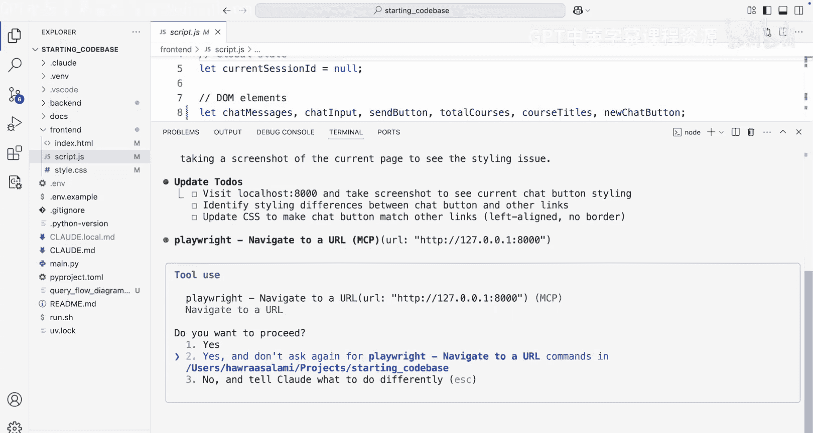

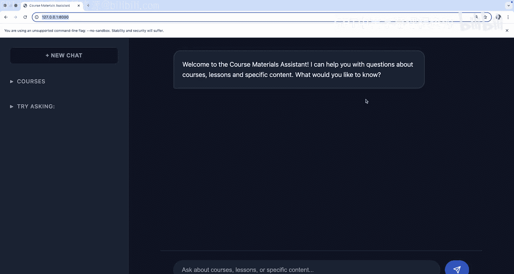

在这里，它可以准确地看到正在发生的问题。与其我们手动截取必要的屏幕截图，它可以以编程方式自我修复。我们也可以有一个更具体的提示词，不断要求Claude Code进行必要的更改。

由于我没有开启自动接受，我可以在Vs code中看到正在进行的更改。开箱即用，我没有看到边框和背景，有了这个新的更改，看起来不错。让我们进行这些更改，并继续做其他更改。我可以看到左对齐看起来不错，这里需要做的任何其他更改。它将截取另一个屏幕截图，以验证它所做的更改看起来是正确的，它使用了正确的图标前缀来匹配其他部分。

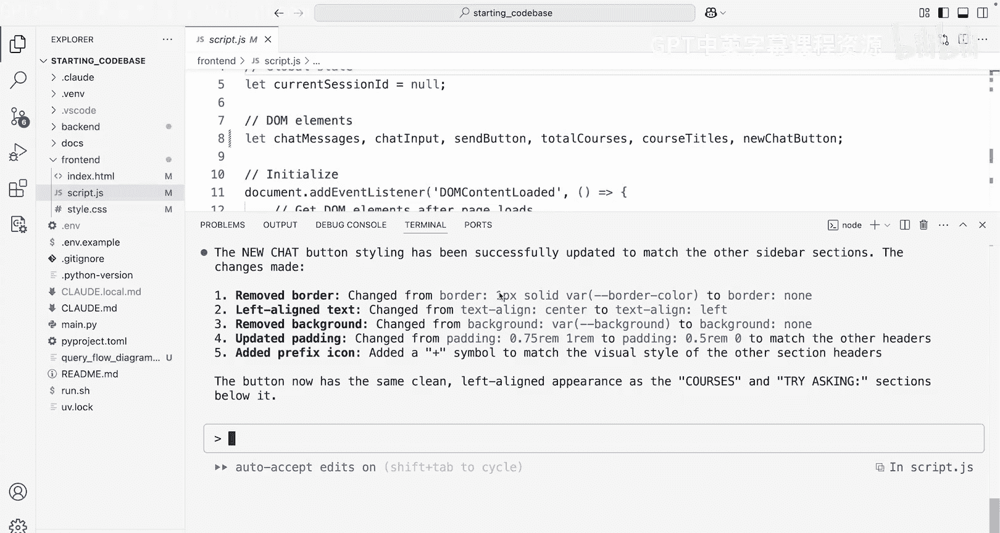

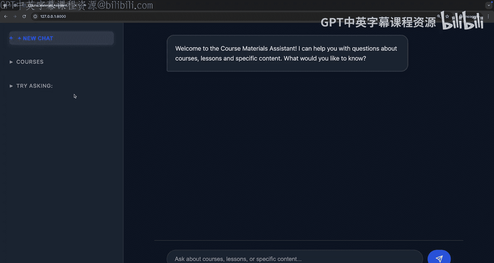

考虑到这一点，让我们去看看它做得怎么样。我将刷新页面，看起来不错。它这里多了一个加号。所以，我们为什么不继续要求它去掉那个呢？但它已经左对齐了，并且使用了我们之前喜欢的图标。

所以，让我们继续修复这个问题，并说：“现在有两个加号图标。移除靠近文本‘+ 新建聊天’的那个。”我们可以看到这里，H内容中已经有一个加号了，所以我们将移除那个。

让我们看看这里做了什么。所以，与其添加那个额外的加号，我们可以看到这里做了什么。如果我们需要另一个快照，我们可以访问并截取必要的快照。正如我们在这里看到的，Claude Code看到没有打开的标签页，所以它自我修复，再次打开它，并截取了必要的屏幕截图。

让我们看看现在是什么样子。好多了。正如你可以想象的，使用像MCP Playwright这样的工具构建复杂的界面，使得构建、设计和测试变得轻而易举。

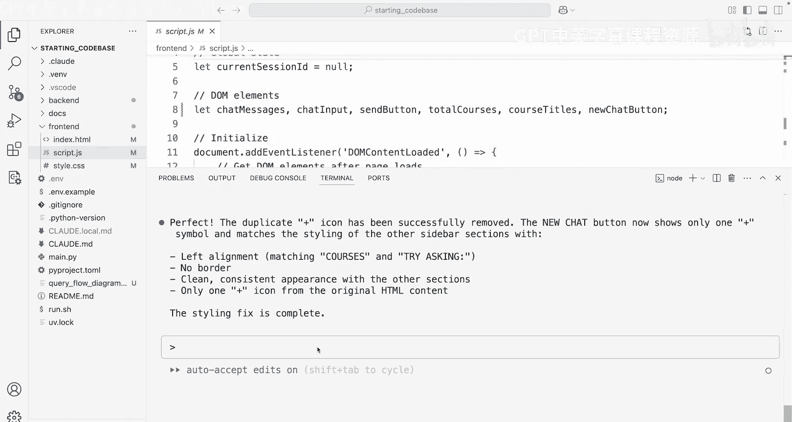

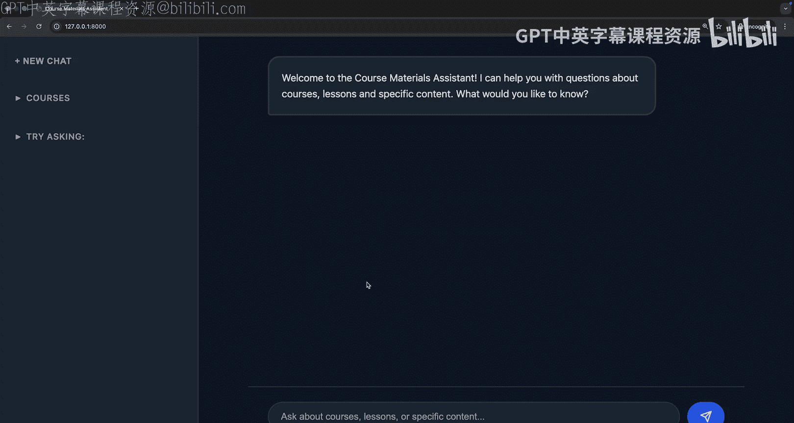

## 为后端添加新工具
我们需要一些非常好的前端更改，现在让我们去后端看看。像之前一样，我们将重新开始。与其基于这个对话继续构建，我们将开始一个新的对话。所以，让我们清除对话历史记录，重新开始。这次我们想在后台添加一些功能。

我将输入一个提示词，讨论一下这里要做什么。我需要添加另一个工具，允许我访问特定课程，并为每个课程查看课程编号、课程标题以及相关描述。

目前，当我查看一个课程时，我得到的数据相对比较高层。让我们看看我的意思。我们将要求Claude Code在这里做的是更改我们的 `search_tools.py` 文件。让我们看看那个文件。在这个文件中，我们现在可以看到，我们只有一个用于搜索内容和获取该特定课程详细信息的工具。

这第二个工具将允许我们为这些课程中的每一课获取更具描述性的信息。

所以，让我们看看Claude能做什么。正如我们之前所做的那样，让我们制定一个计划，并确保在开始更改单个文件之前，我们首先同意该计划。

Claude Code可以看到当前的架构，实现大纲工具。由于我们之前有 `.claude_m` 文件，它将能够更快地理解需要做什么。

我们可以看看需要实现什么，确保我们在正确的文件中做正确的事情。我们可以看到，一旦我们创建了这个工具，我们就更新系统提示词以确保我们获得额外的数据，然后我们在我们的RAG系统中注册该工具。

和往常一样，如果我们想更改或建议任何东西，我们现在就可以做。让我们看看Claude Code能为我们做什么。如果这按预期工作，我们应该能够询问关于课程的问题，并为该课程中的特定课程获得更多细节。

我们可以看到，这里我们不仅修改了底层的Python代码，还修改了系统提示词。在这里，我们注册了我们制作的新工具。一旦我们完成了待办事项列表，我们可以回到浏览器，看看情况如何，如果这已经正确实现，我们将看到已做更改的摘要。我们可以在任何时候更改任何东西。

回到浏览器。让我们尝试请求一些关于课程的信息。如果这按预期工作，我们应该能够获得更详细的信息，包括该特定课程的链接。在这里，我们可以看到课程的名称。如果我们愿意，我们甚至可以构建额外的功能来获取每一个课程的来源。

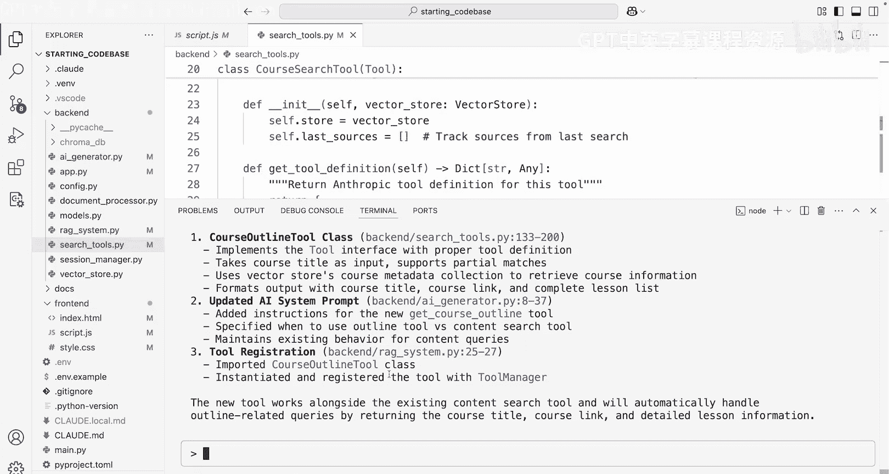

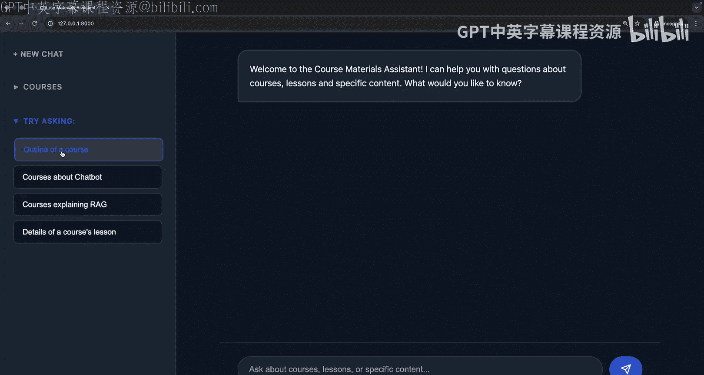

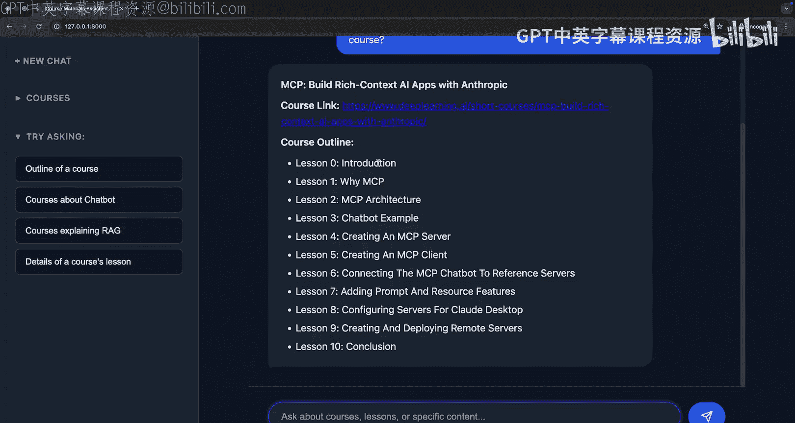

## 总结
在本节课中，我们一起学习了如何为现有项目添加功能。我们掌握了两个核心工作流：使用“计划模式”进行结构化、可控的代码修改，以及通过集成MCP服务器（如Playwright）来扩展Claude Code的能力，实现自动化界面测试与调整。我们实践了为前端添加可点击的引用链接和“新建聊天”按钮，并为后端添加了新的数据查询工具。这些技能将帮助你更高效、更可靠地迭代和增强你的软件项目。在下一课中，我们将讨论当出现问题时该怎么办，以及如何使用Claude Code进行调试、编写测试，确保我们对与Claude Code共同编写的软件充满信心。