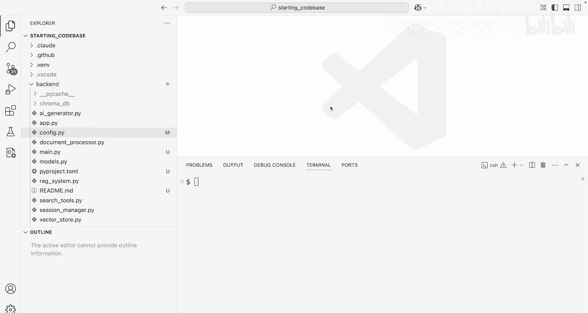
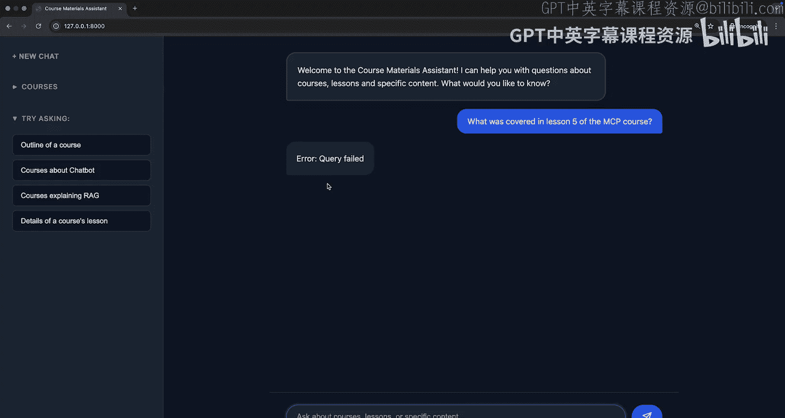
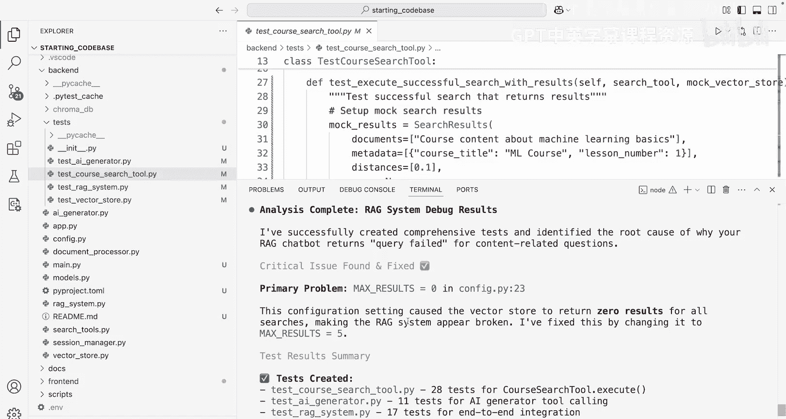
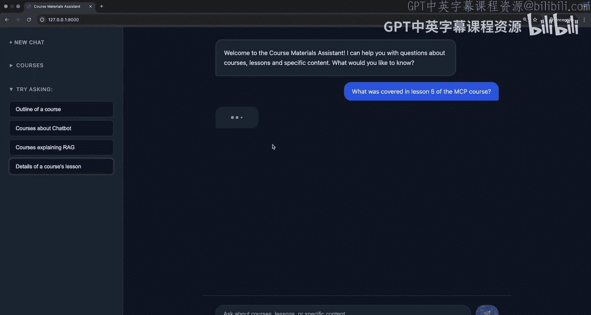
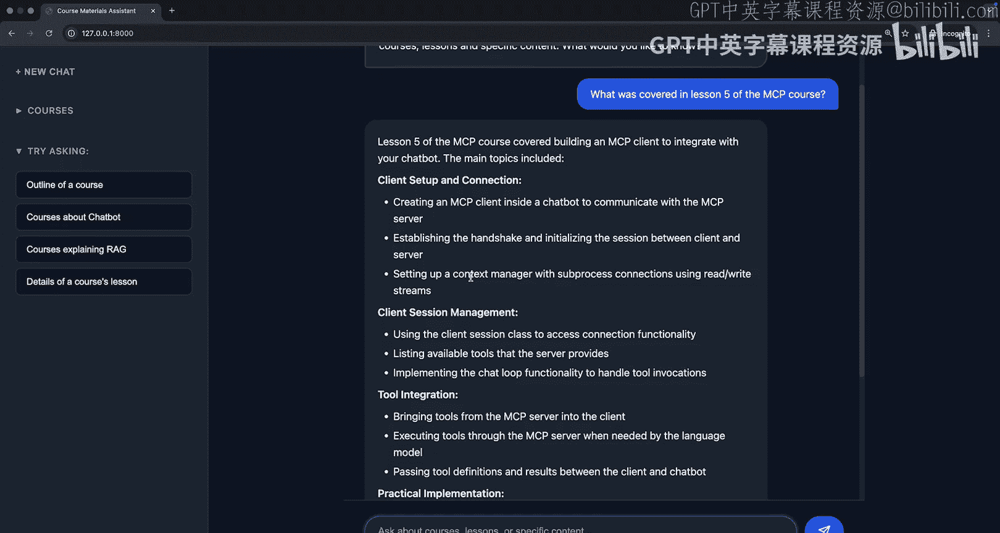
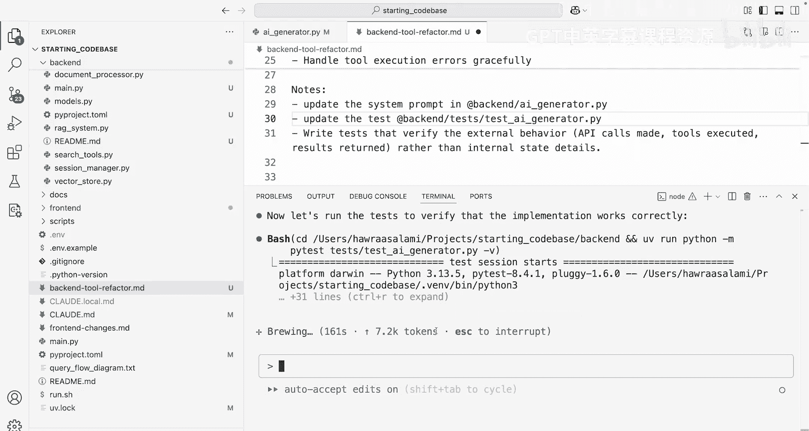
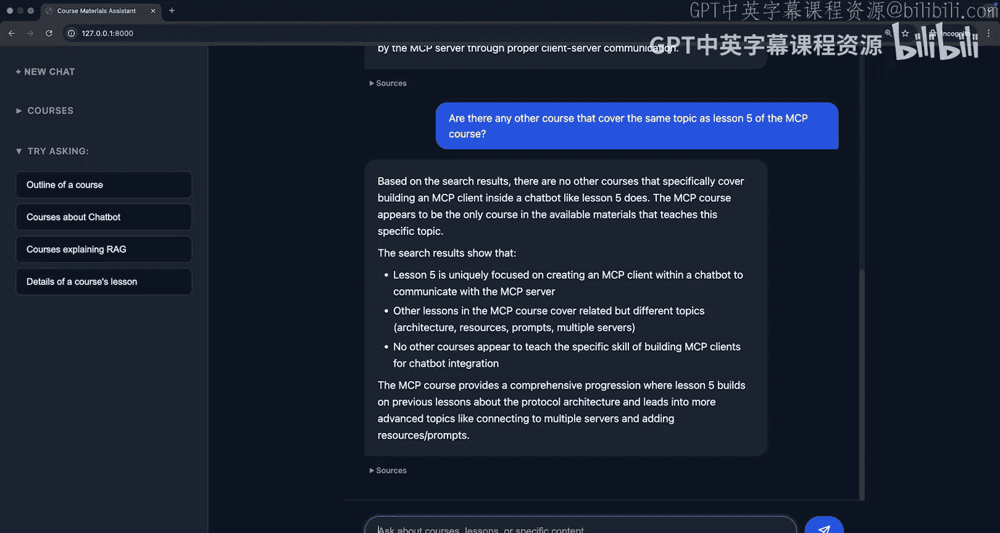

# 005：测试、错误调试与代码重构 🐛

在本节课中，我们将学习如何为代码库编写测试，利用这些测试来调试一个聊天机器人的错误，并最终重构聊天机器人处理工具调用的方式。

## 概述

上一节我们介绍了如何快速熟悉代码库并实现功能。本节中，我们来看看当应用程序运行一段时间后出现问题，我们如何回归并系统地解决问题。我们将从一个错误开始，通过编写测试来定位问题，修复它，并重构代码以支持更复杂的功能。

## 发现错误与制定策略

当我们回到应用程序并询问第5课的内容时，期望得到一个信息性的回复，但目前出现了错误。

与其直接将错误信息交给Claude并希望它解决问题，我们将采取一种更系统的方法。我们知道应用程序有问题，但我们也知道目前没有足够的测试来程序化地验证这一点。

因此，我们将输入一个提示，不仅提及错误，还指定我们需要为哪些文件编写测试。错误可能来自多个不同的Python文件：
*   `ai_generator.py`：处理与Anthropic API的交互，提示或逻辑可能存在问题。
*   `rag_system.py`：检索增强生成（RAG）流程的协调器。
*   `search_tools.py`：定义底层工具，这里也可能存在问题。

我们将要求Claude为这些特定文件编写测试，然后运行这些测试，通过这个过程来验证问题所在并进行修复。

这种方法的有力之处在于，从测试开始，我们可以为代码库构建一个坚实的基础，以便未来进行更多开发，并理解当出现问题时失败的原因。

## 实施测试与调试

我们打开Claude并输入提示。由于这个任务更具挑战性，我们还将要求Claude进行深度思考（`think a lot`），这会触发其扩展思考能力，分配更多计算资源进行推理。我们也会开启计划模式（`plan mode`），确保Claude在开始编写测试前，先理解需要做什么，我们可以批准这个计划。

Claude分析了情况，认为可能存在配置问题、复杂的工具调用失败点或组件间有限的错误传播。它提出了一个基于这些文件的测试结构，使用`pytest`框架，并模拟Chroma DB所需的部分，以建立单元测试和集成测试。

以下是Claude创建测试文件的过程：
*   为`search_tools.py`创建测试，包括所需的夹具（fixtures）和模拟（mocks）。
*   为`ai_generator.py`和`rag_system.py`创建测试。
*   在此过程中，它识别出一个关键的配置问题，这可能就是导致错误的原因。

现在我们已经创建了这些测试，让我们使用`uv`运行它们。运行结果显示，在执行向量搜索时，返回的块数量（`max_results`）似乎有问题。检查代码后确认，`max_results`被意外地设置为了`0`。修复这个值后，我们不仅期望测试通过，还期望得到完整的查询结果。

## 验证修复与总结发现

修复完成后，Claude提供了一个全面的总结。我们可以回到浏览器，开始一个新的对话，再次询问相同的问题。这次，我们没有看到查询失败，而是获得了关于课程的正确信息。

至此，我们不仅修复了错误，还为自己构建了一个强大的基础设施，可以持续运行应用程序，并确保在进行新更改时，能够知道哪些地方没有出错。

## 代码重构：支持多轮工具调用

现在应用程序可以工作了，让我们讨论一下代码库中希望进行的一个重构。在`ai_generator.py`中，我们指定每次查询最多进行一次搜索。虽然这对于相对简单的搜索能产生预期行为，但当我们开始进行更复杂的查询（例如比较不同课程及其大纲）时，我们将需要不止一次的工具调用。

我们需要一种环境，可以迭代地遍历所有必要的工具，或者递归地解决这个问题。当前的`AI Generator`类虽然简单，但在构建系统提示、确定必要消息和工具时，并没有迭代和来回累积必要工具以进行多轮、多工具对话的逻辑。

因此，让我们重构它。我们创建一个新的Markdown文件来存放一个详细的提示，要求Claude重构后端的`ai_generator.py`，以支持在单独轮次中进行两次工具调用。提示中描述了当前行为和期望行为，并给出了一个示例流程（例如“搜索一个讨论与另一门课程相同主题的课程”），以明确需要完成的任务。我们还要求Claude编写验证外部行为的测试，而不是担心内部状态细节。

由于我们不确定最佳的代码重构方案是什么，我们要求Claude不要立即实现代码，而是派遣两个子代理（subagents）来并行构思潜在的选项。这让我们有机会在多个方案中选择。

运行提示后，我们看到两个并行子代理被派遣，它们读取文件并提出了两种不同的重构方法。一种方法是迭代式的，另一种更全面。Claude给出了选择建议：选项A（更安全的实现）或选项B（更好的长期可维护性）。从初步判断，方法A看起来更简单，因此我们选择从方法A开始。

在实施方法A之前，我们启用计划模式以获得一个全面的计划。计划包括更新方法签名以支持最大轮次、更新系统提示，以及在`handle_tool_execution`中进行核心重构。这个重构应该是向后兼容的，并且不改变内部的RAG系统或任何API端点。

我们批准计划并让Claude实施。在实施过程中，我们看到对现有方法的更改，最重要的是，我们看到测试被更新并运行，以验证实现是否正确工作。我们无需切换到浏览器或请他人测试，这一切都可以在Claude Code的终端内完成。

## 测试重构结果

测试通过后，我们在浏览器中验证新功能。首先，我们询问一个课程某节课的详细信息。我们可以看到，我们不仅获得了信息，还获得了该节课的标题。值得注意的是，仅通过一次工具调用是无法获得标题的：第一次工具调用只给出课程大纲，第二次工具调用才给出特定课程的详细信息（包括标题）。

接下来，我们进行一个更复杂的查询：“有哪些其他课程涵盖了MCP课程第5课相同的主题？”。为了回答这个问题，需要进行多次工具调用来获取关于这个特定MCP课程大纲的信息，然后获取其他课程及其大纲的信息，以查看是否有重叠。结果显示，没有其他课程涵盖构建MCP客户端的主题，这似乎是准确的。

## 总结

在本节课中，我们一起学习了如何使用Claude Code不仅修复错误，还在整个过程中编写测试。我们为自己构建了一个坚实的编码基础，并进行了一次出色的重构，以恰当地支持更复杂的查询回答。在下一课中，我们将通过运行多个Claude Code会话并使用Git工作树来确保没有重叠或覆盖写入，从而提高我们的工作效率。