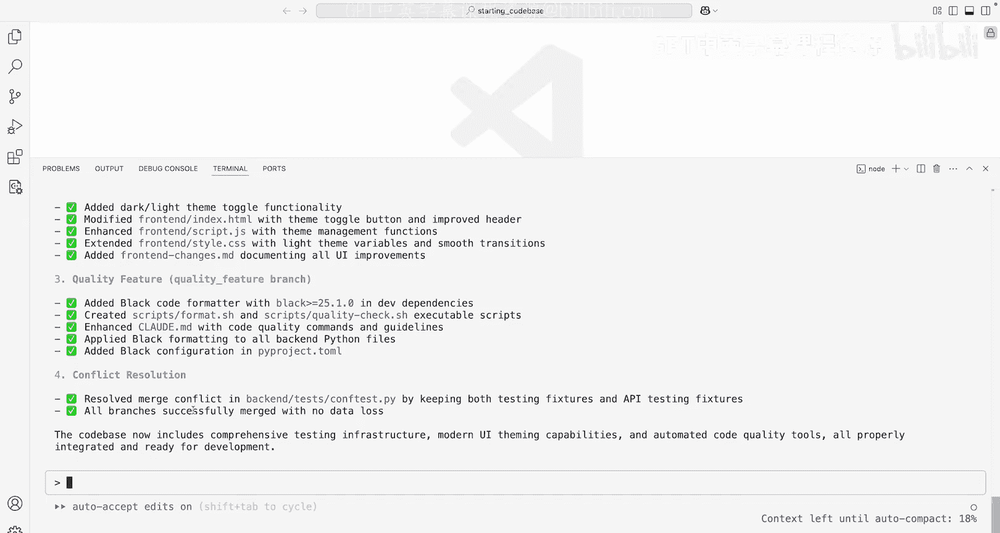
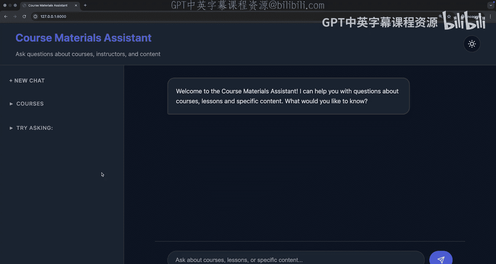
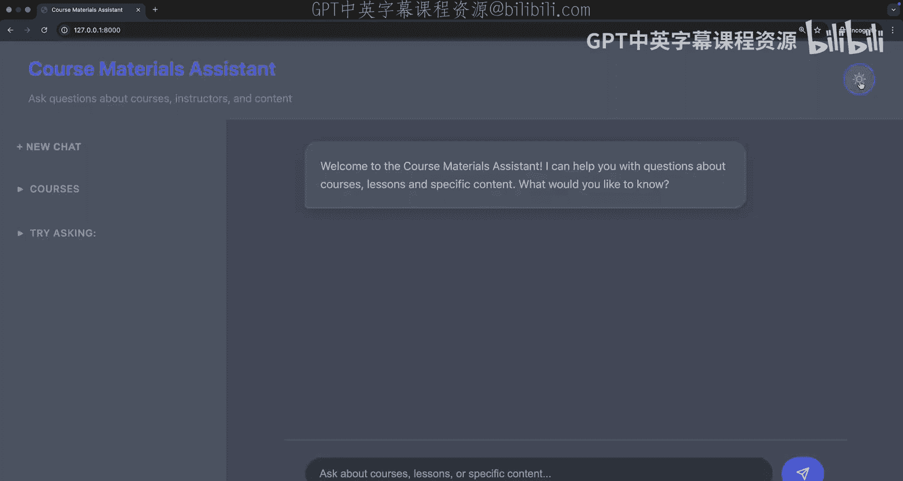
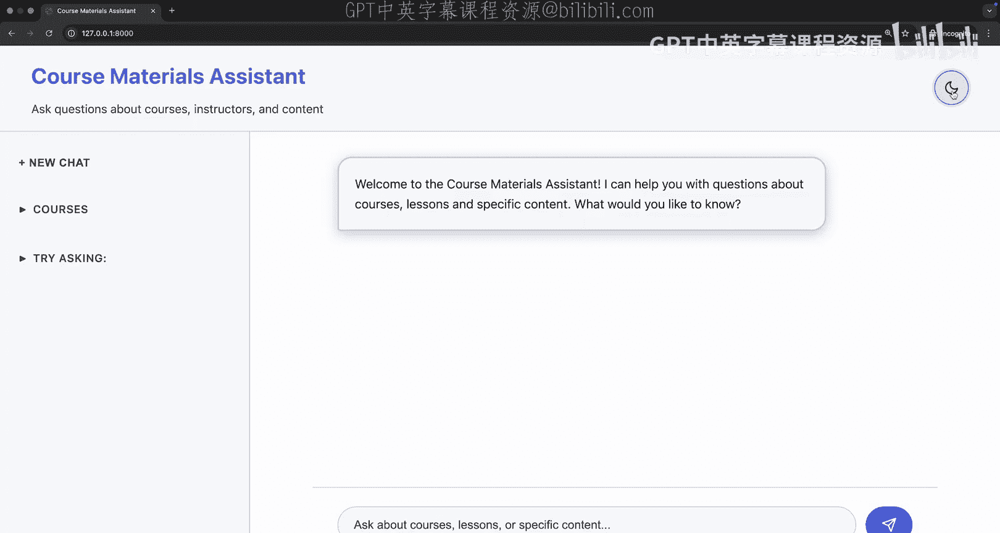

# 006：同时添加多个功能

## 概述
在本节课中，我们将学习如何使用 Claude Code 同时处理多个功能开发任务。我们将通过 Git 工作树功能，在并行环境中安全地修改代码，避免文件冲突，并最终合并所有更改。

---

## 自定义命令的创建与使用

上一节我们介绍了 Claude Code 的基本功能，本节中我们来看看如何创建自定义命令来优化工作流程。

Claude Code 内置了许多斜杠命令，但您也可以创建自己的命令。在 `.claude` 文件夹内创建一个名为 `commands` 的新文件夹。在此文件夹中，创建一个以您希望的命令名命名的 Markdown 文件。这里我将创建一个名为 `implement_feature` 的命令。

创建 Markdown 文件 `implement_feature.md` 后，您可以在其中放置任何内容。特别之处在于，如果您想向自定义命令传递参数，可以使用 `$arguments` 变量来引用。

以下是我在该文件中放置的内容：
```
当使用此命令时，我将指定您正在实现一个新功能。用户可以指定该功能的具体内容。然后，我需要确保 Claude Code 清楚地知道这仅适用于前端功能，并将所做的更改写入名为 `frontend_changes.md` 的文件。
```

您可以想象自定义命令有许多不同的用例，例如以特定方式运行测试或运行文件。请注意，与 `claude.md` 文件不同，此处放置的内容不会自动添加到您的上下文中。如果您希望某些内容应用于您创建的每个 Claude Code 实例，请使用 `claude.md` 文件。但如果您有特定的命令，可能在不同对话中使用或不使用，那么这里是一个很好的存放位置。

我将使用这个自定义命令来开始讨论工作树。但在开始之前，让我们退出 Claude Code 并重新进入，以验证我们可以看到这个自定义命令。现在我可以看到 `implement_feature` 命令，其描述来自 Markdown 文件的第一部分。

添加此自定义命令后，让我们继续添加并提交更改。我可以从命令行执行此操作，但我将要求 Claude 为我完成。

以下是 Claude 执行的命令：
```bash
git add .claude
git commit -m "Add custom command for implementing features"
```

这很好，因为 Claude Code 可以创建带有描述性信息的提交消息，说明所做的更改。我们可以看到它已添加到仓库中。由于我们已经授予了权限，因此无需再次确认。

如果您好奇这些权限设置存储在哪里，可以在 `.claude` 文件夹内的 `settings.local.json` 文件中找到。在此文件中，我们可以指定已允许的命令，这样我们就不需要每次都进行确认。您也可以看到，当我们使用 Playwright 时，我们授予了权限。如果您想添加自己的权限，可以轻松地在此文件中添加，或者使用方便的 `/permissions` 命令。

---

## 使用 Git 工作树进行并行开发

现在我们已经设置了自定义命令，让我们讨论一下如何与 Claude Code 并行工作。我们将使用 Git 来确保在拥有多个 Claude Code 实例时不会覆盖现有文件。

我可能有两个不同的 Claude Code 实例操作同一个文件。如果我使用当前环境这样做，将会导致覆盖错误和相当多的混乱。幸运的是，Git 在这里提供了一个极好的选项，即使用称为“工作树”的功能。工作树允许我创建代码库的副本，在隔离环境中操作，然后在最后合并在一起。实际上，我可以使用 Claude 来帮助合并和管理我的工作树。

要开始使用工作树，我首先创建一个名为 `.trees` 的文件夹。在此工作树文件夹中，我将添加几个工作树。

以下是创建三个工作树的命令：
```bash
git worktree add .trees/ui_feature
git worktree add .trees/testing_feature
git worktree add .trees/quality_feature
```

为了确认我已创建所有这些工作树，我可以查看一下。我可以看到我当前在主分支上，并且已经创建了三个独立的工作树。为了在每个环境中正确设置，我将打开 `trees` 文件夹，并为每个工作树打开一个终端。

我将从我的 UI 功能开始，并将其移到这里。然后我将引入我的测试功能，并将其移到右侧。最后，让我们引入我们的质量功能，并将其移到上方以给我们更多空间。我们将使其稍微小一些。现在我们有了三个专用的终端窗口，并隐藏了资源管理器。

现在，让我们为每个环境打开 Claude。我们现在可以并行运行 Claude Code，并确保如果修改了相同的文件，我们不会覆盖它们。我们可以在稍后合并这些工作树时修复任何冲突。

---

## 并行实现多个功能

我将使用 `implement_feature` 命令，然后输入一个我想要的具体功能。该功能允许我添加一个切换按钮来在深色和浅色主题之间切换。让我们继续创建一个切换按钮，定位它，并确保我可以为此特定切换按钮进行导航。我们将从这部分开始，然后添加浅色主题变体。

当这个运行时，我现在可以移动到另一个工作树。在这个第二个工作树中，让我们开始考虑一下我想为这个测试框架做什么。我将在这里传递一个提示，以增强现有的测试框架并为 FastAPI 端点添加额外的测试。

当那个运行时，让我们为我们的开发工作流程添加一些必要的代码质量工具。当我们这样做时，我们可以开始看到正在请求更改。让我们继续在这些环境之间切换，并确认我们想要的更改。我们的测试正在编写，我们用于分析代码库结构和格式化的额外开发依赖项也正在添加。

我们将看到我们正在修改一个名为 `pyproject.toml` 的文件，并且还将看到正在请求编辑该特定文件。随着我们继续，这些选项将对这些文件进行编辑，我们将同时看到我们的前端代码正在按预期完成。

我们可以并行工作，并确保这些特定更改不会被代码库的其他部分覆盖。如果碰巧我们对类似文件进行了更改，我们可以确保修复这些合并冲突，并且我们可以使用 Claude 来完成。我们的前端更改正在写入，我们正在添加更多测试，并且我们正在为质量检查添加一些格式化工具和开发脚本。

我们将按预期进行，确保质量脚本正在完成，并且看起来我们的前端功能正在添加。现在以我们之前相同的方式添加浅色主题。我们将使用我们的 `implement_feature` 自定义命令来确保我们正在写入更改日志。我们还将添加一个浅色主题。

一旦完成，我们将继续排队其他几个我们想要的 JavaScript 功能和实现细节的提示。当那个运行时，我可以检查其他脚本。我可以确认我想运行那些脚本，如果有任何事情发生，Claude Code 可以按需修复。看起来有一些脚本但 Claude 不知道。所以我们将继续安装依赖项或确保我们按预期运行事物，并看到这里我们开始了一些代码质量检查，我们已经编写了 API 端点测试，并且我们正在添加更多前端功能。

一旦这一切完成，我们可以前往浏览器。我们可以确认我们的检查已完成，但在我们继续之前，让我们引入所有这些单独的更改。如果我们想运行测试，我们可以确认这是按预期的。我们想前往浏览器进行我们的 UI 测试，我们可以这样做。在这里，我们可以看到代码库格式化已完成，开发脚本已添加，文档已更新。

我们之前看到有一个 `pyproject.toml` 文件在两个不同的工作树中被添加。因此在整理这些单独的部分时可能会有一些冲突。现在我们对这些更改感到满意，让我们添加并提交一个描述性的消息。

让我们也在这个工作树上做同样的事情。由于我们将合并这些特定的提交，我们将希望确保我们有描述性的提交消息，以便我们可以理解在每个工作树中做了什么。我们已经提交了这个特定的提交，我们在这里的这一个上也做同样的事情。我们已经完成了我们的 UI 增强，所以让我们做同样的添加并提交一个描述性的消息。

如果您发现自己编写这类提示，如“添加并提交带有描述性消息”，这也可能是另一个自定义命令的好用例，我们可以在其中指定我们想要的确切样式或我们公司遵循的最佳 Git 实践。

---

## 合并工作树并解决冲突

现在我已经完成了所有这三个的提交，我现在可以回到我的主分支并合并一些东西。所以我要关闭这些终端环境并跳回到我们的主分支。

现在我将要求 Claude Code 使用 `git merge` 命令来合并所有工作树和 `.trees` 文件夹，并修复任何冲突（如果有的话）。所以让 Claude Code 合并所有这些特定的树，并确保它们按预期工作。

我们可以看到这里有三个可用的工作树。所以我们将从合并每个工作树开始。我们将确认这是我们想要使用的命令，然后这应该按预期工作。看起来我们的测试功能没有任何冲突。让我们引入我们的 UI 功能。再次强调，我们可以自己编写这些命令，但 Claude Code 从我们的提示中确切知道该做什么。

现在我们可以合并质量功能分支。在这里，我们将查看是否有任何冲突。正如我们所见，在这个特定文件中存在冲突。所以我们将让 Claude Code 分析这些冲突并完成合并。当您有小的合并冲突而不想每次都手动处理时，这可能非常有价值。在这里进行测试也很有价值，以确保一旦我们完成，我们可以运行测试并且代码库按预期工作。

现在继续按预期进行合并，并且可以用“解决合并冲突”来提交所有这些更改。如果我愿意，之后我可以要求它删除这些工作树，或者如果我需要，我可以保留它们。它将快速运行测试以确保这些文件按预期存在，并且合并配置也是按预期的。

我们也可以返回浏览器，看看我们的前端更改是否按预期实现。看起来 Claude Code 已经完成，我们已经添加了必要的依赖项，修改了我们的 `pyproject.toml`，添加了测试，实现了浅色/深色主题，实现了我们的 Black 代码格式化器以确保代码按特定格式预期，并在我们与另一个工作树处理的同一文件中添加了该配置，修复了任何冲突。让我们确保这按预期工作。

回到浏览器，我现在看到这里我有这个可爱的主题，当我切换时，我可以看到浅色主题和深色主题。可能还有一些我想在这里和那里调整的东西，但我已经能够编辑堆栈的所有部分，甚至在代码检查和 DevOps 方面做一些事情，所有这些都没有通过 Git 工作树的功能导致令人头疼的覆盖问题。

---







## 总结
在本节课中，我们一起学习了如何使用 Claude Code 和 Git 工作树功能来并行开发多个功能。我们首先创建了自定义命令来优化工作流程，然后利用 Git 工作树创建了三个独立的开发环境，分别用于 UI 功能、测试框架增强和代码质量工具添加。通过并行工作，我们能够同时修改代码而不会产生冲突，最后成功合并了所有更改并解决了可能出现的合并冲突。这种方法极大地提高了开发效率，特别是在处理多个相关但独立的任务时。



在下一课中，我们将看到如何通过 GitHub 集成在终端之外使用 Claude Code，以便审查拉取请求、进行更改，并在终端生态系统之外提供帮助。