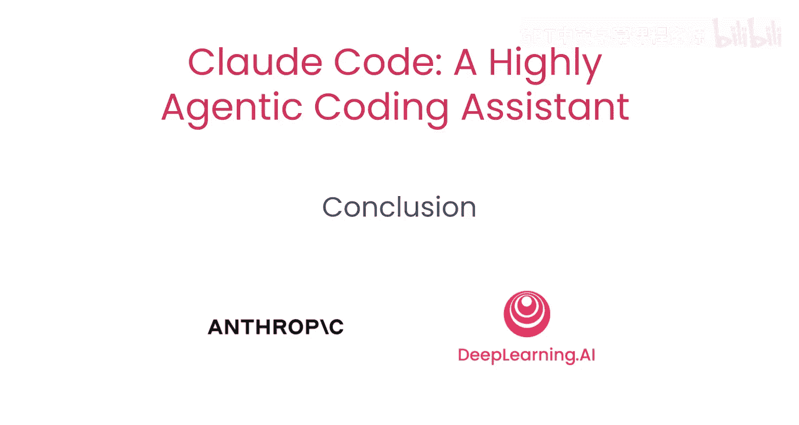

# 010：总结与展望 🎯

在本节课中，我们将回顾整个课程的核心内容，总结使用 Claude Code 的关键要点，并展望如何进一步扩展其能力。

## 课程回顾与核心要点

上一节我们探讨了如何利用 Claude Code 进行调试。现在，让我们对整个学习旅程进行总结。

恭喜你坚持学习到这里。你已经学会了如何使用 Claude Code 来探索、测试、重构和调试代码库。

为了让 Claude Code 发挥最佳效果，你需要遵循以下关键实践：

以下是使用 Claude Code 的三个核心原则：

1.  **提供清晰的指令**：明确告知 Claude Code 你的具体需求。
2.  **阐明上下文**：确保它理解当前任务所处的环境和背景。
3.  **指向相关文件**：在代码库中明确指出与任务相关的文件。

此外，请务必将你的代码库规则添加到 `.claudermd` 文件中，并包含任何你希望 Claude Code 记住的关于项目的信息。

## 扩展能力与未来展望

考虑扩展 Claude Code 的能力，并将其连接到 MCP 服务器，例如 Playwright 和 Figma。

感谢你与我一同踏上这段学习旅程。我迫不及待想看到你将使用 Claude Code 构建出怎样的项目。

---

**本节课总结**

本节课中，我们一起回顾了 Claude Code 的核心使用流程：探索、测试、重构与调试。我们总结了高效使用它的三大关键——清晰的指令、明确的上下文和精准的文件指引，并强调了项目规则文件（`.claudermd`）的重要性。最后，我们展望了通过连接 MCP 服务器来扩展其功能的可能性。希望这些知识能助你在编程道路上更高效地创造。