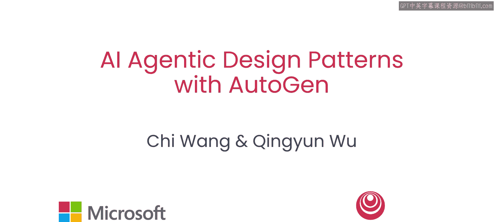
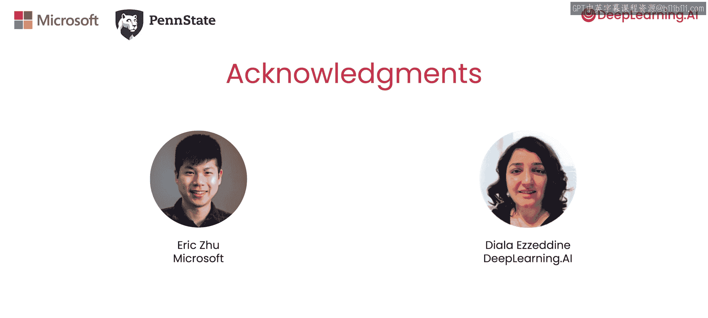

# 001：课程介绍

欢迎来到与微软合作构建的《利用AutoGen的人工智能智能体设计模式》课程。

本课程的讲师是微软的资深研究员朱旺和宾夕法尼亚州立大学的助理教授吴涛，他们两位都是AutoGen的共同创造者。

感谢吴恩达。很高兴来到这里。谢谢。很高兴与您一起，吴恩达。

## 课程概述

在本课程中，我们将介绍AutoGen。AutoGen是一个多智能体对话框架，它使您能够快速创建具有不同角色、个性和能力的多个智能体，以使用不同的AI智能体设计模式来实现复杂的AI应用。

让我们假设您对分析金融数据感兴趣。这项任务可能需要编写代码来收集和分析股价，然后将您的发现综合成一份报告。这可能需要一个人花费数天时间进行研究、编码和写作。

一个多智能体系统可以通过让您创建并“雇佣”智能体为您工作来简化这个过程，例如研究员、数据收集员、代码编写员和执行员。您的智能体还可以迭代地审查、批评和改进结果，直到它达到您的标准。

这只是多智能体框架众多实际应用中的一个例子。朱旺和吴涛将引导您完成六个课程，每个课程都展示其独特的设计流程和用例。

## 课程内容

在本课程中，您将通过探索构建智能体和可对话智能体来学习AutoGen的所有核心组件。您将创建并定制两个单口喜剧演员智能体之间的生动对话，同时探索它们的交互能力。

接下来，您将学习一种称为**顺序聊天**的多智能体交互模式。这使您能够构建按步骤执行一系列任务的对话智能体。我们将用一个客户入职应用程序来说明这一点。

您还将在两个实际场景中探索智能体反思框架。第一个场景将使用多个智能体来生成一篇写得很好的博客文章。第二个场景则为智能体添加工具，以创建一个对话式国际象棋游戏。在这两个例子中，您将学习另一种称为**嵌套聊天**的交互模式。

嵌套聊天意味着当一个智能体被赋予一项任务时，它会召集一批其他智能体，并与它们进行一段时间的迭代，然后才返回结果。如果我们把您（开发者）想象成几个智能体的经理，那么嵌套聊天就对应于让您管理的一个智能体也去管理它们自己的智能体。

您还将学习一个非常强大的功能：**工具使用**。您可以为智能体提供一个用户定义的函数，例如一个检查特定棋步是否合法的函数，并让智能体使用它。

对于那些您可能没有预定义函数或代码可提供的应用，您还将学习**编码和代码执行**。这意味着要求智能体编写它需要的代码，在检查正确性之后，它可以在沙箱环境中执行自己编写的代码，以计算任务所需的结果。我们将在金融分析示例中同时说明工具使用以及代码编写和执行。

最后，您将学习构建自定义多智能体群聊的最佳实践。我们将通过生成详细报告的示例来说明这一点。这项复杂任务需要规划，换句话说，智能体必须决定要采取的一系列行动，例如获取数据、分析、写作和修订。您将看到我们如何将规划智能体添加到群聊中，并控制工作如何从一个智能体流向另一个智能体，以便以正确的顺序执行所需的各个任务。

## 第一课预告

许多人已经完成了这门课程，我要感谢微软的每一位成员以及DeepLearning.AI的团队。

在第一课中，您将从构建第一个AutoGen智能体开始，编写一个基本的双智能体对话程序，并欣赏一场单口喜剧表演。这听起来很棒。让我们进入下一个视频，开始学习吧。😊