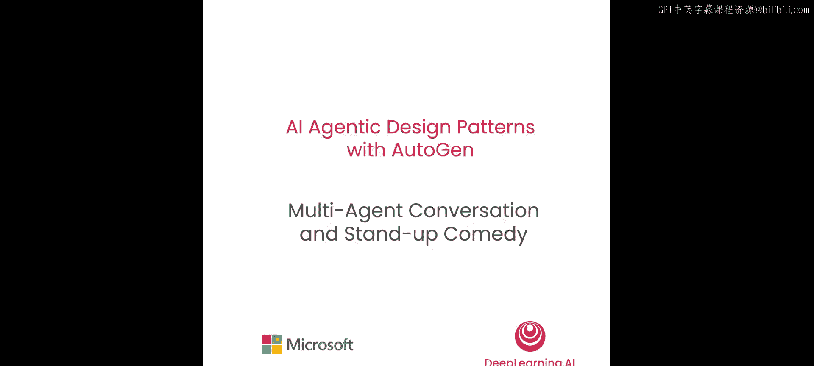
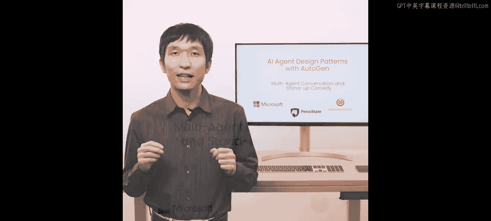
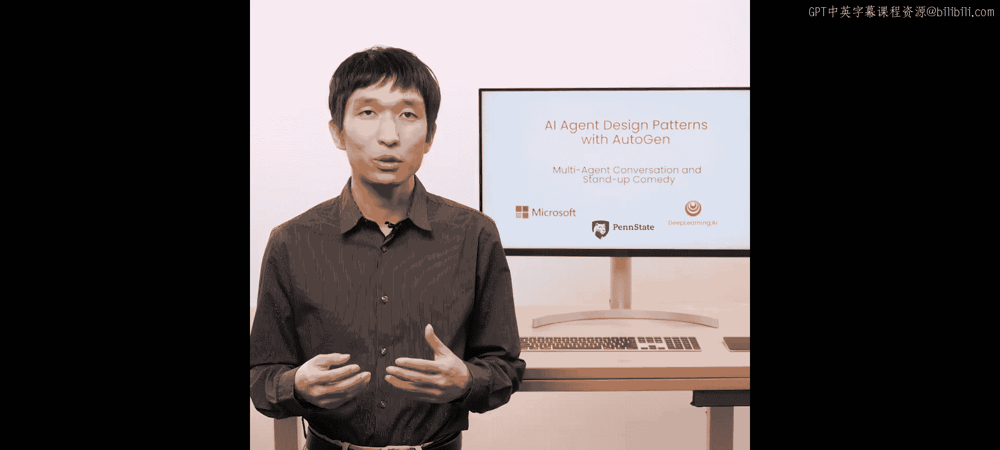
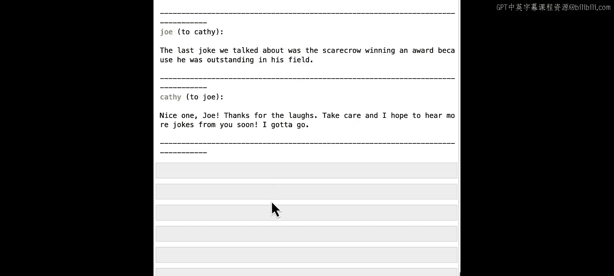

# 002：多智能体对话与单口喜剧示例





在本节课中，我们将学习AutoGen中**可对话智能体**的基本概念，并构建一个由两个单口喜剧演员智能体相互对话的趣味应用。我们将从智能体的基础定义开始，逐步学习如何创建智能体、配置其行为，并管理它们之间的多轮对话。

## 智能体基础概念




上一节我们介绍了本课程的目标，本节中我们来看看AutoGen中智能体的核心概念。

在AutoGen中，一个**智能体**是一个可以代表人类意图行事的实体。它可以发送消息、接收消息、执行操作、生成回复并与其他智能体互动。

AutoGen提供了一个内置的智能体类，称为 **`ConversableAgent`**。它在同一个编程抽象中统一了不同类型的智能体，并附带了许多内置功能。

以下是`ConversableAgent`的一些核心功能：
*   你可以使用LLM配置列表来生成回复。
*   你可以执行代码或函数调用。
*   它提供了让人类参与循环以及检查是否停止响应的组件。
*   你可以根据应用需求，开启、关闭或自定义这些组件。

利用这些不同的能力，你可以使用相同的接口创建具有不同角色的智能体。

## 创建你的第一个智能体

了解了智能体的概念后，我们开始动手创建第一个智能体。

首先，我们需要从环境变量中导入OpenAI API密钥，并定义语言模型配置。

```python
# 导入获取API密钥的工具函数
from autogen import get_openai_api_key
# 运行函数获取密钥
openai_api_key = get_openai_api_key()

# 定义LLM配置，本课程使用GPT-3.5 Turbo模型
llm_config = {
    "model": "gpt-3.5-turbo",
}
```

接下来，我们从AutoGen导入`ConversableAgent`类，并创建第一个智能体对象。

```python
# 导入ConversableAgent类
from autogen import ConversableAgent

# 创建第一个可对话智能体，命名为“chatbot”
chatbot = ConversableAgent(
    name="chatbot",
    llm_config=llm_config,  # 传入上面定义的LLM配置
    human_input_mode="NEVER",  # 设置人类输入模式为“从不”
)
```

我们向`ConversableAgent`传递了LLM配置，这样智能体就能使用大语言模型来生成回复。`human_input_mode`设置为`"NEVER"`意味着智能体永远不会寻求人类输入，它只会使用大语言模型来生成回复。通常，你可以将此模式切换到其他设置，例如`"ALWAYS"`，那么智能体在尝试自行生成回复前总会先询问人类输入。

这只是智能体的基本设置。通常，你还可以添加代码执行配置、函数调用等其他设置，但让我们从这个简单设置开始。

## 与智能体进行单次对话

创建好智能体后，我们可以使用`generate_reply`方法让它对一个提问生成回复。

```python
# 调用智能体的generate_reply函数，并提供一个消息列表
reply = chatbot.generate_reply(
    messages=[
        {
            "content": "Tell me a joke.",
            "role": "user",
        }
    ]
)
print(reply)
```

运行这段代码，你应该能从智能体得到一个回复。智能体可能会说：“当然，给你讲个笑话：为什么稻草人会获奖？因为他在他的领域里很出色。”

这是通过提问并从智能体获得回复所能做的最基本的事情。

现在，如果你再次调用这个函数会发生什么？假设我们再次调用`generate_reply`函数，这次将内容替换为“重复那个笑话”。我们期望智能体重复那个笑话吗？实际上不会。因为当我们调用`generate_reply`函数时，它不会改变智能体的内部状态。所以当我们再次调用时，它并不知道之前已经生成过回复，这相当于一次全新的调用，它会生成一个新的回复，而不知道之前回复过。

如果你希望生成不同的回复，当然可以在应用中使用这种方式。但如果你想保持状态、维护状态并让它执行一系列任务，我们需要一种不同的方法。

## 构建多智能体对话：单口喜剧示例

在下一部分，让我们看看如何创建多个智能体之间的对话，我们将做一个单口喜剧的例子。

我们想创建一个应用，让两个单口喜剧演员智能体相互交谈并取笑对方。首先，我们创建一个名为Cassy的可对话智能体。

```python
# 创建第一个喜剧演员智能体 Cassy
cassy = ConversableAgent(
    name="Cassy",
    system_message="Your name is Cassy and you are a standup comedian.",
    llm_config=llm_config,
    human_input_mode="NEVER",
)
```

在这个例子中，我们通过`system_message`让智能体知道“你的名字是Cassy，你是一个单口喜剧演员”。我们传递了相同的LLM配置和相同的人类输入模式。如果你不指定系统消息，那么智能体会有一个空的系统消息，并表现为一个通用助手智能体。使用系统消息，我们可以定制智能体的行为。

接下来，我们创建另一个智能体。

```python
# 创建第二个喜剧演员智能体 Joe
joe = ConversableAgent(
    name="Joe",
    system_message="Your name is Joe and you are a standup comedian. Start the next joke from the punch line of the previous joke.",
    llm_config=llm_config,
    human_input_mode="NEVER",
)
```

我们创建了另一个名为Joe的可对话智能体，并给出了系统消息：“你的名字是Joe，你是一个单口喜剧演员。” 之后，我们添加了另一条指令：“从上一个笑话的包袱开始下一个笑话。” 这为我们提供了关于如何延续对话的更具体指示。

## 发起并管理智能体对话

现在，我们有两个喜剧演员智能体准备就绪，可以开始工作了。发起对话的方式是调用其中一个智能体的`initiate_chat`函数。

例如，如果我们想让Joe开始对话，就调用Joe的`initiate_chat`函数。

```python
# 让 Joe 发起与 Cassy 的对话
chat_result = joe.initiate_chat(
    recipient=cassy,
    message="I'm Joe, Cassy. Let's keep the jokes rolling.",
    max_turns=2,  # 设置对话轮数为2
)
```

我们将收件人设置为Cassy，并给出初始消息：“我是Joe，Cassy。让我们继续讲笑话吧。” 我们设置`max_turns`为2，所以将进行两轮对话然后结束。

运行后，我们可以看到对话过程。第一条消息就是我们设置的“I‘m Joe， Cassy. Let’s keep the jokes rolling.”。下一条消息来自Cassy：“嘿Joe，很高兴见到另一位喜剧爱好者，让我们用一些笑话开始吧。为什么数学书看起来很伤心？因为它有太多问题。” 下一轮，Joe说：“好吧，Cassy，至少现在我们知道为什么数学书总是那么消极了。” 你可以看到Joe遵循了我们之前的指示，从上一个笑话的包袱开始了下一个笑话。Cassy接着说：“哈哈，没错，它只是无法从书页中减去悲伤。” 这延续了那个笑话，并最终提出了另一个笑话。经过这两轮交流，对话停止了。

对话结束后，我们可以检查`chat_result`中的聊天记录。

```python
# 导入 pprint 库以便美观地打印聊天记录
import pprint
pprint.pprint(chat_result.chat_history)
```

你可以看到所有交换的消息：第一条来自Joe，第二条来自Cassy，第三条来自Joe，第四条再次来自Cassy。

你还可以检查聊天结果中的令牌使用情况。

```python
# 查看对话的成本（令牌使用量和费用）
print(chat_result.cost)
```

我们会看到我们使用了GPT-3.5 Turbo模型，消耗了97个完成令牌和219个提示令牌，总令牌数为316，总成本为若干美元。

通常，你可以用不同的方式定义对话。你也可以通过调用`chat_result.summary`函数来检查聊天结果的摘要。默认情况下，我们使用最后一条消息作为聊天结果的摘要。在这个例子中，我们看到那是来自Cassy的最后一条消息。如果你想改变摘要方法，我们可以用不同的摘要方法进行配置。

## 高级对话控制：终止条件

你可能会注意到，我使用了`max_turns=2`来控制这次对话中发生多少轮。如果你在对话结束前不知道正确的轮数，该怎么办？我们可以通过提供名为`is_termination_msg`的额外配置来改变终止条件。这是一个布尔函数，它接收一条消息作为输入，并返回True或False，表示该消息是否意味着对话应该终止。

例如，你会注意到我改变了这里的消息，说“当你准备好结束对话时，说‘I gotta go’”。我们也传递这个停止条件，检查“I gotta go”是否在消息中。如果我们检测到“I gotta go”这个短语，我们将认为对话结束，并将此条件给予每个智能体。因此，每个智能体都会检查从另一个智能体收到的消息中的条件，如果他们在收到的消息中看到“I gotta go”内容，他们将停止回复。

让我们用新的终止条件再次运行对话，看看会发生什么。

```python
# 定义终止条件函数
def is_termination_msg(content):
    return "I gotta go" in content["content"]

# 再次发起对话，这次包含终止条件
chat_result_2 = joe.initiate_chat(
    recipient=cassy,
    message="I'm Joe, Cassy. Let's keep the jokes rolling.",
    max_turns=10,  # 设置一个较大的轮数上限，实际由终止条件控制
    is_termination_msg=is_termination_msg,
)
```

前几条消息类似。但这次，你可以看到他们有更多轮的对话。Cassy讲了个笑话，Joe回应了。Cassy问Joe另一个不同的笑话，Joe用其他笑话回应，最终Joe的最后一条消息是：“很高兴你喜欢，Cassy。披萨总是领先一步。谢谢你的笑声，我得走了。” 是的，它以“I gotta go”结束了对话，Cassy看到了，所以它停止了回复。这是一种更灵活的停止对话的方式。

## 继续对话与状态保持

对话结束后，如果你想继续对话，或者想看看这次智能体是否能保持状态，我们可以测试一下。我们可以用之前类似的提问来测试。接下来，我们将让Cassy发送另一条消息。

```python
# 让 Cassy 继续与 Joe 对话
continuation_result = cassy.send(
    recipient=joe,
    message="What's the last joke we talked about?",
)
```

这次，他们会记得最后一个笑话是什么吗？让我们检查一下。成功了！Joe回应道：“我们讨论的最后一个笑话是关于稻草人因为在他的领域里很出色而获奖。” 并且，他们也遵循了相同的终止条件。所以我们看到这次Cassy说“I gotta go”。Joe也知道这是停止对话的信号，它将停止回复。

这演示了让智能体进行对话、开始对话、继续对话以及记住对话历史的方法。

## 总结



本节课中我们一起学习了AutoGen中**可对话智能体**的核心概念。我们从定义智能体开始，学习了如何创建和配置单个智能体，并使用`generate_reply`方法进行单次交互。接着，我们深入探讨了多智能体对话，构建了两个单口喜剧演员智能体相互调侃的趣味示例。我们掌握了使用`initiate_chat`发起对话、用`max_turns`控制对话轮数、以及通过自定义`is_termination_msg`函数实现更灵活的对话终止条件。最后，我们还验证了智能体在对话中保持状态和记忆的能力。这仅仅是使用`ConversableAgent`构建两个智能体对话的非常基础的演示，在接下来的课程中，我们将学习许多其他对话模式和智能体设计模式。