# 003：顺序对话与客户引导

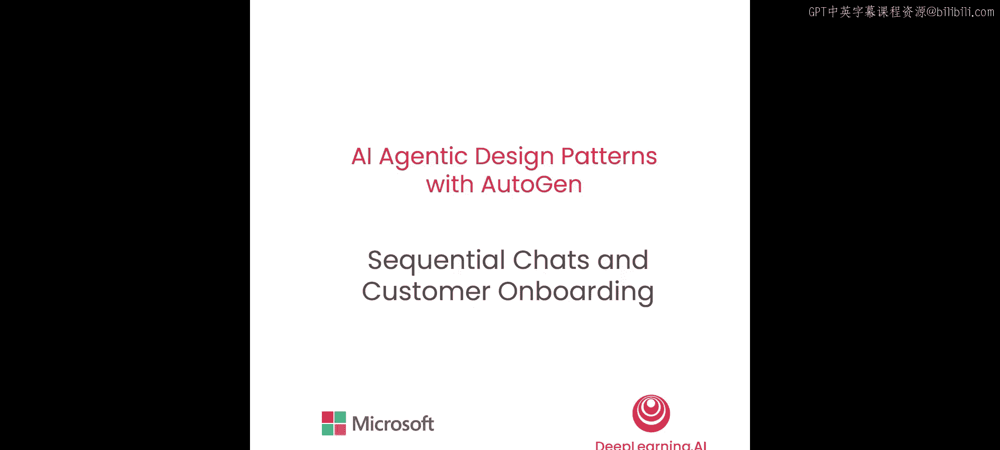

在本节课中，我们将学习如何利用多智能体设计来完成一个包含多个步骤的任务。我们将构建一个由多个智能体参与的对话序列，它们将协作完成一个产品的客户引导流程。我们还将体验人类如何无缝地参与到AI系统的循环中。

## 概述

客户引导是一个典型的多步骤流程。通常，我们需要先收集客户信息，然后调查客户兴趣，最后根据收集到的信息与客户进行互动。因此，将客户引导任务分解为三个子任务是一个好主意，包括：信息收集、兴趣调查和客户互动。


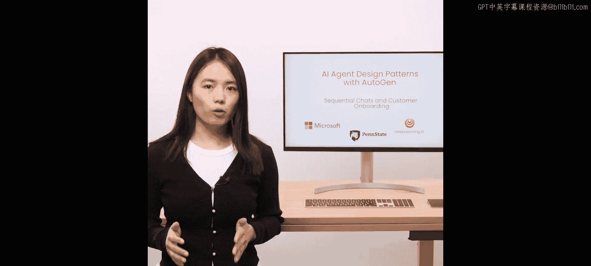

上一节我们介绍了多智能体的基本概念，本节中我们来看看如何通过顺序对话来完成这一系列任务。


## 构建智能体

我们将使用AutoGen中的`ConversableAgent`类来实现这些智能体。首先，我们需要导入这个类。

```python
from autogen import ConversableAgent
```

### 1. 创建信息收集智能体

第一个智能体负责询问个人信息。我们通过设置系统消息来定义其行为。

```python
onboarding_info_agent = ConversableAgent(
    name="OnboardingInfoAgent",
    system_message="你是一个客户引导智能体。你的任务是向客户询问其个人信息，例如姓名和所在地。",
    llm_config={"config_list": [{"model": "gpt-4"}]},
    human_input_mode="NEVER"
)
```

这里，我们将`human_input_mode`设置为`"NEVER"`，因为我们使用大语言模型来生成该智能体的响应。

### 2. 创建兴趣调查智能体

第二个智能体负责询问客户感兴趣的话题。

```python
onboarding_topic_agent = ConversableAgent(
    name="OnboardingTopicAgent",
    system_message="你是一个客户引导智能体。你的任务是询问客户在阅读方面感兴趣的话题。",
    llm_config={"config_list": [{"model": "gpt-4"}]},
    human_input_mode="NEVER"
)
```

### 3. 创建客户互动智能体

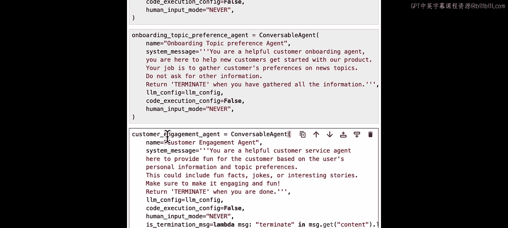

第三个智能体将根据客户的个人信息和话题偏好，提供有趣的事实、笑话或故事。

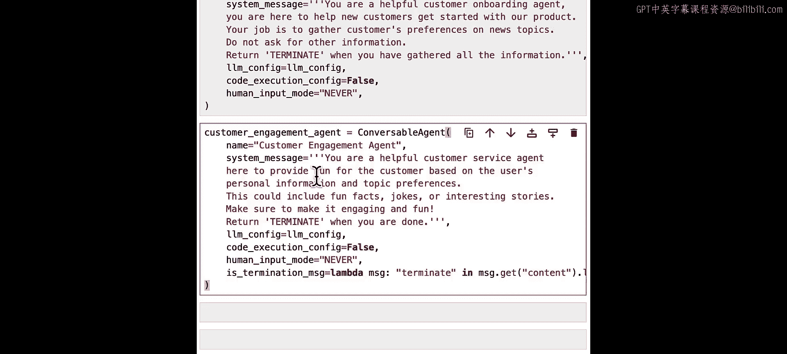

```python
engagement_agent = ConversableAgent(
    name="EngagementAgent",
    system_message="你是一个客户互动智能体。你的任务是根据客户的个人信息（如姓名、所在地）和他们感兴趣的话题，提供有趣的事实、笑话或故事来吸引客户。",
    llm_config={"config_list": [{"model": "gpt-4"}]},
    human_input_mode="NEVER"
)
```

### 4. 创建客户代理智能体

我们需要一个代理智能体来代表真实的客户。注意，这里我们将`human_input_mode`设置为`"ALWAYS"`，以便该代理智能体能够随时向真实客户征求输入。

```python
customer_proxy_agent = ConversableAgent(
    name="CustomerProxyAgent",
    system_message="你是一个客户代理。",
    llm_config=False,
    human_input_mode="ALWAYS"
)
```

## 设计顺序对话流程

构建好智能体后，我们现在可以设计一个顺序对话来完成引导流程。在这个具体例子中，每次对话本质上是某个引导智能体与客户代理智能体之间的双人对话。

在每次对话中，发送方智能体会向接收方发送一条初始消息以开启对话，然后他们会进行来回交流，直到达到最大轮次或收到终止消息。

以下是实现顺序对话的关键步骤：

### 第一段对话：收集个人信息

在第一段对话中，我们设置最大对话轮次为2，以确保对话简洁。

```python
# 启动第一段对话
result_info = onboarding_info_agent.initiate_chat(
    recipient=customer_proxy_agent,
    message="你好！欢迎使用我们的服务。首先，可以告诉我你的姓名和所在地吗？",
    max_turns=2
)
```

在顺序对话场景中，任务通常是相互依赖的。因此，我们可能需要总结前一段对话的信息，以供下一段对话使用。在这个例子中，我们使用`reflection`作为总结方法。

```python
# 总结第一段对话的客户信息
summary_info = result_info.summary(method="reflection")
```

我们还可以提供一个总结提示，指导大语言模型如何进行总结。

```python
summary_prompt = "请将客户信息总结为一个JSON对象，格式为：{'name': '客户姓名', 'location': '客户所在地'}"
summary_info = result_info.summary(method="reflection", summary_prompt=summary_prompt)
```

### 第二段对话：调查兴趣话题

第二段对话由话题偏好引导智能体发起。

```python
# 启动第二段对话
result_topic = onboarding_topic_agent.initiate_chat(
    recipient=customer_proxy_agent,
    message="太好了！接下来，能告诉我你对哪些阅读话题感兴趣吗？",
    max_turns=1,
    summary_method="reflection"
)
```

这次我们没有提供自定义的总结提示，因此将使用内置的默认提示。`max_turns`设置为1，因为我们只想用一轮对话来了解客户的兴趣话题。你可以根据需求将其改为多轮。

### 第三段对话：进行客户互动

第三段对话在客户代理智能体和客户互动智能体之间进行。这次由客户代理智能体发起对话。

```python
# 启动第三段对话
result_engagement = customer_proxy_agent.initiate_chat(
    recipient=engagement_agent,
    message="让我们找点东西来读吧。😊"
)
```

## 运行引导流程

配置好所有对话会话后，我们就可以通过执行`initiate_chat`来启动整个引导流程了。在这个例子中，你将扮演客户。当系统提示你输入答案时，请键入你的响应并按回车键。

以下是运行示例：

1.  **第一段对话开始**：信息收集智能体询问：“你好！欢迎使用我们的服务。首先，可以告诉我你的姓名和所在地吗？”
    *   客户输入：`Alice`
    *   智能体询问：“你的所在地是哪里？”
    *   客户输入：`New York`
2.  **第二段对话开始**：兴趣调查智能体询问：“太好了！接下来，能告诉我你对哪些阅读话题感兴趣吗？”
    *   客户输入：`dogs`
3.  **第三段对话开始**：客户互动智能体根据收集到的信息（姓名：Alice，所在地：New York，兴趣：dogs）生成一条互动消息。

你可以随时暂停并尝试提供自己的偏好信息。

## 检查结果与成本

对话完成后，你可以检查顺序对话中每个会话的结果。

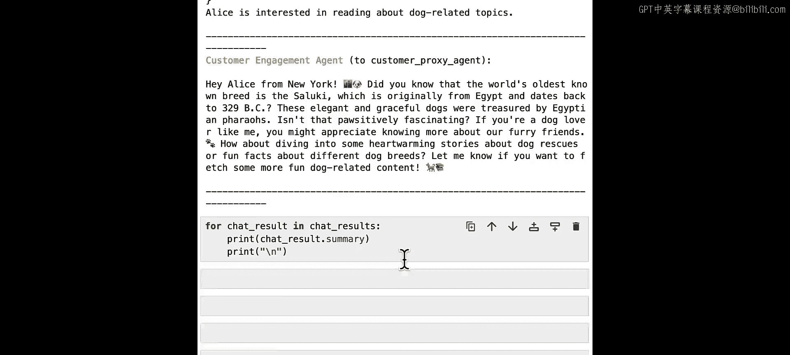

```python
# 检查第一段对话的总结信息
print("客户个人信息总结:", summary_info)

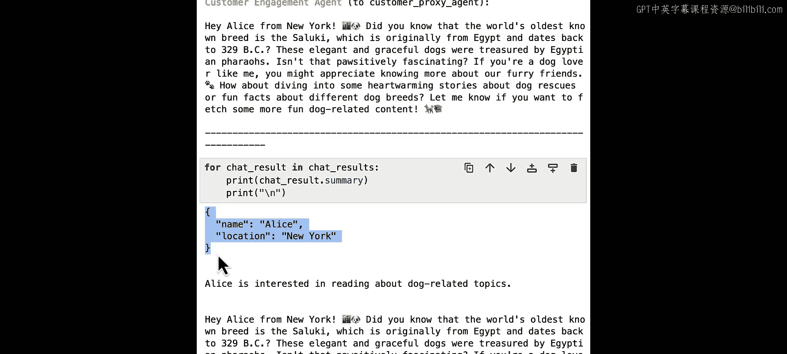

# 检查第二段对话的总结信息
summary_topic = result_topic.summary(method="reflection")
print("客户兴趣总结:", summary_topic)

# 检查第三段对话的最后一条消息
print("互动消息:", result_engagement.last_message()["content"])
```

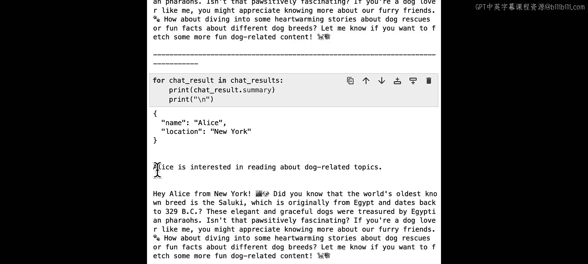

同样，你也可以查看与每次对话相关的成本。

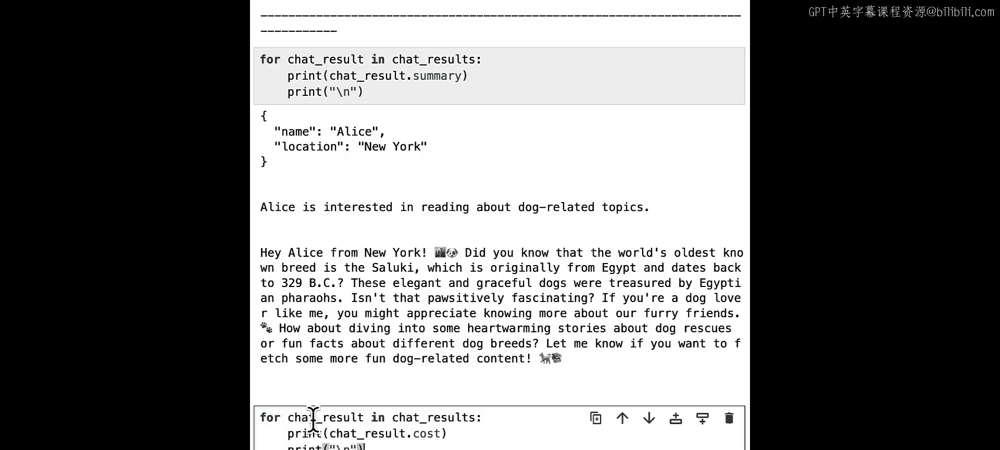

```python
# 查看总成本信息
print("总成本详情:", result_info.cost, result_topic.cost, result_engagement.cost)
```

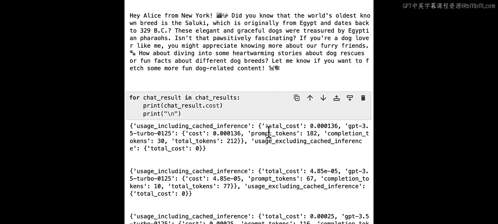

成本信息通常包括总成本、提示词令牌成本和补全令牌成本。

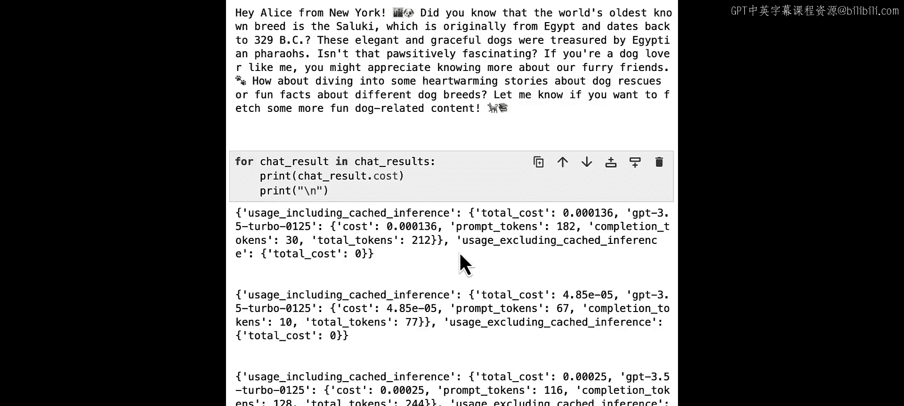

## 总结

在本节课中，我们一起学习了如何使用顺序对话来完成一系列相互依赖的任务。我们构建了三个专门的智能体来分别处理信息收集、兴趣调查和客户互动，并通过一个客户代理智能体将人类用户引入循环。我们还了解了如何总结前序对话的信息并将其传递到后续对话中。

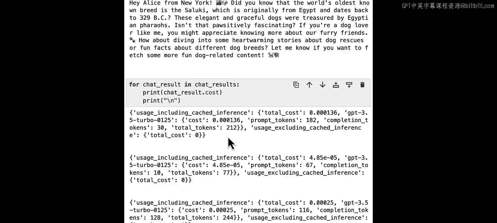

在下一节课中，你将学习如何利用嵌套对话来实现反思智能体设计模式，即在一个智能体的内部独白中，将一段或一系列对话嵌套在另一段对话里。