# 005：工具使用与会话式国际象棋 🏆

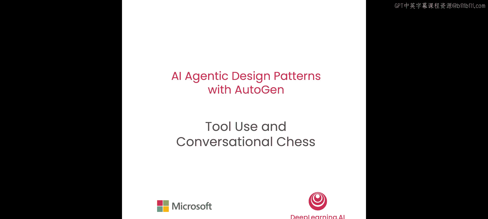


在本节课中，我们将学习如何在智能体之间的消息聊天中使用工具。你将构建一个会话式国际象棋游戏，两个AI棋手都可以调用工具，并在棋盘上做出合法的移动。

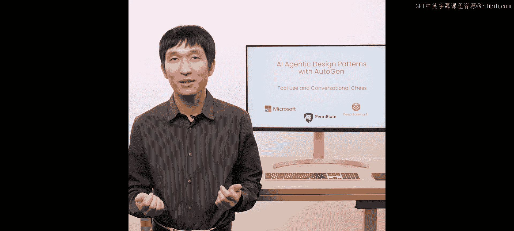

## 概述

上一节我们介绍了如何在AutoGen中使用可对话智能体进行对话。本节中，我们将学习一项新能力——工具使用。我们将继续使用嵌套聊天作为一种对话模式，使智能体能够使用工具完成任务，并通过构建一个会话式国际象棋游戏来展示这个例子。

我们将使用GPT-4模型，因为它在国际象棋方面比GPT-3表现更好。

## 第一步：创建国际象棋游戏所需的工具

首先，我们需要导入一些库。我们导入`chess`库，它为我们提供了以编程方式运行游戏的方法。

```python
import chess
```

我们将初始化棋盘。为了让棋盘了解当前状态，我们需要一个变量来跟踪是否已经走了一步棋。因此，我们将该变量初始化为`False`。

```python
board = chess.Board()
move_made = False
```

现在，我们准备好定义智能体所需的工具了。

首先，我们定义一个名为`get_legal_moves`的工具。这是一个Python函数，它返回一个字符串，内容是UCI格式的合法移动列表。UCI格式是一种供智能体理解所走棋步的语言格式。

```python
def get_legal_moves() -> str:
    legal_moves = list(board.legal_moves)
    return f"Possible moves are: {legal_moves}"
```

这个带注释的部分非常重要，它将允许智能体理解返回内容的格式及其含义。

接下来，我们还需要定义一个在棋盘上走棋的工具。这个函数有一个名为`move`的输入参数。当智能体决定走一步棋时，它可以调用这个函数并传入一个特定的字符串，这个移动也必须是UCI格式。该函数的返回值应该是一个表示移动结果的字符串。

```python
def make_move(move: str) -> str:
    global move_made
    chess_move = chess.Move.from_uci(move)
    board.push(chess_move)
    move_made = True
    board_display = str(board)
    piece = board.piece_at(chess_move.from_square)
    piece_symbol = piece.symbol()
    piece_name = chess.piece_name(piece.piece_type)
    if piece_symbol.isupper():
        piece_name = "white " + piece_name
    else:
        piece_name = "black " + piece_name
    return f"We moved the {piece_name} from {chess_move.from_square} to {chess_move.to_square}."
```

在返回信息给智能体之前，我们想获取刚刚所走棋步的信息，从移动的原始点获取棋子，获取该棋子的符号，并使用`chess`库的函数创建棋子名称并进行规范化。最后，我们返回一个字符串，说明我们将一个棋子从一个原始位置移动到了一个新位置。这样就完成了工具的定义。

## 第二步：创建智能体

现在，我们准备好创建智能体了。我们将从AutoGen导入`ConversableAgent`。

```python
from autogen import ConversableAgent
```

首先，我们创建一个玩家智能体`player_white`，并给它一个系统消息：“你是一名国际象棋棋手，你执白棋”。我们还需要让智能体知道有哪些工具可用，所以告诉它首先调用`get_legal_moves`来获取合法移动列表，然后调用`make_move`来走一步棋。我们将让智能体知道这两个可用的函数。我们还需要向它传递一个大语言模型配置。

```python
player_white = ConversableAgent(
    name="player_white",
    system_message="You are a chess player and you play as white. First call get_legal_moves to get a list of legal moves, then call make_move to make a move.",
    llm_config={"config_list": [{"model": "gpt-4", "api_key": os.environ.get("OPENAI_API_KEY")}]},
)
```

另一个玩家智能体呢？唯一的区别是名称和系统消息。

```python
player_black = ConversableAgent(
    name="player_black",
    system_message="You are a chess player and you play as black. First call get_legal_moves to get a list of legal moves, then call make_move to make a move.",
    llm_config={"config_list": [{"model": "gpt-4", "api_key": os.environ.get("OPENAI_API_KEY")}]},
)
```

现在创建了这两个玩家智能体。需要记住的一点是，尽管我们在系统消息中告诉了这两个智能体它们可以使用的两个函数，但我们必须给它们具体的定义。因此，稍后我们将需要注册工具。

在此之前，让我们创建一个存储智能体，称为`board_agent`。`board_agent`扮演着与玩家检查棋步直到棋步合法，并更新棋盘状态的角色。为了定义这个`board_agent`，我们还需要为智能体设置一个停止条件。

```python
def check_move_made():
    return move_made

board_agent = ConversableAgent(
    name="board_proxy",
    llm_config=False,  # 这个智能体不会使用大语言模型
    is_termination_msg=check_move_made,
    human_input_mode="NEVER",
)
```

我们传递了终止条件函数`check_move_made`。当一步棋已经走完时，这个智能体将停止与其他智能体的对话；否则，它会继续询问其他智能体并说“请走一步棋”，这是它唯一的回复。我们还将`human_input_mode`设置为`NEVER`。

## 第三步：向智能体注册工具

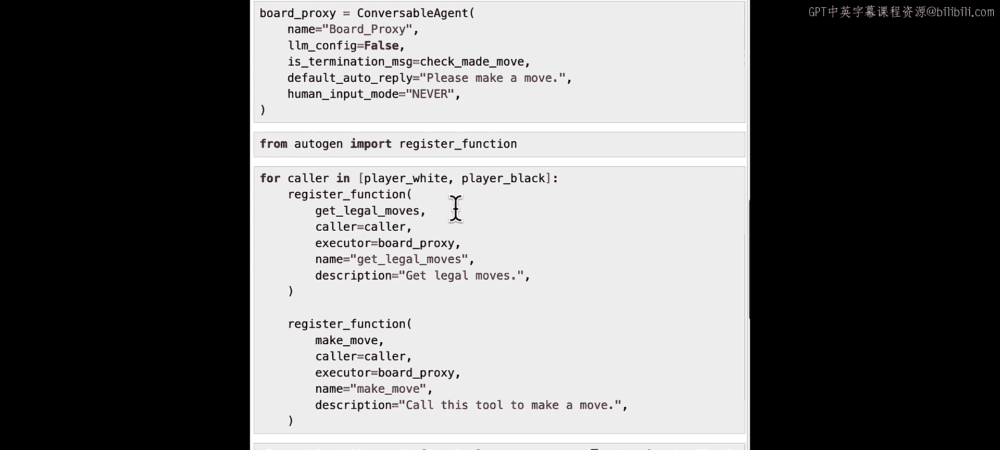

现在我们已经定义了所有智能体，可以向智能体注册工具了。为此，我们将从`autogen`导入一个名为`register_function`的函数。

```python
from autogen import register_function
```

我们需要为两个玩家都注册，所以我们将在这两个玩家智能体之间使用一个`for`循环。

```python
for player in [player_white, player_black]:
    register_function(
        get_legal_moves,
        caller=player,
        executor=board_agent,
        name="get_legal_moves",
        description="Get the list of legal moves in UCI format.",
    )
    register_function(
        make_move,
        caller=player,
        executor=board_agent,
        name="make_move",
        description="Make a move on the chessboard. Input should be a move in UCI format.",
    )
```

在这些函数注册之后，调用者（即其中一个玩家智能体）将能够提议一个函数调用，而执行者（即`board_proxy`智能体）将能够执行该工具。

我们实际上可以检查工具注册情况，例如，我们可以检查`player_black`当前的`llm_config`部分。我们看到一些字段，如类型、函数描述、参数，都自动填充到了这个工具定义中。这就是AutoGen的`register_function`所做的。因此，用户不需要手动编写所有这些遵循OpenAI格式的定义。AutoGen库会为你完成。用户需要做的就是定义函数，并以这种方式提供必要的注释。除此之外，它只是一个你正在学习的普通Python函数，智能体使用这些工具不需要额外的工作。

## 第四步：设置嵌套聊天模式

注册工具后，我们还希望创建这个嵌套聊天对话模式，因为我们希望当两个玩家彼此对弈时，他们在走棋之前能与`board_agent`进行嵌套聊天，以确保棋步是合法的。为此，我们首先为`player_white`注册一个嵌套聊天。这个嵌套聊天的触发者是`player_black`。当`player_white`收到来自`player_black`的消息时，这个嵌套聊天将被触发，并且这个嵌套聊天将在它回复`player_black`之前执行。

```python
player_white.register_nested_chats(
    trigger=player_black,
    chat_queue=[{"sender": board_agent, "recipient": player_white, "summary_method": "last_msg"}],
)
```

这里我们使用一个只有一个聊天的聊天队列。在嵌套聊天中，聊天将由代理`board_proxy`发起，接收者将是`player_white`。我们将使用最后一条消息作为这个聊天的总结方法。在`player_white`回复`player_black`之前，它将首先在`board_proxy`和`player_white`之间发起这个嵌套聊天，直到`player_white`选择了一步棋，然后它再回复`player_black`关于这步棋。

类似地，我们也可以为`player_black`注册一个嵌套聊天。这次的触发者是`player_white`，内部聊天是在`board_proxy`和`player_black`之间。

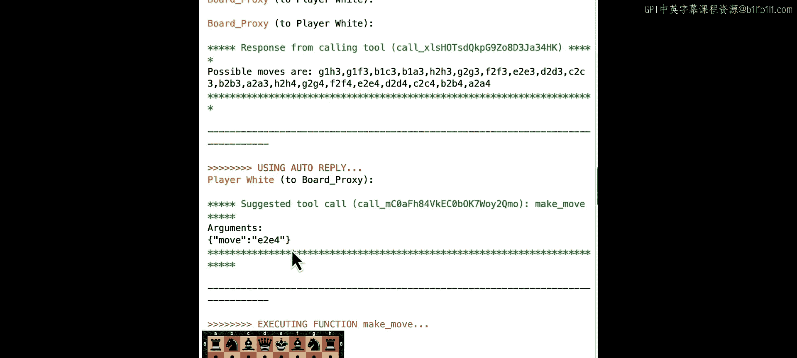

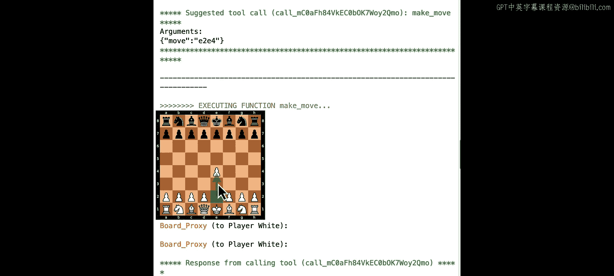

```python
player_black.register_nested_chats(
    trigger=player_white,
    chat_queue=[{"sender": board_agent, "recipient": player_black, "summary_method": "last_msg"}],
)
```

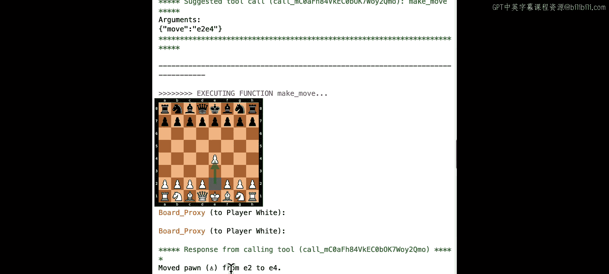

## 第五步：运行游戏

好了，这就是我们需要做的所有工作。让我们准备好开始游戏。我们将首先调用`chess.Board()`函数创建一个新棋盘，然后调用`player_black.initiate_chat`方法，并附带初始消息“让我们下棋吧，该你走了”。我们将`clear_history`设置为`True`。

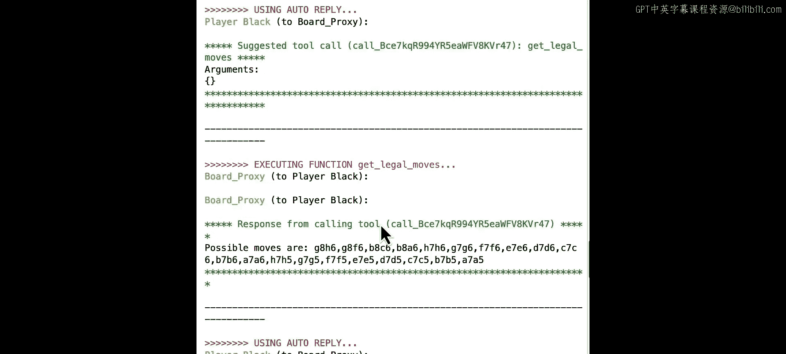

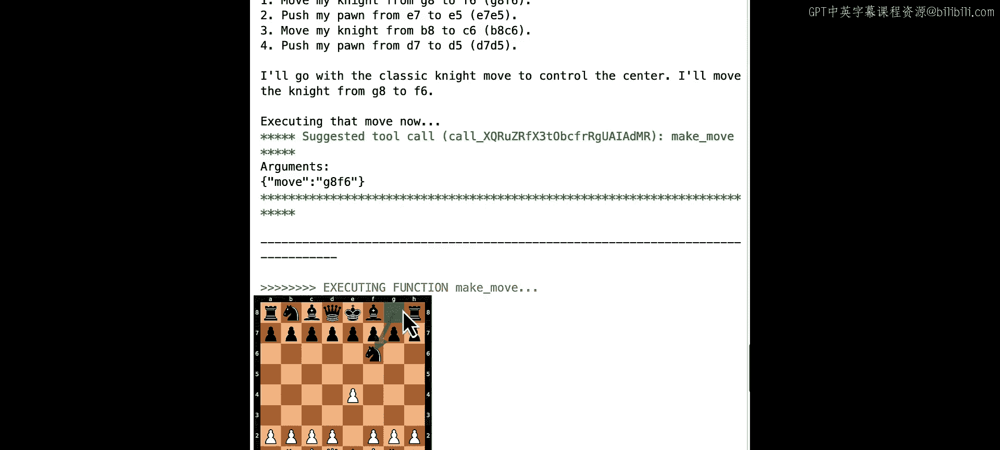

```python
board = chess.Board()
move_made = False

player_black.initiate_chat(
    player_white,
    message="Let's play chess. Your move.",
    clear_history=True,
)
```

当我们运行代码时，我们看到`player_black`发起了消息。现在`player_white`收到消息，它将进入这个自动回复，并进行必要的嵌套聊天。这个嵌套聊天是在`board_proxy`和`player_white`之间。我们注意到`player_white`首先建议调用工具`get_legal_moves`来从棋盘获取合法移动。`board_proxy`返回工具执行结果，返回所有可能的移动。然后`player_white`使用`make_move`工具，参数为`e2e4`。这就是`player_white`选择的移动。`board_agent`现在执行该移动并返回消息：“我们将兵从e2移动到e4”。这就是嵌套聊天的结束，因为一步棋已经走完。

在那个嵌套聊天结束后，`player_white`将回复返回给`player_black`。这是从`player_white`发送给`player_black`的实际回复。

现在，`board_proxy`和`player_black`之间会发生同样的嵌套聊天。`player_black`也会调用`get_legal_moves`工具并建议移动，使用`make_move`。`player_black`选择的移动是`g8f6`。现在`board_proxy`返回确认：“我们将马从g8移动到f6”。所以来自`player_black`的最终消息是“我已将我的马从g8移动到f6，该你了”。那个内部嵌套聊天结束，所以`player_black`将总结发送回`player_white`。

同样的模式将再次发生，`player_white`将获取合法移动并选择它将走的另一步棋。这就是这两个回合对话的结束。

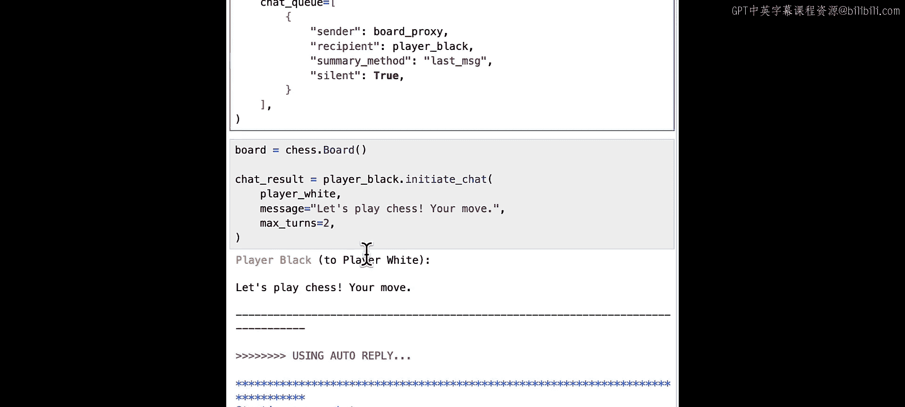

## 第六步：增加趣味性

我们如何让这个游戏更有趣呢？我们注意到在这个游戏中，玩家只谈论他们正在走的棋步。我们如何增加一点乐趣，让聊天不仅仅局限于这些棋步呢？

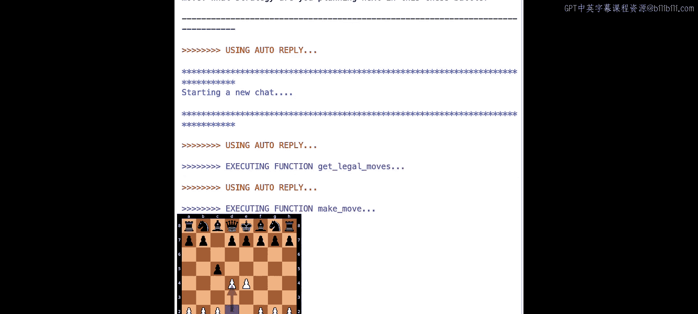

我们可以修改关于这些玩家智能体的定义。现在我们可以更改这条消息，说在走了一步棋之后，闲聊一下让游戏变得有趣。这是我们添加的一个额外指令。对`player_black`也做同样的操作。我们将需要重复关于工具使用的注册，以及那个聊天。

```python
player_white = ConversableAgent(
    name="player_white",
    system_message="""You are a chess player and you play as white. First call get_legal_moves to get a list of legal moves, then call make_move to make a move.
    After a move is made, chat to make the game fun.""",
    llm_config={"config_list": [{"model": "gpt-4", "api_key": os.environ.get("OPENAI_API_KEY")}]},
)

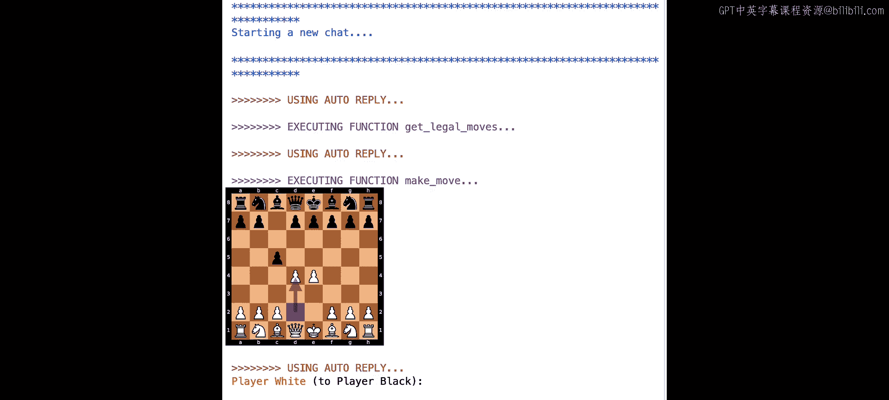

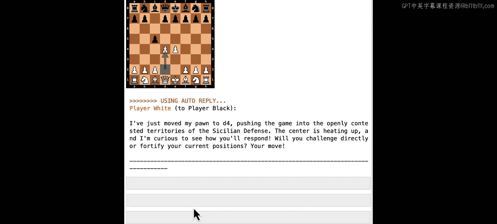

player_black = ConversableAgent(
    name="player_black",
    system_message="""You are a chess player and you play as black. First call get_legal_moves to get a list of legal moves, then call make_move to make a move.
    After a move is made, chat to make the game fun.""",
    llm_config={"config_list": [{"model": "gpt-4", "api_key": os.environ.get("OPENAI_API_KEY")}]},
)
```

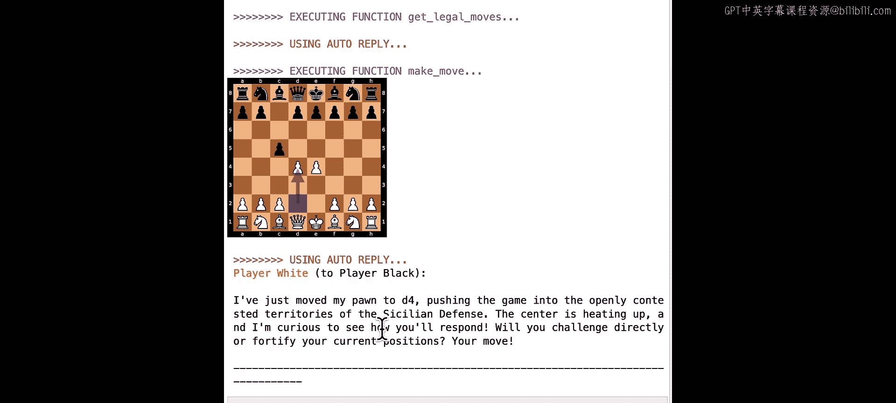

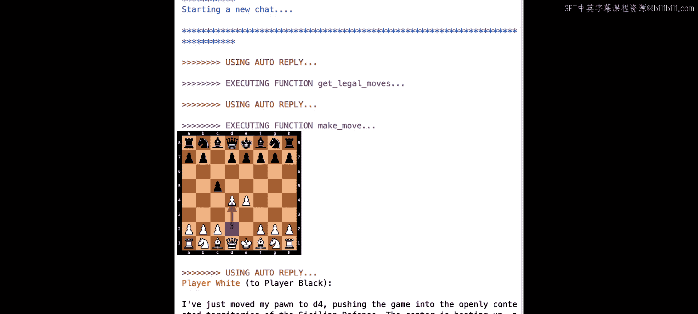

最后，我们将重新创建棋盘并重新开始对话。顺便说一下，我们还在嵌套聊天中添加了一个标志`summary_method="last_msg"`，所以这次我们不需要检查内部对话，我们只想看到两个玩家智能体之间的外部对话。

让我们看看。这次我们看到`player_white`走了第一步棋，不仅走了棋，`player_white`还说：“让我们看看你如何应对这个经典开局。”这次`player_black`走了兵并说：“我将我的兵移动到c5，选择西西里防御，该你了。你在这场国际象棋战斗中计划下一步采取什么策略？”他们开始互相挑战。`player_white`回应道：“我刚刚将我的兵移动到d4，将游戏推入了西西里防御的公开争夺领域。中心正在升温，我很好奇你将如何回应。”他们继续制造乐趣并进行下去。

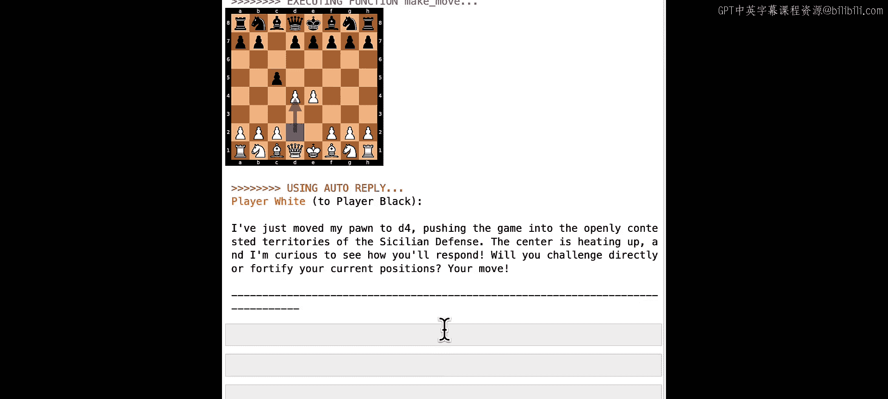

你可以自己尝试这个例子，并自行修改，让它们表现不同。

## 总结

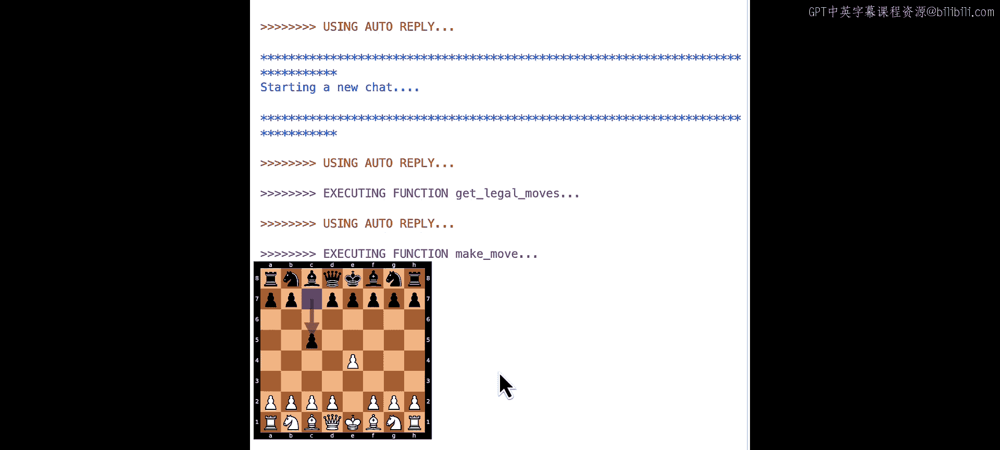

在本节课中，我们一起学习了如何在AutoGen中使用工具。我们构建了一个会话式国际象棋游戏，演示了在嵌套聊天中使用工具的一种特定方式。这并非唯一的方式，但一般来说，当你使用工具时，你需要一个能够提议使用工具的智能体，和另一个能够执行该工具的智能体。如果你想将这种提议和使用工具隐藏在嵌套聊天内部，你可以以类似的方式进行。当我们这样做时，从外部看，我们不一定需要知道涉及两个智能体，我们可以简单地创建一个智能体的体验，该智能体能够利用工具并在其他应用程序中执行某些功能。在其他应用程序中，你可能希望明确展示这种工具提议和工具执行的分离。

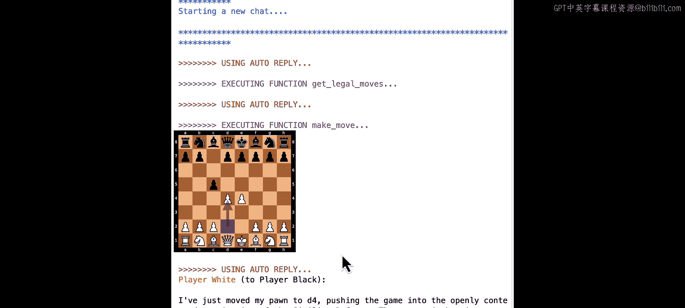

在下一课中，我们还将演示其他使用工具的方式，例如，使用自由格式代码，或让智能体建议代码，或让智能体在更自由的编码风格中消费用户定义的函数。