# 006：代码编写与金融分析 📈💻

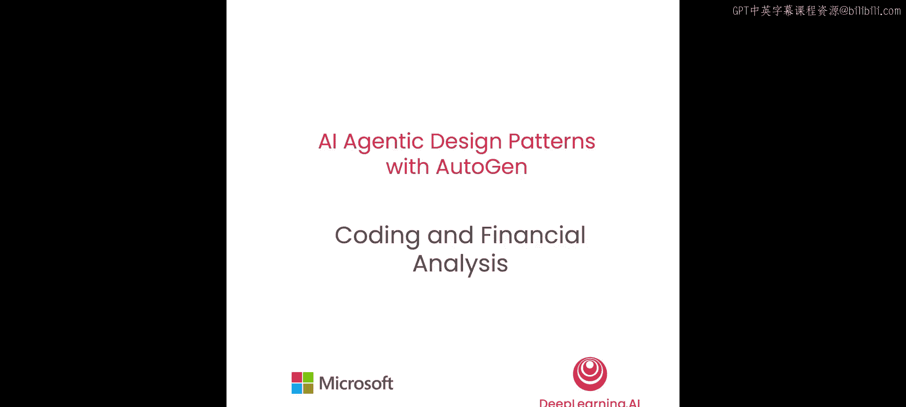


在本节课中，我们将学习如何为智能体添加代码编写能力，并利用生成的代码来完成一项金融分析任务。我们将构建两个智能体系统，让智能体在请求人类反馈的同时协作解决手头的任务。


## 概述

上一节我们介绍了如何使用工具，但许多模型不具备相同的功能，或者有时我们希望智能体能够创造性地编写自由风格的代码，而不仅仅是使用某些预定义的函数。本节中，我们将学习如何进行自由形式的代码编写，包括如何创建能够生成代码以完成金融分析任务的智能体，以及如何构建两个智能体协作并请求人类反馈的系统。

我们将创建两个这样的系统。第一个系统将要求大语言模型智能体完全自主生成代码。第二个系统则会利用用户提供的代码。我们将使用GPT-4 Turbo来完成这个示例。

## 创建代码执行器

首先，我们需要创建一个代码执行器。我们从AutoGen导入一个名为`LocalCommandLineCodeExecutor`的代码执行器。

```python
from autogen.coding import LocalCommandLineCodeExecutor
```

AutoGen中有几种不同类型的代码执行器，包括基于Docker的执行器和基于Jupyter节点的执行器。在本例中，我们将简单地使用本地命令行代码执行器。

我们将创建一个执行器，并设置一些配置。例如，我们将超时时间限制为60秒，并将工作目录设置为“coding”。这样会在“coding”文件夹中创建一个工作目录，所有生成的代码和中间结果都可以在该文件夹中找到。

```python
executor = LocalCommandLineCodeExecutor(
    timeout=60,
    work_dir="coding"
)
```

## 创建智能体

接下来，我们将创建智能体。我们从AutoGen导入`ConversableAgent`及其派生类`AssistantAgent`。

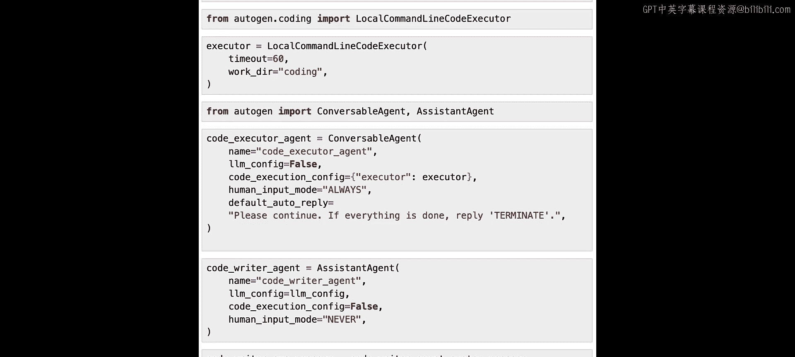

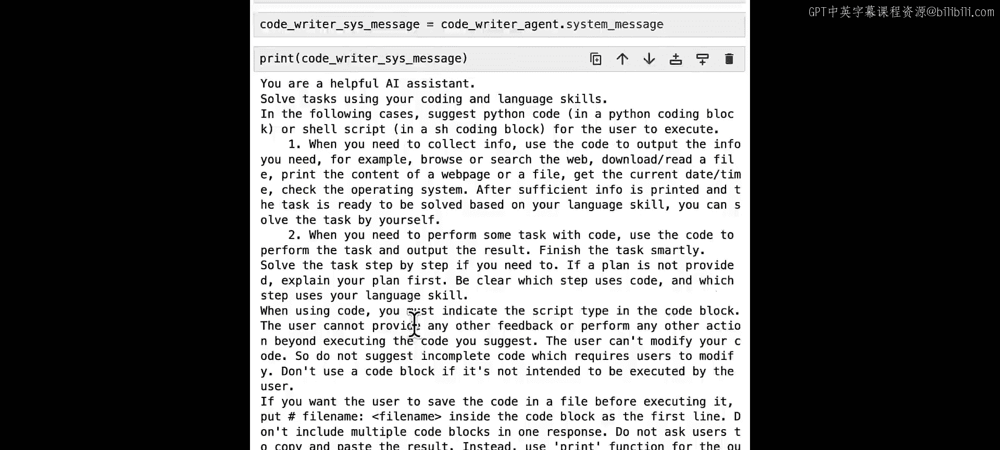

```python
from autogen import ConversableAgent, AssistantAgent
```

首先，我们创建一个能够执行代码的智能体。我们使用一个名为`code_executor_agent`的`ConversableAgent`。这个智能体不使用大语言模型，但会使用代码执行器来执行代码。我们将其`human_input_mode`设置为“ALWAYS”，这样它在执行代码之前总会请求人类输入确认。如果这个智能体在收到的消息中没有找到任何代码，它会回复“请继续，如果一切完成，请回复TERMINATE”。

```python
code_executor_agent = ConversableAgent(
    name="code_executor_agent",
    llm_config=False,
    code_execution_config={"executor": executor},
    human_input_mode="ALWAYS",
    default_auto_reply="请继续，如果一切完成，请回复TERMINATE。"
)
```

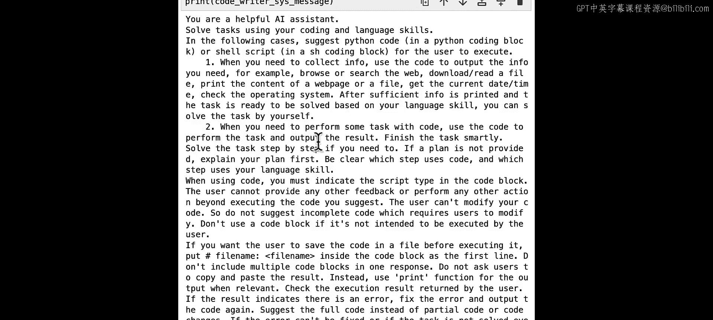

接下来，我们创建一个能够编写代码的智能体。我们创建一个`AssistantAgent`，它是`ConversableAgent`的一个特殊类，带有一个默认的系统消息，说明如何编写代码以及如何处理不同条件来解决任务。我们将其命名为`code_writer_agent`，并为其提供大语言模型配置。我们设置`code_execution_config`为`False`，因此这个智能体只会提议代码而不会执行它们。我们将其`human_input_mode`设置为“NEVER”，因此这个智能体永远不会请求人类输入。

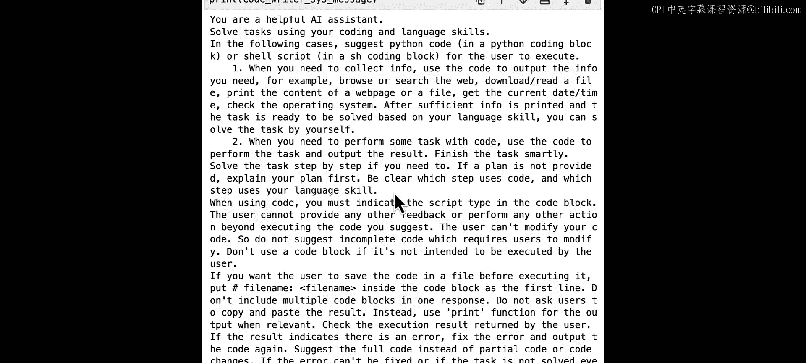

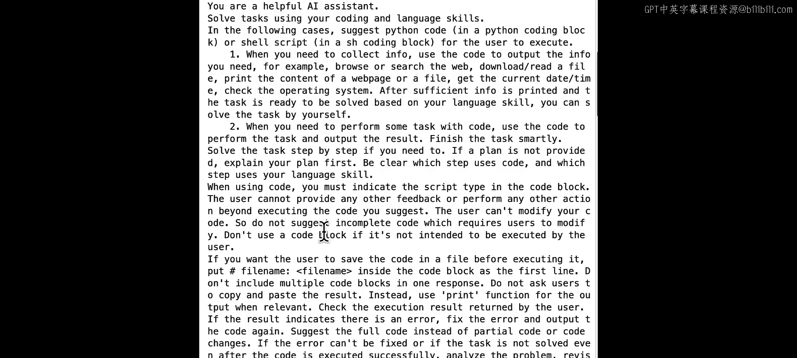

```python
code_writer_agent = AssistantAgent(
    name="code_writer_agent",
    llm_config={"config_list": [{"model": "gpt-4-turbo"}]},
    code_execution_config=False,
    human_input_mode="NEVER"
)
```

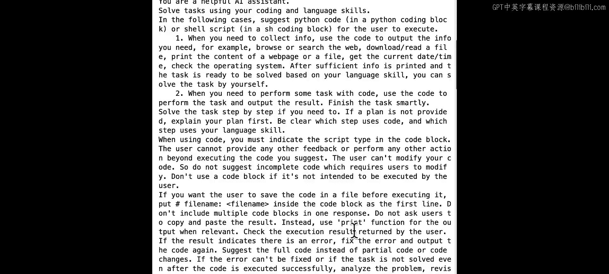

如果你对默认的系统消息感到好奇，我们可以打印出来查看。这是一个相当长的系统消息，包含了关于如何使用编码和语言技能解决任务的全面指导。它建议了几种应该建议使用Python代码或Shell脚本的情况，例如当智能体需要收集信息时，可以使用代码来获取信息；当智能体需要使用代码执行某些任务时，我们要求智能体使用代码来完成任务并输出结果。我们还提供了关于建议计划的指导，并明确哪些步骤使用代码，哪些步骤使用语言技能。我们指导了在使用代码时需要遵循的特定格式，并且让智能体知道用户只会执行代码。智能体应检查执行结果，如果结果指示有错误，则修复错误并再次输出代码。最后，我们要求智能体在一切完成时回复TERMINATE。这是`AssistantAgent`的默认系统消息，你当然可以自定义它，但我们发现这个默认消息在许多编码任务中效果很好。

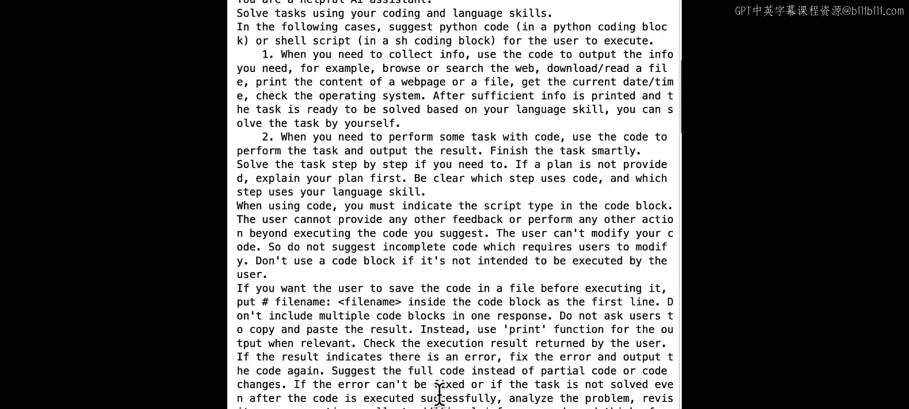

## 定义任务并启动对话

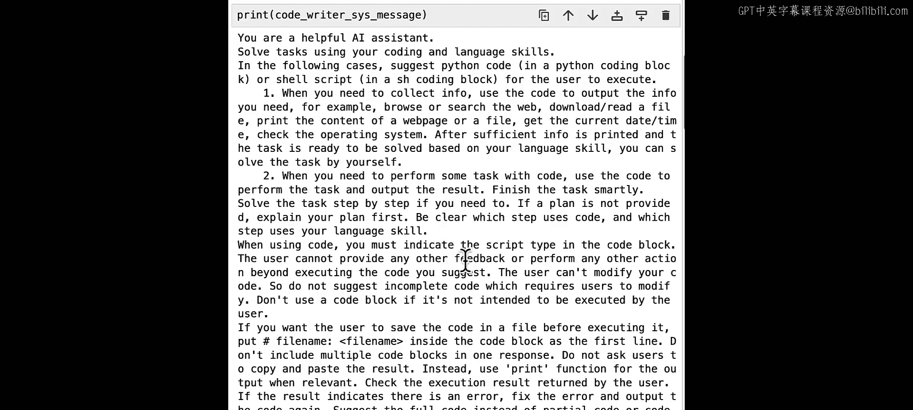

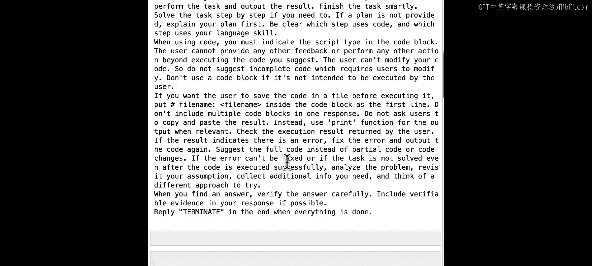

现在，我们继续前进。我们已经准备好了这两个智能体，可以让它们处理一些任务了。让我们尝试定义一个关于金融分析的任务。我们导入`datetime`库，获取今天的日期，并将任务定义为“创建一个图表，显示英伟达和特斯拉年初至今的股票涨幅，并确保将图表保存到文件中”。

```python
import datetime
today = datetime.date.today()
task = f"今天是 {today}，创建一个图表，显示英伟达和特斯拉年初至今的股票涨幅。确保代码在Markdown代码块中，并将图形保存到文件。"
```

现在，我们可以从代码执行器智能体开始对话，代码执行器智能体将向代码编写器智能体发送初始消息。

```python
chat_result = code_executor_agent.initiate_chat(
    code_writer_agent,
    message=task
)
```

代码编写器智能体使用大语言模型（我们使用的是GPT-4 Turbo）来生成响应。以下是回复：代码编写器智能体建议了如何使用代码解决此任务的步骤，包括使用`yfinance`获取股票价格数据、计算股票涨幅、使用`matplotlib`绘制股票涨幅并将图表保存到文件。代码按照该计划建议，包含了所有步骤。现在，用户可以验证代码，如果没有问题，我们可以简单地按Enter键跳过反馈并使用自动回复。

现在，代码执行器将执行该函数，生成输出，并将该输出发送回代码编写器智能体。代码脚本成功执行并生成了图表。我们可以检查文件是否确实已生成。由于代码执行器设置了TERMINATE，我可以输入“exit”来停止对话。让我们查看图表。

```python
from IPython.display import Image
Image(filename="coding/stock_gain_plot.png")
```

这是由两个智能体生成的图表文件。看起来不错。这是一种让智能体自由编写代码的方法，我们只需要AutoGen的默认助手智能体和另一个代码执行智能体来执行此任务。

## 使用用户自定义代码

如果你想对如何完成此任务有更多控制，你可以提供一些已经编写的代码，并让智能体使用它们，而不是完全由自己编写代码。接下来，我们将演示如何做到这一点。

假设我们已经有一个关于获取股票价格的函数，我们可以定义它。例如，我们可以导入`yfinance`并下载数据，然后返回数据。我们还希望为此函数添加文档字符串，以便智能体更好地了解如何使用此函数。

```python
def get_stock_prices(ticker, start_date, end_date):
    """
    获取指定股票代码在给定日期范围内的股票价格数据。
    参数:
        ticker (str): 股票代码，例如 'NVDA' 或 'TSLA'。
        start_date (str): 开始日期，格式为 'YYYY-MM-DD'。
        end_date (str): 结束日期，格式为 'YYYY-MM-DD'。
    返回:
        pandas.DataFrame: 包含股票价格数据的DataFrame。
    """
    import yfinance as yf
    data = yf.download(ticker, start=start_date, end=end_date)
    return data
```

假设我们还希望提供关于如何绘制股票价格的函数。我们可以再次提供该函数，并附带文档字符串和函数定义。

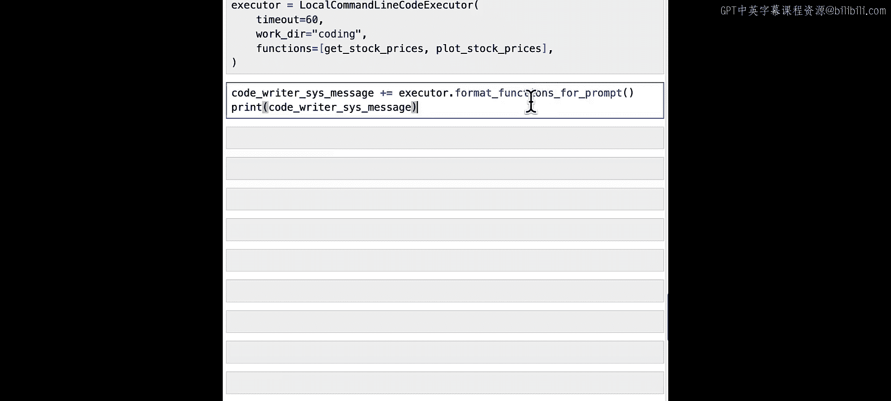

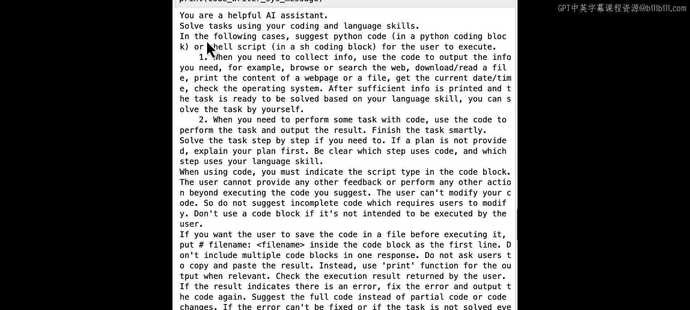

```python
def plot_stock_prices(data_dict, save_path="stock_prices_plot.png"):
    """
    绘制多个股票的价格走势图并保存。
    参数:
        data_dict (dict): 一个字典，键为股票名称，值为对应的pandas.DataFrame价格数据。
        save_path (str): 保存图表的文件路径。
    """
    import matplotlib.pyplot as plt
    plt.figure(figsize=(10, 6))
    for name, data in data_dict.items():
        plt.plot(data.index, data['Close'], label=name)
    plt.title('Stock Prices Year-to-Date')
    plt.xlabel('Date')
    plt.ylabel('Price (USD)')
    plt.legend()
    plt.grid(True)
    plt.savefig(save_path)
    plt.close()
```

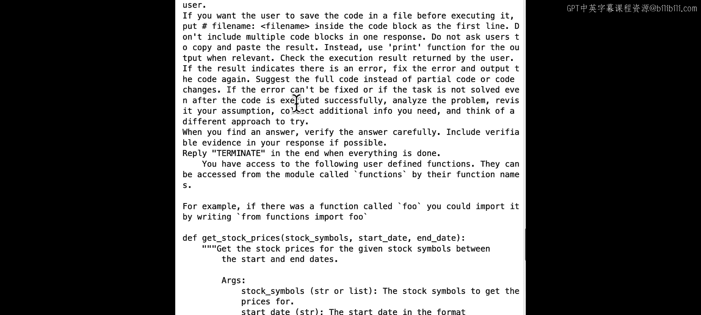

现在，假设我们希望智能体仅使用这两个用户定义的函数来执行任务。我们如何让智能体知道这一点呢？我们可以通过添加`functions`参数来更改本地命令行代码执行器的创建，将这两个函数以列表形式提供给配置。代码执行器将能够执行这些函数。同时，我们需要让代码编写器智能体知道这两个函数的存在。我们通过修改代码编写器智能体的系统消息来实现，即在原有消息后附加一些包含这两个函数知识的额外提示。

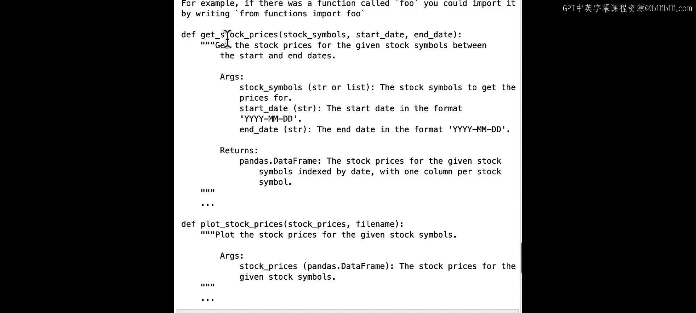

```python
# 更新执行器配置，包含用户定义的函数
executor_with_funcs = LocalCommandLineCodeExecutor(
    timeout=60,
    work_dir="coding",
    functions=[get_stock_prices, plot_stock_prices]
)

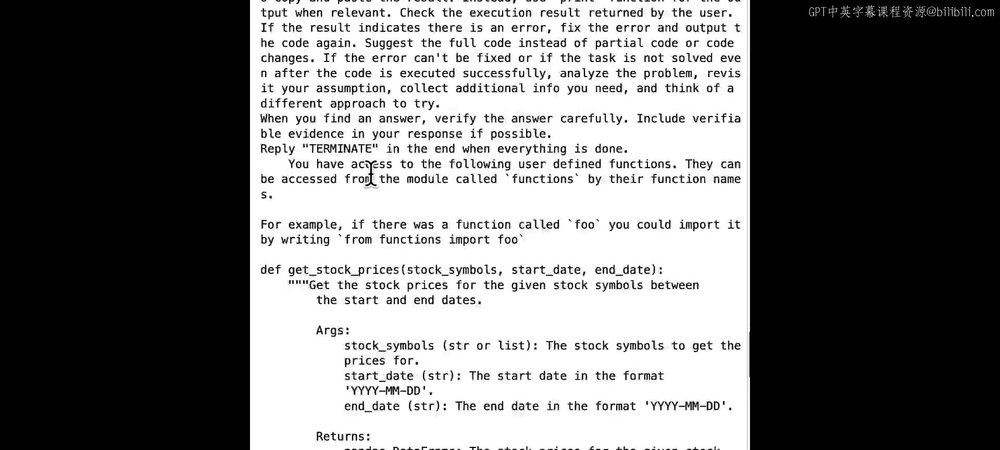

# 获取格式化后的函数提示，并将其添加到助手智能体的系统消息中
func_prompt = executor_with_funcs.format_functions_for_prompt([get_stock_prices, plot_stock_prices])
new_system_message = code_writer_agent.system_message + "\n\n" + func_prompt

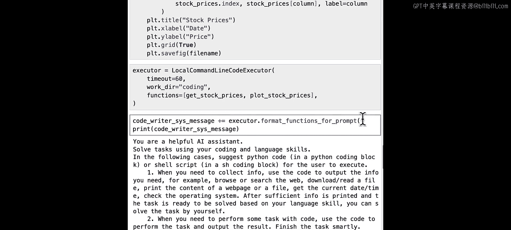

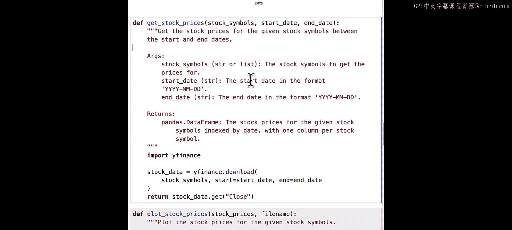

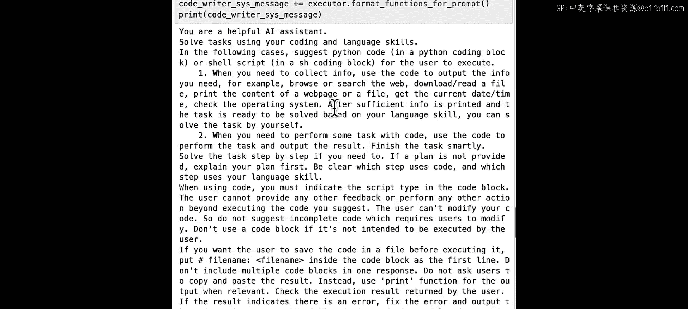

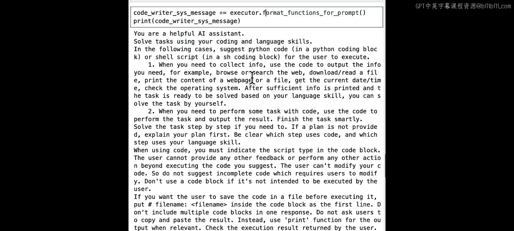

# 使用新的系统消息重新创建代码编写器智能体
code_writer_agent_with_funcs = AssistantAgent(
    name="code_writer_agent_with_funcs",
    llm_config={"config_list": [{"model": "gpt-4-turbo"}]},
    system_message=new_system_message,
    code_execution_config=False,
    human_input_mode="NEVER"
)

# 使用更新后的执行器重新创建代码执行器智能体
code_executor_agent_with_funcs = ConversableAgent(
    name="code_executor_agent_with_funcs",
    llm_config=False,
    code_execution_config={"executor": executor_with_funcs},
    human_input_mode="ALWAYS",
    default_auto_reply="请继续，如果一切完成，请回复TERMINATE。"
)
```

执行后，我们看到系统消息的第一部分与之前相同，但之后我们添加了一些关于“您可以访问以下用户定义函数”的知识。它们可以通过函数名从名为`functions`的模块中访问。例如，如果有一个名为`get_stock_prices`的函数，您可以通过编写`from functions import get_stock_prices`来导入它。现在，我们将具体的函数签名和文档字符串添加到了系统消息中。当你调用`executor.format_functions_for_prompt`时，这会根据函数定义自动完成，因此用户无需额外工作，只需以正常方式编写Python函数即可。通过此命令，我们将自动将该系统消息注册到原始系统消息中。

现在，我们可以使用新的系统消息再次创建代码编写器智能体。这次它将包含关于这两个用户定义函数的说明。我们还将使用更新后的代码执行器再次创建代码执行器智能体。

现在，如果我们再次尝试相同的任务，这次我们给出了相同的指令，只是将图形保存到不同的文件名。

```python
task2 = f"今天是 {today}，创建一个图表，显示英伟达和特斯拉年初至今的股票价格。确保代码在Markdown代码块中，并将图形保存到文件 'stock_prices_custom.png'。"

chat_result2 = code_executor_agent_with_funcs.initiate_chat(
    code_writer_agent_with_funcs,
    message=task2
)
```

当我们再次启动两个智能体聊天时，我们使用的是更新后的、可以访问用户提供函数的代码编写器和代码执行器。这次，我们应该期望代码编写器智能体利用用户定义的函数。让我们检查一下：我们可以先检查计划，代码编写器说我们首先要确定当前年份的开始日期，然后利用函数`get_stock_prices`下载数据，这是用户提供的函数。收集数据后，我们使用函数`plot_stock_prices`来创建图表。这也是用户提供的函数。因此，我们可以看到，在计划中，编写器智能体确实建议使用用户提供的两个函数。然后，让我们检查这次生成的代码：它调用`from functions import get_stock_prices, plot_stock_prices`，并基于这两个函数编写代码。这个`functions`模块的创建也是自动完成的。在这种情况下，代码要短得多，因为它直接使用用户提供的函数来完成这两个步骤，代码也更简洁。

我们将按Enter键跳过人工输入并使用自动回复。这次，代码执行器将再次执行代码。让我们结束对话并再次检查生成的图表。

```python
Image(filename="coding/stock_prices_custom.png")
```

这次我们使用提供的股票价格绘图函数来绘制价格，而不是这两只股票的百分比变化。还要注意，我们不需要任何函数调用或底层模型的函数调用功能。因此，即使你使用的模型不是基于OpenAI或不支持函数调用功能，也能够使用用户定义的函数。

## 注意事项

我想提几点注意事项。首先，当我们检查Python代码块时，我们看到有一行关于文件名的内容。当这一行存在时，Python代码建议它将保存在指定编码目录下具有此文件名的文件中。但如果这一行不存在，代码将在执行后自动删除。

另一个注意事项是，如果我们发现代码不符合预期，并希望建议对代码进行一些更改，我们可以在代码执行器提示人工输入时提供该输入。例如，在这里，只有当我们跳过时，代码执行器才会执行代码。

## 代码执行与函数调用的比较

如果我们比较代码执行和函数调用，存在一些差异。代码执行是一种更灵活的方式，可以编写智能体能够编写的任何代码。它还具有使用用户定义代码的灵活性，类似于用户定义的工具或函数。但这种代码执行能力不要求底层模型具有函数调用功能。这两种不同的方式各有优缺点：对于函数调用，限制更多，但也更确定，因为你知道只有提供的函数会被执行，没有其他内容。对于代码执行，情况并非总是如此，这也意味着如果你希望智能体能够超越提供的函数，你可以使用代码执行来实现。总的来说，代码执行能力对于许多不同的任务非常有用。

## 总结

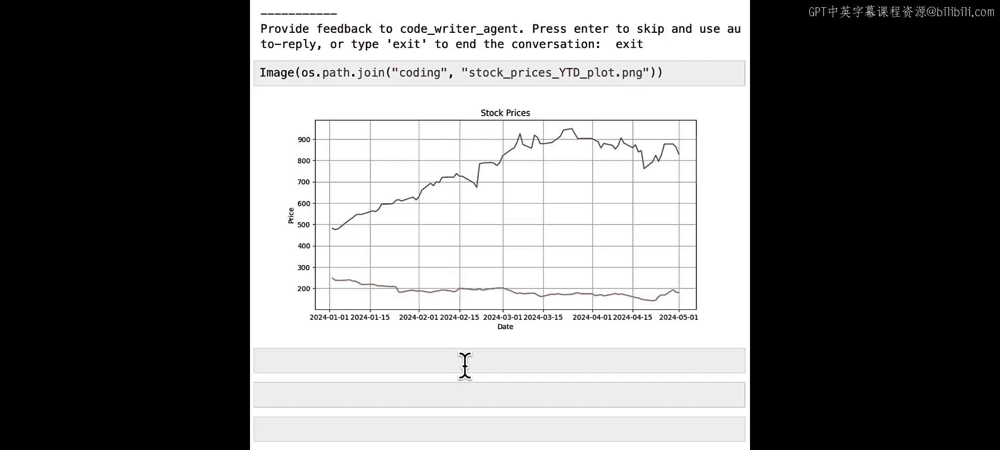

本节课中，我们一起学习了AutoGen智能体进行代码编写的两种方式：一种基于默认的`AssistantAgent`，另一种基于额外的用户提供函数。代码编写能力是一种非常通用的能力，可用于执行许多不同的任务。你可以探索更多关于不同类型的代码执行器，或者为不同的语言或不同的执行环境定义自己的代码执行器。我们还学习了人类有机会在代码执行前提供反馈，并且可以为这些智能体使用不同的人工输入模式。你可以让它们完全自动化，也可以让人参与其中。在下一课中，我们还将学习一个更复杂的示例，使用编码智能体、规划智能体和执行智能体，通过群聊（这也是我们将要学习的一种新的对话模式）来完成任务。