# 007：规划与股票报告生成 📈

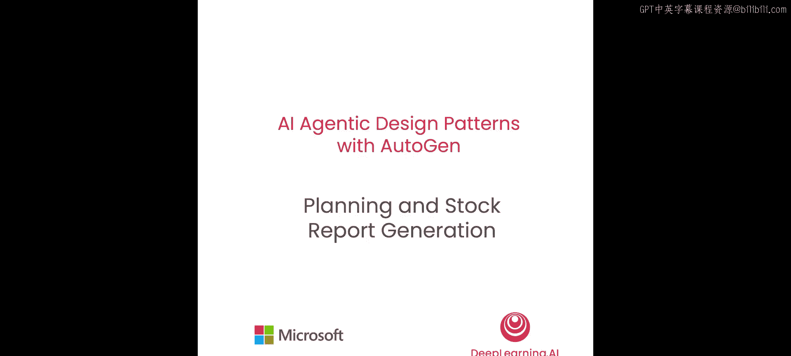

在本节课中，我们将深入学习多智能体群聊，并构建一个自定义的群聊系统。该系统将协作生成一份关于过去一个月股票表现的详细报告。完成这个复杂任务需要引入“规划”这一设计模式，通过在群聊中加入一个规划智能体来实现。我们还将学习如何自定义群聊中的发言者转换顺序。

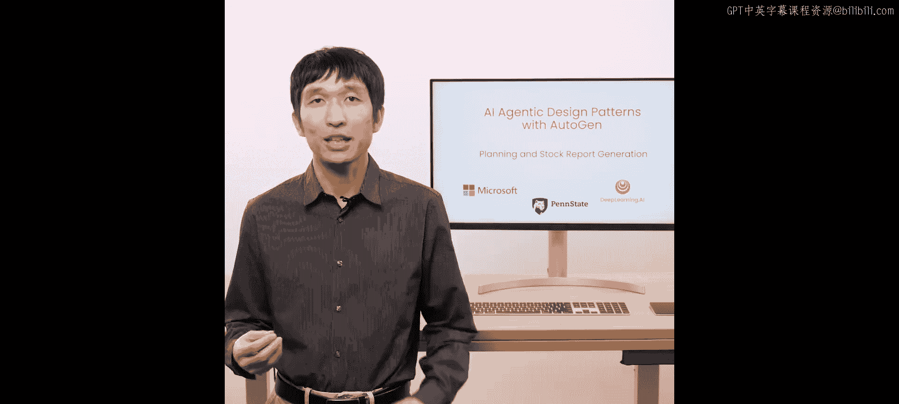


## 概述


上一节我们介绍了顺序对话模式。本节我们将探索一种更动态的协作模式——群聊。在这种模式下，多个智能体可以自主交互，共同解决复杂任务，而无需开发者预先设计每一步的具体执行顺序。我们将通过一个生成股票报告的例子来演示如何创建包含规划者、工程师、执行者和写手在内的多智能体群聊系统。

## 代码实现

让我们开始编写代码。首先，定义模型配置，我们将使用GPT-4 Turbo。

```python
config_list = [{"model": "gpt-4-turbo", "api_key": "YOUR_API_KEY"}]
```

接下来，定义我们的任务。这是一个相当复杂的任务：生成一份关于过去一个月股票表现的详细博客文章。

```python
task = "Generate a detailed report on the stock performance of Tesla (TSLA) over the past month, formatted as a blog post."
```

在之前的课程中，我们学习了顺序对话模式，它可以执行多步骤任务，但这需要人工设计具体的步骤和每个步骤涉及的智能体。如果我们想简化问题呢？如果我们只想定义智能体，并让它们协同工作来解决这个任务，而不为每一步提供非常具体的详细指令，该怎么做？在本课中，让我们尝试一种名为“群聊”的新对话模式，它不需要手动设计的步骤。

首先，导入AutoGen库。

```python
import autogen
```

然后，尝试创建此任务所需的几个智能体。让我们思考一下需要什么。

首先，我们需要一个用户代理智能体，它可以向其他智能体发送关于初始任务的信息。

```python
user_proxy = autogen.UserProxyAgent(
    name="Admin",
    system_message="Give the task and send instructions to writer to refine the blog post.",
    code_execution_config=False,
    llm_config={"config_list": config_list},
    human_input_mode="ALWAYS"
)
```

我们设置`human_input_mode`为`ALWAYS`，因此当轮到该智能体发言时，它将始终请求人工输入。如果人工跳过输入，它将代表用户向写手智能体发送指令以完善博客文章。

考虑到这是一个复杂的任务，我们可能需要一个规划智能体来帮助我们将任务分解为更简单、更小的子任务，并将这些子任务发送给其他智能体去解决。

那么，我们创建一个规划者智能体。这是一个可对话的智能体，名为“Planner”。我们给它一些指令。

```python
planner = autogen.AssistantAgent(
    name="Planner",
    system_message="""Given a task, please determine what information is needed to complete the task. Please note that all information will be retrieved using Python code. Only suggest information that can be retrieved using Python code. After each step is done by others, check the progress and instruct the remaining steps. If a step fails, try to work around.""",
    description="Planner. Given a task, determine what information is needed. After each step is done, check progress and instruct remaining steps.",
    llm_config={"config_list": config_list}
)
```

你看到我添加了一个名为`description`的字段。`description`和`system_message`有什么区别？`system_message`是我告诉智能体的指令，只有这个智能体需要知道。而`description`是我用来让其他智能体了解这个智能体的角色的。例如，管理者可以根据描述来决定何时使用这个智能体。所以描述是：“规划者。给定一个任务，确定完成任务所需的信息。在每个步骤完成后，检查进度并指导剩余步骤。” 这更简略、更高层，并且从第三人称的角度，我们可以了解这个智能体是做什么的。

规划者可能会建议一些需要使用Python代码的任务，因此我们可能需要一些能够编写Python代码的智能体。

让我们定义一个名为“Engineer”的智能体。我们将使用AutoGen中的默认助手智能体作为这个智能体的类。这个默认的助手智能体将有一个关于编写代码的详细指令的默认系统消息，因此我们不需要提供额外的系统消息，但我们会添加一个描述。

```python
engineer = autogen.AssistantAgent(
    name="Engineer",
    description="Engineer. Writes code based on the plan provided by the planner.",
    llm_config={"config_list": config_list}
)
```

在工程师编写代码之后，我们需要一些智能体来执行代码，因此我们可能需要一个执行者。

```python
executor = autogen.UserProxyAgent(
    name="Executor",
    system_message="Executor. Execute code.",
    code_execution_config={
        "last_n_messages": 3,
        "work_dir": "coding",
        "use_docker": False
    },
    human_input_mode="NEVER",
    llm_config=False
)
```

我们将`last_n_messages`设置为3，因此这个智能体将回顾对话历史，并按从后往前的顺序查找第一条包含代码的消息，并执行该消息中的代码。我们设置工作目录为“coding”，并设置`use_docker`为False。

别忘了任务是关于撰写博客文章的。因此我们还需要一个负责写作的智能体。定义这个写手智能体。

```python
writer = autogen.AssistantAgent(
    name="Writer",
    system_message="Please write blog in markdown format with relevant titles and put content in the markdown code block. Take feedback from the admin and refine the blog.",
    description="Writer. Writes blog posts in markdown format.",
    llm_config={"config_list": config_list}
)
```

现在我们已经创建了这些智能体。你可以看到，当我创建每个智能体时，我主要考虑这个智能体需要扮演什么角色，以及为了启动这个任务，我需要创建哪些角色的智能体。但我不需要提供关于哪个智能体应该先做什么的详细指令。我只需将它们放在群聊中。

在这里，我使用刚刚创建的智能体创建一个群聊。

```python
groupchat = autogen.GroupChat(
    agents=[user_proxy, planner, engineer, executor, writer],
    messages=[],
    max_round=10
)
```

有五个智能体。我提供了一个空的初始消息列表，并将最大轮数设置为10。

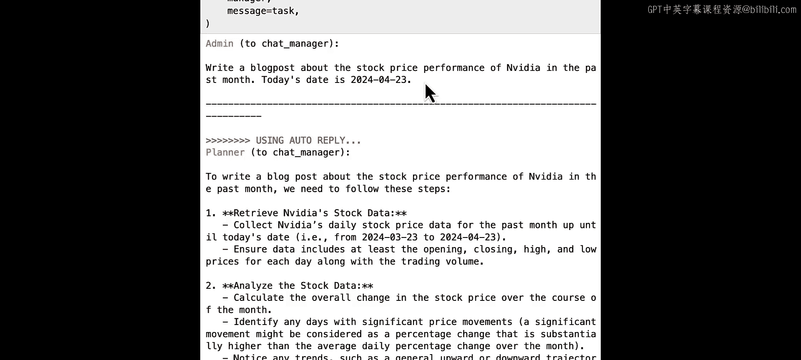

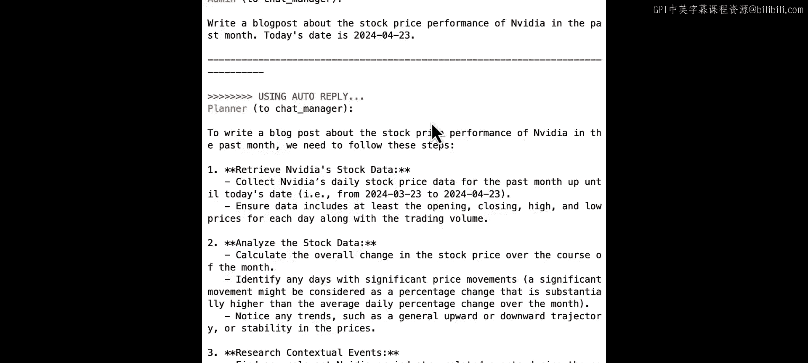

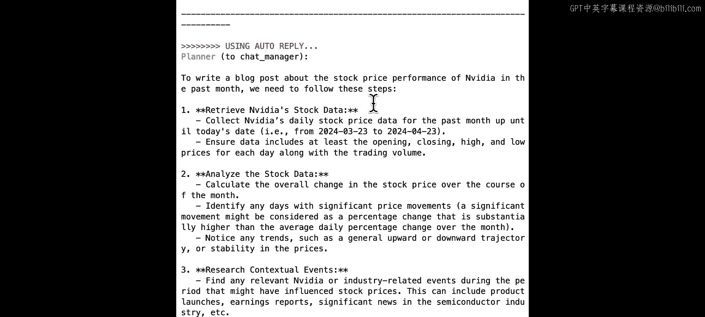

在我让这些智能体工作之前，我还需要创建一个群聊管理器。这是AutoGen中管理群聊的特殊智能体。这个群聊管理器也需要大语言模型配置。

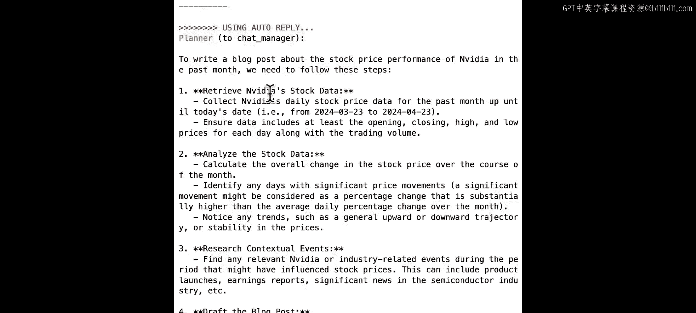

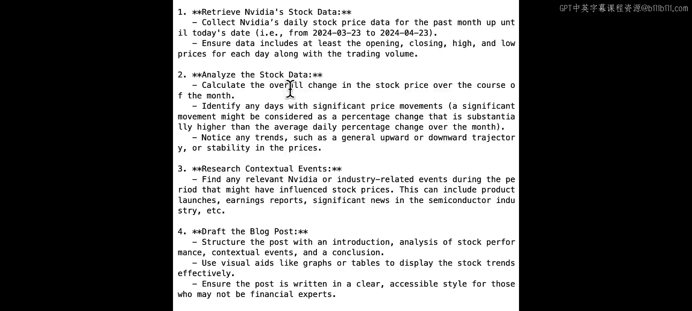

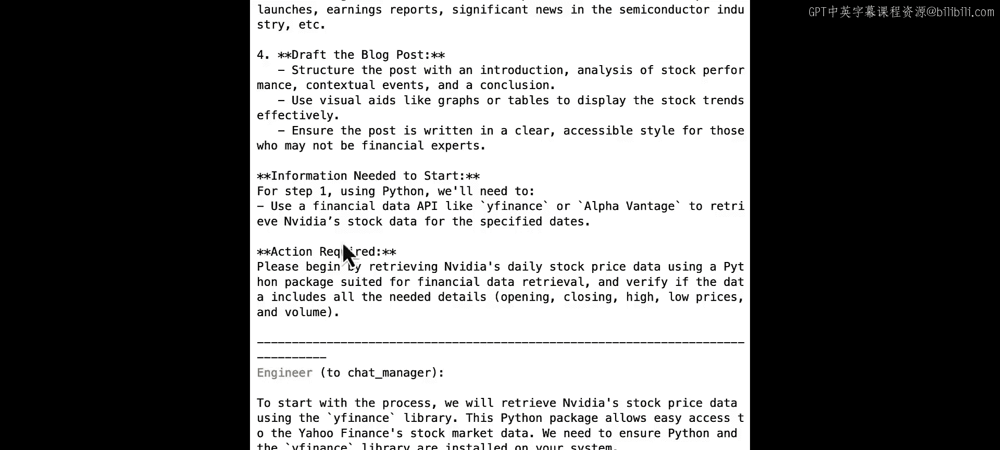

```python
manager = autogen.GroupChatManager(
    groupchat=groupchat,
    llm_config={"config_list": config_list}
)
```

我只需定义这些智能体并将它们放入群聊中，然后我就可以通过启动用户代理和管理器之间的聊天来开始对话，因为我希望第一条消息来自用户代理，消息内容将是我们之前定义的任务。

```python
user_proxy.initiate_chat(
    manager,
    message=task
)
```

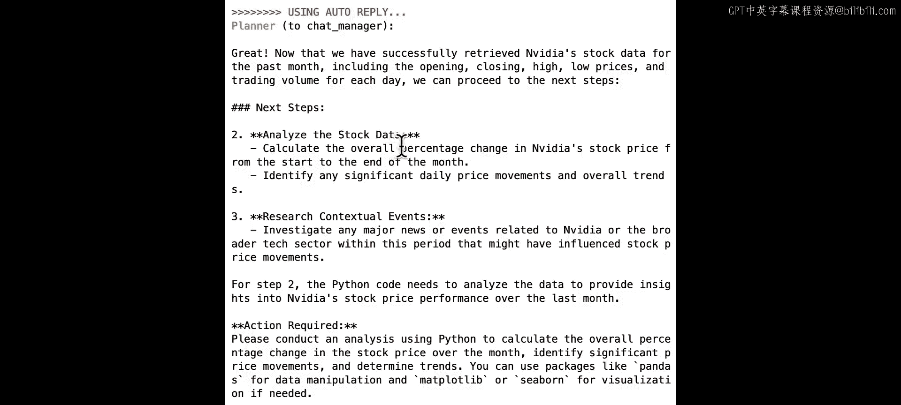

在我开始对话之后，所有这些智能体将自动协同工作，无需开发者指定具体的发言者顺序。

第一条消息将从用户代理发送给聊天管理器，内容是关于任务的。聊天管理器会将此消息广播给其他每个智能体，因此群聊中的每个智能体都会看到这条消息。然后，聊天管理器将使用其大语言模型选择一个智能体作为下一个发言者。在决定谁下一个发言时，聊天管理器会查看当前的对话历史和每个智能体的角色，并决定哪个是最佳选择。

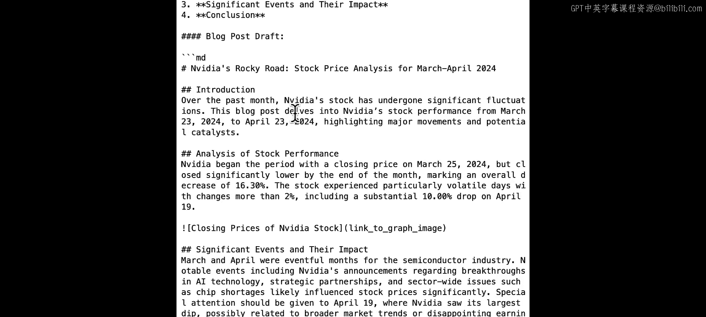

我们看到规划者被选为第一个发言的智能体。规划者建议了几个步骤，包括：检索股票数据、分析股票数据、研究相关事件、起草博客文章，最后重复第一步并建议一些操作。

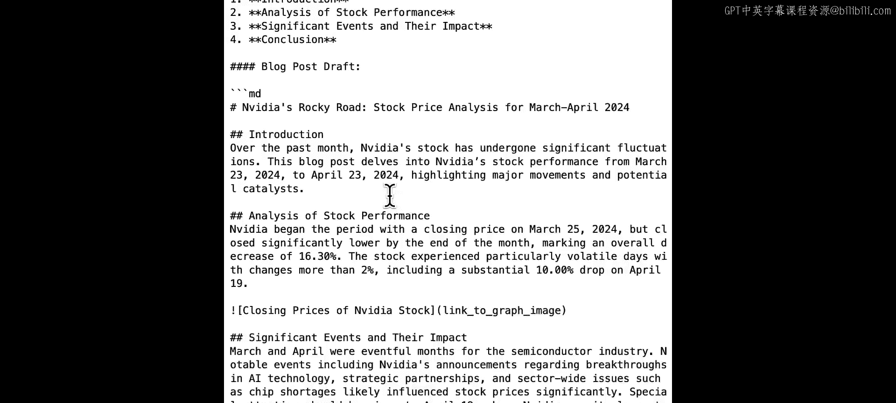

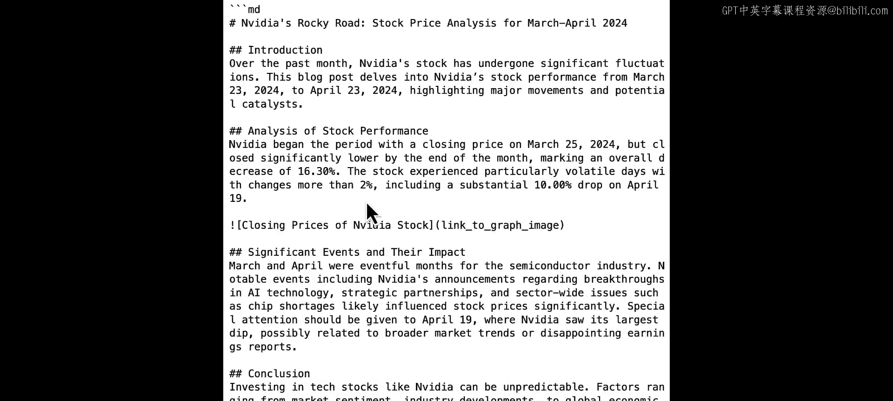

接下来，聊天管理器需要选择下一个发言者，它选择了工程师。因此，工程师将遵循规划者对第一步的建议，并建议一段用于检索股票数据的代码。

然后，执行者被聊天管理器选中来执行代码并输出数据。现在，在第一步完成后，规划者再次被聊天管理器选中。它建议了接下来的步骤：分析股票数据、研究相关事件等。它实际上建议了一个Python代码示例来开始第二步，因此工程师将完成该Python代码。

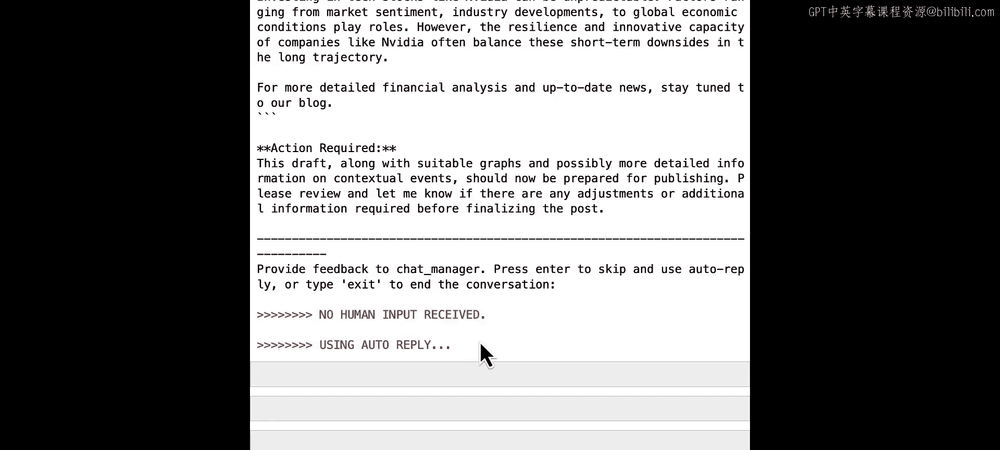

执行者被聊天管理器选中来运行代码并输出结果。你不仅可以看到股票价格输出，还可以看到每日变化。

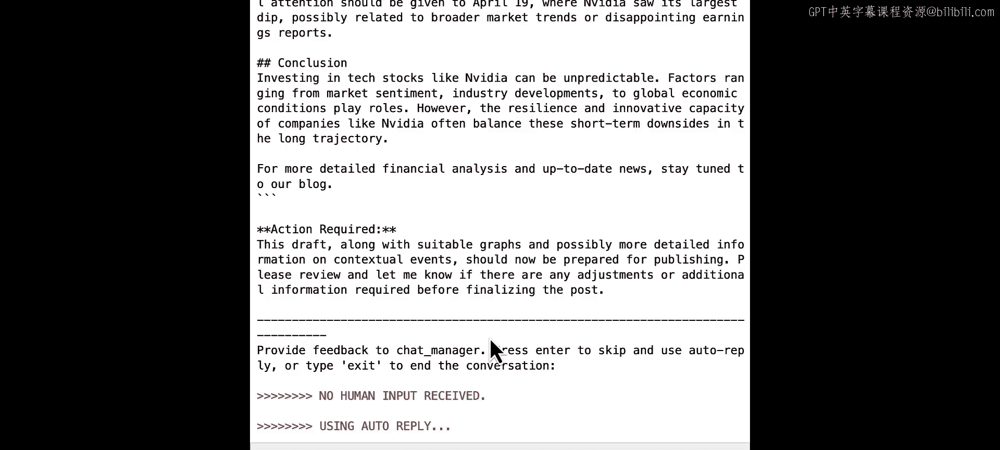

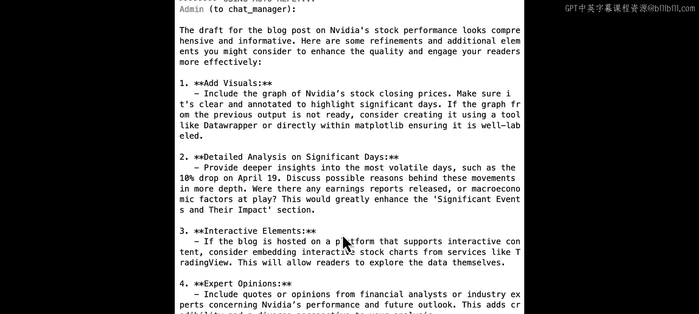

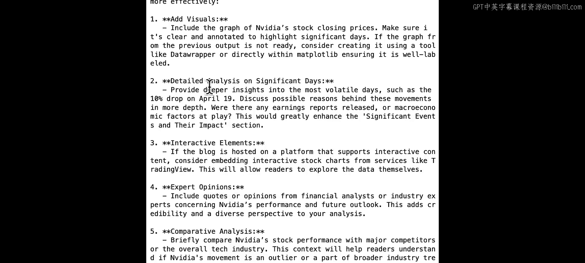

当前两步完成后，我们看到写手被聊天管理器选中开始起草博客文章，因为写手已经有足够的信息开始写作。它以Markdown格式撰写博客文章，包含引言部分、股价分析、股票表现部分、重大事件及其影响以及结论。

现在，管理员被聊天管理器选中。这个管理员将征求用户的反馈。如果我对这篇博客文章不满意，我可以在这里提供我的输入。我打算跳过我的反馈，让这个用户代理智能体代表我提出一些修改建议。

现在，这个用户代理智能体正在使用大语言模型来生成回复。这个回复应该包含一些关于这篇博客文章需要改进的建议。

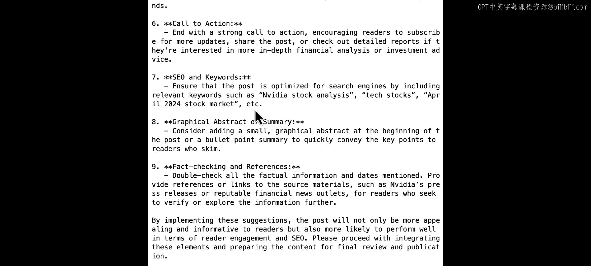

因此，管理员提出了一些改进建议，包括添加可视化、详细分析、互动元素等。之后，写手应该接受该反馈并自动提出修改后的博客文章。

在这次对话中，我们看到所有智能体都由群聊管理器自动触发，并遵循预定义的角色和描述。通常，角色和描述需要精心设计，以确保它们能够遵循正确的顺序。

现在我们看到写手已经对博客文章进行了一些修订，它还总结了博客文章中增强的元素。如果我们增加群聊的轮数，可能会有更多的对话。对话在这里停止，因为我们将最大轮数设置为10。

如果我们回顾这次对话，我们会发现规划者确实扮演了建议初始计划的角色，并且在某些步骤完成后，它会检查进度并建议后续步骤。但并非所有步骤都被完全遵循。在前两步之后，我认为写手跳过了第三步，直接开始撰写博客文章。这是使用大语言模型决定发言顺序的一个缺点。

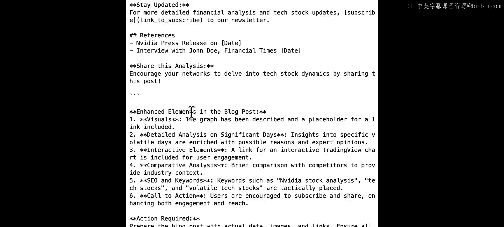

但是，有几种方法可以为对话添加更多控制。例如，你可以设置关于发言者顺序的约束。让我展示如何做到这一点。

首先，重复相同的智能体定义。

```python
# 重新定义相同的智能体
user_proxy = autogen.UserProxyAgent(...)
planner = autogen.AssistantAgent(...)
engineer = autogen.AssistantAgent(...)
executor = autogen.UserProxyAgent(...)
writer = autogen.AssistantAgent(...)
```

我将演示如何在发言顺序中添加一些约束。

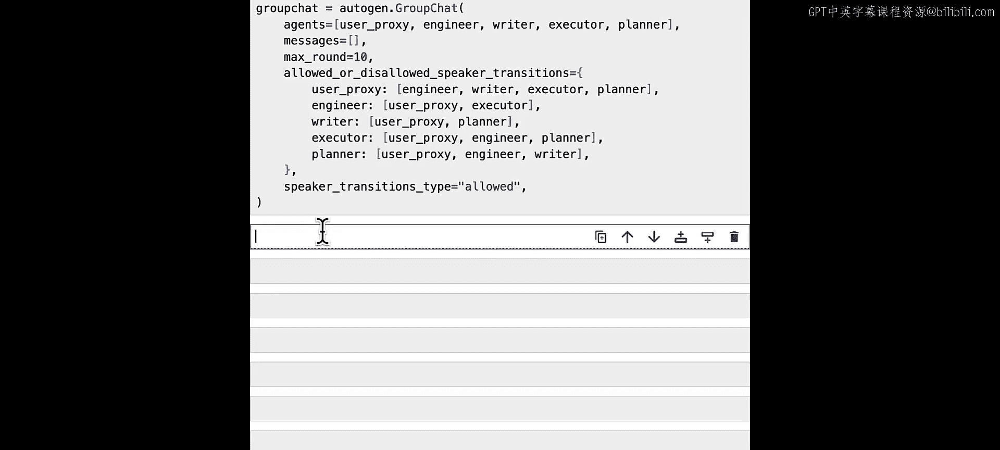

在这个例子中，我创建一个带有额外约束的群聊。这是一个名为`allowed_or_disallowed_speaker_transitions`的字典。对于每个智能体，你可以指定允许在该特定智能体之后发言的智能体。

例如，我们限制工程师之后的发言者只能是用户代理或执行者。我们限制执行者之后的发言者只能是用户代理、工程师或规划者。

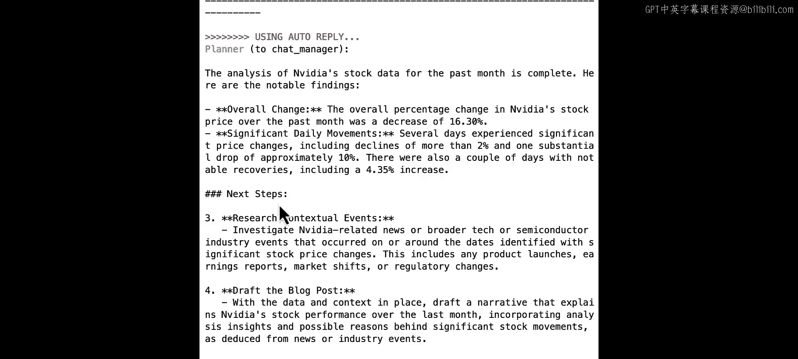

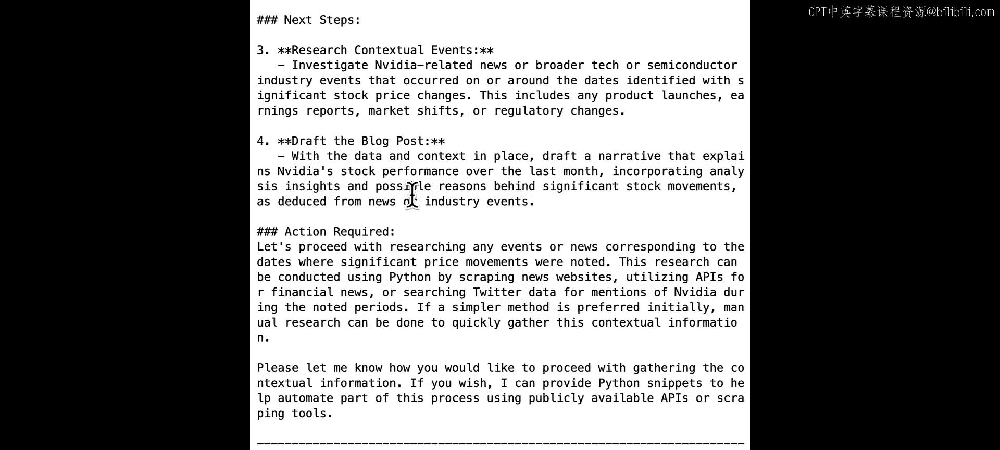

```python
allowed_transitions = {
    engineer: [user_proxy, executor],
    executor: [user_proxy, engineer, planner],
    # 其他智能体可以自由发言，或根据需要添加更多约束
}

groupchat_with_constraints = autogen.GroupChat(
    agents=[user_proxy, planner, engineer, executor, writer],
    messages=[],
    max_round=10,
    allowed_or_disallowed_speaker_transitions=allowed_transitions,
    speaker_transitions_type="allowed" # 指定这是允许的转换列表
)
```

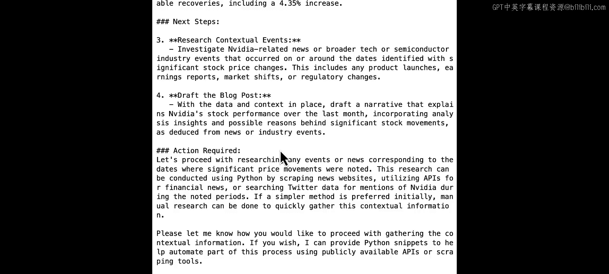

在我们施加这个约束之后，我们不应该看到写手在工程师或执行者之后立即发言。这给了规划者在写手开始撰写博客文章之前审查计划的机会。你可以指定允许或禁止的发言者转换。在这种情况下，我们只设置允许的转换。

在定义之后，我们应该看到一个更符合我们期望的发言顺序。前几个步骤是相同的。但现在，在执行者完成第二步之后，我们应该看到规划者接管。它审查之前的步骤并建议接下来的步骤。这修复了我之前提到的问题。

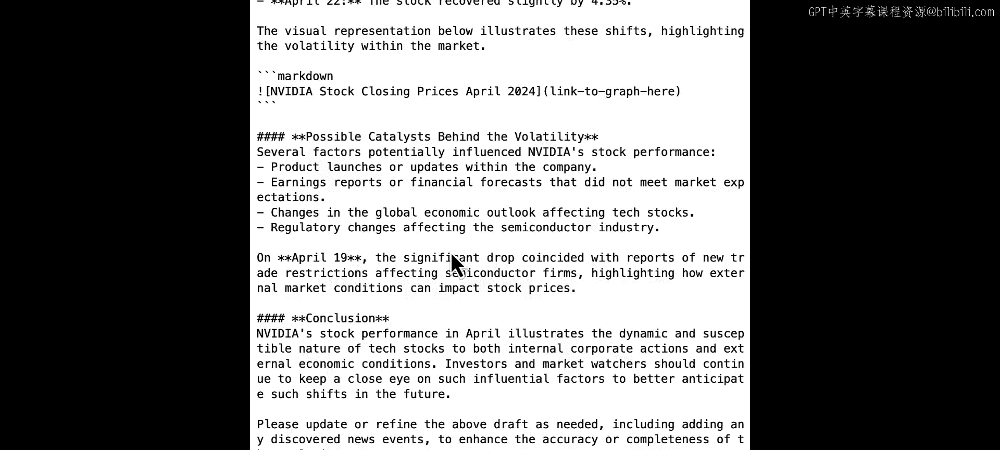

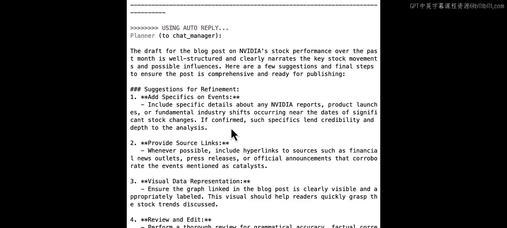

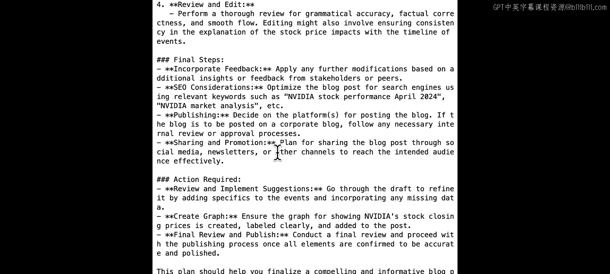

你看到，尽管我们添加了一些约束，但整体任务完成仍然是非线性的。它仍然保持了智能体在需要时来回切换和插话的灵活性。因此，这仍然比顺序聊天具有更多的灵活性。

这种指定发言者转换的方式可以模拟群聊中的有限状态机转换，因此它是允许开发者添加更多控制的高级功能。你也可以在智能体的描述中添加一些自然语言指令，这样你不仅可以指定约束，还可以获得关于何时转换到哪个智能体的更多细节。

此外，你还可以使用编程语言定义精确的转换顺序。本节课不涵盖这一点，但你可以在AutoGen的网站上找到相关信息。

## 总结

本节课我们一起学习了“规划”这一智能体设计模式，并探索了“群聊”这一新的对话模式。

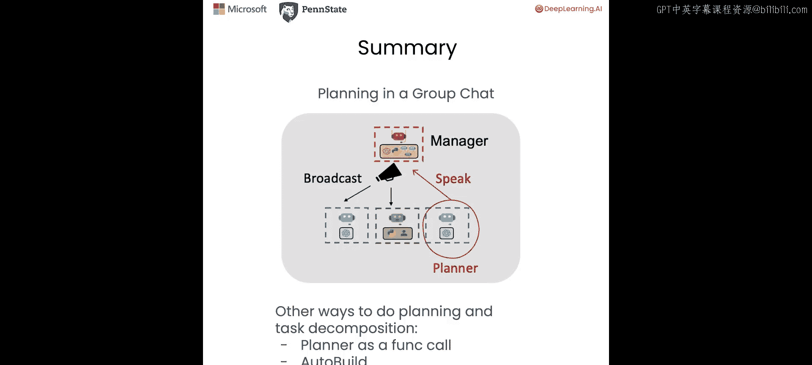

*   **群聊模式**：提供了一种更动态的方式，让多个智能体无需人类开发者设计非常详细的执行计划即可协同解决任务。
*   **规划智能体**：可以在群聊中引入，以帮助制定计划和任务分解。
*   **发言控制**：通过`allowed_or_disallowed_speaker_transitions`参数，我们可以为群聊添加约束，模拟状态机转换，从而在保持灵活性的同时增加对对话流程的控制。

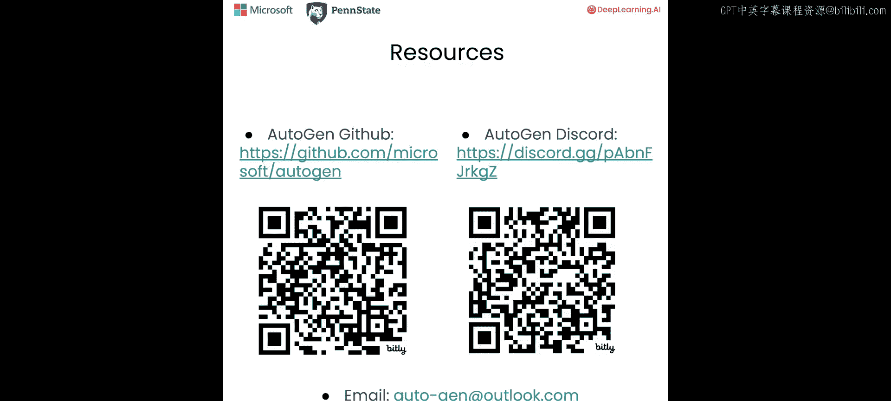

总的来说，任务分解和规划可以有多种不同的方式，我们只展示了一个特定的例子。关于AutoGen的基本介绍，这就是我们涵盖的所有课程内容。AutoGen还有许多其他高级功能，例如教智能体随时间改进、多模态、理解图像的视觉能力、使用开源模型作为智能体的后端等等。我们还有基于智能体的评估工具和基准测试工具，以及其他新的有趣研究，例如帮助用户为特定任务设计智能体。请从我们的网站查找这些高级新功能或正在进行的研究，并阅读博客文章。希望你喜欢到目前为止的课程，并能在自己的实践中探索更多有趣的用例。