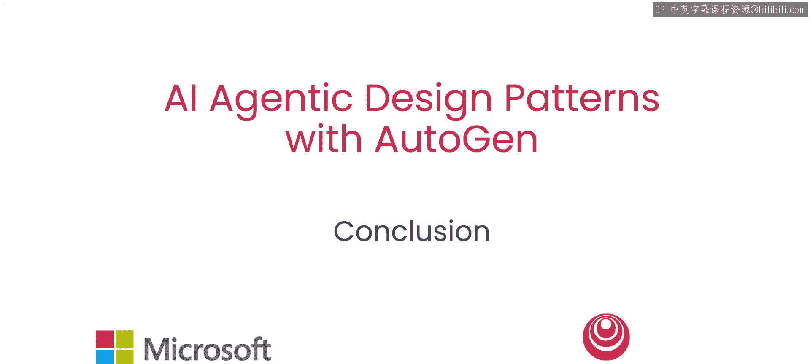
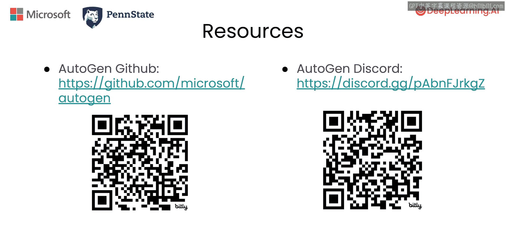

# 008：总结与展望 🎯

在本课程中，我们学习了利用AutoGen框架构建人工智能智能体的几种核心设计模式。现在，让我们对所学内容进行回顾，并了解如何进一步探索。

## 课程内容回顾

上一节我们介绍了各种智能体协作模式，本节中我们来对整个课程进行总结。

在本节课中，我们学习了AutoGen中的几种智能体设计模式。

*   **多智能体协作**：多个智能体通过对话与合作共同完成任务。
*   **反思**：智能体对自身或他人的输出进行审查与改进。
*   **工具使用**：智能体调用外部工具（如代码执行器、搜索引擎）来获取信息或执行操作。
*   **代码生成**：智能体根据需求生成可执行的代码。
*   **规划**：智能体将复杂任务分解为可执行的子步骤序列。

你可以将这些基础构建模块组合起来，构建富有创意的应用程序，以解决非常复杂的任务。

## 进阶学习与社区

以下是进一步学习和获取支持的途径。

*   **访问官方网站**：查看我们的网站，以了解本课程未涵盖的更多高级功能。
*   **感谢开源社区**：感谢出色的开源社区让这一切成为可能。
*   **加入Discord社区**：加入我们拥有超过16，000名成员的Discord社区，我期待看到你构建的作品。

---

本节课中我们一起学习了AutoGen的核心智能体设计模式，包括多智能体协作、反思、工具使用、代码生成和规划。掌握这些模式是构建强大AI应用的基础。请利用提供的资源继续你的探索与构建之旅。